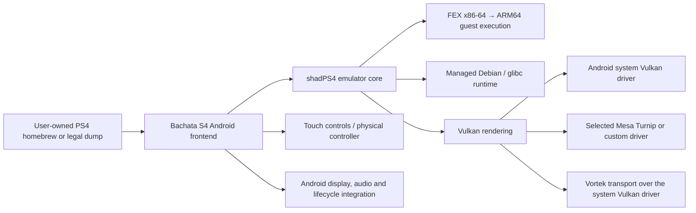

<!--
SPDX-FileCopyrightText: 2026 shadPS4 Emulator Project
SPDX-License-Identifier: GPL-2.0-or-later
-->

<p align="center">
  
</p>

<h1 align="center">Bachata S4</h1>

<p align="center">
  <strong>Experimental PlayStation 4 emulation for ARM64 Android devices.</strong>
  <br>
  Powered by <a href="https://github.com/shadps4-emu/shadPS4">shadPS4</a>,
  FEX, a managed Linux runtime, and Vulkan.
</p>
<p align="center">
  <a href="https://play.google.com/store/apps/details?id=com.bachatas4.android">
    
  </a>
  <a href="https://github.com/JICA98/Bachata-S4/releases">
    
  </a>
  <a href="https://github.com/JICA98/Bachata-S4/releases">
    
  </a>
  <a href="https://t.me/bachatas4emulator">
    
  </a>
</p>
<p align="center">
  <a href="https://bachatas4.games/">
    
  </a>
  
  
  <a href="LICENSE">
    
  </a>
</p>
<p align="center">
  <a href="https://bachatas4.games/">Compatibility</a>
  ·
  <a href="https://github.com/JICA98/Bachata-S4/issues">Game discussions and issues</a>
  ·
  <a href="https://github.com/JICA98/Bachata-S4/releases">Releases</a>
  ·
  <a href="documents/android-building.md">Build guide</a>
  ·
  <a href="https://github.com/JICA98/Bachata-S4-Compatibility">Compatibility data</a>
</p>
> [!IMPORTANT]
> Bachata S4 is in early experimental development. Compatibility and performance vary by
> game, emulator release, phone, Android version, thermal state, and selected graphics
> driver. Bachata S4 does not include games, firmware, keys, licenses, or copyrighted
> console files. Use only software and content you legally own.

---
## What is Bachata S4?

Bachata S4 adapts the [shadPS4](https://github.com/shadps4-emu/shadPS4) emulator
for modern ARM64 Android devices. It combines:
- the **shadPS4 emulator core**;
- **FEX-based x86-64 guest execution** on ARM64 hardware;
- a reproducibly built, managed **Debian/glibc runtime**;
- Android display, audio, input, and lifecycle integration;
- Vulkan rendering through a compatible **system driver**, **Mesa Turnip**, or another
  explicitly selected custom driver;
- a mobile game library, per-game settings, touch controls, and physical-controller
  support.
The Android frontend is located in [`android/BachataS4`](android/BachataS4).
Runtime inputs and pinned upstream revisions are maintained under
[`runtime/locks`](runtime/locks).

---
## 🎮 Game compatibility

Compatibility is evidence-based and specific to the exact emulator release, device, GPU,
Android version, guest backend, and graphics driver used by the tester.

The live source of truth is the
**[Bachata S4 compatibility website](https://bachatas4.games/)**.
Structured report data, screenshots, and compressed logs are maintained separately in
**[`JICA98/Bachata-S4-Compatibility`](https://github.com/JICA98/Bachata-S4-Compatibility)**.

**Current snapshot: 9 tested games — 6 In-game · 1 Menus · 2 Boots**

<!-- compatibility-games-start -->
| Screenshot | Game | Serial | Status | Latest recorded result | Compatibility / discussion |
|---|---|---:|---|---|---|
| <a href="https://bachatas4.games/compatibility.html?game=CUSA00900"></a> | **Bloodborne** | `CUSA00900` | 🟢 **In-game** | Reaches controllable gameplay in Hunter's Dream. Recorded Turnip test averaged 21.03 FPS, with 17–30 FPS observed during gameplay. | [Live report](https://bachatas4.games/compatibility.html?game=CUSA00900) · [Issue #2](https://github.com/JICA98/Bachata-S4/issues/2) |
| <a href="https://bachatas4.games/compatibility.html?game=CUSA08692"></a> | **Dark Souls: Remastered** | `CUSA08692` | 🟢 **In-game** | Reaches controllable gameplay in Undead Asylum at roughly 24–30 FPS on the recorded Turnip configuration. | [Live report](https://bachatas4.games/compatibility.html?game=CUSA08692) · [Issue #3](https://github.com/JICA98/Bachata-S4/issues/3) |
| <a href="https://bachatas4.games/compatibility.html?game=CUSA07023"></a> | **Sonic Mania** | `CUSA07023` | 🟢 **In-game** | Reaches Green Hill Zone Act 1 at ~60 FPS in the recorded Vortek test. | [Live report](https://bachatas4.games/compatibility.html?game=CUSA07023) · [Issue #4](https://github.com/JICA98/Bachata-S4/issues/4) |
| <a href="https://bachatas4.games/compatibility.html?game=CUSA13801"></a> | **Sekiro: Shadows Die Twice** | `CUSA13801` | 🟢 **In-game** | Reaches controllable gameplay in the opening Ashina Reservoir area; recorded gameplay runs roughly 19–30 FPS with heavier dips. | [Live report](https://bachatas4.games/compatibility.html?game=CUSA13801) · [Issue #5](https://github.com/JICA98/Bachata-S4/issues/5) |
| <a href="https://bachatas4.games/compatibility.html?game=CUSA10454"></a> | **Dragon's Crown Pro** | `CUSA10454` | 🟢 **In-game** | Reaches controllable dungeon gameplay at about 60 FPS in the recorded OnePlus 13 / Turnip gen8 v3 test. | [Live report](https://bachatas4.games/compatibility.html?game=CUSA10454) · [Issue #11](https://github.com/JICA98/Bachata-S4/issues/11) |
| <a href="https://bachatas4.games/compatibility.html?game=CUSA01843"></a> | **Teenage Mutant Ninja Turtles: Mutants in Manhattan** | `CUSA01843` | 🟢 **In-game** | Reaches controllable stage gameplay at a locked 30 FPS in the recorded OnePlus 13 / Turnip gen8 v3 test. | [Live report](https://bachatas4.games/compatibility.html?game=CUSA01843) · [Issue #12](https://github.com/JICA98/Bachata-S4/issues/12) |
| <a href="https://bachatas4.games/compatibility.html?game=CUSA07399"></a> | **Crash Bandicoot N. Sane Trilogy** | `CUSA07399` | 🟡 **Menus** | Reaches the title screen at about 30 FPS, but the recorded test could not advance to the main menu or gameplay. | [Live report](https://bachatas4.games/compatibility.html?game=CUSA07399) · [Issue #6](https://github.com/JICA98/Bachata-S4/issues/6) |
| <a href="https://bachatas4.games/compatibility.html?game=CUSA03146"></a> | **Galak-Z** | `CUSA03146` | 🟠 **Boots** | Boots and renders frames, but remains on a dark boot frame and does not reach the title screen. | [Live report](https://bachatas4.games/compatibility.html?game=CUSA03146) · [Issue #7](https://github.com/JICA98/Bachata-S4/issues/7) |
| <a href="https://bachatas4.games/compatibility.html?game=CUSA17425"></a> | **SnowRunner** | `CUSA17425` | 🟠 **Boots** | Reaches a rendered title screen at roughly 15–20 FPS, but the screen is static and does not respond to input; menus were not reached. | [Live report](https://bachatas4.games/compatibility.html?game=CUSA17425) · [Issue #13](https://github.com/JICA98/Bachata-S4/issues/13) |
<!-- compatibility-games-end -->

> [!NOTE]
> **In-game does not mean fully playable.** It means controllable gameplay was reached in
> at least one recorded configuration. Completion, long-session stability, correct
> rendering, audio, input, and performance may still have major problems. FPS values above
> describe specific recorded tests and are not performance guarantees for other devices.
>
> Click any thumbnail or **Live report** link to open the underlying compatibility page.

<!-- compatibility-status-table-start -->
| Status | Confirmed titles |
|---|---:|
| `playable` | 0 |
| `ingame` | 6 |
| `menus` | 1 |
| `boots` | 2 |
| `nothing` | 0 |
<!-- compatibility-status-table-end -->

### Status meanings
| Status | Meaning |
|---|---|
| **Playable** | Suitable for normal play in the tested configuration, with no major blocker found. |
| **In-game** | Reaches controllable gameplay, but completion and full stability are not verified. |
| **Menus** | Reaches menus or title screens but not controllable gameplay. |
| **Boots** | Starts and produces meaningful visual or audio output before an early blocker. |
| **Nothing** | Crashes, hangs, or fails to produce useful output in the tested configuration. |

---
## How the Android runtime works

Every compatibility report records the active backend and driver. Performance from one
phone or driver must not be generalized to every Android device.

---
## Features
- PS4 emulation frontend designed for **ARM64 Android**
- shadPS4 core integrated with an Android-focused runtime
- FEX guest execution for x86-64 workloads
- Vulkan rendering through system, Turnip, or selected custom drivers
- Vortek-based Vulkan integration paths
- Game library with cover artwork and metadata
- Per-game settings and graphics-driver selection
- Configurable touch controls
- Physical-controller mapping
- Session logs and diagnostic export
- Release-, device-, and driver-specific compatibility reports
- Screenshot- and log-backed public testing workflow
- Google Play and source-built distribution paths
- Open-source code under GPL-2.0-or-later
---
## Requirements

| Item | Requirement |
|---|---|
| Operating system | Android 12 or newer — API 31+ |
| CPU architecture | `arm64-v8a` |
| Graphics | Vulkan-capable GPU and compatible driver |
| Recommended hardware | Recent high-end Snapdragon/Adreno device |
| Storage | Sufficient space for the app, runtime, shaders, and user-provided content |
| Content | User-owned homebrew or legally dumped software only |
Compatibility can differ substantially between devices that appear similar. Check reports
from the same SoC, GPU generation, Android version, and driver family whenever possible.

---
## Download

### Google Play — recommended

The supported Google Play build is the easiest installation path and directly supports
continued development, device testing, and compatibility work.

**[Install Bachata S4 from Google Play](https://play.google.com/store/apps/details?id=com.bachatas4.android)**
### GitHub Releases

Source-linked project builds, release notes, checksums, and downloadable artifacts are
available under **[GitHub Releases](https://github.com/JICA98/Bachata-S4/releases)**.

> [!NOTE]
> The GitHub download badge counts GitHub release assets only. It does not include Google
> Play installations.

---
## Quick start
1. Install Bachata S4 from Google Play or a trusted project release.
2. Open the app and complete the initial runtime setup.
3. Select the graphics driver appropriate for the device.
4. Import user-owned homebrew or a legally dumped title.
5. Launch the title and allow initial shader or pipeline compilation to complete.
6. Compare the result with the
   [live compatibility database](https://bachatas4.games/).
7. When reporting a problem, include the Bachata S4 release, phone, Android version,
   selected driver, reproduction steps, and sanitized session log.
Bachata S4 does not provide PS4 games, firmware, licenses, decryption keys, or copyrighted
system files.

---
## Graphics-driver policy

Turnip drivers are **not bundled inside the APK**. They are installed after application
setup from the project’s trusted driver feed or imported from a local compatible ZIP.

The exact driver name, version, build, and source must be recorded in compatibility
reports. A filename, Vulkan API version, Android version, or GPU model is not a substitute
for the actual Turnip version.
See [`documents/android-building.md`](documents/android-building.md) for the maintained
runtime and packaging rules.

---
## Compatibility data architecture

The website frontend remains in this repository, while compatibility evidence is stored
in the dedicated data repository:

```text
JICA98/Bachata-S4
├── compatibility-site/                  # Static frontend
├── scripts/compatibility/               # Capture helper
├── .agents/skills/bachata-compatibility/
└── .github/workflows/compatibility-pages.yml
JICA98/Bachata-S4-Compatibility
├── games/
│   └── CUSAxxxxx/
│       ├── game.json                    # Stable title metadata
│       └── reports/
│           └── <immutable-report>.json  # One file per test
├── assets/
│   └── CUSAxxxxx/<report-id>/
│       ├── screenshots/
│       └── logs/
└── scripts/
    ├── validate.py
    └── build_site_data.py
```
The homepage loads a compact generated index grouped by CUSA ID. Full history is loaded
only when a user opens a title, preventing duplicate cards and keeping the site responsive
as reports grow.

---
## Submit a compatibility report

Use
[`.agents/skills/bachata-compatibility/SKILL.md`](.agents/skills/bachata-compatibility/SKILL.md)
for the complete agent workflow.

The workflow:
1. Searches for or creates one canonical game issue in `JICA98/Bachata-S4`.
2. Creates a dedicated branch and Git worktree for `Bachata-S4-Compatibility`.
3. Selects the exact ADB device, Bachata release, and graphics driver.
4. Launches the title and captures screenshots, logs, device data, and performance evidence.
5. Adds a new immutable report without overwriting previous results.
6. Shows the proposed report and screenshots to the tester.
7. Publishes the compatibility pull request only after explicit tester confirmation.
8. Updates the canonical main-repository issue and embeds representative screenshots in
   the issue conversation.
A useful report includes:

- official Bachata S4 release tag and exact commit;
- CUSA serial and game/update version;
- exact phone model, SoC, GPU, RAM, and Android version;
- guest backend;
- graphics-driver type, exact version, build, and source;
- the furthest status actually observed;
- clear reproduction notes and known problems;
- representative screenshots;
- sanitized compressed session logs;
- FPS measurements only when the sampling method is recorded.

---
## Build from source

The maintained instructions are in
**[`documents/android-building.md`](documents/android-building.md)**. Use that guide as the
source of truth because the runtime and Android toolchain evolve quickly.

Current high-level requirements include:

- Linux or WSL2 x86-64
- JDK 17+ and Node.js 20+
- Android SDK platform/build-tools 37
- Android NDK `30.0.14904198`
- CMake `3.22.1`
- Ninja
- Debian/Ubuntu runtime build dependencies

High-level build flow:
```bash
git submodule update --init --recursive --jobs 8

runtime/scripts/build-runtime-debian.sh
node runtime/tests/verify-runtime.mjs runtime/locks/components.lock.json
node runtime/tests/verify-no-bundled-turnip.mjs runtime/build/rootfs

cd android/BachataS4
./gradlew clean test lintDebug assemblePlaystoreDebug
```

Do not copy commands from old releases or third-party guides without checking the
maintained Android build document.

---
## Project status

Bachata S4 is not a finished or universal PS4 emulator. A title may:

- fail before rendering;
- reach only menus or partial gameplay;
- have missing graphics, audio, or input;
- run slowly on current mobile hardware;
- behave differently across Android versions or drivers;
- regress or improve between emulator releases;
- require game-specific emulator work.
Public compatibility testing helps determine whether a blocker belongs to guest execution,
kernel/HLE behavior, graphics, audio, input, runtime packaging, or Android integration.

---
## Issues and contributions
- **Game compatibility discussions and bugs:**
  [github.com/JICA98/Bachata-S4/issues](https://github.com/JICA98/Bachata-S4/issues)
- **Compatibility data and report pull requests:**
  [github.com/JICA98/Bachata-S4-Compatibility](https://github.com/JICA98/Bachata-S4-Compatibility)
- **Android/runtime build guide:**
  [`documents/android-building.md`](documents/android-building.md)
- **Contributing guide:**
  [`CONTRIBUTING.md`](CONTRIBUTING.md)
- **Upstream emulator:**
  [shadps4-emu/shadPS4](https://github.com/shadps4-emu/shadPS4)
Before opening a new game discussion, search for its exact CUSA ID. One canonical issue is
used per game so that reports from different releases, phones, and drivers remain in one
conversation.

---
## FAQ

### Does Bachata S4 include PS4 games?

No. Bachata S4 includes no games or copyrighted console content. Users must provide
software they legally own or open-source homebrew.

### Does “In-game” mean a title is fully playable?

No. It means controllable gameplay was reached in a specific recorded environment. Check
the report’s notes, screenshots, device, driver, and emulator release.
### Why can the same title behave differently on two phones?

CPU generation, GPU, Android version, available memory, graphics driver, thermal limits,
and emulator release can all affect behavior.

### Which devices are recommended?

Recent flagship Snapdragon devices with Adreno GPUs are currently the most practical
testing targets, but no device guarantees compatibility.
### Where should Bachata S4 be downloaded?

Google Play is the recommended supported installation. GitHub Releases provide
source-linked project builds and checksums.

---
## Legal

Bachata S4 is an independent open-source project and is not affiliated with, endorsed by,
or sponsored by Sony Interactive Entertainment.

“PlayStation” and related marks are trademarks of their respective owners. Bachata S4 does
not distribute games, firmware, keys, licenses, or copyrighted system components.

Use only software and content you have the legal right to run.

---
## Credits

- [shadPS4](https://github.com/shadps4-emu/shadPS4) developers and contributors —
  emulator core
- [FEX-Emu](https://github.com/FEX-Emu/FEX) developers and contributors — x86-64 guest
  execution
- Winlator, Vortek, Box64, Mesa, Vulkan, GNU, and other runtime projects listed in
  [`NOTICE.android-runtime.md`](NOTICE.android-runtime.md)
- Everyone submitting reproducible reports, screenshots, logs, fixes, and testing feedback

---
## License

Bachata S4 is licensed under
[GPL-2.0-or-later](LICENSE). Third-party runtime components retain their respective
licenses; see [`NOTICE.android-runtime.md`](NOTICE.android-runtime.md).

---

<p align="center">
  <strong>Help push PlayStation 4 emulation on Android forward.</strong>
  <br>
  Install responsibly. Test carefully. Share evidence. Improve compatibility.
</p>
