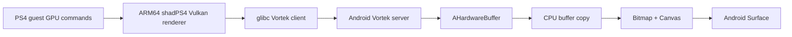

# Android 前端与 ARM64 C++ 整合审计

日期：2026-09-07。目标：Android 16 / 16 KiB，原生 ARM64 shadPS4 host，FEXCore 只执行 PS4 x86-64 guest。本文回答“现有代码是否值得作为后续迭代基础”，版本出处另见[基线选择](android-foundation-selection.md)。

## 1. 判断与选型

**具备整合基础，可以采用；但当前成熟度是“已有真实的跨架构执行与 Android 桥接实现”，不是“已经支持 Android 16 KiB 的原生模拟器”。**

建议固定三份代码的职责：

| 代码 | 固定提交 | 用途 |
|---|---|---|
| [Bachata Android 子仓](https://github.com/zFitness/Bachata-S4/tree/67dbf4e5b54b0467bf8a93de3de0a557a71f9f43) | `67dbf4e5b54b0467bf8a93de3de0a557a71f9f43` | Android UI、游戏库、导入、输入、配置、session；其中自带 C++/runtime 作为同版本组合参考 |
| [ARM64 核心子仓](https://github.com/zenithblue-oss/shadps4-arm64/tree/be6bc2e9c60799e071dd2fafa6216e8d80ec619c) | `be6bc2e9c60799e071dd2fafa6216e8d80ec619c` | FEX guest/HLE/线程回调的主要移植来源；按模块迁入当前主仓 |
| [FEX 子仓](https://github.com/FEX-Emu/FEX/tree/50e6eee95ae95d3257672727a9302a30b4a60a9a) | `50e6eee95ae95d3257672727a9302a30b4a60a9a` | 上游源码研究与后续版本适配；**不能直接替换参考核心锁定的旧 FEX** |

两份 Bachata/ARM64 的 runtime lock 都锁定 FEX `f2b679f6028ce1c38875233aecfcf5d3f8ebecec`。先维持它作为行为对照，再单独推进新 FEX API/NDK/16 KiB；避免一次改变前端、核心、FEX、图形桥四个变量。

最先值得做的工程任务不是追逐 app 的 0.2.x 标签，而是：**提取 Android 后端接口，建立 NDK/bionic 的 16 KiB FEX 执行 harness，同时补上原生 Surface 接入。** 当前主仓核心继续保留，不用旧 fork 整树覆盖。

## 2. 源码证明它不是空壳

逐文件比较所得：

| 范围 | 结果 |
|---|---|
| `src/core/fex/` | 两个文件完全相同，包含实际 FEX engine |
| `src/core/guest_cpu/` | 9 个文件完全相同；一个 bridge 文件改变 HLE trace 策略，另新增 trace helper |
| `runtime_client.cpp/.h` | 完全相同 |
| `audio_transport.cpp/.h` | 完全相同 |
| controller snapshot | 新核心增加可选 motion 字段，保留原有输入字段 |
| runtime Vortek 协议头 | 完全相同；**不代表整个 client/server 实现相同** |

详细列表：[文件比较结果](data/android-arm64-interface-comparison.json)。

真实执行入口也已经接通到代码实现：

1. [Linker](https://github.com/zenithblue-oss/shadps4-arm64/blob/be6bc2e9c60799e071dd2fafa6216e8d80ec619c/src/core/linker.cpp#L145) 在 FEX 配置下走 `RunGuestMain`，而不是把 guest RIP 强转为 ARM 函数调用。
2. [InitializeFexRuntime](https://github.com/zenithblue-oss/shadps4-arm64/blob/be6bc2e9c60799e071dd2fafa6216e8d80ec619c/src/core/linker.cpp#L288) 创建 HLE registry、x86 veneer、HleGuestBridge、FexGuestCpuBackend。
3. [FexGuestCpuBackend](https://github.com/zenithblue-oss/shadps4-arm64/blob/be6bc2e9c60799e071dd2fafa6216e8d80ec619c/src/core/guest_cpu/fex_guest_cpu.cpp#L47) 有 CreateThread、Run、CallGuest、Invalidate、DestroyThread 的实际实现。
4. [HLE ABI adapter](https://github.com/zenithblue-oss/shadps4-arm64/blob/be6bc2e9c60799e071dd2fafa6216e8d80ec619c/src/core/guest_cpu/hle_call_adapter.h#L28) 读取 x86 SysV GPR/XMM/栈参数，验证 guest 地址后调用 host HLE；不是让 ARM64 直接遵循 x86 calling convention。
5. [pthread 入口/清理](https://github.com/zenithblue-oss/shadps4-arm64/blob/be6bc2e9c60799e071dd2fafa6216e8d80ec619c/src/core/libraries/kernel/threads/pthread.cpp#L253)、[TLS 析构](https://github.com/zenithblue-oss/shadps4-arm64/blob/be6bc2e9c60799e071dd2fafa6216e8d80ec619c/src/core/libraries/kernel/threads/pthread_spec.cpp#L92)、[AvPlayer 回调](https://github.com/zenithblue-oss/shadps4-arm64/blob/be6bc2e9c60799e071dd2fafa6216e8d80ec619c/src/core/libraries/avplayer/avplayer_impl.cpp#L37) 已有回到 guest 执行的分支。

所以 **guest x86、host ARM64 的关键分界已有实现基础**。glibc 是 host 的 C 库选择，不会自动把这条路径变成“整个 x86 shadPS4 放进 FEX”。不过 ABI 类型覆盖、异步回调、对象生命周期仍须逐接口验收；源码实现不等于商业游戏兼容性证明。

## 3. Android 与 C++ 的实际接口对照

下表中的“可复用”指已有实现与协议对应，不表示已在目标设备联调。

| 接口 | Android 侧 | ARM64 C++ 侧 | 整合判断 |
|---|---|---|---|
| 启动 | EmulationService → RuntimeProcessLauncher | main 的 CLI + Linker | 已对应；当前是 glibc 子进程启动，NDK 需新入口 |
| 游戏/存档根目录 | app-private storage、override root、绝对 eboot 路径 | CLI 参数及路径校验 | 可保留用户流程与参数语义；NDK 可改直接传递路径/FD |
| 控制与状态 | LocalServerSocket、逐行接收 BACHATA/1 | AF_UNIX RuntimeClient | 已对应；缺能力协商与完整会话命令 |
| 普通手柄 | ControllerFrameEncoder，4 槽位 | ParseControllerSnapshot → ApplyRemoteState | 基本字段可直接对接；motion 尚未由 Android 编码 |
| 音频 | ALSARequestHandler → AudioTrack | BachataAudioOut → AudioTransport | socket PCM 格式对应；低延迟、underrun 尚待设备测试 |
| 图形 | embedded X server + Vortek server + AHB/Canvas | SDL X11 + Vulkan/Vortek client | 有完整桥接思路，但依赖版本必须成套；现有呈现含 CPU 拷贝 |
| Surface 生命周期 | SurfaceView 更新 ManagedSession | 首次启动 SDL/X11 窗口 | 不足以支持原生窗口重建 |
| 调试 | session 日志、诊断导出 | guest/HLE trace、FEX thread state | 可保留；没有完备的 guest debugger 控制接口 |

### 3.1 启动：原生 ARM64 已存在，NDK 入口缺失

[Service 的实际启动分支](https://github.com/zFitness/Bachata-S4/blob/67dbf4e5b54b0467bf8a93de3de0a557a71f9f43/android/BachataS4/app/src/main/kotlin/com/bachatas4/android/service/EmulationService.kt#L286) 选择：

```text
nativeLibraryDir 中的 glibc loader
  --library-path <runtime>/host
  <runtime>/host/shadps4-arm64-fex
  --override-root <game-root>
  --bachata-storage-root <app-files>
  --bachata-socket <control.sock>
  -g <absolute-eboot>
```

[RuntimeProcessLauncher](https://github.com/zFitness/Bachata-S4/blob/67dbf4e5b54b0467bf8a93de3de0a557a71f9f43/android/BachataS4/core/runtime/src/main/kotlin/com/bachatas4/android/runtime/process/RuntimeProcessLauncher.kt#L70) 的 FEX 分支**没有调用 FEXLoader**。FEXCore 链在 ARM64 shadPS4 里，Box64 是另一个后端选择。

另一方面，[C++ 构建脚本](https://github.com/zenithblue-oss/shadps4-arm64/blob/be6bc2e9c60799e071dd2fafa6216e8d80ec619c/runtime/scripts/build-shadps4-arm64.sh#L76) 明确指定 `CMAKE_SYSTEM_NAME=Linux`、`aarch64-linux-gnu`，并检查 interpreter 为 `/lib/ld-linux-aarch64.so.1`。Android 的 [native CMake](https://github.com/zFitness/Bachata-S4/blob/67dbf4e5b54b0467bf8a93de3de0a557a71f9f43/android/BachataS4/core/runtime/src/main/cpp/CMakeLists.txt#L18) 当前构建驱动桥、pkg、Winlator、Vortek，**没有把 shadPS4/FEX 编成 JNI backend**。

不能把此 glibc 产物改名为 `libshadps4.so` 再由 bionic 的 `System.loadLibrary` 加载。需要真实的 NDK 构建目标、依赖闭包和 C/JNI 生命周期入口。

### 3.2 控制协议：同源，但别接错文件

实际 service 使用的是 **ASCII 行协议**：

```text
C++ → Android: BACHATA/1 HELLO version=1
C++ → Android: BACHATA/1 EVENT Running
C++ → Android: BACHATA/1 EVENT Frame
C++ → Android: BACHATA/1 ERROR code=...
Android → C++: BACHATA/1 INPUT slot=0 seq=1 buttons=... lx=... ...
```

证据：[Service 读写](https://github.com/zFitness/Bachata-S4/blob/67dbf4e5b54b0467bf8a93de3de0a557a71f9f43/android/BachataS4/app/src/main/kotlin/com/bachatas4/android/service/EmulationService.kt#L335)、[RuntimeClient](https://github.com/zenithblue-oss/shadps4-arm64/blob/be6bc2e9c60799e071dd2fafa6216e8d80ec619c/src/platform/bachata/runtime_client.cpp#L181)。

仓库另有 `RuntimeProtocol.kt`（长度前缀 JSON）与 `Box64EmulatorRuntime.kt` 抽象。生产源码检索没有发现 app 使用它们；不能根据其中 Hello/Stop 类型认定现有 C++ 已支持 JSON 会话协议。

具体缺口：

- Service 的逐行分支处理 Running/Frame/Error，没有对 HELLO 完成严格协商，也没有把 Stopped 的 exit_code 作为该分支的终态依据。
- C++ input reader 只解析 INPUT；没有暂停、单步、读 guest 状态、优雅 STOP 请求。
- Android [stopSession](https://github.com/zFitness/Bachata-S4/blob/67dbf4e5b54b0467bf8a93de3de0a557a71f9f43/android/BachataS4/app/src/main/kotlin/com/bachatas4/android/service/EmulationService.kt#L753) 依赖进程 destroy/cancel，finally 再 destroyForcibly。这不能直接搬成“在同进程停止 C++ 线程”。

应让新 NativeBackend 显式支持 requestStop、stop-complete、错误码、session generation；调试命令通过独立且共享执行状态的适配层实现。

### 3.3 输入与音频：最适合先复用的桥

[ControllerFrameEncoder](https://github.com/zFitness/Bachata-S4/blob/67dbf4e5b54b0467bf8a93de3de0a557a71f9f43/android/BachataS4/core/runtime/src/main/kotlin/com/bachatas4/android/runtime/input/ControllerFrameEncoder.kt#L18) 发送 slot/seq/buttons、4 个 stick byte、两个 trigger、touch 坐标；C++ reader 有 4 槽位去重及断开归零。新 C++ 的 gyro/accel 是可选扩展，旧输入仍可解析。

但 Android ControllerSnapshot 没有 gyro/accel，不能仅凭 C++ `has_motion` 推断传感器通路已经完成；这些 DS4 字段也不足以组成 Beat Saber 的 PSVR/Move 6DoF 输入。

音频 [AudioTransport](https://github.com/zenithblue-oss/shadps4-arm64/blob/be6bc2e9c60799e071dd2fafa6216e8d80ec619c/src/platform/bachata/audio_transport.cpp#L115) 的请求头为 `code:u8 + length:u32 little-endian`：

- PREPARE=4：channels:u8、sample-type:u8、sample-rate:u32、buffer-size:u32。
- WRITE=5：PCM payload。
- CLOSE=0。

[Android handler](https://github.com/zFitness/Bachata-S4/blob/67dbf4e5b54b0467bf8a93de3de0a557a71f9f43/android/BachataS4/core/runtime/src/main/java/com/winlator/alsaserver/ALSARequestHandler.java#L24) 和类型枚举与其对应；Service 已明确 `useSharedMemoryAudio=false`，避免 server 从未被填充的 SHM 取样。新原生后端可先复用 AudioTrack 输出，再视测量结果改为 AAudio/Oboe；音频时钟与阻塞回压要独立验证。

### 3.4 图形：接口存在，性能路径与生命周期必须改变

当前显示路径：



源码证据：

- [VortekWindowBridge](https://github.com/zFitness/Bachata-S4/blob/67dbf4e5b54b0467bf8a93de3de0a557a71f9f43/android/BachataS4/core/runtime/src/main/java/com/bachatas4/android/runtime/vortek/VortekWindowBridge.java#L116) 在 present 后将 AHB 复制到 drawable 的 CPU buffer。
- [SurfaceWindowRenderer](https://github.com/zFitness/Bachata-S4/blob/67dbf4e5b54b0467bf8a93de3de0a557a71f9f43/android/BachataS4/core/runtime/src/main/kotlin/com/bachatas4/android/runtime/display/WinlatorEmbeddedXServer.kt#L196) 每次 drawWindow 创建 Bitmap、copyPixelsFromBuffer、drawBitmap、recycle；render loop 每约 16 ms 调度。
- 因此它不是可直接沿用的零拷贝原生 Vulkan WSI，VR 更不应以这条 Canvas 链路作为最终呈现实现。CPU 拷贝代价与帧延迟需要实测，本文不推断具体 FPS。

**原生 Android WSI 还缺真实实现。** [vk_platform.cpp](https://github.com/zenithblue-oss/shadps4-arm64/blob/be6bc2e9c60799e071dd2fafa6216e8d80ec619c/src/video_core/renderer_vulkan/vk_platform.cpp#L5) 顶部定义了 Android Vulkan 宏，但 [CreateSurface](https://github.com/zenithblue-oss/shadps4-arm64/blob/be6bc2e9c60799e071dd2fafa6216e8d80ec619c/src/video_core/renderer_vulkan/vk_platform.cpp#L62) 仅实现 Win32、X11/Wayland、Metal，没有 `vkCreateAndroidSurfaceKHR` 分支；`WindowSystemType` 和 SDL window-info 也没有对应 Android 窗口接入。定义宏不能填补这条路径。

NDK 目标应改为：Java Surface → ANativeWindow → Vulkan Android surface → swapchain。可通过完整的 SDL Android 平台接入，或抽出 PlatformWindow 接口由 JNI 提供；推荐后者以减小与当前 SDL 桌面窗口类的耦合。[Android Vulkan 官方说明](https://developer.android.com/ndk/guides/graphics/getting-started)

生命周期也有实质缺口：[SessionScreen](https://github.com/zFitness/Bachata-S4/blob/67dbf4e5b54b0467bf8a93de3de0a557a71f9f43/android/BachataS4/feature/session/src/main/kotlin/com/bachatas4/android/feature/session/SessionScreen.kt#L150) 更新 ManagedSession.surface，而 Service 只取首次非空 surface，随后没有持续收集来重建 renderer。应明确 acquire/release、surface generation、GPU drain、swapchain 销毁重建；不能只保留一个启动时 Surface 引用。

还有两项易误判的问题：

1. [Frame 事件发送处](https://github.com/zenithblue-oss/shadps4-arm64/blob/be6bc2e9c60799e071dd2fafa6216e8d80ec619c/src/core/libraries/videoout/driver.cpp#L262) 位于 host presenter 调用之后。Android 收到事件就标记 FIRST_FRAME_PRESENTED，但这并不能证明 Android 最终 Surface 已显示该帧。后续应拆分 guest flip、host submit、Android present 计数及时间戳。
2. 两份 runtime lock 的 Vortek client 同为 `9325b606…`，**server 不同**：Android 快照来自 winlator-app `72ec347c…`；ARM64 仓来自 vortek `df8183df…`。握手只严格检查 magic/major/pointer-size/endian，build-id 差异仅记日志，不能证明 Vulkan 函数序列化全部兼容。[Android lock](https://github.com/zFitness/Bachata-S4/blob/67dbf4e5b54b0467bf8a93de3de0a557a71f9f43/runtime/locks/components.lock.json)、[ARM64 lock](https://github.com/zenithblue-oss/shadps4-arm64/blob/be6bc2e9c60799e071dd2fafa6216e8d80ec619c/runtime/locks/components.lock.json)、[握手实现](https://github.com/zFitness/Bachata-S4/blob/67dbf4e5b54b0467bf8a93de3de0a557a71f9f43/android/BachataS4/core/runtime/src/main/cpp/vortek/bachata_vortek_server.cpp#L303)。

因此旧路线复现时先保持 Android 快照自带的成套依赖；升级 Vortek server 应单独验证 WSI、fence/FD、扩展序列化，不能看到协议主版本相同就混搭。

## 4. 16 KiB 与 guest/host 边界：决定最终能否运行

当前两份核心同样存在[硬检查](https://github.com/zenithblue-oss/shadps4-arm64/blob/be6bc2e9c60799e071dd2fafa6216e8d80ec619c/src/core/fex/fex_guest_engine.cpp#L1281)：

```cpp
constexpr long kRequiredPageSize = 4096;
// GuestEngine::Create:
if (sysconf(_SC_PAGESIZE) != kRequiredPageSize)
    return Failure(EngineStage::Mapping, ENOTSUP);
```

**在真正 16 KiB host page 下，该后端明确拒绝创建。** 不能把编译出 ARM64 APK、升级 targetSdk/NDK 或做 ELF 对齐当成已解决此限制。Android 官方也把 native 代码页大小假设列为独立工作项。[16 KiB 官方指南](https://developer.android.com/guide/practices/page-sizes)

最终工程必须同时完成：

| 项目 | 可继承的基础 | 必须处理的工作 |
|---|---|---|
| FEX host page | 既有 engine、harness、旧 FEX pin | host allocation/protection 与内部 4 KiB 索引分离；guard、VA 探测、JIT cache |
| shadPS4 VMM/GPU tracker | 当前 loader、映射及 tracker | 16 KiB host 上保护/失效覆盖所有子页与 aliases |
| C++ ABI | HLE registry/veneer/adapter | PS4 结构布局、函数指针、可变参数及回调逐类覆盖 |
| host 平台 | 现有 glibc ARM64 执行链 | NDK/bionic、allocator、TLS/ucontext、signal、依赖库 |
| guest 地址与对象 | range validator、host range publish | 统一 GuestPtr/GuestCodePtr/handle，禁止把 host 实现细节变成 guest ABI |
| 调试与控制 | trace、可识别 FEX thread/frame | 安全点暂停/快照/恢复、异步 JIT fault 重建、跨线程失效 |

`guest_cpu.h` 当前通用接口只有 Run(request)，stop reason 仅 Returned/Halted/Faulted；真正的 FEX backend 还有自己的线程 API。**还不是 citron/azahar 那种可长期依赖的完整 CPU 服务边界**。需在自己的 adapter 层收敛线程、memory、stop/debug、callback API，避免让 app 或各 HLE 文件继续扩散 FEX 内部类型。

详细 16 KiB 设计、原子访存、地址空间与信号方案见[总体技术方案](fex-android16-native-guest-host-plan.md#L145)。上述工作是有明确切入点的移植任务，但当前不能承诺只靠改几个宏就能完成。

## 5. 推荐实施顺序与验收门槛

### 第一步：把可复用前端接到明确的 backend 接口

保留 library/data/settings/input/session UI；把 EmulationService 里的 backend 选择、安装、进程和显示实现下沉到实现类。

建议接口语义（设计建议，尚未实现）：prepare、start、setSurface(surface, generation)、submitController、requestStop、awaitStopped、events。保留 ManagedSession 对 UI 的状态接口，避免 UI 感知 FEX/glibc。

旧实现封为 ManagedGlibcBackend 用于对照，新实现为 NativeFexBackend。NativeFexBackend 的 C++ engine 运行在明确的 host worker threads，JNI 只负责有界参数传递与事件通知；第一版优先让已有 SurfaceView 与 native window 在同一进程内直接对接。如果随后采用独立 Android service 进程，需要通过 Binder/Parcelable Surface/FD 显式传递，ManagedSession singleton 不会跨进程共享；独立进程也不会自动消除 bionic/signal/16 KiB 问题。

### 第二步：先攻克目标设备的两个最小闭环

1. **NDK/FEX 闭环**：真正 16 KiB Android app 里执行小型自有 x86 guest；验证返回值、GPR/flags/SIMD、TLS、多线程、guest→HLE→guest、JIT invalidation、guard fault、stop/restart。
2. **NDK 图形闭环**：现有 Android 页面把 Surface 接到 native Vulkan，清屏/三角形可见；surface detach/重建后恢复；音频 tone 和普通手柄状态有确定结果。

这两项不依赖大规模游戏兼容性，可先暴露最危险的结构问题。验收记录必须含 `getpagesize=16384`、CPU/GPU、API level、全部 native artifact Build ID 与依赖版本。

### 第三步：迁入实际 shadPS4 guest/HLE 链

按闭包迁入 ARM64 fork 的 linker/symbol resolver、guest engine、HLE adapters、pthread/TLS/exception 与回调、VMM 和相关平台改动；不能仅复制 `src/core/fex` 就期待工作。

以新前端带一个合法取得的非 VR PS4 测试对象验证启动、渲染、输入、音频、退出及重新启动。先定义“显示交互场景并持续运行”的结果，随后才衡量帧率。未指定非 VR 游戏时，先用自有 homebrew/harness 保证可重现性，商业游戏由实际可取得且桌面主仓可运行的对象确定。

### 第四步：补上可用调试，再推进 Beat Saber

优先建立 host LLDB 下的 guest thread registry、停在 HLE/安全点时的 guest snapshot、host JIT PC→guest RIP 对应和 guest 内存视图；安全点与异步停机的寄存器可信度必须区别显示。[LLDB 方案](fex-lldb-host-guest-workflow.md)、[guest debugger 能力审计](fex-guest-debugger-feasibility.md)。

Beat Saber 单独验收 PSVR/Move/HMD 服务语义、tracking、双眼呈现和时序。Android 的普通 controller 与原生 Vulkan 接入成功，都不足以证明这部分完成。它应是后续功能项目，不能作为判断 Android 基础是否可用的唯一首测对象。

## 6. 打包与日常迭代中的具体注意点

- 旧 runtime 安装器按 manifest 逐文件检查大小和 SHA-256，安装后去执行位，启动由 APK 中的 host loader 读取映射。改 C++ 后需重新生成 runtime、manifest、依赖与相匹配的 debug symbols，不能只假定替换一个文件就会生效。[RuntimeInstaller](https://github.com/zFitness/Bachata-S4/blob/67dbf4e5b54b0467bf8a93de3de0a557a71f9f43/android/BachataS4/core/runtime/src/main/kotlin/com/bachatas4/android/runtime/install/RuntimeInstaller.kt#L91)
- [package-runtime](https://github.com/zFitness/Bachata-S4/blob/67dbf4e5b54b0467bf8a93de3de0a557a71f9f43/runtime/scripts/package-runtime.mjs#L277) 若本地 deep-guest pin binary/metadata 存在，会优先复制 pin，覆盖刚构建的 guest 及 stage。后续源码迭代构建要显式 `BACHATA_DEEP_GUEST_PIN=0`，并核对最终部署 Build ID；否则可能调试的仍是旧二进制。
- 新 FEX checkout 与参考核心旧 API 不同；使用自己的版本隔离 adapter，不让升级 FEX 成为每个 HLE 的改动。[FEX/Dynarmic 比较](fexcore-dynarmic-source-comparison.md)
- Android 的配置/驱动选择 UI 可以保留，但 glibc 环境变量、Vortek 与 NDK 原生驱动加载属于不同实现；NativeFexBackend 只暴露实际生效的设置。
- 本次未改现有 SG8275 分支及其未提交修改，也未把旧核心覆盖主仓；这些子仓是可追溯的开发来源。

## 7. 已执行的验证与证据范围

除静态调用链和逐字节比较外，本次在 macOS ARM64 **实际编译并运行** ARM64 参考仓自己的两份 C++ 测试，链接其真实 runtime_client/controller_snapshot/audio_transport 实现，**18/18 通过**：

- 控制帧 socketpair 收发、连接断开；
- 4 controller slots、sequence 顺序及断连归零、可选 motion；
- 音频 PREPARE/WRITE wire payload 和 PCM 转换。

[完整测试输出](data/android-arm64-runtime-contract-tests-2026-09-07.txt)。Apple libc++ 默认未开放 jthread，首轮编译失败；启用该工具链的 `_LIBCPP_ENABLE_EXPERIMENTAL` 后通过，没有修改被测 C++。这属于 host 工具链设置，不是 FEX/Android 修复。

可复现命令与环境：[测试记录脚本](../scripts/analysis/run_android_arm64_contract_tests.py)。

此外，新 Android 子仓 runtime lock 检查已通过（8 components / 30 inputs）。**本次未构建 APK、未执行 Kotlin/Java 端、未运行 FEX guest、未在 Android 16 KiB 设备验证 Vulkan/音频/游戏。** 18 个测试证明 C++ 传输实现有可执行基础；两端互通目前由静态协议对照支持，不能标成 Android 端到端通过。
