# Android 原生 host 评估（2026-09-11）

结论：**方案可行，推荐保留现有 Kotlin 前端，将主仓拆成可嵌入的 ARM64/bionic host runtime，继续用现有 `guest_cpu_fex` 执行 x86-64 guest。当前 APK 只是这一架构的 CPU 冒烟起点，尚未连接主仓 loader、Orbis HLE、线程和渲染器。** 不应以“再把 desktop executable 编成 so”估算后续工作。

下一批应交付“普通 APK 内，真实 ELF → 主仓 loader → FEX → 一个真实 Orbis HLE → 可验证返回”，随后扩展 kernel/callback 和原生显示。具体任务、顺序、验收见 [host-native v1 执行 spec](specs/android-native-host-v1.md)。本次只评估并编写文档，没有修改生产代码、安装 APK 或重跑设备会话。

## 1. 本次基点和证据边界

| 项目 | 本次观察 |
|---|---|
| 主仓 | `tencentmalos/shadPS4`，`codex/android-fex-round2` |
| HEAD | `9ac6c300ef82074014dd03046dd29134ab278075` |
| origin 分支 | `0e10defc04457e019c07fd2a78d4f58d506133b2`，本地领先 36 提交 |
| FEX gitlink | `385a0cc4d81cd456c8d5c26b4f09cb5a7d8d5842` |
| Foundation gitlink | `1f7008848736b7c6c0779220480344fd5b5fc5e3` |
| 当前目标 | Swan / Android 16（API 36）/ ARM64 / 4 KiB；16 KiB 设备适配延期 |
| 可用辅助设备 | `9c2841a4`，AYN Thor / API 33 / 4 KiB；另一个 adb 设备 unauthorized，未确认其型号 |

独立检查归档于 [本次证据](validation/android-native-host/2026-09-11/README.md)，包含源码 hash、gitlinks、现有 APK 的五个 ELF 身份和原始检查日志。父仓另有历史文档、研究和子仓未提交工作，不能把 HEAD 当作全部工作区的内容身份。

本次重跑 `test_v0_runner.py`：**23/23 通过**。此前 N4 报告中的 runner 两个失败已修；源码也已包含 RCX 恢复、native FP 切换以及 native Invoke 的 catch，不能继续将旧缺陷表述为原样存在。完整 fenv/errno、异常清理、并发 HLE 和 callback 矩阵仍未完成；本次没有复跑历史报告的 215 checks / 117 sub。

本次请求执行 Android 三个模块的 JVM 单测，**在 `:core:runtime:compileDebugUnitTestKotlin` 失败，未进入验收**：测试仍引用已移除的 X server / bounds 类型，另有 `Files.readString/writeString` 不可见和旧 Unsafe 用法。不能将成功 assemble 等同于单测通过。

## 2. 对所附实施报告的判定

| 报告内容 | 可以确认什么 | 尚不能确认什么 |
|---|---|---|
| 接回 PKG native | CMake 已编入 `libbachata_pkg.so`；实际依赖 `libz.so`，无需为基本导入先 vendor libdeflate | 没有真实 PKG 的正例解包、取消、Room 入库和 UI 导入闭环 |
| Library 中有 FEX Smoke | 报告通过手工修改 Room DB 填入记录 | 该记录不是导入器成功证据，也不是游戏目录被 loader 打开 |
| 会话 natural / Cancel 成功 | 历史日志记录 FEX 固定循环及 reason 0 / 2；本地库 Build ID 与日志一致 | 临时 exported service 的 adb 启动不证明最终 `exported=false` APK 的 UI→session 闭环 |
| 点击 Launch 失败 | 报告中的 adb 点击没有触发目标链路 | “真手指/手柄会成功”及“heap tagging 导致触摸失败”是未验证推测 |
| Android host 已开始原生化 | JNI so 内真实使用主仓 `guest_cpu_fex`，不是外部 glibc runtime | game path、driver、Surface、controller 尚未进入 native emulator；尚未执行游戏 |

本地现存 APK 为 **50,745,178 bytes**，SHA-256 `57fe946256e3878e761231e4c6232c1780669d8497544d4f2c5601dbed2484f8`；这次检查的是已有产物，没有从干净目录重新构建或核对设备上安装包。`libshadps4_fex_session.so` Build ID 为 `d7fb57a910e0f6d4e36ea2ee6bdd22d0857c29f4`；`libbachata_pkg.so` 为 `3b0f9559f5beb93c6ff5e504e2553642d74e5f0e`。旧报告的包大小和测试次数不能自动转用于该产物。

源码入口：[JNI](../android/shadps4-app/core/runtime/src/main/cpp/fex_session_jni.cpp)、[Service](../android/shadps4-app/app/src/main/kotlin/com/shadps4/android/service/FexSessionService.kt)、[native CMake](../android/shadps4-app/core/runtime/src/main/cpp/CMakeLists.txt)、[PKG CMake](../android/shadps4-app/core/runtime/src/main/cpp/pkg/CMakeLists.txt)。

## 3. 接入完整 host 前的关键问题

### P1：JNI Stop 没有持有 context 的生命周期

`fex_session_jni.cpp:255–282` 在锁内读取裸 `CpuContext*`，释放锁后调用 `RequestInterrupt` 和 `WaitStopped`；owner 在 `208–214` 可以完成 Run、DestroyThread 并 reset context。存在确定的代码交错：**Stop 取得指针 → owner 销毁 context → Stop 解引用**。这是静态识别的 UAF 风险，本次未在设备复现。

此外，创建 context 前的 Stop 直接返回 false，没有保存取消意图；多个调用可竞争 join/替换同一 `std::thread`；`WaitStopped` 后的 `join()` 不受传入超时限制。需要 session generation、持有活动调用的生命周期保护、唯一负责 join 的控制者和可查询的 stop receipt。不能只扩大 mutex 到阻塞等待，owner 也需要该锁收尾。

### P1：Service 将“请求已接收”当作 Running，并可将 GuestFault 显示为正常退出

`nativeStart` 在创建 owner 后立即返回，尚未完成 context/thread 初始化；Service 第 53 行已经发布 Running。Run 返回成功的 `Result<StopInfo>` 可以包含 `GuestFault`，native 此时仅记录 reason，未设置 last_error；Service 第 62–74 行把非 Cancel 的无 error 结果全部归为 `EXITED / 0`。

独立 watcher 没有 generation，可能观察到后一场会话，旧 watcher 的 `stopSelf()` 也可能影响新 start。`handleStop` 忽略失败/超时，Service 没有 `onDestroy` 清理。需要一次性终态、native ready 事件、强类型原因和有代次的会话控制，UI 以该状态机为准。

### P1：allocator 的“ART 静默”没有被测量，也没有传递 reservation 所有权

`fex_context.cpp:132–220` 中的新探测占住四个 64 MiB 区块，sleep 60 ms 后无条件设置 `cycle_ok=true`，随后释放。持有区块期间没有其他常规分配者占入，是 reservation 的效果，不是整个进程已经静默的证据。释放后再调用 FEX `SetupHooks`，两者并无 reservation 移交；原先的竞争窗口仍存在。内层地址扫描也未逐步检查 deadline，8 秒不是严格时间上限。probe 失败后 `call_once` 正常完成会令本进程永久保留 `allocator_ready=false`。

该函数关于 `CollectMemoryGaps` “只考虑已有映射之间，遇到高 ART mapping 就截短”的注释不符合固定 FEX 源码的完整逻辑：它先计算/clamp gap，再判断上界，并有 EOF tail 处理。因此历史失败的具体根因尚未由这一解释证明。45 次冷启动成功只能作为有限经验结果。

后续应先归档真实范围、maps、claim errno 和 SetupHooks 路径，再验证 **可原子取得且持续持有的 allocator 区域**。Linux 的公开接口是 `SetupHooks(size_t)`，`HookPtrs` 重载仅在 Windows；`Create64BitAllocatorWithRegions` 和 `InitializeAllocator` 涉及内部接口，不能虚构一个现成的 Android regions 注入 API。可在主仓固定版本适配层做 provider 可行性验证，但必须覆盖 FEX mmap/munmap、small allocator 初始化及成对释放；只调用 `SetupAllocatorHooks` 或删掉 SetupHooks 都不构成完整实现。

这一项是稳定嵌入 ART 的首要可行性门槛，详见 spec HN0。FEX 子仓仍遵守其贡献约束，不能因本 spec 直接改写它。

### P1：当前 native 构建记录混用了 API 33 和 API 35

JNI `.cxx` cache 是 `ANDROID_PLATFORM=android-33`，它引用的预编译 FEX build cache 是 `android-35`。当前 app minSdk=33、compileSdk=36、targetSdk=35；这些参数不是同一个层面的版本。本次没有完成干净重建的整条产物身份链；即使该组合在 AYN 上加载成功，也不建立整个混合依赖的 API 33 支持合同。

建议辅助 API 33 profile 的全部自有 native 依赖干净重建到 33；Swan profile 可继续使用经审计的 native API 35 + app SDK 36，并记录实际 sysroot。NDK 目录标签不能代替元数据。依据：[Android NDK 对最低 API、预编译库及 STL 的要求](https://developer.android.com/ndk/guides/common-problems)。

## 4. 真正需要迁移的是哪些 host 边界

### 4.1 从 desktop 入口中分离可重启 runtime

[根 CMake](../CMakeLists.txt) 直接将 COMMON/CORE/VIDEO/SHADER/AUDIO/INPUT 等加入 `add_executable(shadps4)`，链接 SDL、ImGui、媒体、网络、更新等广泛依赖。当前主仓没有 `src/CMakeLists.txt` / `src/core/CMakeLists.txt` 供 Android 简单复用。

[Emulator::Run](../src/emulator.cpp) 混合窗口、配置、挂载、HLE 注册、模块装载和执行，并调用 `quick_exit`；大量 singleton/静态状态依赖进程退出清理。JNI 直接调用它会把普通会话结束变成整个 app 退出。

应抽出 `HostRuntime`（进程基础设施）与 `EmulationSession`（一次执行资源），明确可重启范围；desktop 和 Android 使用同一套核心 targets，不维护两份巨大源文件列表。最小 headless target 可以暂不链接 renderer/SDL frontend，但必须明确未提供的能力，不能通过空实现宣称整个 core 已移植。

### 4.2 guest 地址不能成为 ARM64 函数指针

| 现有路径 | ARM64 整合问题 | 所需替换 |
|---|---|---|
| `linker.cpp::RunMainEntry` | x86 asm / 其他架构 UNREACHABLE | guest 初始化状态 + `CpuContext::Run` |
| `module.cpp::Module::Start` | cast guest entry 为 native 函数并调用 | 同一 guest 调用入口 |
| `libs.h::LIB_FUNCTION` | resolver 保存 host 函数地址 | guest veneer 地址 → typed HLE descriptor → ARM64 host 函数 |
| `LIB_OBJ` | 向 guest 输出 native 对象地址 | guest ABI 对象或显式代理/handle |
| pthread start / `_runOnAnotherStack` | ARM64 `blr x1` 只是 native 栈切换 | 绑定 native owner 的 guest ThreadHandle + Run |
| TLS / heap / atexit / 回调 | guest/native 地址、布局和生命周期混用 | guest FS/GS、独立 guest 对象及受控 InvokeGuest |

`sysv_abi` 标注不会自动在 AArch64 上桥接 x86 ABI。guest argv/env/入口参数也不能继续直接指向 `std::string::c_str()`。guest 地址的合法性检查应来自统一 guest 内存层，不能像旧 reference 的部分 host-range 路径那样把任意 native 指针注册为 guest 可访问。

[ARM64 reference 的 resolver](../references/shadps4-arm64/src/core/loader/symbols_resolver.h) 和 linker/veneers 值得迁移**设计**，但它使用另一代 FEX 和另一套 runtime。不得整套引入旧 backend，替换当前已验证的暂停、失效、poison 和 typed pin 实现。固定参考版本为 [`be6bc2e9c60799e071dd2fafa6216e8d80ec619c`](https://github.com/tencentmalos/Bachata-S4/tree/be6bc2e9c60799e071dd2fafa6216e8d80ec619c)。

### 4.3 内存所有权是 loader 接入的硬门槛

[旧 AddressSpace](../src/core/address_space.cpp) 在非 x86 POSIX 路径尝试保留桌面尺度的连续区间；Linux user 上界 `0x54FFFFFFFFFF` 接近 85 TiB，不能搬到 39-bit（512 GiB）host VA 的设备上。该 ARM 路径初次 mmap 没有 MAP_FIXED；问题首先是范围规模和地址语义，不应误称它已在初始化时固定覆盖 ART。

[新 GuestAddressSpace](../src/core/guest_cpu/api/address_space.h) 当前拥有单一 reservation；embedder 的 `kGuestAddressPolicyLimit = 1 << 36` 是 **64 GiB 策略上限，不是 FEX 硬件极限**。旧 VMM 的 `USER_MIN=0x1000000000` 恰好从 64 GiB 开始，两者直接冲突。单纯设置 guest-base offset 也不成立：当前后端是 DirectMapped，不能凭注释假设所有 guest load/store 已支持偏移翻译。

推荐保留 Orbis MemoryManager 的分配语义，将真正 mmap/mprotect、backing、pin、失效所有权统一到扩展后的 GuestAddressSpace。先用一个受控窗口验证可重定位 fixture，随后增加必要的固定窗口和 backing/alias；不要维护两套可独立写入的页表。当前 `RegisterAlias` 只登记 alias 元数据，不创建 OS 共享 backing，不能用于证明 direct-memory 双映射已经实现。

运行中 HLE 的 mmap/unmap 还会遇到当前 Run lease 和 stop/drain 的自等待问题，需要协调执行边界。不可绕过 G2 pre-mutation retirement 来“让它先跑”。GPU 跟踪写保护、guest 逻辑权限和 host 页粒度同样要分别建模。

### 4.4 图形不需要回到 Vortek，但需要真实 WSI 和 guest 提交链

现有 [vk_platform.cpp](../src/video_core/renderer_vulkan/vk_platform.cpp) 没有 Android Surface 分支，并依赖 `WindowSDL`；swapchain 的 acquire 有无限等待，Stop/SurfaceLost 需要一起改造。建议使用 `Surface → ANativeWindow → VkAndroidSurfaceKHR`，保留 desktop SDL adapter。生命周期必须由渲染线程串行处理，窗口引用按代次持有/释放；参见 [NDK Native Window](https://developer.android.com/ndk/reference/group/a-native-window)。

当前 Vulkan 目标 1.3，代码要求 swapchain、push descriptor、vertex attribute divisor、robustness2 等扩展/功能。应在实际 GPU/driver 上逐项检查 feature bits 和 format 支持；“安装了 Turnip”不等于该会话用了它。先系统驱动，再按需要添加独立的 driver-loader 任务。

WSI 清屏只能证明 Android 呈现。后续必须让现有 PM4/rasterizer/shader/VideoOut 接收 guest 命令，才算 renderer 整合；不能以 host 画三角形冒充 guest 图形。第一阶段不导入 X server、Vortek RPC 或 Bitmap/Canvas 搬运。

### 4.5 input/audio/Foundation 的复用边界

`ManagedSession` 已留 Surface 和 controller 接口，但当前 Service 没接 native sink。应将有 generation/sequence 的 controller snapshot 送到原生 controller/pad 路径，由 guest 的真实 pad HLE 消费。

音频可复用 [AudioOutBackend / PortBackend](../src/core/libraries/audio/audioout_backend.h)，添加 AAudio backend，不另造 guest 音频协议。callback 从有界 PCM 队列取数据，不做 guest Run、JNI 或阻塞任务；参考 [AAudio callback 约束](https://developer.android.com/ndk/guides/audio/aaudio/aaudio)。先 host tone 检查设备通路，再 guest AudioOut 数据检查整合。

新 APK 的 CMake 还没有接 Foundation。应复用已有 `shadps4::foundation` / DebugBus 构建入口；反射、packing、网络按真实依赖闭包另行启用，不能声称已经齐全。初期控制用 JNI，默认不开放 TCP；公共设施继续复用 Foundation。

## 5. 推荐架构及取舍

```mermaid
flowchart TB
  UI[现有 Kotlin UI / Library / Session] --> JNI[JNI 会话边界：id、generation、状态事件]
  JNI --> HOST[ARM64 HostRuntime / EmulationSession]
  HOST --> LOAD[主仓 ELF/SELF loader + linker]
  HOST --> HLE[Orbis HLE / kernel / guest thread 协调]
  LOAD --> VM[统一 GuestAddressSpace / backing / pin / publication]
  HLE --> VM
  HOST --> CPU[现有 guest_cpu_fex]
  CPU --> GUEST[FEXCore：PS4 x86-64 guest]
  GUEST --> HLE
  HLE --> GPU[现有 VideoOut / PM4 / shader / Vulkan]
  GPU --> WSI[Android Surface / ANativeWindow]
  HLE --> IO[原生 input / AudioOut / filesystem]
  HOST --> FOUNDATION[Foundation DebugBus / diagnostics]
```

默认同进程 JNI，符合现有前端和当前验证方向。独立 `:emulation` 私有进程可作为后续隔离选项，但仍有 ART/bionic，不能解决 allocator 地址所有权；还需 Binder、跨进程 Surface/输入/事件协议，`ManagedSession` singleton 不会自动跨进程共享。因此不把分进程作为本阶段的修复捷径。

原生化可行性分层：前端/PKG native 已有基础；session/allocator 需要先修；headless host 是明确的下一里程碑；大范围 HLE、内存语义、callback 是主要迁移工作；图形兼容和具体游戏表现需要设备证据。不能从 CPU 冒烟推算 Beat Saber/PSVR 已接近可用。

## 6. 规模及实施顺序

以下是 Git 跟踪的 `.cpp/.h/.c/.S/.kt/.java` 非空行，只用于理解范围，不表示二进制体积、独立 API 数、性能或工作量工期：

| 范围 | 文件 | 非空行 |
|---|---:|---:|
| 新 Android 前端 | 182 | 22,257 |
| 主仓 Orbis libraries | 418 | 134,327 |
| guest_cpu | 14 | 5,147 |
| video_core | 93 | 27,203 |
| shader_recompiler | 115 | 32,756 |

libraries 中有 **5,277 处 `LIB_FUNCTION` 源码调用**，含 stub/条件编译和可能重复注册，不是 5,277 个已工作接口。应按首个 fixture/游戏的 imports 生成能力清单，逐类完成桥接；不逐函数手写上千个裸指针转换。

建议交付顺序：

1. **HN0：可靠会话、allocator、API profile、单测和证据。** 先消除“启动/失败/停止是否真实”的不确定性。
2. **HN1–HN2：可嵌入 host + 统一 VM + 真 ELF 的最小 Orbis HLE 闭环。** 这是下一次审核最有价值的交付。
3. **HN3：typed Orbis registry、guest pthread/TLS 和完整 callback。** 继承 E1/E2/E3/H3 所有未完成契约。
4. **HN4–HN5：原生 WSI → 真 guest renderer → input/audio。** WSI 工作可在核心接口稳定后独立推进，但不能替代 headless 里程碑。
5. **HN6：最终普通 APK 的真实内容 UI 链路和 Swan 验收。** 非 VR 游戏单列兼容性里程碑，VR 留后续。

本次建议不优先 vendor libdeflate，也不继续扩充 UI 外观。zlib 已满足当前构建所需；现在决定 host 能否落地的是 allocator、地址空间、guest/HLE ABI 和生命周期。
