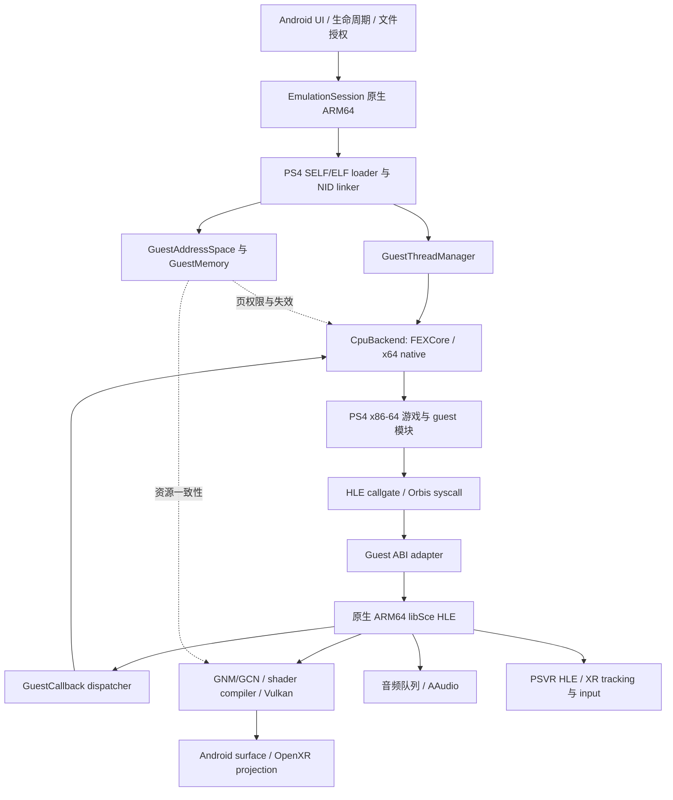

# Android 16 / 16 KiB 页上的 shadPS4 原生 guest/host 分离方案

**整合能力结论与接口核查：见 [Android 与 ARM64 C++ 整合审计](android-arm64-integration-audit.md)。已确认真实启动/HLE/控制/输入/音频基础；NDK 原生 Surface 与 16 KiB 仍是必做工作。**

分析日期：2026-09-07。目标来自本次讨论：Android 16、16 KiB host page，原生 ARM64 模拟器，FEXCore 执行 PS4 x86-64 guest；验证对象为 Beat Saber 的 PS4/PSVR 版本，以及一款非 VR 游戏。

> 后续源码复核：官方 FEX 已检出为 `references/FEX`，固定 `50e6eee9`。本文具体旧 API 以参考项目锁定的 `f2b679f6` 为准；新版已改动 CreateThread/HandleSyscall 并移除 OS_GENERIC，详见 [FEXCore 与 Dynarmic 源码规模和接口对比](fexcore-dynarmic-source-comparison.md)。

> 调试专项复核：采用 [host LLDB → guest 视图路线](fex-lldb-host-guest-workflow.md) 先行；可恢复的 guest 停止/单步作为接入门槛，标准 RSP 随后复用同一套控制接口。现成 stub 的具体缺陷、Core 能力及验收见 [guest debugger 分析](fex-guest-debugger-feasibility.md)。

> Android 前端基线已补齐为独立子仓 `references/Bachata-S4-android`，固定 `67dbf4e5`。源码实际为 0.1.8 系列；官方 v0.2.1 目前只有预发布条目，v0.1.9 的源码关联与发布说明也存在差异。选型、溯源和后续接入步骤见 [Android 基线确认](android-foundation-selection.md)。这份前端尚未合入主仓，也尚未完成 16 KiB 后端改造。

本文将附件视为待复核资料，不把其中的命令、建议和结论当作用户指令。完成的是源码与一手资料分析，**没有在目标设备编译、运行或测量**。SoC、RAM、GPU 驱动、XR runtime、具体游戏版本尚未确定；这些影响验收结果，不妨碍确定架构。

## 1. 决策结论

**建议直接建设“Android NDK/bionic 原生 shadPS4 + FEXCore PS4 执行后端”。已有 ARM64/glibc 版本用于参考与差分验证，不以“整个 x86 shadPS4 先跑起来、再逐个模块 thunk 出去”作为主线。**

理由不是原生化必然获得多少帧率，而是：

1. 用户要的是明确的 PS4 guest / Android host 边界，Beat Saber 又需要直接的 XR 图形、追踪和音频接入。这与原生 HLE/GPU 的结构一致。
2. 本地已有真实的 FEX guest 后端、HLE callgate、反向回调、pthread 接入和 ARM64 shader helper，B 路线已经有可审计的起点。
3. 16 KiB 页是共同硬门槛。完整 Linux guest 路线还要兼容 Linux 的 4 KiB mmap/mprotect 语义，不能自动绕过这个问题。
4. 现有 shadPS4 多处 PS4 内存操作采用 16 KiB 对齐。仅支持 PS4 用户态语义，可能比支持任意 Linux 用户程序更容易匹配目标 host；但 FEX 内部依然必须改造和验证。

**可行性判断：适合作为带退出条件的研发项目启动；现有证据不足以承诺 Android 16 / 16 KiB 上的游戏兼容性，更不能承诺 Beat Saber 的 VR 实时性能。第一笔工程投入应购买这方面的确定性。**

## 2. 必须分开的三个维度

附件及本地旧文档混合了“谁被翻译”“用什么 libc”“如何显示”三个维度。它们不是同一件事。

| 路线 | FEX 翻译什么 | shadPS4 所用 host ABI | 图形/显示 | 与目标的关系 |
|---|---|---|---|---|
| A：完整 Linux x86 guest | 游戏 + x86 shadPS4；部分库可 thunk | x86 Linux，外接 ARM64 宿主层 | 取决于实现，可直接 thunk，也可转发 | 可作对照，CPU 边界不符合最终目标 |
| B1：ARM64 Linux shadPS4 | PS4 游戏与保留的 PS4 模块 | ARM64 glibc | 可以仍带 X/Vortek/托管运行时 | 已有参考代码；CPU 已分离，Android 平台未原生化 |
| B2：原生 Android shadPS4 | PS4 游戏与保留的 PS4 模块 | ARM64 bionic/libc++ | Android Vulkan / AAudio / OpenXR | 推荐最终结构 |

“有容器或托管运行时”不意味着模拟器自身仍是 x86 guest；“用了 FEXCore”也不意味着带了 Linux syscall frontend。FEX 官方 FAQ 明确区分完整 FEX Linux 环境与可嵌入的 FEXCore。[FEX FAQ](https://wiki.fex-emu.com/index.php/FAQ)

同样，**guest/host 分明不要求 guest 与 host 使用不同的地址数值，也不要求分进程**。同址映射是实现 fastmem 的选择；CPU state、对象类型、函数入口、内存所有权和线程生命周期仍然可以严格分离。这里的分离是正确性与维护边界，不是安全沙箱承诺。

## 3. 已有代码究竟证明了什么

### 3.1 分析快照

| 代码 | 本地 HEAD | 本次用途 |
|---|---|---|
| 当前 shadPS4 | `79b7ddff0bd455f78cb85259e48dca314d3baf04` | 应用架构、内存、HLE、Vulkan、PSVR |
| `references/shadps4-arm64` | `be6bc2e9c60799e071dd2fafa6216e8d80ec619c` | 原生 ARM64 guest backend 的主要参考 |
| `references/Bachata-S4` | `e170f8005970ae416e0f39997d82b4fcc57214fe` | 运行时与存量 harness 证据 |
| 本地 citron | `63e5039893c7e4b07a723f51cb14dc4fc52163fd` | CPU callback / fastmem / Android XR 集成 |
| 本地 azahar | `011804d83b37952b66e469dded06a2a39cc1a519` | CPU interface / 内存回调 / page table |
| 参考项目锁定 FEX | `f2b679f6028ce1c38875233aecfcf5d3f8ebecec` | 本文具体 FEX API 与内部限制 |

参考子模块存在本地改动，本文以实际读到的工作树为准；HEAD 用于标明基线，不将其当作整个工作树的内容哈希。`shadps4-arm64` 提交显示的作者日期是 2000-01-01，不能据此推断项目时间线。

### 3.2 可以复用的实现

| 能力 | 实际代码 | 可得结论 |
|---|---|---|
| CPU 后端 | [guest_cpu.h](https://github.com/zenithblue-oss/shadps4-arm64/blob/be6bc2e9c60799e071dd2fafa6216e8d80ec619c/src/core/guest_cpu/guest_cpu.h)、[fex_guest_cpu.cpp](https://github.com/zenithblue-oss/shadps4-arm64/blob/be6bc2e9c60799e071dd2fafa6216e8d80ec619c/src/core/guest_cpu/fex_guest_cpu.cpp) | 已有请求/状态/错误模型及 FEX thread 生命周期 |
| NID → HLE bridge | [libs.h](https://github.com/zenithblue-oss/shadps4-arm64/blob/be6bc2e9c60799e071dd2fafa6216e8d80ec619c/src/core/libraries/libs.h#L13) | ARM64 路径注册 typed adapter，不把 ARM 函数地址直接当 x86 RIP |
| x86 callgate | [hle_call_adapter.cpp](https://github.com/zenithblue-oss/shadps4-arm64/blob/be6bc2e9c60799e071dd2fafa6216e8d80ec619c/src/core/guest_cpu/hle_call_adapter.cpp#L41) | 已有 `mov r10,rcx; mov rax,id; syscall; ret` veneer |
| 自定义 syscall handler | [fex_guest_engine.cpp](https://github.com/zenithblue-oss/shadps4-arm64/blob/be6bc2e9c60799e071dd2fafa6216e8d80ec619c/src/core/fex/fex_guest_engine.cpp#L693) | FEX trap 转入 ARM64 HLE，不需要 PS4 → Linux syscall 伪装 |
| guest 回调 | [linker.cpp](https://github.com/zenithblue-oss/shadps4-arm64/blob/be6bc2e9c60799e071dd2fafa6216e8d80ec619c/src/core/linker.cpp#L319) | 已附着线程走 nested callback，其他情况建立运行请求 |
| guest pthread | [pthread.cpp](https://github.com/zenithblue-oss/shadps4-arm64/blob/be6bc2e9c60799e071dd2fafa6216e8d80ec619c/src/core/libraries/kernel/threads/pthread.cpp#L251) | 线程入口经 FEX 执行，保留 guest 栈与 TLS |
| ARM64 shader helper | [flatten_extended_userdata_pass.cpp](https://github.com/zenithblue-oss/shadps4-arm64/blob/be6bc2e9c60799e071dd2fafa6216e8d80ec619c/src/shader_recompiler/ir/passes/flatten_extended_userdata_pass.cpp#L322) | 已有 ARM64 SRT walker；需要比对当前主线语义后移植 |

所以“B 路线没有公开实现”已经不成立。公开仓库可见于 [shadps4-arm64](https://github.com/zenithblue-oss/shadps4-arm64)。不过源码存在、微测试通过、游戏可玩是三个不同证据等级。

### 3.3 不能当成现成产品的部分

- **不是 NDK/bionic 构建。** [build-shadps4-arm64.sh](https://github.com/zenithblue-oss/shadps4-arm64/blob/be6bc2e9c60799e071dd2fafa6216e8d80ec619c/runtime/scripts/build-shadps4-arm64.sh#L63) 使用 `aarch64-linux-gnu`，并校验 `/lib/ld-linux-aarch64.so.1`；FEX smoke 同样使用 Linux ARM64 toolchain。
- **已有实机证据是 4 KiB + glibc。** [fex-phase1.json](https://github.com/tencentmalos/Bachata-S4/blob/e170f8005970ae416e0f39997d82b4fcc57214fe/runtime/evidence/sm8650/fex-phase1.json) 记录 SM8650、SDK 36、pageSize 4096、glibc interpreter，以及 1.418 秒的 harness。不能外推到 16 KiB、ART 共存、商业游戏或 VR。
- **16 KiB 被显式拒绝。** [GuestEngine::Create](https://github.com/zenithblue-oss/shadps4-arm64/blob/be6bc2e9c60799e071dd2fafa6216e8d80ec619c/src/core/fex/fex_guest_engine.cpp#L1281) 对非 4096 页返回 `ENOTSUP`。
- **ABI adapter 只覆盖有限类型。** [hle_call_adapter.h](https://github.com/zenithblue-oss/shadps4-arm64/blob/be6bc2e9c60799e071dd2fafa6216e8d80ec619c/src/core/guest_cpu/hle_call_adapter.h) 支持寄存器宽度内整数/指针、float/double、void；不是完整 aggregate/varargs/x87 桥。其指针验证失败时仍可能放行大于等于 4096 的地址，正式边界不能照搬这种“看起来像指针”的规则。
- **反向桥并不统一。** [CallGuest](https://github.com/zenithblue-oss/shadps4-arm64/blob/be6bc2e9c60799e071dd2fafa6216e8d80ec619c/src/core/fex/fex_guest_engine.cpp#L1451) 的 nested 路径最多 7 个整数参数；linker 外层新请求最多 32 个。回调不能依靠“恰好从另一条路径调用”改变签名能力。
- **公开状态模型不完整。** 请求/结果公开 GPR、RFLAGS、XMM，但未完整暴露 YMM upper、x87、MXCSR 等。FEX 内部可能持有这些状态，不能把 wrapper 的快照当作完整 CPU context。
- **信号仅局部适配。** [HandleGuestSignal](https://github.com/zenithblue-oss/shadps4-arm64/blob/be6bc2e9c60799e071dd2fafa6216e8d80ec619c/src/core/fex/fex_guest_engine.cpp#L1003) 主要处理 JIT 中的 `SIGBUS/BUS_ADRALN`；[signals.cpp](https://github.com/zenithblue-oss/shadps4-arm64/blob/be6bc2e9c60799e071dd2fafa6216e8d80ec619c/src/core/signals.cpp#L171) 直接安装处理器。这没有证明 ART signal chain、所有 guest fault 和抢占均正确。
- **测试中有源码断言。** 例如 `runtime/tests/*-source.test.mjs` 会检查源文件是否含特定调用；此类测试用于防回归，不能替代执行与并发正确性测试。

复用策略应是“接口与经验证的机制逐项移入”，不要把整个参考 fork 的兼容补丁、信号绕行和 runtime 一并带入。

## 4. 对附件关键判断的修正

| 附件判断 | 复核后的判断 |
|---|---|
| FEXCore 的前端形态是可执行程序，假设自己就是 Linux 进程 | 混淆 FEXCore 与 Linux frontend。Core 有可替换的 syscall/signal/thunk 接口；确实有宿主内存与平台假设，但不强制采用 Linux guest OS |
| B 没有实现，需要从零赌 6–18 个月 | 已有 B1 实现，风险转为代码审计、平台移植和正确性收敛；不能用无来源的工期替代验证 |
| 架构 A 不存在混合内存模型问题 | native thunk、驱动线程、GPU、音频依然位于 ARM host 边界；A 只是边界位置不同 |
| AArch64 Linux 变参全部走栈 | 不成立。AAPCS64 有 GP/FP 寄存器与保存区规则；不能拿 Apple 等平台变体代替 Android ABI |
| Box64 是 GPLv3，AVX 是决定性缺口 | 根 LICENSE 是 MIT；官方已有 AVX/AVX2 配置与实现。仍需测指令覆盖，但这两个排除理由不成立 |
| 39-bit VA 一定让 PS4 失败 | 桌面默认超大预留会失败，不等于所有目标游戏需要那些地址。要测实际所需范围、固定映射与冲突 |
| 容器化就绕开 VA 问题 | 托管运行时、proot 不能增加内核 VA bits；最多改变用户空间布局 |
| shader recompiler 只接受 GCN、输出 SPIR-V，是纯净边界 | 当前入口还依赖 runtime info、device profile、binding、guest user-data 与 SRT walker。可整理成边界，但不是现成纯函数 |
| 单指令 block 是定位 guest RIP 的唯一可靠方法 | FEX 已提供 `RestoreRIPFromHostPC` 等重建接口。单指令模式仍是有用的降级手段，不能替代正常崩溃状态重建 |
| 每次跨界几十到一两百 ns；整体只能快 25–30% | 没有目标 SoC/构建/工作负载证据。这些只能是算例，不能指导预算 |

相关一手依据：[FEXCore 定义](https://github.com/FEX-Emu/FEX/blob/main/FEXCore/Readme.md)、[OS_GENERIC 接口](https://github.com/FEX-Emu/FEX/blob/f2b679f6028ce1c38875233aecfcf5d3f8ebecec/FEXCore/include/FEXCore/HLE/SyscallHandler.h)、[AAPCS64](https://github.com/ARM-software/abi-aa/blob/main/aapcs64/aapcs64.rst)、[Box64 LICENSE](https://github.com/ptitSeb/box64/blob/main/LICENSE)、[Box64 使用说明](https://github.com/ptitSeb/box64/blob/main/docs/USAGE.md)、[FEX Context](https://github.com/FEX-Emu/FEX/blob/f2b679f6028ce1c38875233aecfcf5d3f8ebecec/FEXCore/include/FEXCore/Core/Context.h)。

附件对“不要先引入 fiber”“优先复用成熟 DBT”“重视信号、ABI、GPU”的方向判断仍有价值。需要修正的是事实前提和量化确定性。

## 5. 推荐架构与责任边界



FEX 负责 x86 指令执行、内部 CPU state、JIT、可用的状态重建及代码缓存接口。shadPS4 负责 PS4 loader、Orbis ABI、线程身份、TLS、虚拟内存语义、HLE、GNM/GCN、音频和设备。Android 平台层负责 host 映射、线程/时钟、信号共存、Surface、文件访问、音频与 XR runtime。

FEX 私有类型只出现于 `cpu/fex/` 内；其他模块通过自己的接口操作。建议形成以下最小边界，而不是立即设计一个万能虚拟机：

```cpp
// 架构示意，不是已经实现或可直接编译的 API。
class CpuBackend {
    GuestThreadHandle CreateThread(const ThreadInit&);
    RunResult Run(GuestThreadHandle);
    void RequestInterrupt(GuestThreadHandle, InterruptReason);
    CallbackResult InvokeGuest(GuestThreadHandle, GuestCodePtr, const GuestCallFrame&);
    CpuSnapshot CaptureState(GuestThreadHandle, CapturePoint);
    void InvalidateCode(GuestRange, InvalidationReason);
    void DestroyThread(GuestThreadHandle);
};
```

`CaptureState` 必须区分已经退出 JIT 的安全点与异步 host fault，不能对二者都复制 `CurrentFrame`。暂停、退出、回调、guest fault 也不能都折叠成 harness 的 `HLT`。

保留 PS4 原始模块或自行编写的 x86 guest helper 并不破坏这个结构：它们有明确的 guest 归属。无需为了“纯原生”把 guest libc、allocator、游戏引擎内部函数都重写成 ARM64。

## 6. 第一硬门槛：16 KiB host page

### 6.1 分清三种粒度

| 粒度 | 所属层 | 正确处理 |
|---|---|---|
| Host mapping/protection page = 16384 | Android 内核 | 所有 mmap 地址、offset、mprotect、munmap、guard page 服从实际粒度 |
| PS4 guest mapping/protection 粒度 | Orbis VMM | 按 PS4 ABI；当前 shadPS4 多处采用 16 KiB，不能由 host page 反向定义 |
| FEX 查表、代码追踪、GPU tracker 的逻辑粒度 | 模拟器内部 | 可以维持 4 KiB 索引，但不能直接等同于可独立保护的 host page |

Android 官方要求的不只是 ELF 对齐，也包括去掉 native 代码中的固定页大小假设。[Android 16 KiB 指南](https://developer.android.com/guide/practices/page-sizes)

当前已定位四类具体问题：

1. 参考 adapter 的 `kRequiredPageSize=4096`，以及栈保护和 range validation。
2. 锁定 FEX 的 `FEX_PAGE_SIZE=4096` 同时流入逻辑索引和实际 host 分配；需要按用途拆分。[TypeDefines.h](https://github.com/FEX-Emu/FEX/blob/f2b679f6028ce1c38875233aecfcf5d3f8ebecec/FEXCore/include/FEXCore/Utils/TypeDefines.h)
3. `GetHostVABits()` 试映射 `(1 << bits) - FEX_PAGE_SIZE`。在 16 KiB host 上，这个地址按 4 KiB 计算会不对齐，可能把 `EINVAL` 误判成地址不支持。[Allocator.cpp](https://github.com/FEX-Emu/FEX/blob/f2b679f6028ce1c38875233aecfcf5d3f8ebecec/FEXCore/Source/Utils/Allocator.cpp)
4. shadPS4 [page_manager.cpp](../src/video_core/page_manager.cpp#L39) 的 tracker 固定为 4 KiB。四个逻辑页若共用一个 host page，无法用四次 mprotect 获得四种独立权限。

### 6.2 建议的实现方法

先做 **PS4 专用的 FEX host-page 适配**，不顺便做通用 Linux 4 KiB guest 环境：

- 引入 `HostPageSize/HostPageMask`，用于 host 分配、释放、保护、guard、VA 探测、JIT buffer 与映射文件 offset。
- FEX 的 guest/code 索引常量单独保留，逐个审计 `FEX_PAGE_SIZE` 使用点。**不做全局 4096 → 16384 替换。**
- NDK 构建中关闭 glibc allocator hook，避免接管整个 Android/ART 堆；检查真正链接进来的分配器与其他直接系统调用。官方 CMake 有 `ENABLE_FEX_ALLOCATOR`、`ENABLE_JEMALLOC_GLIBC_ALLOC` 开关，但关闭开关本身不证明全部依赖已清除。[FEX CMake](https://github.com/FEX-Emu/FEX/blob/f2b679f6028ce1c38875233aecfcf5d3f8ebecec/CMakeLists.txt)
- 以 16 KiB 独占 arena 分配 JIT/dispatcher/return gates/guard 区。guest x86 代码只要求逻辑可执行和 host 可读；真正的 ARM64 JIT 代码才需要 host 执行权限，两者不要混为一谈。
- 模块 ELF segment 共享 host page 时，统一处理 BSS、权限与部分页；不得把后一个 segment 的清零扩散到前一个 segment。先对 PS4 实际 loader 路径验证，不套 Linux guest loader。
- 初始 GPU tracking 以 host page 为保护单位，维护覆盖该页的全部逻辑资源。发生写入时保守失效整个 host page 内受影响资源；若移除页保护，必须同步更新所有仍依赖保护的 observer，否则下一次写入会漏报。
- 上述粗粒度策略只能放宽**脏数据追踪精度**，不能随便放宽 guest 可见权限。若目标 guest 真需要同一 host page 内不同权限，应实现软件检查等慢路径，或明确该映射尚不支持。
- 反向映射 guest virtual aliases 到 backing physical pages。通过任意别名或 host HLE 写入时，都需失效相应 JIT/GPU 数据，不能只处理发生 fault 的一个 VA。

### 6.3 验证顺序与退出条件

先得到 NDK/bionic 的最小 FEXCore `.so`，在真正 16 KiB 的 Android app 中执行：

1. 固定地址 code/data/stack 映射，两个相邻 4 KiB 逻辑片段共居一个 16 KiB host page。
2. GPR/flags/SSE/AVX、TLS、guest→HLE→guest callback。
3. guest store 与 host store 修改代码，随后跨线程执行；映射、卸载、重新映射同址代码。
4. GPU tracker 模拟读写保护，覆盖 host page 边缘、跨页访问和别名。
5. JIT 未对齐原子访问、guard fault、暂停、反复创建/销毁，配合 Android 后台/前台切换。

必须保存设备 `getpagesize=16384`、ELF 信息、FEX commit、测试输入与结果。4 KiB 机器上的成功只作为对照。

**退出条件：如果这一阶段发现必须重写 FEX 的普遍访存路径才能维持目标 PS4 映射/权限，应重新评估范围，不能以吞掉 fault 或扩大全部权限伪装通过。** VM 的 4 KiB 内核只是改变部署方案，不能作为本目标已经达成的证据。

## 7. 地址空间：同址映射优先，所有权必须明确

当前桌面 Linux [address_space.cpp](../src/core/address_space.cpp#L33) 把 user 区上限设到 `0x54FFFFFFFFFF`，远超 39-bit 空间。参考 fork 在运行时路径将上限收窄为 `0x3FFFFFFFFF`。这说明默认预留策略可以调整，不证明全部游戏因此兼容。

推荐 `GuestAddressSpace` 自己拥有一组区间：SELF/ELF、guest heap/stack/TLS、shared backing、callgate；ARM host heap、ART、driver mappings 和 JIT cache 是其他所有者。

启动时以 host page 对齐探测所需 VA 并预留 `PROT_NONE`；首次占用用不覆盖已有映射的方式。只有已经属于本模块的 reservation 内才使用替换式 fixed mapping。参考 fork 读取 `/proc/self/maps` 后对空洞使用 `MAP_FIXED` 的方法，在有 ART/驱动并发分配的 app 中存在检查与映射间竞态，不能原样移植。

把 `GuestPtr<T>`、`GuestCodePtr`、host 指针、opaque handle 区分开。第一版 `GuestPtr` 仍可同址解引用，但通过统一 accessor 检查范围和生命周期；不需要一开始对每个 buffer 深拷贝。长时间保存的 guest buffer 必须 pin 或持有映射引用，不能只在 API 入口检查一次。

从 HLE 返回 host `new` 对象地址的旧路径逐步变成 handle table；guest 可读的数据结构、vtable、全局对象要有符合 PS4 layout 的表示。`LIB_OBJ` 也属于边界审计范围，不能只改 `LIB_FUNCTION`。

若某游戏必须使用 host 无法映射的固定高地址，不能通过“给 FEX 加一个基址”轻松解决：访存、间接调用、原子操作、指针比较与 HLE 访问都要一致翻译。那已经是 FEX 地址翻译后端级改造，应列为后续备选或该设备/游戏不支持条件。

## 8. HLE ABI：有限通用桥 + 显式特殊 adapter

### 8.1 不需要手写几千个汇编桥

本次对主树 `.cpp` 中固定形状 `LIB_FUNCTION` 的正则统计得到 **5278 个注册出现、4854 个不同 target 表达式**；它只是粗略注册统计，包含别名和桩，不是精确 ABI 签名数，更不是首个游戏必须实现的数量。

先利用现有 typed adapter 模式统一处理 scalar/pointer/float/double，由 C++ 编译器生成 host AAPCS64 调用。再按实际 import manifest 和签名类型补特殊边界，而不是先实现整个 SysV ABI 标准。

| 类别 | 建议处理 |
|---|---|
| 整数/枚举/普通指针/float/double | 模板 adapter，分别消费 GPR/XMM/stack，测试溢出栈参数 |
| struct 指针、嵌套 buffer | PS4 固定 layout 类型 + 长度/读写/生命周期元数据 |
| struct/vector 按值、返回结构 | 单独生成或手写经过验证的 SysV classifier；含寄存器不足时的整体回退规则 |
| `va_list` / printf 类 | 自己解码 guest varargs，复用格式化逻辑；不得把 x86 `va_list` 传给 bionic vprintf |
| 回调/函数表 | `GuestCodePtr` + 签名描述，反向桥统一编码 |
| host opaque object | 显式 handle table，不按普通 guest pointer 验证 |
| 未覆盖签名 | 开发构建在链接/注册阶段显式报告；不返回“成功”掩盖 |

当前 [va_ctx.h](../src/common/va_ctx.h) 已有 x86 参数保存区模型，但非 x86 的 `__m128` 替代带 FIXME，不能把它直接视为可移植 varargs 实现。

### 8.2 callgate 的具体要求

参考 veneer 保存了第四参数 RCX，因为 x86 `syscall` 会覆盖 RCX/R11。FEX `OS_GENERIC` 提供完整寄存器 spill/fill，可作为正确性优先的第一版入口；该指令由 DBT 处理，不是把任意 guest syscall 发给 Android 内核。[FEX SyscallOp](https://github.com/FEX-Emu/FEX/blob/f2b679f6028ce1c38875233aecfcf5d3f8ebecec/FEXCore/Source/Interface/Core/OpcodeDispatcher.cpp)

还要解决：

- callgate 与真正 Orbis `syscall` 分流。必须检查 trap 所属入口/命名空间，普通 guest syscall 按 Orbis ABI 处理；不能全部当作 HLE operation ID。
- veneer 写 RAX 会覆盖 AL，变参入口若需要原始向量参数计数，应提前保存或使用不依赖该计数的显式参数快照协议。
- callee-saved、栈对齐、red zone、整数扩展、返回 GPR/XMM，以及 guest MXCSR/FP 环境的保存恢复。
- guest 的 long double/aggregate 内存布局不能映射成 host 同名 C++ 类型就宣告兼容。
- 私有 return trap 只在登记的返回页使用；真实 guest HLT/非法指令不能被当成一次正常函数返回。
- HLE 异常在 host 边界内捕获，转成定义好的执行结果；不跨 JIT 栈传播 C++ 异常。

第一版 callgate 集中放进页池。参考实现每个 16-byte veneer 分配一个 host page，在 16 KiB host 上会放大 VMA 与地址占用，适合重构为批次生成/封存。

## 9. 线程、TLS、回调与异常

初期保持 **一个 PS4 guest thread 对应一个 host pthread**，每个 guest thread 持久拥有 FEX context、guest stack、PS4 TCB、取消/暂停状态。不要为每次 HLE 或同线程回调新建 FEX thread。

三种回调必须分别设计：

| 场景 | 处理方式 |
|---|---|
| guest 调用 HLE，HLE 同步回调当前 guest | 同一 FEX thread 嵌套进入，保存 call frame 与返回控制；允许再次进入 HLE |
| guest 注册异步通知，由 guest 的事件分发 API 取回 | 入队，按该 API 的线程身份和时序在 guest 调用点执行；不随意改成后台线程执行 |
| host 工作线程必须同步调用 guest allocator 等 | 首次建立/附着明确的 guest service-thread 身份、guest stack 与 TCB，缓存后复用；必要时使用专用工作线程，但不能破坏 API 线程语义 |

AAudio 的实时回调只消费预先准备的音频数据，不运行任意 guest 代码。XR frame loop 也不应承载可能阻塞的 guest allocator/HLE。

FEX `CreateThread` 解决 CPU state 的创建，不自动完成 PS4 pthread 身份、TCB、altstack、应用信号链或线程退出清理。参考代码支持尝试 nested callback 后新建请求，但生产版需要明确 attach/detach 的生命周期。

guest FS/GS 是 CPU state 内的值；bionic 的宿主 TLS 寄存器保持宿主含义。**不存在为了 guest FS 去切换 Android 的硬件 TLS 的必要。** 参考 [tls.cpp](https://github.com/zenithblue-oss/shadps4-arm64/blob/be6bc2e9c60799e071dd2fafa6216e8d80ec619c/src/core/tls.cpp#L179) 已用 pthread key 保存非 x86 host 上的 PS4 TCB。

暂不引入可跨 host thread 迁移的 fiber。这会额外牵动 altstack、host TLS、FEX 活跃线程、阻塞 HLE 的原生栈与锁。并非理论上不可能，而是第一版没有足够收益抵消复杂性。

额外验收必须包括：TLS destructor、模块 init/fini、pthread join/detach/cancel、回调重入、线程退出时仍有回调、长时间不调用 HLE 的纯 JIT 循环，以及 guest `setjmp/longjmp`/异常设施。host `jmp_buf`、ucontext 与 guest 对应结构不可混用。

## 10. 统一信号、页追踪与内存顺序

### 10.1 signal router

App 进程内由统一入口根据 host PC、fault address、当前执行归属和保护原因分流：

- FEX JIT 的未对齐/特定内部 fault → FEX adapter。
- guest memory 的 GPU read/write tracking 或 SMC protection → GuestMemory 的保护账本。
- 已登记的 ARM64 SRT helper fault → helper 专属恢复路径。
- 真正 guest 异常 → 重建 PS4 寄存器/异常信息，在允许的 guest 上下文投递。
- ART/host 自身的异常 → 保留或接回平台原有处理，不把所有 SIGSEGV 当 guest fault。

一个页同时被 GPU tracker 和 SMC 观察时，应处理所有相关原因；“第一个 handler 返回 handled”可能漏掉另一类失效。

异步 handler 中只做可证明安全的状态获取与标记，复杂日志、分配、一般 mutex、HLE 回调和 GPU 等待都移到安全点。具体信号与 libsigchain 的组合需要真机验证，不预设 FEX Linux frontend 的信号编号可以原封不动占用。

暂停与 guest signal 不能仅等待下次 HLE：纯计算循环可能永不进入 HLE。应由 backend 的中断机制在可恢复边界退出 JIT，且阻塞中的 HLE 也有可唤醒等待；CPU 重建到一致状态之后才能改变执行流。现有 `FlushPendingGuestOrbisSignal` 的思路可参考，不能当作完整抢占方案。

### 10.2 失效协议

所有代码修改来源都进入 `GuestMemory::NotifyWrite/InvalidateCode`：guest store、host HLE memcpy、patch/debugger、module unload、mmap/mprotect，以及同物理内存的其他 VA alias。

失效不仅是删一条缓存：要同步共享 block cache、各线程 lookup/直接跳转、正在执行的代码，以及可回收代码的生命周期。先用保守暂停/失效/恢复协议获得正确性，再缩小范围。FEX 提供的共享与线程缓存接口应封装在 adapter 中调用。

### 10.3 TSO 与 host 共享内存

默认保留 FEX 的正确性配置，不以关闭 TSO 为首轮性能方案。HLE 内部私有数据用正常 C++ 同步；guest/host 共用的 ring、事件标志、原子锁等，由经过审核的访问 helper 和同步协议处理。

普通 guest store 与 native ARM64 `std::atomic` 之间是否形成所需的原子性/顺序，不能只凭“都是同一地址”判断。需要混合执行 litmus tests，覆盖消息发布、store buffering、未对齐和跨 cache-line 原子访问。边界 fence 可以作为初期保守策略，但不能代替数据竞争和生命周期分析。

GPU 顺序还需要 Vulkan semaphore/barrier、queue ownership、host visible cache flush/invalidate；CPU 的 `dmb` 不会自动完成这些 GPU 同步。

热 mutex 的 guest 无竞争路径应在 profiling 证明必要后再考虑。如果现有 ScePthread 对象背后是 host mutex/对象指针，不能直接在 guest 塞几条 x86 CAS 操作 host 对象布局。需先建立明确的 guest-visible 同步协议，并覆盖取消、递归、condvar 等语义。

## 11. 图形原生化还有一个附件漏掉的阻塞

当前主树 [flatten_extended_userdata_pass.cpp](../src/shader_recompiler/ir/passes/flatten_extended_userdata_pass.cpp#L865) 在非 x86 架构直接 `UNREACHABLE`。这是 shader 编译路径中的 SRT walker，不是 PS4 guest CPU 指令。

因此“只把游戏交给 FEX，其余 C++ 编成 ARM64”还不完整：**模拟器自己生成的 x86 helper 也必须移植。** 可先做可移植 C++ walker，以当前主线的语义为准；参考 fork 的 ARM64 emitter 是优化候选。当前主树已经有比旧实现更复杂的 offset 表达式处理，不能只拷贝较旧 emitter 取代全部 pass。

shader compiler 本身可以保留在 native host，但并不是无状态的 GCN → SPIR-V 函数。[CompileModule/GetProgram](../src/video_core/renderer_vulkan/vk_pipeline_cache.cpp#L610) 还读写 `Shader::Info`、`RuntimeInfo`、device profile、bindings；[info.h](../src/shader_recompiler/info.h#L165) 存在 guest user-data、常量 buffer 和 walker 访问。

如果将来确实要从 A 路线把 shader 编译移出来，需要定义独立的、带版本的输入快照与输出描述，包含相关 descriptor/常量/特性/布局；禁止在跨 ISA 边界传 `std::vector`、原生 C++ 对象或 walker 函数地址。这笔工作并不必然比建设 PS4 HLE bridge 更少。

Vulkan 第一轮直接使用 Android 原生 driver/surface，并把“扩展名存在”“feature bit 支持”“format/limit 可用”“目标 draw 实际正确”分开。当前 [vk_instance.cpp](../src/video_core/renderer_vulkan/vk_instance.cpp#L249) 显式要求 swapchain、push descriptor、vertex attribute divisor、robustness2 等；部分其他能力有 fallback。不能把附件中的一列扩展全当硬需求，也不能把 Android 版本当作 GPU 能力证明。

用于 XR 时，先通过 runtime 要求创建兼容的 Vulkan instance/device。自定义 Turnip driver 是否能与该 OpenXR runtime 的 graphics binding 共存要单独验证，不能假定平面 Surface 成功便能直接换驱动运行 XR。

## 12. Beat Saber：PSVR HLE 是独立交付项

本项目中的 Beat Saber 目标是 PS4 二进制。Android/Quest 版是否存在，不会减少运行这份 PS4 代码所需的模拟工作。

当前 shadPS4 的 [hmd.cpp](../src/core/libraries/hmd/hmd.cpp#L111) 返回头显未检测到；[move.cpp](../src/core/libraries/move/move.cpp#L36) 返回控制器未连接。没有可以直接打开的完整 PSVR 实现。因此，即便普通游戏已经运行，Beat Saber 仍有单独阻塞。

### 12.1 可以借鉴本地 citron，但要分清成果

本地 [openxr_manager.cpp](https://github.com/tencentmalos/citron_shadow/blob/63e5039893c7e4b07a723f51cb14dc4fc52163fd/src/android/app/src/main/jni/xr/openxr_manager.cpp#L1195) 已有 frame lifecycle、swapchain、预测显示时间与双眼内容路径，值得复用平台设计。但这里的 `ReleaseAndSubmitFrame` 提交左右眼 `XrCompositionLayerQuad`。这能展示立体画面，不等于 Beat Saber 的头部追踪沉浸式投影。

OpenXR loader 需要设备上的 runtime；Android 16 本身不提供一套必然可用的六自由度头显和双手控制器环境。[OpenXR loader](https://registry.khronos.org/OpenXR/specs/1.1/loader.html)

### 12.2 PSVR → OpenXR 需要覆盖的语义

| PS4 侧 | Host 实现目标 | 验证要点 |
|---|---|---|
| HMD 初始化/设备信息 | XR session 与设备属性 | 不能只伪造“连接成功”然后返回空状态 |
| HMD pose / FOV / eye offset | `xrLocateViews`、坐标与投影转换 | 单位、左右手系、眼间距、recenter、追踪有效位 |
| Move / VrTracker | XR actions、左右手空间与历史采样 | 控制器身份、按钮、位姿、速度/时间戳、断连状态 |
| 震动 | XR haptic action | 时间与幅度映射 |
| 双眼 render target / video submit | Vulkan render targets → XR swapchain | 找到 guest 实际 eye texture 与子区域，避免把电视镜像当眼图 |
| distortion / reprojection | guest pass 与 runtime compositor 的职责划分 | 防止重复畸变；不直接跳过仍有资源/同步副作用的 guest 函数 |
| 节奏音频 | AAudio 队列与统一时钟 | 音频、输入采样、预测显示时间的相对延迟和漂移 |

帧提交应以匹配的 pose/FOV 和 `predictedDisplayTime` 提交 projection views；纹理仍来自 guest 正常渲染。若 guest 只输出经过 PSVR 畸变的最终图，需要先定位畸变前资源或正确替代该阶段，不是提交一个双宽 Surface 就结束。[OpenXR frame submission](https://github.com/KhronosGroup/OpenXR-Guide/blob/main/chapters/frame_submission.md)

不要事先假定 Beat Saber 的具体更新版本使用哪条 reprojection、tracker 或引擎 signal 路径。先导出目标版本 NID/import manifest，在 x86 桌面基线上做 HLE trace 和有限的设备探测实现，确认它实际走什么代码。

### 12.3 三层 VR 验收

1. **协议层**：合成头部/双手轨迹能通过 HMD/Move/VrTracker HLE 被 guest 正确读取；先在桌面 x86 上验证，隔离 FEX 风险。
2. **视觉层**：在真实 runtime 中展示未重复畸变的左右眼，头部 pose 与画面一致；有手柄输入和声音。
3. **游戏层**：目标 Beat Saber 版本能从菜单进入并完成一首曲目，双手轨迹、判定、震动、音画同步及暂停恢复正确。

VR 性能验收用目标刷新率的帧预算：72/90/120 Hz 分别约 13.89/11.11/8.33 ms，应用可用时间还需考虑 runtime 调度余量。记录 p95/p99 CPU/GPU、missed frame、输入到显示、音频 underrun 和热稳定状态，不以“平均 60 FPS”判定 VR 可玩。

## 13. Android 原生平台工作

以下是 B1 → B2 的明确差距，不属于 FEX 指令翻译本身：

- NDK CMake target、bionic/libc++、依赖构建和 `.so` packaging；检查 ELF 不再依赖 `ld-linux`、`libc.so.6`、`libstdc++.so.6`。锁定 FEX 的顶层 CMake 平台白名单需要 Android 适配或独立 library build target。
- 拆 `EmulationSession` 的初始化/停止，支持 Activity/Surface 重建、后台、音频 focus、XR session loss；重复开始游戏不依赖杀进程清理全局对象。
- 通过用户授予的 FD/文档目录进入 host filesystem adapter；不要把 Android 文档 URI 当 POSIX 路径。
- guest file descriptors、错误码、时钟、线程身份与 Android fd/errno/pthread 的区别要在 HLE 层表达。
- guest audio push → host ring → AAudio，输入与 XR pose 使用带时间戳快照。
- PS4 guest code、FEX JIT、shader/helper JIT 和 Vulkan pipeline cache 分别管理缓存格式；涉及 host 机器码的缓存必须包含 ISA、页大小、版本与 CPU 特性标识，不能复用 x86 walker 缓存。

同一 app 内 native worker 线程是第一选择。若 ART 共存问题确实阻塞，可评估单独的 Android app service 进程做隔离；它仍有 Android 运行时和相同内核页大小，并不是自动解决信号/16 KiB 的办法。第一版不主动增加跨进程 GPU/XR 转发。

## 14. 可执行的分阶段计划

各阶段以证据验收，不以“编译成功”或“有截图”替代。下列时间仅是建议的研究 timebox，不是交付预测。

| 阶段 | 工作 | 必须留下的证据 | 未通过时的决定 |
|---|---|---|---|
| G0：基线与目标画像 | 固定代码/FEX/游戏版本，读取设备页大小/VA/GPU/XR 信息，建立桌面非 VR 基线 | manifest、能力报告、可复现启动/退出日志 | 无法确认的硬件能力标成未验证，不假设通过 |
| G1：16 KiB FEXCore app harness | NDK build、host page 适配、callgate、callback、TLS、fault、invalidate、interrupt；LLDB guest 只读视图 | 真正 16384 页 app 内的运行日志与状态对拍；JIT/HLE/fault 三种位置的可信快照 | 若需要全面访存后端重写，重新评估 FEX 投入；不继续堆 UI |
| G2：CPU/HLE 接入 | 先验收 guest 断点/一步/修改后恢复，再扩展 loader/linker、typed ABI、pthread、内存/文件/时间、纯 C++ SRT | 调试 D1 闭环；OpenOrbis 自测及完整 guest→host→guest 重入/退出 | 状态读写/恢复不可信时先修控制层，禁止用统一假成功推进 |
| G3：原生非 VR 游戏 | 先完成多线程/HLE 调试 D2，再接 Vulkan surface、shader、音频/input、所需 HLE | 指定线程单步、阻塞 HLE/callback 可控；固定场景交互/存档/持续运行指标 | 区分 CPU、GPU、驱动、游戏 HLE 与调试控制问题 |
| G4：PSVR 协议 | 在 x86 baseline 上实现目标使用的 HMD/Move/Tracker/reprojection 子集 | API trace、合成 pose 输入、双眼资源识别 | 如果还未识别渲染提交协议，不把问题转交 FEX |
| G5：Android XR + Beat Saber | 绑定真实 runtime、双眼 projection、双手、统一时钟与音频 | 完成一首曲目并达到约定帧预算，退出恢复可重复 | 功能正确但预算不满足时，明确记录“运行但不可实时游玩” |

建议前 **10–15 个工作日**只作为 G0/G1 的可行性 timebox，并同步做 GPU/XR 的最小能力探测和桌面 Beat Saber import 审计。这段时间结束时应能判断下一阶段投入是否值得，而不是承诺已有可玩 APK。

非 VR 游戏尚未命名，采用如下选择规则：优先用户现有且桌面当前 commit 已能稳定运行的单机游戏；固定一个可自动重放的场景，降低联网/复杂视频/大量动态模块的干扰。先用 homebrew 保证测试可控，再确定正式 title。不能以别人某设备的视频替代本地基线。

G3 与 G4 在工程上可独立推进：PSVR 的很多协议错误可以先在 x86 上解决，而 Android FEX 仍在收敛。这是任务拆分建议，本次分析没有启动额外 agent 或后台任务。

## 15. 性能与调试：先设计可归因的实验

可以用以下 CPU 服务时间模型理解原生化收益，但不要把它直接当 FPS 模型：

```text
A: alpha_game * T_game + alpha_emu * T_emu + T_native_boundary_A
B: alpha_game * T_game + T_emu + N_hle * C_hle + N_callback * C_callback
```

`alpha_game` 与 `alpha_emu` 不一定相同；多线程关键路径、GPU 时间、等待、编译和热降频决定帧时间。GPU-bound 场景可能几乎不涨平均 FPS，仍可能改善冷编译或 CPU 功耗，也可能被桥接成本抵消。

建议把以下 trace 从第一版加入：

- 各 HLE 的次数、总时间、p95、阻塞时间；区分纯桥开销和 HLE 工作。
- guest 执行、FEX compile、shader translate、driver pipeline compile、GPU submit/complete、音频 underrun。
- fault 按原因、host page、alias 分类；JIT cache hit/失效、host VMA/RSS、guest 实际驻留、GPU allocation。
- XR frame ID、guest clock、预测显示时间、采样时间、提交时间与 missed frames。

ABI 微测包括空 HLE、6/7/更多整数参数、混合 FP、aggregate、varargs、回调和嵌套回调，并在 release 构建关闭日志后测量。不要先优化到手写汇编再发现参数规则错了。

debug adapter 需要能记录 host PC、重建 guest RIP/GPR/flags/SIMD、模块+offset、guest 栈、HLE 历史和当前映射。优先使用锁定版本的 FEX 重建 API；保留单指令 block、关闭多 block 等定位模式作为降级工具。不要硬编码 `x28` 或内部结构偏移作为稳定协议。

差分测试优先用真实 x86-64 执行受控指令块作 oracle；比较只定义了的 flags/结果。Unicorn/QEMU 可补充其支持范围内的案例，不能充当所有 AVX、异常和 TSO 的绝对真值。单线程寄存器对拍也不能证明并发内存模型正确。

完整 FEX frontend 的 gdbstub 不随链接 FEXCore 自动进入产品，当前也不宜作为现成调试器移植。先实现 host LLDB 的 guest 只读视图，再用受控 native debug hook 验证断点、单步、修改状态后恢复；多线程/HLE 调试通过后进入非 VR 游戏接入。标准 guest RSP 可以后接，但可信执行控制不能后置。源码证据与操作路径见文首两份专项分析。

## 16. 建议的代码切分与最终取舍

按照当前主树逐层加入，而非整体替换成参考 fork：

1. `core/cpu/`：backend API、线程状态、执行退出原因；`fex/` 隔离版本依赖。
2. `core/guest_abi/`：typed HLE、特殊 ABI、guest pointer/handle/callback 类型，改 linker 和 symbol resolver。
3. `core/guest_memory/`：映射所有权、host page 对齐、保护原因账本、alias 与失效。
4. `platform/android/`：NDK/bionic、signals、surface/audio/storage/input、生命周期。
5. shader SRT helper：先可移植实现，后审计引入 ARM64 emitter；保留当前主树的全部 offset 语义。
6. `core/libraries/{hmd,move,vr_tracker}/` + `platform/xr/`：PSVR guest 契约与 host XR 分开。

FEX commit 和补丁系列锁定；把 host page、Android build、allocator、信号与调试改动拆成可单独复核的补丁。升级 FEX 时先跑受控测试，再跑非 VR 固定场景，再跑 VR。桌面 native 后端保持可用，既保护主线，也提供定位 guest/HLE 错误的对照。

对这次目标，最重要的优先级是：

**16 KiB NDK/FEXCore 可证明正确 → 原生 HLE/线程/内存契约 → 非 VR 可重复运行 → PSVR 协议和 XR → Beat Saber 实时性能。**

这条路线不要求先实现一整个 x86 Linux host layer，也不要求先写新的 x86 JIT。它复用现有成果，但把目前证据没有覆盖的 16 KiB、ART 共存、PSVR 和性能放到明确的门槛上。

附件提出的“先完整 guest、再 shader thunk”可留作另一项独立实验；对于本次 **Android 16 / 16 KiB / guest-host 分明 / Beat Saber** 的组合目标，它不应成为默认主线。
