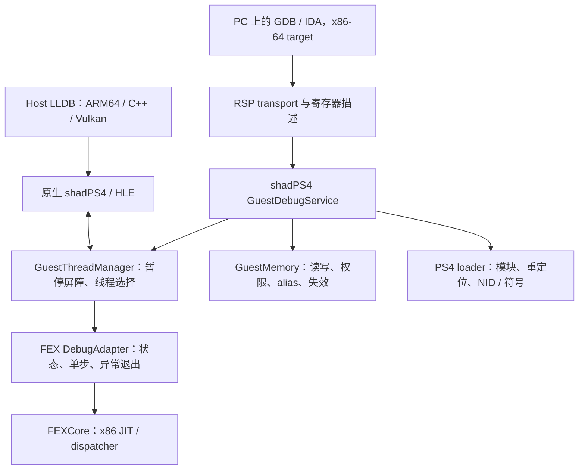

# FEXCore / shadPS4 guest debugger：源码核查与可落地方案

日期：2026-09-07。目标：Android 16、ARM64、16 KiB host page；原生 shadPS4 HLE/GPU + FEXCore 执行 PS4 x86-64 guest。

核查版本：本仓 `references/FEX`，提交 `50e6eee95ae95d3257672727a9302a30b4a60a9a`。本文是源码与协议审计，**未运行 FEX gdbstub、未完成 Android 调试器实现，也未验证 GDB/IDA 客户端联调**。下面分别标注现有事实、设计建议与待验证条件。

## 1. 判断与对原方案的修正

**原分析对“现成 FEX debugger 不足以支撑日常 guest 调试”的判断成立，而且目前源码里的问题比文档描述更具体。但“FEXCore 无法支撑 guest debugger”并不成立：Core 已有 TF 单步异常、INT3、状态重建和代码失效机制，缺的是可靠的执行控制、状态读写契约，以及 PS4 调试服务。**

推荐路线：在 shadPS4 中建立独立 `GuestDebugService`，由它管理 guest 线程、断点、内存、模块和停止事件；为 FEXCore 做版本隔离的调试适配器。先通过 host LLDB 只读视图与 native debug hook 使用这些能力，后续再外接 x86-64 GDB RSP。借鉴本地 citron 的调试服务与调度器分层，**不把 FEX LinuxEmulation 的 gdbstub 整体搬进 Android 作为成品**。LLDB 的具体读状态、反汇编与停止点方案见 [专项操作分析](fex-lldb-host-guest-workflow.md)。

这不是换一个网络协议就能完成的工作。最难的闭环是：

> 停在明确的 guest 指令边界 → 完整读取状态 → 修改寄存器或代码 → 只推进指定 guest 线程 → 再次停下，且其他线程、HLE 回调和代码缓存一致。

我修正前一份方案中的调试顺序：**可恢复的单线程 guest 调试，应成为 CPU/HLE 接入前的门槛；多线程调试应成为非 VR 游戏接入前的门槛。** 标准 RSP 协议可以后置，先通过 LLDB native hook 使用同一套控制能力；仅有 crash dump 不足以支撑复杂 HLE、TLS、回调错误的定位。

## 2. 现有 gdbstub 的问题：逐项落到源码

### 2.1 断点：协议返回成功，但实际上没有设置

[GdbServer.cpp:1184](https://github.com/FEX-Emu/FEX/blob/50e6eee95ae95d3257672727a9302a30b4a60a9a/Source/Tools/LinuxEmulation/LinuxSyscalls/GdbServer.cpp#L1184) 的 `CommandBreakpoint` 只解析部分字段、暂停线程，然后返回 `OK`；没有修改 guest 指令、建立断点表或添加 JIT 检查。`ProcessPacket` 将 `Z`、`z` 都路由到这里。

因此，客户端发送 `Z0,<addr>,1` 后获得成功，并不表示下次执行会停在该地址。`Z1` 与 `Z2–Z4` 也没有对应实现。**问题不是单纯“0xCC 依赖 SMC 不够牢”，而是标准断点请求本身尚未接通。** 客户端是否改用写内存插入断点，取决于客户端；不能假设它会在收到 `OK` 后自动补救。

### 2.2 单步：Linux 前端没有接通 Core 能力

[ThreadManager.cpp:373](https://github.com/FEX-Emu/FEX/blob/50e6eee95ae95d3257672727a9302a30b4a60a9a/Source/Tools/LinuxEmulation/LinuxSyscalls/ThreadManager.cpp#L373) 的 `Step()` 明确记录未实现：清理线程缓存后调用 `Run()`，等待运行/空闲；设置和恢复单步模式的位置还是 TODO。

[GdbServer.cpp:605](https://github.com/FEX-Emu/FEX/blob/50e6eee95ae95d3257672727a9302a30b4a60a9a/Source/Tools/LinuxEmulation/LinuxSyscalls/GdbServer.cpp#L605) 的 `ThreadAction(action, tid)` 未使用 `tid`，continue/step 面向全体线程；step 回复还混入多个 `OK` 和停止包。它不能作为“指定线程恰好执行一条 x86 指令”的保证。

`vCont?` 宣告 `c;t;s;r`，实际只解析首个 action，`r` 没有对应执行分支；`t` 调用 `TM.Stop()`，也不是完整的 non-stop 调度语义。见 [HandlevCont:1126](https://github.com/FEX-Emu/FEX/blob/50e6eee95ae95d3257672727a9302a30b4a60a9a/Source/Tools/LinuxEmulation/LinuxSyscalls/GdbServer.cpp#L1126)。协议支持必须看执行路径，不能只看 feature 回复。

### 2.3 寄存器：不只是不能写，读取也有可确认的布局问题

| 检查项 | 当前源码行为 | 对使用者的影响 |
|---|---|---|
| `G` 全寄存器写 | 路由到 unknown | 无法据此实现修改状态后继续 |
| `P` 单寄存器写 | 无处理分支 | 修改 RIP、跳过失败调用等基本操作缺失 |
| `p<n>` 单寄存器读 | 把编号当成结构体字节偏移 | 按 target.xml 编号读取会取错寄存器 |
| `g` 的 SIMD 序列化 | 每个寄存器连续输出低 128 + 高 128 位 | 与 XML 描述的所有 XMM → MXCSR → 所有 YMM 高半顺序不同 |
| MXCSR | 输出结构体零初始化，但生成状态时未赋值 | 显示的 0 不是可信的 guest MXCSR |
| 部分 segment / x87 字段 | dummy/不完整 | 不能将全部返回字节当作有效架构快照 |

证据：[读单寄存器:775](https://github.com/FEX-Emu/FEX/blob/50e6eee95ae95d3257672727a9302a30b4a60a9a/Source/Tools/LinuxEmulation/LinuxSyscalls/GdbServer.cpp#L775)、[读全寄存器:660](https://github.com/FEX-Emu/FEX/blob/50e6eee95ae95d3257672727a9302a30b4a60a9a/Source/Tools/LinuxEmulation/LinuxSyscalls/GdbServer.cpp#L660)、[快照生成:297](https://github.com/FEX-Emu/FEX/blob/50e6eee95ae95d3257672727a9302a30b4a60a9a/Source/Tools/LinuxEmulation/LinuxSyscalls/GdbServer.cpp#L297)、[target XML:106](https://github.com/FEX-Emu/FEX/blob/50e6eee95ae95d3257672727a9302a30b4a60a9a/Source/Tools/LinuxEmulation/GdbServer/Info.cpp#L106)、[命令分发:1240](https://github.com/FEX-Emu/FEX/blob/50e6eee95ae95d3257672727a9302a30b4a60a9a/Source/Tools/LinuxEmulation/LinuxSyscalls/GdbServer.cpp#L1240)。

两个可直接从代码推出的例子：

- XML 中前 16 项是 GPR，第 16 号是 RIP。因此 `p10`（十六进制 16）应返回 RIP；当前实现按 `16 / 8` 返回 `gregs[2]`。
- XML 期待 `xmm0.low, xmm1.low, …, xmm15.low, mxcsr, ymm0.high, …`；`g` 实际输出 `xmm0.low, ymm0.high, xmm1.low, ymm1.high, …, mxcsr`。即使包总长度相同，字段意义仍然错位。

这是静态协议不一致的结论，不是宣称已观测到某版本 IDA 的具体 UI 表现。GDB 对寄存器编号、`g` 的布局和不可用寄存器编码有明确规定，不能以 FEX 内部结构布局替代。[GDB RSP packets](https://sourceware.org/gdb/current/onlinedocs/gdb.html/Packets.html)、[target description format](https://sourceware.org/gdb/current/onlinedocs/gdb.html/Target-Description-Format.html)。

### 2.4 写内存：代码失效没有接通

[CommandMemory:735](https://github.com/FEX-Emu/FEX/blob/50e6eee95ae95d3257672727a9302a30b4a60a9a/Source/Tools/LinuxEmulation/LinuxSyscalls/GdbServer.cpp#L735) 直接把地址转换成 host 指针，`memcpy` 写入后留着 invalidate TODO。即使客户端直接写 `0xCC`，已经翻译的 block 也可能继续执行旧代码。

另外，映射检查可以缩短 `length`，但写入仍使用原来的 `data.length()`；这也不是可直接复用的 guest memory API。对 PS4 还缺少 guest 映射所有权、alias、保护理由和 GPU tracking 的协调。

### 2.5 异常停住后，修改状态再恢复存在结构性问题

gdbstub 的信号拦截路径调用 `SpillSRA()`，通知客户端后等待唤醒。[构造函数:92](https://github.com/FEX-Emu/FEX/blob/50e6eee95ae95d3257672727a9302a30b4a60a9a/Source/Tools/LinuxEmulation/LinuxSyscalls/GdbServer.cpp#L92) 自带“segfault 后无法恢复”的历史注释；更有意义的是继续检查实现：

- [SpillSRA:106](https://github.com/FEX-Emu/FEX/blob/50e6eee95ae95d3257672727a9302a30b4a60a9a/Source/Tools/LinuxEmulation/LinuxSyscalls/SignalDelegator.cpp#L106) 从 host signal context 回填静态分配的寄存器并重建 flags；SVE256 分支明确尚未保存高 128 位。此限制有条件，不能泛化到所有 Android CPU 的 AVX 路径。
- [RestoreThreadState:258](https://github.com/FEX-Emu/FEX/blob/50e6eee95ae95d3257672727a9302a30b4a60a9a/Source/Tools/LinuxEmulation/LinuxSyscalls/SignalDelegator.cpp#L258) 会恢复备份的 host context 和 guest state；其中明确说明 JIT 中修改 context 涉及状态重建和 tearing，尚不完整。
- [暂停入口:437](https://github.com/FEX-Emu/FEX/blob/50e6eee95ae95d3257672727a9302a30b4a60a9a/Source/Tools/LinuxEmulation/LinuxSyscalls/SignalDelegator.cpp#L437) 包含保存 continuation、区分 JIT/非 JIT 和 dispatcher 临界区的逻辑。它远超“在 signal handler 里改一份 CPUState”。

**所以即使补上 `P/G` 的解析和赋值，也不能立即宣称寄存器可写。** 必须证明恢复时使用的是修改后的架构状态，而不是旧的 host GPR、spill slot 或备份 context。

### 2.6 host JIT 符号化，不等于 guest 栈回溯

[FEXGDBReader.cpp:58](https://github.com/FEX-Emu/FEX/blob/50e6eee95ae95d3257672727a9302a30b4a60a9a/Source/Tools/FEXGDBReader/FEXGDBReader.cpp#L58) 的 `unwind_frame` 没有展开实现，`get_frame_id` 返回固定值。文件前半部分会导出 block 符号和行映射，但不能据此认为已经具备可靠的 guest unwind，更不能自动跨越 x86 guest → ARM64 HLE → x86 callback。

### 2.7 原附件哪些说法需要更新

| 原说法 | 对本次 checkout 的结论 |
|---|---|
| 硬编码 TCP 8086，多实例冲突 | 过时。当前为带 PID 的 Unix socket；见 [OpenListenSocket:1488](https://github.com/FEX-Emu/FEX/blob/50e6eee95ae95d3257672727a9302a30b4a60a9a/Source/Tools/LinuxEmulation/LinuxSyscalls/GdbServer.cpp#L1488) |
| 链接 FEXCore 就没有现成 stub | 成立。stub 构造依赖 Linux SyscallHandler、ThreadManager、SignalDelegator；见 [FEXInterpreter:554](https://github.com/FEX-Emu/FEX/blob/50e6eee95ae95d3257672727a9302a30b4a60a9a/Source/Tools/FEXInterpreter/FEXInterpreter.cpp#L554) |
| 只能启动时 attach | 应拆开：启动时启用 server 与 RSP `vAttach` 是不同问题；当前 `vAttach` 未实现，不能由此推断所有“稍后连接”都不可能 |
| Ctrl-C 必须两次 | 本次未运行验证，不能当作当前事实；代码确有处理 `0x03` 的暂停分支 |
| 基本只适合 inspection | 方向成立，但 SIMD/单寄存器读也有问题，inspection 仍需验证 |
| 几百行 symbolizer 足够 | 仅能覆盖受控、保留 frame pointer 等有限场景；对优化过且缺符号的 PS4 游戏不构成完整替代 |

FEX Wiki 仍写 TCP 8086，说明抓取时间新不代表条目内容已跟上源码。[FEX debugging wiki](https://wiki.fex-emu.com/index.php/Development:Debugging_FEX_with_Signals)。

## 3. FEXCore 已有的能力：为何仍值得做

### 3.1 TF 单步链路已经存在

当前源码路径是：

```text
guest TF / 内部 packed TF
  → Dispatcher 检查 TF，进入单指令翻译
  → CompileSingleStep(..., 1)
  → JIT EmitTFCheck
  → SynchronousFaultData：SIGTRAP / #DB / si_code=2
  → frontend 的 guest signal / debug stop 路径
```

对应：[Dispatcher:172](https://github.com/FEX-Emu/FEX/blob/50e6eee95ae95d3257672727a9302a30b4a60a9a/FEXCore/Source/Interface/Core/Dispatcher/Dispatcher.cpp#L172)、[CompileSingleStep:1040](https://github.com/FEX-Emu/FEX/blob/50e6eee95ae95d3257672727a9302a30b4a60a9a/FEXCore/Source/Interface/Core/Core.cpp#L1040)、[EmitTFCheck:725](https://github.com/FEX-Emu/FEX/blob/50e6eee95ae95d3257672727a9302a30b4a60a9a/FEXCore/Source/Interface/Core/JIT/JIT.cpp#L725)。Core 还会在 TF 生效时避开普通缓存链接路径，见 [ExitFunctionLink:531](https://github.com/FEX-Emu/FEX/blob/50e6eee95ae95d3257672727a9302a30b4a60a9a/FEXCore/Source/Interface/Core/JIT/JIT.cpp#L531)。

FEX 把 TF 的启用状态和“一条指令的抑制状态”放在 packed byte 中，在下一条指令入口生成上一条指令完成后的异常。因此，不能直接把内部 byte 当作普通 EFLAGS.TF 修改。[TF 写入逻辑](https://github.com/FEX-Emu/FEX/blob/50e6eee95ae95d3257672727a9302a30b4a60a9a/FEXCore/Source/Interface/Core/OpcodeDispatcher.h#L1829)。

已有 [trap_flag.cpp 自测](https://github.com/FEX-Emu/FEX/blob/50e6eee95ae95d3257672727a9302a30b4a60a9a/unittests/FEXLinuxTests/tests/signal/trap_flag.cpp#L1)，检查 trap 编号、RIP 和信号次数；这是实现意图与已有测试资产，**不是本次在 Android 16 KiB 环境的通过证据**。

两个容易混淆的概念必须分开：

- `CompileRIPCount(..., 1)` / `MaxInst=1`：只约束编译块长度，不保证执行一条后返回 debugger。
- TF → #DB：具有停止事件的架构基础，但仍需 frontend 接收、保存、恢复和线程选择。

`BLOCK_DEBUGGING` 的 read/write watch tracker 也不是现成调试服务：当前编译期常量为 false，相关入口包含人工定位/日志用途。见 [Context.h:69](https://github.com/FEX-Emu/FEX/blob/50e6eee95ae95d3257672727a9302a30b4a60a9a/FEXCore/Source/Interface/Context/Context.h#L69)、[OpcodeDispatcher.cpp:4420](https://github.com/FEX-Emu/FEX/blob/50e6eee95ae95d3257672727a9302a30b4a60a9a/FEXCore/Source/Interface/Core/OpcodeDispatcher.cpp#L4420)。

### 3.2 INT3 有明确的 guest 异常语义

[OpcodeDispatcher.cpp:4803](https://github.com/FEX-Emu/FEX/blob/50e6eee95ae95d3257672727a9302a30b4a60a9a/FEXCore/Source/Interface/Core/OpcodeDispatcher.cpp#L4803) 处理 `0xCC`：生成 #BP / SIGTRAP，并把 guest RIP 设到 INT3 之后。新 debugger 可以用这一机制实现软件断点，前提是显式失效、识别断点所有权，并正确恢复原指令。

### 3.3 状态与缓存 API 是基础，但不是完整调试接口

[公开 Context.h:70](https://github.com/FEX-Emu/FEX/blob/50e6eee95ae95d3257672727a9302a30b4a60a9a/FEXCore/include/FEXCore/Core/Context.h#L70) 提供执行、RIP 重建、EFLAGS/SIMD 重建及写回、线程创建、代码失效等接口。当前没有 Dynarmic 那种对称的公开 `Run()/Step() → HaltReason` 契约。

特别注意 [RestoreRIPFromHostPC:144](https://github.com/FEX-Emu/FEX/blob/50e6eee95ae95d3257672727a9302a30b4a60a9a/FEXCore/Source/Interface/Core/Core.cpp#L144)：它基于 block 内 host/guest offset 映射，失败时回退到保存的 RIP。它解决“host PC 与哪段 guest 指令相关”，并不保证“所有寄存器和内存都处于该指令执行前的一致状态”。

例如，一条 guest 指令翻成多个 ARM64 操作；暂停发生在中间时，某些结果可能已写出。直接把 guest RIP 改回指令头重跑，可能重复副作用。**精准定位、完整快照、可恢复检查点是三个不同等级。**

## 4. 和 Dynarmic / citron 的真正差距

| 维度 | FEXCore 当前基础 | Dynarmic / 本地 citron 参考 | 对方案的含义 |
|---|---|---|---|
| 一条 guest 指令执行后返回 | 有 TF + 单指令翻译 + 异常机制，缺统一公开 Step 契约 | Dynarmic `Step()` 返回 `HaltReason` | FEX adapter 的首要补齐项 |
| 执行退出 | frontend/dispatcher/signal 协作 | `HaltExecution()`、Run 返回原因 | 需定义 PS4 自己的停止与恢复状态机 |
| 架构状态读写 | helper + CPUState + SRA 重建 | 显式 Get/Set PC/GPR/SIMD 等 | FEX 状态可写性要按停止位置分类 |
| 软件断点完整生命周期 | Core 有 INT3；Linux stub 未闭环 | citron 有恢复原指令、单线程步进、重插和失效链路 | 借鉴服务层和线程协调，不复制 ARM 断点字节 |
| guest OS 信息 | FEX frontend 管 Linux guest | citron kernel 提供 Switch 线程/模块/内存 | shadPS4 必须提供 PS4 对应信息 |
| guest 回调重入 | Core 有 `HandleCallback` | Dynarmic Run/Step 明确不可递归 | FEX 有可复用基础，但调试必须跟踪嵌套执行层级 |

Dynarmic 证据：[A64 interface:25](https://github.com/tencentmalos/dynarmic/blob/a593d9262388e3216985b982e400f19ef9ce9749/src/dynarmic/interface/A64/a64.h#L25)。citron 证据：[StepThread:416](https://github.com/tencentmalos/citron_shadow/blob/63e5039893c7e4b07a723f51cb14dc4fc52163fd/src/core/arm/dynarmic/arm_dynarmic_64.cpp#L416)、[断点恢复/重插:214](https://github.com/tencentmalos/citron_shadow/blob/63e5039893c7e4b07a723f51cb14dc4fc52163fd/src/core/debugger/gdbstub.cpp#L214)、[调试暂停/线程动作:342](https://github.com/tencentmalos/citron_shadow/blob/63e5039893c7e4b07a723f51cb14dc4fc52163fd/src/core/debugger/debugger.cpp#L342)。这里引用的是用户本地 checkout，不宣称所有上游版本均已具备同等功能。

因此，前文约 7–8 万行的核心规模相近，不等于 debugger 接入成本相近。**FEX 更重的一段工作在执行控制与状态恢复边界，而非 RSP 字符串解析。** Dynarmic 本身也不是完整 guest debugger，citron 的 kernel/debugger 服务层仍承担了大量工作。

## 5. 推荐架构：shadPS4 拥有 guest 调试语义



RSP 服务只依赖 shadPS4 的接口，不包含 FEX 内部结构偏移。以下是**建议新增的概念接口**，不是声称它们已存在：

| 接口职责 | 必须保证的语义 |
|---|---|
| RequestPause / AwaitStop | 先请求，再获得有 epoch 的停止结果；超时不能伪报成功 |
| ReadGuestState | 返回寄存器有效位、停止精度、可写性；不可得的值不伪装成 0 |
| WriteGuestState | 仅在明确可修改的架构边界提交；修改后由 owner thread 安全恢复 |
| ResumeThread / StepThread | 指定 guest TID；区分正常 continue、一步、内部断点跨越 |
| ReadMemory / WriteMemory | 验证 guest VA 全范围；处理权限、alias、代码与 GPU 一致性 |
| Insert/RemoveBreakpoint | 记录原字节、地址空间/模块世代、引用计数与恢复状态 |
| GetStopRecord | 原因、guest TID、PC、异常类型、HLE/callback 层级、精度等级 |

RSP 连接调试的是 app 内的 PS4 虚拟进程，不是 Android `ptrace` 出来的 x86 进程。使用 app 内 server + adb 转发即可设计运行中连接；不需要在 rootfs 中运行 guest gdb。具体 socket/端口和客户端能力需联调，不能照抄旧 `-G :8086` 命令。

先验证 GDB 的 x86-64 远程目标，再验证 IDA。target XML 不应继续宣称 GNU/Linux guest；PS4 OS ABI、模块定位和 unwind 信息按实际能力处理，必要时先采用最小的独立 x86-64 目标描述。Ghidra、Binary Ninja、LLDB 兼容不能由“都支持远程调试”推导出来。

## 6. 如何做出可靠的停、读、写、走

### 6.1 三类 stop，避免承诺所有崩溃都能恢复

| 停止种类 | 例子 | 初期允许的操作 |
|---|---|---|
| 架构边界 stop | 受控 INT3、单步完成、HLE 入口/返回闸口 | 完整状态验证后支持读写和继续 |
| 异步 host 暂停 | 暂停时在某段优化 JIT 中途 | 保留 host continuation；先读取诊断快照/原样恢复，不能直接套用架构状态写回 |
| 未分类 fault | host C++ 崩溃、无法重建的 JIT fault | 保存 host+guest 证据，标记 inspect-only；不能假装已修复并重跑 guest 指令 |

对异步暂停，若用户要求改寄存器或单步，应在恢复受控 continuation 后尽快汇合到架构检查点，再接受写操作。这可能需要 block 出口/回边检查、取消直链或一个专用 debug code mode；不能只在 dispatcher 顶部放检查，因为已链接的热点循环可能绕过它。

初期 debug mode 可以在启用时让各线程退出到安全边界、清理相关缓存，禁用会绕过停止检查的链接优化。它可以较慢，但必须有可验证的暂停上界。release 模式与 debug 模式的 code cache 身份要区分；不能混用未插入检查的旧 block。

不能从任意 signal handler `longjmp` 越过持锁的原生 HLE/C++ 栈。先保存最少事件和 context，转入已设计的安全处理路径；socket 通讯、等待所有线程、分配内存和复杂日志放到正常线程上下文。

### 6.2 单步分两阶段实现

**第一阶段：TF 验证路径。** 在可恢复的 guest 边界，用 Core 的 flags API 设置 TF，进入 TF 专用单指令路径；frontend 捕获 #DB，将状态导出并退出执行。完成 GPR/flags/SIMD、分支和普通访存的受控测试。这可以先验证“无需新写 x86 单步语义”的可行性。

它不能直接冒充最终通用方案：guest 自己也能读写 TF；`POPFQ`、异常、REP 和 HLE 边界会影响行为。简单地“保存旧 TF，单步后恢复”可能覆盖 guest 指令对 TF 的合法修改。必须区分 debugger 的 stepping intent 与 guest 的架构 TF。

**第二阶段：独立的 debug step 控制。** 在 adapter/Core 扩展中建立每线程的一步预算/停止请求，复用单指令编译和异常退出的实现基础，但使调试请求不改变 guest 可见 TF。把结果定义成正常完成、guest fault、进入阻塞 HLE、callback stop 等明确原因。具体补丁需结合 dispatcher 与 frontend 联调；本文没有验证“一处小改动”即可实现。

REP 的步进粒度、调用 HLE 时如何结束一步、guest TF 原本为 1 时哪个事件优先，都必须写进契约并对拍。不能用 PC 是否改变判断执行了一条指令：自跳转和 REP 都可能重复同一 PC。

### 6.3 软件断点先用 INT3，必须有完整恢复事务

推荐首版支持 `Z0/z0`，流程如下：

1. 所有 guest 执行线程到达可控停止状态，验证目标地址和当前代码世代。
2. 保存原字节，写入单字节 `0xCC`，经 GuestMemory 显式失效所有关联译码/代码缓存与 alias。当前正在执行的旧 block 也必须先退出。
3. 捕获 FEX 生成的 #BP，核对该地址确为本 debugger 的断点。FEX 的 guest RIP 为断点后一字节；由 stub 统一归一化为断点地址，客户端协议层验证只调整一次。guest 自带 INT3 不能随意回退。
4. 用户 continue 时，保持其他 guest 线程暂停，恢复原字节并失效；只执行命中线程的一条原指令。
5. 验证是预期线程、预期内部 step 完成且原位置没有被 guest 自修改，再重插断点并失效，按用户原始操作继续或报告 stop。
6. 若一步中出现 fault、回调、线程退出或模块卸载，保留明确的 pending 状态并报告真实原因；不能把任何 SIGTRAP 都当成内部一步成功。

这和本地 citron 的断点恢复机制在职责上相近，但 x86 指令长度、INT3 的 RIP 语义、FEX 代码缓存和 PS4 线程体系都不同。

进一步要规定 debugger 读内存时展示原字节还是实际补丁字节，以及写入已设断点位置时如何更新影子原字节。detach/断连时只能恢复自己仍拥有的补丁，不能覆盖游戏已经改写的代码。

后续可以做不修改 guest 字节的 JIT 执行断点；那需要保证命中任意合法 guest 指令入口、拆 block 并失效所有关联入口。只在已有 block 起点比较 RIP 会漏掉块中断点，不能当首版捷径。

### 6.4 多线程：all-stop 必须由 shadPS4 调度层定义

首版只实现 all-stop，暂不宣告 non-stop/multiprocess。每个 guest 线程区分 `InJit / InHle / Waiting / InCallback / DebugStopped`，记录停止 epoch。线程创建、退出、attach、断连和 callback 重入必须参与同一协议。

“只让指定线程单步”指 guest 线程，不是调用 server 的 host 线程。由 guest owner thread 执行恢复与 FEX 进入操作；server 线程负责发请求，不能直接递归调用正在执行的 `ExecuteThread`。

HLE 中阻塞的线程可以记录保存的 guest 边界及等待原因，但“卡在 native wait 中”不等于可以任意改其 RIP。初期可将该状态设为只读，并支持取消/唤醒到可修改边界。否则 debugger 请求暂停时容易等待一个必须依赖其他已暂停线程才能结束的 HLE。

host GPU/audio/XR 服务也可能继续向 guest 可见内存写入。因此需要区分“guest CPU 已停”与“内存快照完全静止”；一致性快照要协调写入者、等待必要 fence，或明确标记外部可变区。不能只暂停 CPU 就宣称所有内存完全冻结。

### 6.5 guest → HLE → guest callback 的调试边界

每次跨界记录 guest TID、调用序号、guest return PC、NID/符号、参数摘要、callback depth 和 host task/thread。让一次 guest 调用及其 callback 能在日志和 stop record 中关联。

- 在 HLE 入口/出口设置语义断点，排查错误参数、TLS、handle、返回值与回调时机。
- guest 单步进入原生 HLE 时，暂停在可描述的边界；继续调试 C++ 由 host LLDB 完成。
- step-over 可以用调用层级和临时返回断点协作，但 callback 内其他断点、异常仍要对用户可见。
- 嵌套 callback 必须保留所有外层 invocation/返回记录；一次调试 resume 不能误恢复最外层或清掉内层 continuation。

不把 x86 guest 帧与 ARM64 native 帧伪装成一个普通 x86 call stack。展示两条栈和明确的跨界关联，更容易信任和定位。

## 7. Android 16 KiB、watchpoint 与 Beat Saber

### 7.1 16 KiB 不阻止 RSP，影响的是实际停机与内存路径

软件 INT3 补丁是 1 字节，host `mprotect` 却作用于 16 KiB。读写和恢复权限必须经过前一份方案中的保护原因账本，协调 guest 权限、FEX SMC、GPU tracking、guard page；不能由 debugger 自己“临时设 RW，完成后设 RX”。

若暂停借用 FEX interrupt fault page，还需检查其对象大小、对齐、独占 host page，以及与 bionic/ART 信号链的共存。16 KiB 下保护一块 4 KiB 子区不能自动获得独立保护语义。

保留 host signal 和 guest exception 两种编号/来源，显式映射到 GDB stop reason。内部 SMC、GPU tracking、非对齐修复事件不应直接通知成 guest 崩溃；guest #DB/#BP 又不能被当成 host SIGTRAP 一概放行。GDB 使用自己的 signal 编号体系。[GDB stop reply specification](https://sourceware.org/gdb/current/onlinedocs/gdb.html/Stop-Reply-Packets.html)。

当前参考 fork 的 [HandleGuestSignal:1003](https://github.com/zenithblue-oss/shadps4-arm64/blob/be6bc2e9c60799e071dd2fafa6216e8d80ec619c/src/core/fex/fex_guest_engine.cpp#L1003) 主要接 SIGBUS 非对齐修复，这不构成完整的 #DB/#BP 调试停止与恢复实现；必须单独接入。

### 7.2 watchpoint 排在基础调试之后

| 方案 | 价值 | 限制与建议 |
|---|---|---|
| host 硬件 watchpoint | 可辅助定位特定 host 地址的访问 | ARM debug 寄存器、host 线程、JIT/native 写入和 guest DR 语义不同；不作为 PS4 DR0–DR7 的自动映射 |
| `mprotect` watchpoint | 能捕获受保护页上的一类访问 | 16 KiB 粗粒度，误触发多，还与 SMC/GPU/guard 竞争；必须解码真实 guest 访存后过滤，不宜首版 |
| JIT 访存插桩 | 可按 guest 地址/大小判断，语义最可控 | 需覆盖 vector、atomic、REP、跨界和优化合并；仅在 debug 模式启用并单独衡量开销 |
| HLE 写入审计 | 易定位 host HLE 导致的 guest 数据变化 | 不能覆盖所有 guest store，但对早期端口很有价值 |

首版诚实地不支持 `Z2/Z3/Z4`，优先做好软件断点和寄存器修改。后续 watchpoint 还要注明是否覆盖 host HLE/GPU 写入、停止发生在访存前还是后；“某地址变了”与“准确停在造成变化的 guest 指令”不是同一能力。

### 7.3 Beat Saber 的调试价值和限制

对 Beat Saber，优先的语义断点是 HMD 初始化、Move/Tracker 数据入口、pose 时间戳、双眼 buffer 提交和音频时间轴。结合调用 ID、XR frame ID 与 ring buffer trace，比随机停在未知 x86 地址更快定位跨层错误。

完整暂停会破坏 XR 帧节奏；单步运行不能作为实时性能测试。Android XR host loop 应有受控暂停状态，暂停期间维持 runtime 要求的生命周期；resume 时重新采样 pose、处理积压事件与时钟偏移。另用不暂停的 trace 记录 miss frame、提交延迟、输入/音频同步问题。

先在受控 homebrew 和非 VR 场景把 debugger 自身验证可靠，再用于 PSVR。否则游戏出错与调试器改变状态会混在一起。

## 8. guest 栈、符号与 crash dump 的合理边界

最小快照包括：FEX/shad 提交号、device/page size、guest 模块及 load bias、guest TID、guest/host PC、有效寄存器、栈区映射、相关代码字节、停止精度、HLE/callback 链、代码缓存 generation、近期异常/失效记录。

有 `.eh_frame`/DWARF 时按实际可用信息展开；只有 frame pointer 时限制最大深度、验证栈边界和返回地址所在模块。缺乏展开信息的游戏只能提供有置信度标记的候选帧，不能把扫描到的所有代码地址作为准确 backtrace。

模块符号优先利用 loader 已知的映射、导出、NID/HLE 名称，再与用户本地 IDA/Ghidra 数据库中的模块偏移对应。JIT host 符号主要帮助定位 FEX/native 问题，不替代 guest ELF 符号。

初期使用结构化 snapshot + 原始内存片段，比急于输出一个不完整的“Linux x86 core”更合适。以后若导出 ELF core，要明确 PS4 note/ABI、寄存器布局与调试器兼容约束。

## 9. 分阶段验收与投入判断

下面是**建议门槛，不是已完成的测试结果**。

| 阶段 | 交付 | 必须通过的关键案例 |
|---|---|---|
| D0：可信 inspection | 线程/模块/内存查询，寄存器读取、快照、停止精度标记 | 每个 GPR 和每个 SIMD 高低半写入不同哨兵值；`g` 与所有 `p` 一致；MXCSR/flags 与 oracle 一致；跨未映射区返回错误 |
| D1：单线程恢复闭环 | INT3、一步、寄存器/代码修改、继续、detach | 同一断点反复命中；改变 RIP/GPR/XMM 后真实执行采用新值；已热编译代码被修改后执行新值；异常发生在断点跨越中仍可解释 |
| D2：多线程/HLE | all-stop、指定线程一步、线程事件、HLE/callback stop | 其他 guest 线程计数不前进；阻塞 HLE 不死锁；callback 嵌套后正确返回；模块卸载/地址复用/断连不残留补丁 |
| D3：复杂指令与观察点 | 完整 SIMD/FP 验证、选择性 watchpoint、较强 unwind | REP、自跳转、跨页访存、atomic、guest TF、异常处理返回；访问类型/地址/前后状态符合契约 |

D1 至少增加这些针对 FEX 的验证：

1. 从冷 block 和已直链热循环分别插入断点、发起暂停，验证没有绕过检查。
2. 一步执行正常指令、条件分支、call/ret、guest syscall/HLE call；不以“PC + 指令长度”代替判断实际执行。
3. 单步 TF=0 与 guest TF=1、修改 flags、x87/SSE/AVX 状态；未支持字段明确返回 unavailable。
4. 原 guest INT3 与 debugger 插入 INT3、真正非法指令、内部 signal 分别路由，RIP 不重复回退。
5. 真实 Android 16 KiB：同 host page 不同子区权限、跨页补丁、alias、GPU tracking 同时存在。
6. 异步暂停后原样恢复与边界停止后修改恢复分别测试，不能用前者通过证明后者正确。

协议联调保留 RSP transcript：`qSupported`、target XML、线程选择、`g/p`、`G/P`、`m/M`、`Z0/z0`、step/continue/interrupt、detach/重连。只宣告真正通过的能力；GDB 与 IDA 各自完成一次端到端回归。停止回复、断点成功和不可用寄存器编码按协议处理，不用额外 `OK` 掩盖未完成动作。

时间评估：在 **FEXCore 已能于目标 16 KiB NDK app 正确执行受控 guest** 的前提下，熟悉 C++/JIT/signal 的工程师可将 D0+D1 设为约 **2–4 人周的探索预算**，D2 再预留 **4–8 人周**。这是用于安排验证的工程估计，不是交付承诺；若 D1 暴露需要较大的 dispatcher/状态恢复改造，应先重估，不能继续沿用数字。D3 不计入首个可用 debugger；16 KiB 移植、PSVR、GPU 和游戏兼容投入也不包含在这里。

最早应作出的去留判断：**能否在同一受控 guest 程序里，重复“断点 → 读写寄存器 → 执行一步 → 恢复断点 → 继续”，同时给出可信的状态对拍。** 若做不到，先解决执行控制，暂缓大规模游戏 HLE 接入。

## 10. 最终建议

保留 FEXCore 选型；把 guest debugger 从后续便利工具提升为 CPU/HLE 平台的基础设施。复用 TF/INT3/重建/失效机制，新增 shadPS4 的调试服务和 FEX adapter，优先实现可恢复边界上的 all-stop 调试。

不要继续沿用“搬个 stub、改个端口、加几百行 symbolizer 就够”的成本模型。当前最重要的风险是 **调试器显示的状态是否可信、修改是否真正生效、继续后是否仍执行同一个 guest 语义**；这比能否连接 GDB 更决定端口能不能持续开发。

相关文档：[Android 整体方案](fex-android16-native-guest-host-plan.md)、[FEXCore 与 Dynarmic 源码规模对比](fexcore-dynarmic-source-comparison.md)。
