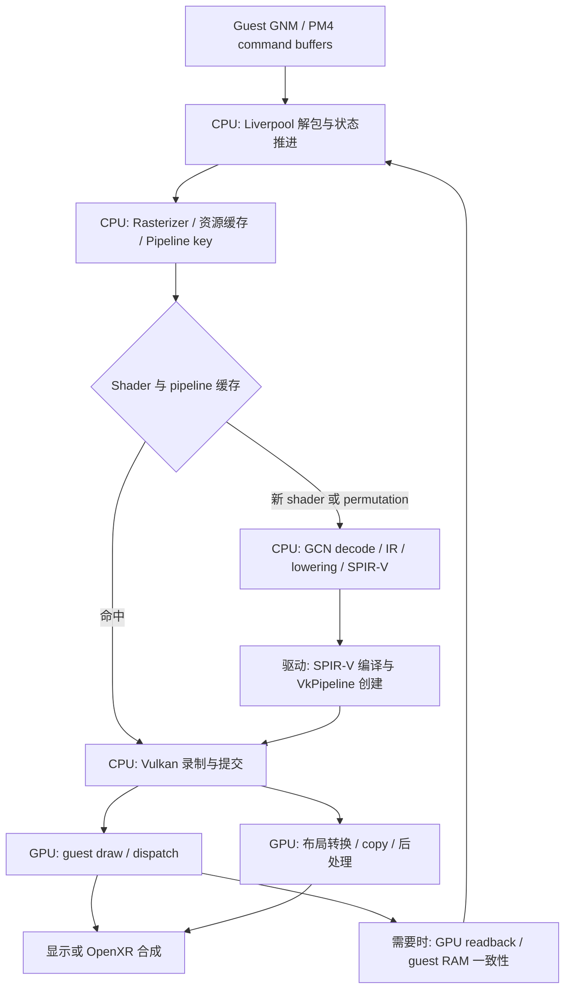

# GCN 模拟实现、平台差异与改进方向

维护日期：2026-10-02。源码范围：本 fork 的 `85a39824d` 加当前工作树修改，Mesa 子仓 `9b8a35676e`。这是实现说明与问题清单，不是所有 GCN 指令/游戏的兼容性认证。后续修改 compiler profile、shader cache 格式或 driver workaround 时应同步更新本文。

关联实测：[2026-10-02 软件路径清查](../validation/android-native-host/gcn-software-audit-20261002.md)。该报告里的 AYN Thor / A740 数据只代表其固定 host/Turnip 版本；不能直接套用到 Swan/A840、PC AMD/NVIDIA/Intel 或 macOS。

## 1. “GCN 模拟”的四个层次

本仓没有为 Android 单独实现一套 CPU 光栅器。PC 与 Android 主要共用以下流程：在 CPU 上解析 PS4 GPU 命令和翻译 GCN shader，向 Vulkan 提交，再由驱动编译为宿主 GPU 指令执行。

| 层次 | 实际工作 | 主要成本 | “软件”的准确含义 |
|---|---|---|---|
| guest GPU 命令处理 | 解释 PM4、寄存器状态、资源描述符、队列/同步 | CPU、锁、查表、录制、等待 | 模拟命令处理器，不是 CPU 执行每个像素的 shader |
| GCN shader 编译 | decode→CFG→IR→优化/语义转换→SPIR-V | 首次/新 permutation 的 CPU 编译 | 编译器在 CPU 上运行，生成代码在 GPU 上运行 |
| shader/固定功能补偿 | 32 位运算拼 64 位、LDS spill、额外 GS/TCS/TES、格式/布局转换 | GPU ALU、寄存器、带宽、阶段/pass 切换 | GPU 执行的兼容实现；可能很贵，也可能被优化掉 |
| host/guest 内存一致性 | 脏页跟踪、上传、回读、copy HLE 的 guest mirror | CPU 拷贝、GPU transfer、同步 | 确实有 CPU 参与，但不是通用 GCN 软件执行器 |

必须再区分三个“支持”：Vulkan feature/API 支持、shadPS4 对 GCN 语义的正确映射、宿主 ISA 的直接硬件实现。三者并不等价。例如 Turnip 报告 `shaderInt64=true`，主仓可提交 Int64 SPIR-V，但其 IR3 后端仍做 `nir_lower_int64`。

也不能把所有 fallback 视作精确替代。本文分别标记语义转换、近似/降级和明确不支持。

## 2. 共用执行链

图中的箭头表示处理关系，不表示所有工作都同步串行；实际还有 pipeline worker、record/submit/completion worker、present 线程及队列同步。

| 组件 | 责任与入口 |
|---|---|
| GNM / Liverpool | [GNM](../../src/core/libraries/gnmdriver/gnmdriver.cpp) 编码/接收提交；[Liverpool](../../src/video_core/amdgpu/liverpool.cpp) 解释 PM4、寄存器、draw/dispatch、等待与事件 |
| Vulkan Rasterizer | [vk_rasterizer.cpp](../../src/video_core/renderer_vulkan/vk_rasterizer.cpp)：绑定资源、固定功能状态、选择 pipeline、处理部分特殊 shader/HLE |
| GCN 前端 | [decode](../../src/shader_recompiler/frontend/decode.cpp)、[translate](../../src/shader_recompiler/frontend/translate)：scalar/vector ALU、内存、插值、export、EXEC/VCC/SCC 等进入 IR |
| IR 编译流程 | [recompiler.cpp](../../src/shader_recompiler/recompiler.cpp)：SSA、常量传播、资源发现、LDS/波操作转换、控制流结构化、DCE |
| SPIR-V 后端 | [backend/spirv](../../src/shader_recompiler/backend/spirv)：能力声明、stage 接口、buffer/image/shared/atomic、整数与浮点指令 |
| 能力选择 | [Profile](../../src/shader_recompiler/profile.h)、[Instance](../../src/video_core/renderer_vulkan/vk_instance.cpp)、[PipelineCache](../../src/video_core/renderer_vulkan/vk_pipeline_cache.cpp)：实际 features/limits、driver workaround、用户策略构成 compiler profile |
| 资源与同步 | [buffer cache](../../src/video_core/buffer_cache/buffer_cache.cpp)、[texture cache](../../src/video_core/texture_cache/texture_cache.cpp)、[scheduler](../../src/video_core/renderer_vulkan/vk_scheduler.cpp)：布局、驻留、脏数据、屏障、生命周期 |
| 缓存与异步 | [serialization](../../src/video_core/renderer_vulkan/vk_pipeline_serialization.cpp)、[compiler](../../src/video_core/renderer_vulkan/vk_pipeline_compiler.cpp)、[driver cache](../../src/video_core/renderer_vulkan/vk_driver_pipeline_cache.cpp) |

GCN 的标量/向量寄存器和 EXEC 控制流并不是简单重命名。前端会把标量进位/比较结果、lane mask、控制流及跨 lane 操作变成 IR，再由优化阶段消除可证明冗余的工作。因此“某条 GCN 指令展开成多条 IR/SPIR-V”并不必然等于最终多条等成本 ISA，也不能只数源代码分支估算开销。

## 3. PC 与 Android 的分工

| 环境 | 共用内容 | 平台/驱动差异 |
|---|---|---|
| Windows / Linux PC Vulkan | 相同的 GCN 前端、IR、SPIR-V、资源缓存、固定功能映射 | Windows/X11/Wayland surface；物理 GPU 和驱动 features 决定扩展/精度/波宽/原子路径 |
| macOS Vulkan | 仍使用上述 GCN→SPIR-V 路径 | Metal surface；本 fork 有 KosmicKrisp 专用 workaround。系统 Vulkan 构建会启用 portability enumeration 以枚举 MoltenVK 等实现；可枚举不等于其具备全部所需能力或已经游戏验收 |
| Android Turnip | 同一套 renderer/recompiler | 私有驱动加载、Android Surface/AHB、KGSL/移动内存预算、可选 OpenXR；本轮实机是源码 Turnip。驱动源构建流程见 [Turnip 指南](turnip-source-build.md) |
| Android Qualcomm 系统驱动 | 同一套能力选择和 shader 翻译 | 代码仍保留其 Int64 能力降级、FP32 float-control workaround、稀疏 buffer 大小规避；当前用户工作路线锚定 Turnip，不代表这些分支已删除 |
| guest CPU 执行 | 与 GCN 编译器独立 | Android 的 FEX x86→ARM 翻译属于 guest CPU；不能把它的 CPU 时间称为软件 GCN shader 时间 |

平台 surface 和 portability 入口见 [vk_platform.cpp](../../src/video_core/renderer_vulkan/vk_platform.cpp)。驱动 ID 只是部分已知 workaround 的选择依据；多数路径必须看当前 device 的 feature/limit，不能靠“AMD 就支持”“PC 都原生”之类的假设。

### 按驱动 ID 选择的现有处理

| 判断 | 当前代码行为 | 边界 |
|---|---|---|
| NVIDIA proprietary 且支持 barycentric | `needs_manual_interpolation=true`，显式计算插值 | 额外 GPU ALU，不是 CPU 插值 |
| NVIDIA proprietary | clip distance 用 fragment discard 补偿；额外 LDS barriers | 正确性 workaround，不能只为降开销直接移除 |
| Mesa KosmicKrisp | `needs_lds_barriers`、`needs_unorm_fixup`；list restart 扩展路径禁用 | 并非所有 macOS Vulkan 都走该分支 |
| Qualcomm proprietary | 禁用已发现误编译的 FP32 denorm preserve/flush profile 控制 | **Turnip 保留自身报告的 float controls**；不能泛化到所有高通 GPU |
| Qualcomm proprietary | sparse buffer arena 限制在已验证的 2 GiB 边界以下 | driver CPU 录制崩溃规避，不是 GCN 运算降级 |
| StorageMinAlignment > 4 | `needs_buffer_offsets` | 由实际对齐限制决定，与 OS 标签无直接关系 |

出处：[profile 构造](../../src/video_core/renderer_vulkan/vk_pipeline_cache.cpp)、[Instance](../../src/video_core/renderer_vulkan/vk_instance.cpp)、[buffer arena](../../src/video_core/buffer_cache/buffer_cache.cpp)、[UNORM export 修正](../../src/shader_recompiler/frontend/translate/export.cpp)。其他 driver-specific 工具兼容分支，例如跳过有问题的工具枚举，不应计入 shader 模拟成本。

## 4. 数值、lane 与共享内存 fallback

| 功能 | 选择条件 / 实现 | 语义与可能成本 |
|---|---|---|
| Int64 普通运算 | `support_int64=true` 时发 Int64 SPIR-V；否则 [spirv_int64.cpp](../../src/shader_recompiler/backend/spirv/spirv_int64.cpp) 用 u32 pair | 主仓展开增加指令；驱动接受 Int64 也可能继续展开。需检查最终 ISA、活跃范围与寄存器压力 |
| Float64 | 不支持时 [LowerFp64ToFp32](../../src/shader_recompiler/ir/passes/lower_fp64_to_fp32.cpp) 改操作并转换 packed 表示 | **降精度近似，不是完整软 FP64**。范围/舍入/精度不等价，不能称精确回退；也不能认为此路径一定更慢 |
| FP16 / FP32 float controls | 根据 Vulkan float-control properties 发可用执行模式，并应用上述 driver workaround | 不支持的模式没有通用逐操作软件精确替代；属于精度边界 |
| trinary min/max | 缺 AMD 扩展时拆成二元运算：[floating point](../../src/shader_recompiler/backend/spirv/emit_spirv_floating_point.cpp)、[integer](../../src/shader_recompiler/backend/spirv/emit_spirv_integer.cpp) | GPU ALU 展开，驱动可能合并；注意 NaN/符号零等行为 |
| cube face/坐标辅助 | 缺 AMD GCN 扩展时用比较/select/abs 等：[image emitter](../../src/shader_recompiler/backend/spirv/emit_spirv_image.cpp) | GPU ALU；最终 cube texture sampling 仍是 GPU 采样，不能将整个 cubemap 称为软件纹理器 |
| wave64 ballot / readlane | compute 可要求 64-lane 时直接请求；否则 [lower_wave64_pass.cpp](../../src/shader_recompiler/ir/passes/lower_wave64_pass.cpp) 在适用场景用 LDS/barrier 拼接 | 非均匀控制流有适用边界；增加 LDS 和同步，不能简单改 profile 的 subgroup_size 来伪造能力 |
| DS swizzle / readlane | [warp emitter](../../src/shader_recompiler/backend/spirv/emit_spirv_warp.cpp) 使用 shuffle/quad 操作；动态 quad 选择可能先取多路再 select | 多指令但仍在 GPU；readlane 使用 shuffle 有已有 Turnip probe 原因 |
| whole-wave reduction | 支持 arithmetic+clustered 的 compute/fragment 可匹配 guest 模式并使用 clustered ops | 保留 EXEC/参与 lane 语义；强制旧 shuffle 不只是性能选择，已有归约语义测试反例。clustered API 也不承诺单条 ISA |
| compute LDS | 默认 Workgroup memory；[SharedMemoryToStoragePass](../../src/shader_recompiler/ir/passes/shared_memory_to_storage_pass.cpp) 对超容量或缺 explicit layout 的混合类型改成 SSBO | 从片上共享内存变成全局 buffer，可能显著增加带宽/延迟。按 workgroup 分配独立地址区间；转换后的同步语义仍需专项验证，见下文 |
| mixed LDS 类型 | [SharedMemorySimplifyPass](../../src/shader_recompiler/ir/passes/shared_memory_simplify_pass.cpp) 可把非原子16/64访问拆成32位；有布局扩展时利用显式布局 | 拆普通 load/store 不代表能拆 atomic；先尽量避免整块 LDS spill |
| fragment LDS | [FragmentLdsPass](../../src/shader_recompiler/ir/passes/fragment_lds_pass.cpp) 仅证明 lane-private 的访问转成寄存器/SSA | 优化性转换，不引入 fragment Workgroup/barrier；证明失败明确拒绝 |
| GDS | GPU storage buffer：`BufferType::GdsBuffer` | 跨工作组共享状态，没有通用 Vulkan GDS 对等资源；应保留原子与可见性 |
| FP32 atomic min/max | 缺 `VK_EXT_shader_atomic_float2` 时 [atomic emitter](../../src/shader_recompiler/backend/spirv/emit_spirv_atomic.cpp) 映射到整数 atomic | 当前 `OpSelect` 两个操作数都包含 atomic，代码已有 FIXME。是额外操作和语义核查项，不能称已经精确/最优 |
| 64-bit atomic | 分别检测 buffer/shared feature：[EmitContext](../../src/shader_recompiler/backend/spirv/spirv_emit_context.cpp) | 不支持时抛错，**不以两个32位 atomic 伪装原子性** |

Turnip 的驱动内展开可从 [ir3_compiler.c](../../references/mesa-turnip/src/freedreno/ir3/ir3_compiler.c)、[ir3_nir.c](../../references/mesa-turnip/src/freedreno/ir3/ir3_nir.c)、[tu_device.cc](../../references/mesa-turnip/src/freedreno/vulkan/tu_device.cc) 追踪。宿主清理掉一个 lowering 开关，不会消除 Adreno ISA 本身缺少的运算。

另有两处必须区分“源码现状”与“已验证正确”：

- **WriteLane 的后端占位。** [readlane elimination](../../src/shader_recompiler/ir/passes/readlane_elimination_pass.cpp) 会沿 WriteLane 链解析可确定的读取，但 [EmitWriteLane](../../src/shader_recompiler/backend/spirv/emit_spirv_warp.cpp) 本身直接返回零。如果相关值在优化后仍存活，这不是通用的 lane 写入实现。应增加残留 IR 检查和语义测试，不能将常见模式被消除等同于完整支持。
- **LDS→SSBO 的屏障覆盖。** 上述转换 pass 改写内存访问，未同步改写 barrier；[EmitBarrier](../../src/shader_recompiler/backend/spirv/emit_spirv_barriers.cpp) 的 compute 控制屏障当前只带 `WorkgroupMemory`，通用 memory barrier 才同时包含 `UniformMemory`。需要检查最终 SPIR-V 中是否有其他屏障覆盖 SSBO 可见性，并用跨 wave 读写竞争测试验证；仅凭这个局部分支还不能断言所有 spill shader 都错误。

这两项是源码审计发现的验证缺口，没有证据表明它们触发了本轮血源的性能问题。

## 5. 插值、阶段与固定功能模拟

### 插值的三个不同路径

1. 普通 GCN P1/P2 插值可识别为 Vulkan smooth/no-perspective/centroid/sample 输入，由正常 GPU 插值接口表达。
2. 显式 per-vertex 值/重心坐标依赖 AMD explicit vertex 或 KHR barycentric 能力；某些驱动另需 manual interpolation workaround。
3. 缺上述能力时，实验 GS bridge 复制三角形顶点值并产生重心坐标输入。它是额外 GPU stage，有 varying/output 容量限制，当前只支持无其他 GS/TCS/TES 的 VS-only TriangleList/TriangleStrip，以及受限的 vertex builtins。

关闭第3条不意味着第2条已经得到通用正确替代。对于必须读取显式顶点值的游戏，可能重新遇到不支持或画面错误。不能为避免异常而默默改成普通 flat/smooth 数据。

源码：[GCN vector interpolation](../../src/shader_recompiler/frontend/translate/vector_interpolation.cpp)、[实验 GS](../../src/shader_recompiler/backend/spirv/emit_spirv_interpolation.cpp)、[graphics stage 组装](../../src/video_core/renderer_vulkan/vk_graphics_pipeline.cpp)。

### 其他阶段与固定功能

| 功能 | 当前实现 | 边界/成本 |
|---|---|---|
| guest VS/GS/HS/DS 与 stage ring | front-end 和 IR passes 转换接口、ring 与 tessellation 语义 | Vulkan stage 支持不等于 guest stage 组合均已支持；接口和顶点顺序需测试 |
| RectList / QuadList | 生成辅助 TCS/TES：[emit_spirv_quad_rect.cpp](../../src/shader_recompiler/backend/spirv/emit_spirv_quad_rect.cpp) | 增加 stage/pipeline 成本；不存在能直接替代所有语义的 Vulkan rect primitive |
| user clip / 非标准 depth range | clip planes、VS 坐标变换和必要的 clip-distance 输出 | 特定寄存器状态触发；与既有 clip/cull 输出容量有冲突检查 |
| 无 PS 且需要 clip-distance emulation | 生成 discard fragment shader | 额外 FS 工作，主要与相应 profile/workaround 有关 |
| scaled min/max blend | shader output 加乘法，并配置 blend | 语义适配，不是 CPU blend |
| MSAA | 按实际格式/usage/sample mask 选择原生图像与 pipeline；shader 处理 sample index 语义 | 不能只用全局 sample mask 宣称8×无支持；`force_disable_msaa` 是有损用户策略，不是精确 MSAA 模拟 |
| shading rate | 支持且当前 pipeline 可用时降 shading rate，否则 full rate | 回到 full rate 是正确性优先；不能将 requested quality 当成实际每个 draw 的 rate |
| depth/stencil format | 如 D16S8 缺失时尝试 D24S8/D32S8；部分 sRGB 格式有 UNORM 替代 | 不是任意格式都能自动转；格式替代需要跟踪颜色/精度语义 |
| 特殊 stencil 操作 | [liverpool_to_vk.cpp](../../src/video_core/renderer_vulkan/liverpool_to_vk.cpp) 对 bitwise stencil op 警告并用 Keep | **降级近似**，不是精确实现；test_val/op_val 冲突也有警告，需单独补正确语义 |
| primitive restart | 受 list/patch restart 能力限制；特殊 restart index 明确拒绝 | 禁用不支持组合不能被当成完整 primitive emulation |

补充源码：[rasterizer 状态映射](../../src/video_core/renderer_vulkan/vk_rasterizer.cpp)、[instance format 选择](../../src/video_core/renderer_vulkan/vk_instance.cpp)、[user clip](../../src/shader_recompiler/ir/passes/lower_user_clip_planes.cpp)、[special emitter](../../src/shader_recompiler/backend/spirv/emit_spirv_special.cpp)。

## 6. 资源、纹理布局与真实 CPU 回退

| 路径 | 实现方式 | 性能和正确性含义 |
|---|---|---|
| typed buffer load/store | [LowerBufferFormatToRaw](../../src/shader_recompiler/ir/passes/lower_buffer_format_to_raw.cpp) 用原始 buffer 访问和 pack/unpack 表达格式、swizzle/number conversion | GPU 展开；可研究适用场景的 texel buffer/native typed 优化，但不能绕过 guest stride/越界/对齐语义 |
| SRT 与 dynamic sharp | CPU 尽量 flatten/特化；动态来源使用受控 descriptor/内存路径 | 未能证明的动态 load 需要 DMA；关闭 DMA 时某些 shader 会明确失败，不是自动回退为等价慢路径 |
| DMA / BDA 页表 | GPU 地址经主仓页表/保护路径访问，CPU 维护驻留与同步 | 不意味着零拷贝。`dma_bounds` 是默认关闭候选；未知来源仍要全范围同步 |
| storage image mip | 无 AMD image-load-store-LOD 时，常量 mip 绑单 view，动态 mip 用 descriptor array | 额外 view/descriptor 成本；普通 image fetch 的 LOD 原本可用，不能把所有 LOD 都记为回退 |
| 特殊 storage read + LOD | [image emitter](../../src/shader_recompiler/backend/spirv/emit_spirv_image.cpp) 某条分支仍 `UNREACHABLE` | 明确不支持；源码里的未启用 fallback 不能算作已实现 |
| tiling / detiling | [TileManager](../../src/video_core/texture_cache/tile_manager.cpp) 的 GPU compute 与 copy | GCN 地址布局不等于宿主 tiling。GPU 上有转换不代表 CPU 软件解码；重复转换/pass break 才是优化重点 |
| image/buffer alias、深度互拷 | texture/buffer cache 同步最新数据，必要时 GPU转换或回读 | 不可通过忽略 dirty、取消屏障或过早重用 scratch 来“提速” |
| BC/ASTC sampling | 按 device format feature 确认可采样格式 | 当前A740 Turnip报告BC/ASTC支持；不是全部Android保证，也没有通用隐式CPU BC兜底的保证 |
| texture medium / low | [Image](../../src/video_core/texture_cache/image.cpp) 决定缩放/丢 mip；[BlitHelper](../../src/video_core/texture_cache/blit_helper.cpp) 可 GPU 重编码 ASTC/BC7 | 画质策略，可能付出上传/转换成本；CPU-only asset 和 GPU-written render 数据必须分流 |
| 已知 copy compute shader HLE | [vk_shader_hle.cpp](../../src/video_core/renderer_vulkan/vk_shader_hle.cpp)：CPU读控制表和合并区段，GPU `copyBuffer` | 有机会减少原 compute 成本，却也可能打断 render pass |
| copy HLE 的 guest mirror/commit | CPU-owned源同步镜像 guest RAM；GPU-produced源则在完成后 download/commit | **真实 CPU 拷贝/可能回读**。关闭会破坏 CPU/GPU共同写页的一致性，血源蒙皮矩阵曾是实际反例 |
| PM4/资源缓存 | CPU 状态机、页跟踪、描述符/SRT读取、pipeline 查找 | 即使shader全在GPU执行，也可能限制提交速度；应与GPU执行成本分别分析 |

PS4 framebuffer 元数据（HTile/FMask 等）也不是原生 Vulkan 显存布局。部分常见 clear/meta 操作按高层语义处理；游戏若把元数据作为可读数据使用，需要专门验证。当前 FMask storage 等分支存在明确限制，不能把元数据 fast path 视作完整 GCN 压缩元数据模拟。

## 7. 缓存与异步编译不等于硬件/软件模式切换

当前有三类不同身份：guest shader/permutation 与反射信息、graphics/compute pipeline recipe、驱动 `VkPipelineCache` blob。

- shader profile 和序列化版本一起校验；内部缩放/能力/实验策略改变后，不能复用不匹配的 SPIR-V。blob 还有 magic/version/长度/校验和。
- driver cache 绑定设备/驱动身份。它能省编译工作，但不能使不支持的 SPIR-V feature 成为可用能力。
- `sync` / `async_accurate` / `async_graphics_skip` 控制 pipeline 构建与等待；**async 不代表 GCN 翻译、资源准备、驱动创建全部都已移出 GPU command thread**，要分别测量。
- `async_graphics_skip` 在 pipeline 未就绪时可能跳 draw，是明确有损策略；missing-content 传播到后续读取时有保护，可能自动停用跳过。它既不是 shader fallback，也不能拿跳帧后的高FPS证明模拟优化。
- 首次 pipeline 创建停顿、每 draw 查找成本、GPU shader 执行时间是三个问题，不能合并成一个“software慢”。

截至本次源码，binary/meta/pipeline-key版本分别为34、23/24（条件构建）、7；后续维护应以 [serialization](../../src/video_core/renderer_vulkan/vk_pipeline_serialization.cpp) 为准。

## 8. 可选诊断与防止实验泄漏

以下是**当前工作树源码**的语义，历史APK可能不同。正式使用前核对 host SHA、日志和实际 profile，不能只读 property。

| 设置 | 效果 | 默认与风险 |
|---|---|---|
| Android `debug.shadps4.software_interp` | 值须与当前完整 `CUSAxxxxx` 相等，才请求 GS bridge | 默认关闭；旧布尔 `1` 在新源码被忽略。该隔离修改已构建候选，设备旧9483包仍应保持属性空 |
| Android `debug.shadps4.lower_int64=1` | 强制主仓 u32-pair，用于同驱动对照 | 默认按feature；`0`仅取消强制，不能启用驱动未报告的 Int64 |
| Android `debug.shadps4.wave_reduction=0`；桌面 `SHADPS4_WAVE_REDUCTION=0` | 禁用 clustered reduction，回旧翻译 | 默认按能力启用；仅诊断，不能假设语义/性能等价 |
| `SHADPS4_VK_DISABLE_EXTENSIONS`；Android同名语义属性 `debug.shadps4.vk_disable_extensions` | 人为隐藏逗号分隔的扩展 | 默认无；会改变profile或进入不支持路径，采集结束应恢复 |
| `debug.shadps4.shader_dump=1` | 输出 GCN/IR/SPIR-V等证据 | 默认关闭；有磁盘/编译附加开销 |
| DebugBus `gpu_timing detail`、`profiler_ring fine on`、`draw_log`、`pass_log` | 增加GPU/CPU细粒度测量 | 不是优化；测完恢复并报告采集开销 |
| `upload_diag` 的 ignore-dirty / DMA bounds等实验 | 改资源同步策略或诊断 | 不属于无害显示开关；不能批量开启作为“性能模式” |

新增启动日志列出 compiler policy；它说明**选择了哪套规则**，不证明每个 shader 都触发。进一步应统计实际使用次数，见下一节。

## 9. 改进项与实施顺序

以下为候选工作，除注明“已做”外未实现；不承诺固定FPS收益。

| 优先级 | 改进 | 为什么做 / 如何验收 |
|---|---|---|
| P0，已做首步 | GS实验按游戏隔离，移除 Int64“native硬件”误导日志 | 防止一个游戏的实验污染另一个游戏。当前11项隔离测试通过，属性清理已在设备生效；候选APK未安装 |
| P0 | 建立统一 shader fallback 诊断数据 | 给每个已编译/permutation记录fallback原因、额外stage、LDS spill字节、64位操作等；缓存加载也恢复信息。先做编译时统计与低频快照，避免每draw字符串/锁成为新开销 |
| P0 正确性 | 修复/验证 FP32 atomic min/max fallback | 当前可能同时执行两条atomic。应以并发、正负数、±0/NaN及返回旧值的契约测试确定正确算法，再比较分支/CAS/驱动原生；不能只删掉一条就宣布正确 |
| P0 正确性 | 检查残留 WriteLane 与 LDS spill 屏障 | 给无法消除的 WriteLane 明确诊断并补语义实现；针对 SSBO 的 `UniformMemory` 可见性做最终 SPIR-V 审计及跨 wave 竞争测试。未确认当前游戏触发，不归因为现有低帧率 |
| P1，热点驱动 | 减少逐 draw CPU成本 | 针对 SRT、permutation 查找、resource binding、dirty同步和录制做真实CPU采样；避免将frame等待时间当on-CPU。已有fast path须验证命中而非只看开关 |
| P1，热点驱动 | copy HLE 与内存一致性路径减负 | 合并区段/复用映射、减少重复镜像、提高安全hoist覆盖；保持guest可见性、页内混写和完成顺序。用镜像/回读字节与on-CPU、pass break联合验收 |
| P1，触发时做 | 降低 LDS→SSBO 的需要 | 先做存活区间/类型简化，研究分阶段或更小scratch；不能把32KiB硬件虚报64KiB。必须测barrier、跨lane通信、占用率与global带宽 |
| P1，兼容需求驱动 | 完整显式顶点/插值方案 | 优先研究driver暴露可用硬件语义；否则扩展GS/其他阶段方案，覆盖GS/tessellation、strip顶点序、provoking vertex、clip/cull、MSAA sample。比较额外stage和varying成本；不默认全局启用 |
| P1，热点驱动 | 降低纹理转换/pass break | 延迟/合并上传，延长合法缓存复用，减少反复native/scaled转换；评估独立transfer queue及所有权同步，不能把“另起线程”当异步GPU上传完成 |
| P2 | typed buffer / cube /特殊算术更短映射 | 对高频shader识别可安全映射的宿主操作；比较SPIR-V与IR3/PC ISA、寄存器spill、真实GPU时间，保留特殊值与越界语义 |
| P2 | 深化CPU翻译/pipeline异步与缓存 | 区分GCN翻译、layout/reflection、vkCreatePipeline；继续正确的优先队列/缓存预热。高FPS不能来自跳过必需draw |
| P2 正确性 | 明确FP64、bitwise stencil、未支持stage/LOD等边界 | 增加可追踪的unsupported/approximate状态；按实际游戏需要设计精确实现。精确模拟可能更慢，应作为有证据的兼容选择 |
| 持续 | 驱动源码优化与回归矩阵 | Turnip/NIR/IR3 lowering也可能占主要成本。必须绑定驱动SHA、设备型号、shader hash与场景，不靠换二进制推断原因 |

对于当前血源，不应优先“删除 LDS spill 或 atomic fallback”：本次375模块缓存未观察到这两项。先从实际热点出发。Int64类型声明、静态模块数、源码中有某个分支，都不足以归因。

## 10. 验证与诊断方法

1. **固定身份。** 记录app/host/driver SHA、device/driver ID、游戏版本、profile、画质、属性及冷暖cache状态。PC也需要实际feature dump。
2. **区分静态和动态。** 反汇编缓存可确认使用哪些转换；实际draw/dispatch频率、GPU时间和带宽要靠采样。新增诊断应保留shader hash、permutation和pipeline key。
3. **区分CPU与GPU。** PM4/SRT/编译/镜像用on-CPU与调度证据；GPU timestamp仅算设备区间；嵌套GPU zone不能相加，未覆盖区间不能直接称idle。
4. **按语义设计测试。** 数值含边界/特殊值/溢出；lane含EXEC分歧和helper invocation；LDS/atomic含竞争与barrier；插值含阶段组合、MSAA、strip与clip；资源含alias/部分写/布局互拷。
5. **做同场景对照。** 同包同驱动仅改变一个可证明安全的策略；反例保留。shader cache变化造成的冷编译不能当稳态成本。
6. **跨平台逐能力验收。** PC AMD/NVIDIA/Intel/macOS和Android A740/A840分别验证其实际路径；只编译通过不算设备语义验证。

已有针对性入口在 [tests/video_core](../../tests/video_core)：`android_shader_int64_probe`、`android_wave_reduction_probe`、`android_scalar_mask_probe`、`android_interpolation_probe`、`android_interpolation_cache_probe`、`android_fragment_lds_probe`、`android_auxiliary_interface_probe`、`android_dynamic_lod_probe`、`android_depth_range_probe`、`android_msaa_image_probe`、各类tiling/block/depth-copy scratch probe。本轮新增 `android_gcn_capabilities_probe` 与 `shader_experiment_tests`。

这些测试名表示测试范围，不能自动当作本轮全部运行或全部通过。最新执行证据应引用具体日期报告。

## 11. 当前实测快照与维护入口

2026-10-02 AYN/A740、Turnip `9b8a35676e` 的实际profile：GS插值关、manual interpolation关、compute subgroup64、Int64由driver接收、FP64不支持、explicit shared layout支持、LDS上限32KiB、float atomic minmax不支持。读缓存校验1045个blob、375个SPIR-V模块：无`ssbo_shmem`，无上述atomic回退指令，2模块有非恒定64位结果指令，5模块有GDS buffer。**这是静态观察，不是性能占比。**

详细实现清理、设备状态、测试、候选包与未完成项见 [软件路径清查](../validation/android-native-host/gcn-software-audit-20261002.md)。GPU query回收和LiteP工具修复仍独立跟踪；采样故障不应被误认为guest shader在CPU执行。

更新本文时至少复核：`Profile`字段及构造、`TranslateProgram` pass顺序、SPIR-V feature guards、graphics辅助stage、runtime资源fallback、driver版本/下游lowering、profile/缓存版本，以及每条“已验证”对应的原始证据。
