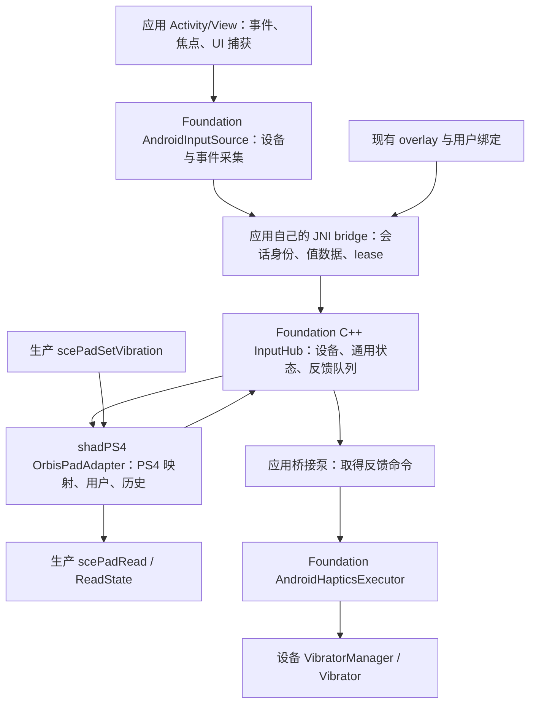

# Android 输入优先：Foundation 共用手柄与 SDL 退出实施补充

日期：2026-09-12。交给下一位实施 AI（用户指定 Opus4.8）。本文件是[生产 Runtime 整版 spec](android-native-host-production-runtime.md)的输入架构及施工顺序补充；[本次复核](../validation/android-native-host/foundation-input-review-2026-09-12.md)说明当前缺口。**本文最初是规划；2026-09-13已实施并修复核心输入/桥接/SDL和ART装载，见[当前复核](../validation/android-native-host/runtime-input-review-2026-09-13.md)。以下为原始行为要求，不表示各项都已验收；后续按[整版新spec](android-native-host-runtime-after-input.md)继续。**

## 目标、顺序和固定基线

**先接入真实 Android 手柄，将共用部分下沉 Foundation；接着完整清理 Android SDL；随后继续生产 Runtime/真实 PKG。** 输入与 SDL 清理作为一次连续实施包，内部可以分提交，遇到可修复的依赖继续处理，不在首个编译成功或首个按钮后停工索取新 spec。完整游戏的十分钟、Stop/同进程重启目标继续由整版 spec 约束。

| 仓库/参考 | 基线与用途 |
|---|---|
| 主仓 `tencentmalos/Bachata-S4` | `codex/android-fex-round2`，本次被审 `261775607e3d9680046590e81966a6e7948a8e2a`；从包含本补充的后续提交继续，不 reset 用户工作 |
| Foundation `tencentmalos/foundation` | 已有 owned 分支 `codex/shadps4-android-fex-v0`，固定起点 `1f7008848736b7c6c0779220480344fd5b5fc5e3`；先提交/push 子仓，再更新主仓 gitlink |
| citron `tencentmalos/citron_shadow` | 固定 [2106bcd83844e05dfbb5251a902143233a7ec43b](https://github.com/tencentmalos/citron_shadow/tree/2106bcd83844e05dfbb5251a902143233a7ec43b)，具体输入文件与身份见[记录](../validation/android-native-host/2026-09-12-host-library/citron-input-reference.json)；只作为迁移来源，本包不要求修改 citron |
| 平台 | 主仓现有 NDK29 / native API33 / arm64 / c++_shared；Swan/API36/4KiB 是目标，AYN/API33/4KiB 辅助。16KiB、VR、系统 Vulkan 驱动后置 |

开始前读 [AGENTS](../../AGENTS.md)、[Foundation 接入边界](../foundation-integration.md)、[子仓归属](../subrepository-ownership.md)与子仓当前指令。保留 `references/Bachata-S4` 脏内容和未跟踪 `externals/dear_imgui/`。本工作不需要变动 FEX、FFmpeg、XR 或健康第三方 pins。

## 架构决定：共用输入与宿主语义分开



Foundation 提供机制；主仓负责 PS4 语义和 SessionCore 所有权。Android 通过现有 Activity/View 分发事件，Foundation 接收调用，不继承应用 Activity，不建立第二个 native 事件循环。官方 KeyEvent/MotionEvent 模型支持这个接法；仅在实际消费事件时返回 handled。[Android controller input](https://developer.android.com/games/sdk/game-controller/controller-input)

### Foundation 的具体落点（现已建立）

```text
foundation/modules/input/
  CMakeLists.txt
  include/spatial/input/    # 平台无关值类型、InputHub、反馈命令
  src/                     # 设备/状态管理、规范化、边界检查
  tests/                   # 独立 host / NDK 契约
  android/
    build.gradle.kts       # 可直接引用的 Android library
    src/main/AndroidManifest.xml
    src/main/kotlin/.../    # AndroidInputSource、InputSink、HapticsExecutor
```

导出 `foundation_input` / `spatial::foundation_input`，建议命名空间 `spatial::input`，沿用现有模块目录/命名约定。纯 C++ 部分至少独立 C++20、PIC；只用标准库及必要线程依赖，不能要求 SDL、JNI/JDK、OpenXR、ImGui、FEX、Orbis、完整 Foundation module system 或 allocator。DebugBus 可做可选 adapter，不成为输入核心的依赖。

本仓通过 `cmake/SpatialFoundation.cmake` 单独 `add_subdirectory(modules/input)`，对重复 target 作保护。若加入 Foundation 总入口，用不改变旧宿主默认构建的可选开关；不能为了找到新 target 解析整个 Foundation 根 CMake。旧 `IInputSystemModule` 和 XR `ControllerSnapshot` 保持原合同；未来有真实消费者时再做桥接，本包不改造整个旧模块系统。

Android 部分成为真正的 Gradle library，从 Foundation 子仓路径引用一次；插件/Kotlin版本由宿主协调，不把 shadPS4 的全局 Gradle 设置或包名复制进去。采用独立库 namespace，不引用宿主 `R`、Compose、`ManagedSession`、`CitronApplication`。通过构造参数注入 Context、执行器/Handler、事件 sink 和反馈命令来源，持有必要的 application Context，不持有 Activity。**库中不声明应用专用 native 方法，不 `System.loadLibrary`，不定义 `JNI_OnLoad`，不要求自己的 `.so`。** C++ 消费者无需构建 Kotlin；Android 消费者按需提供自己的 JNI 连接。

### 主仓保留的内容

- `src/input/`：平台后端接口、`OrbisPadAdapter` 和现有 PS4 状态/用户策略。将 SDL 具体设备、事件和 discovery 移到仅 desktop 编译的实现。可以保留 `GameController` 的适用接口，但 Android 可见 header 不再含 `SDL_Gamepad*` 等类型。
- `src/core/libraries/pad/`：既有 NID/ABI、句柄、用户/端口校验、PS4 按钮位/轴范围、触控尺寸、guest 时间戳、历史读取与错误。以现有生产实现为依据，不另造测试 pad API 替代它。
- Android runtime：app-owned JNI bridge、有效 session/generation 校验、control lease、主仓用户绑定与配置存储。既有 remap/overlay UI 和可复用测试保留并接新链。
- 设置热键、菜单、暂停/退出：由宿主输入路由发给 UI/ApplicationControl，不在 Foundation 调用 `ImGuiEmuSettings`。保留适用的 Vulkan ImGui 设置层，拆开 `input_handler.cpp → settings_dialog_layer.cpp` 直接依赖；不按 `big_picture` 目录名整组删除。

## 最小 API 与状态合同

下面定义职责与行为，不要求机械照抄类名或新造通用序列化框架。接口先随两个实际消费者边界确定：独立输入测试宿主与 shadPS4。不要为未来所有模拟器设计复杂插件体系。

| 值类型/操作 | 必须表达的语义 |
|---|---|
| `DeviceInstance` / capabilities | source/backend + device 实例 + connection epoch；按钮、轴描述、反馈能力和可选传感器能力。persistent profile key 与运行期身份分开 |
| `InputPacket` / event batch | 协议版本、stream/session token、实例、单调 sequence/time、有限个值事件；device add/change/remove 与 focus/reset 作为明确控制事件 |
| `InputHub` | 显式构造/销毁，无全局单例；注册、提交、移除、reset、获取一致快照/变更；线程安全与容量明确，非法/stale 输入有返回结果 |
| neutral controls | 使用物理位置 South/East/West/North、方向键、肩键/扳机/两摇杆等；不直接使用 Switch A/B 翻转或 PS4 位掩码。保留原始 control id 供用户重映射 |
| normalized state | 双向轴有限值 [-1,1]、扳机 [0,1]，neutral 明确；按 capability 的 min/max/flat 转换，能力缺失不冒充已实现 |
| `HapticCommand` | 目标实例/连接代次/会话、序号、限幅强度和有界时长、明确 cancel；队列入列、平台实际执行和 Unsupported/失败分别记录 |

Android 层采集设备能力、原始 KeyEvent/MotionEvent 值并转换为通用事件；C++ 只做一次基础规范化，宿主做一次用户 remap/dead zone/PS4 数值转换。若实施时选择在 Kotlin 完成规范化，必须同步简化 C++ 输入合同和测试，不能两侧重复应用 dead zone。禁止 NaN/Inf、非法 min/max、越界按钮或超长数组直接进入状态；JNI 复制字段，不能把 C++ struct 内存布局当跨语言协议。

设备身份必须区分同型号双设备。descriptor 用于匹配持久配置，但多个逻辑实例可能共享；deviceId 也可能随重连改变，另加连接 epoch 使旧回调失效。不要用 PID/VID、controllerNumber 或枚举顺序充当永久唯一键。[InputDevice](https://developer.android.com/reference/android/view/InputDevice)

使用 `InputDeviceListener` 处理 added/changed/removed；changed 重新查询能力，removed 撤回状态和反馈。查询返回 null 时走撤回/拒绝，不继续使用旧 Java 对象。[InputDeviceListener](https://developer.android.com/reference/android/hardware/input/InputManager.InputDeviceListener)

映射和合并至少落实以下行为：

- HAT 与 DPAD key、BRAKE/GAS 与 LTRIGGER/RTRIGGER 等同一控件的多种报告有确定优先级/合并规则；持续按下不因另一路回中误释放，也不生成重复按键边沿。
- 主仓显式维护 source → user/port 绑定，同型号设备可分配不同端口，不能所有设备提交 slot 0。断连/重连是否保留玩家分配与 runtime 实例重建分开。
- overlay 与实体输入合并时分别保存来源状态。一个来源松开不清掉另一个仍按住的按钮；轴同时输入的优先级/选择规则固定并测试，不能靠最后调用偶然决定。
- remap 修改、UI capture 开始/结束、失焦和断连不会留下按下未释放状态。应用决定哪些输入交给 UI，保持 press/release 配对；不得让旧按住状态在重新获焦后自动复活。
- 保留 `scePadRead` / `scePadReadState` 的生产历史、采样计数/时间和连接标志合同；多事件批次不能把所有短按吞成最终 neutral。宿主将 Foundation 单调时间映射到 guest 时间，不在 Foundation 调 `sceKernelGetProcessTime`。
- 基础包先覆盖普通手柄和 overlay。gyro/touchpad/LED 等有能力才报告并接入；不为凑数据声称 PSVR/Move、双手 pose 或传感器可用。

## 生命周期、JNI 和震动

`InputHub` 的一次游戏连接由当前 SessionRuntime 所有，UI/设备发现服务可跨会话存在，但每次绑定生成新的 opaque token。JNI 每次提交/取反馈先验证有效 session 与实例代次，并取得已有 RAII lease；不把 native 对象地址裸露给 Kotlin 作为无需校验的长期指针。拷贝值后释放 Java array/reference，JNI 异常在边界转换为明确失败，不跨 JNI/C++ 边界泄漏。

现 `ManagedSession` controller sink 还没有实际安装者，本包必须接通它或以新接口替换，并迁移 `GamepadInputManager` 和 overlay 调用点，删除已失效的旁路。输入不能只停在 Kotlin DTO，也不能送进独立诊断库里另一套 host/global pad registry。host `.so` 与 FEX JNI 沿用已验证的两库边界，只保留一份生产状态。

线程模型优先采用足够简单的实现：Android 采集在指定串行 executor 上；C++ 接口承受 JNI 与 pad/HLE 并发，短锁下发布一致值快照；读取/震动不执行 Java、不等待 UI、不持输入锁调用外部代码。队列有界，按键释放、移除、cancel 不允许无声丢失；超载可合并轴更新，若丢失状态完整性须显式 reset/resync，记录结果。用顺序号与握手测试并发，不用 settle sleep。

**震动采用 Kotlin 拥有平台执行器、C++ 只产生命令。** 应用 bridge 以可取消的单个泵批量取得反馈命令并交给 Foundation Kotlin executor，明确唤醒/轮询上限和停止方法；不创建每次震动一个线程或在 guest HLE 内同步等 Java。多个 guest/host 调用者可能生产命令，不能未经串行化保证就照搬 citron 的 SPSC 队列。worker 不永久持有 Activity、过期设备或跨线程 JNIEnv。

反馈报告基于实际 capability：无 vibrator 则 Unsupported；单 actuator 明确做强度降混，不宣称左右双马达独立控制。强度零、Stop、失焦策略要求停振、设备撤回都执行 cancel；所有仍在队列中的旧 epoch 命令也失效，不能 cancel 后被迟到命令重新开启。[Android VibratorManager](https://developer.android.com/reference/android/os/VibratorManager)

Stop 的顺序为：关闭该 generation ingress → 使旧输入/反馈无效并发布 neutral/断开 → 取消设备震动 → 停止并等待相关 pump/in-flight lease → 解绑/销毁。dispatcher/listener 的进程级寿命允许保留，但必须解除旧会话绑定；对象销毁不与回调并发。若退出超时仍有调用者，保留其拥有者并如实报告，不强行释放后进入新会话。沿用 SessionCore 的 late-drain 和完成回执合同。

## 连续实施顺序

### 先完成 Foundation 与实际手柄接入

在 owned Foundation 分支建立独立 C++/Android library 和契约，迁移 citron 可复用的设备、轴、反馈逻辑，逐文件保留来源及实际许可证。将 Citron singleton、Switch 设置、JNI ID cache、输入大系统替换为上述注入接口，而不是更换包名后整体搬入。

主仓在同一批接上 Foundation target/Gradle module、app JNI、会话绑定、OrbisPadAdapter 和既有 overlay/remap UI。抽离 desktop SDL adapter 后保留其原功能。先用 portable/NDK 和正式 native pad 入口验证输入转换，不要求完整 TMNT 启动才能发现映射错误。

此时其余共享 TU 可能仍引入 SDL；这是短暂中间状态，立即继续下一段。当前含 SDL `JNI_OnLoad` 的旧 host DSO 不作为普通 APK 的正确加载方案，不补 `org/libsdl/app/*`，也不新造一套重复状态的测试宿主去规避最终接线。

### 接着完成 SDL 清理及普通 APK 输入闭环

按整版 spec 的 SDL 清单处理 ImGui platform backend、音频、trophy、camera/mouse、消息框与事件，保留实际需要的 renderer/HLE。复用 AAudio/OpenAL 和应用控制接口，未支持麦克风等按真实 Orbis 错误退出；不补成功 stub，不盲删 settings layer。

同时收口根 source lists、externals SDL 查找/子目录、public headers 和传递链接。Android 新输出目录配置不再查找/编译/链接 SDL；desktop 保留已有依赖。根 host 对象及依赖 target 仍为生产源码唯一来源，不手列第二套闭包。

接到 canonical JNI 库并通过普通 APK 加载，验证物理输入 → Foundation → bridge → **正式 pad 读状态**、反向反馈及同进程退役。输入诊断可在 debug 模式调用同一生产对象，并明确是 host-origin；随后继续整版的 FEX guest-origin pad 调用和 TMNT 交互，不能把诊断页按钮变化叫作 guest 已接通。

## 验收和交付

以下是一组整体验收维度，可组织为少量测试套件，不是要求逐条另开任务。所有测试记录准确 source/pin、环境、命令/退出码、case ID 和产物身份；FAIL/超时/重复 ID/缺失终态均使 runner 非零。

| 维度 | 必须验证的结果 |
|---|---|
| 真正共用 | `modules/input` 独立 host/NDK 构建，不依赖 SDL/JNI/XR/主仓；一个最小 Android library 消费 fixture 可注入 fake sink，运行/编译不引用 shadPS4/citron 包或原生库。可复用机制只存在 Foundation 一份 |
| 控件正确性 | 实体按钮/双摇杆/扳机/HAT、轴 min/max/flat、NaN/Inf/非法包、重复报告、短按序列、配置更新；对应生产 PS4 按钮位、0..255/中心值、时间/历史读取 |
| 多设备与合并 | 同型号双设备、两玩家隔离、overlay+实体同时按住/松开、热插拔复用 deviceId、changed/null、端口上限；没有设备条件时 fixture 与实机结果分开 |
| UI/身份 | UI capture/失焦/重获焦不粘键；旧 session/连接 token、迟到 release/cancel、超载/resync 不污染当前状态；非法 JNI 数据不崩溃 |
| 反馈 | 实际硬件振动、零强度立即取消、断连/Stop 后不重启、无能力/平台失败正确报告；多生产者和退出竞争受控，无 JNI 引用/线程泄漏 |
| native/API | 实际 `scePadRead`/`ReadState`/SetVibration 路径消费同一 InputHub；host-origin 与 FEX guest-origin 分别记录，未实现的 guest 桥不得标 PASS |
| 构建/SDL | 新目录 host+最终 JNI `--no-undefined`；依赖图/include/compile commands/link map 无 Android SDL；完整符号表和 DT_NEEDED/APK 无 SDL 实现/导入/Java exports，只剩本项目 JNI 初始化；desktop adapter 受影响路径编译回归 |
| 普通 APK/寿命 | 正常应用 UID 输入、震动及 Stop，至少三次同 PID session start/stop，generation 严格变化，无旧输入/震动/worker；现有 host61/0、触及的 SessionCore/输入 UI 契约回归 |
| 整版衔接 | Turnip、真实 FEX pad 消费、TMNT 交互/音频/十分钟/Stop/重启按整版表继续，未到达时写 `IN_PROGRESS`；AYN 与 Swan 分开，不用 shell 装载充当 APK |

先 push Foundation 子仓提交并验证远端可取，再推进主仓 gitlink 和源码；禁止父仓引用仅存在本机的子仓提交。实现中维护 `foundation/modules/input/README.md`：两种独立接入方式、线程/寿命合同、Android 依赖和迁移来源。更新主仓 Foundation 接入记录、AGENTS/CLAUDE 和整版状态；不要把本文件的规划写成已实现。

交付一份报告，列出可检出的两个仓库提交、可安装 APK/符号位置、上述验证与剩余实际失败点。本输入包完成只代表输入和 Android SDL 退出已验证；完整 PKG 仍按上位 spec 持续推进。无需为每个按钮、库或中间链接点再交回一份微型规划。
