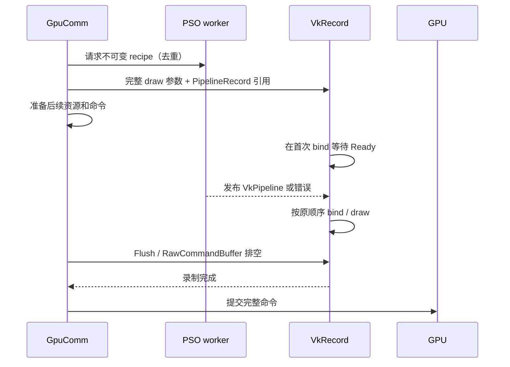

# Pipeline 编译、预热与驱动 PSO cache 方案（2026-09-26）

状态：用户要求的源码对照与实施规划；本轮未实现该方案。依据为 [AYN 血源完整 LiteP](../validation/android-native-host/bloodborne-startup-upload-20260926.md)、当前 shadPS4 `b4972cbd` 工作树，以及本地 Citron `3da08ee52defc5003d23683b0c233b0dac88722f`（本文引用的三个 Vulkan 文件干净）。

## 结论与目标

**可以直接通过标准 Vulkan `VkPipelineCache` 支持驱动 PSO cache；应先接入持久化、修正预热顺序并测量命中，再做有界后台编译。** 不需要先实现独立纹理上传队列，也不依赖 Turnip 私有缓存目录。[Khronos Pipeline Cache 指南](https://docs.vulkan.org/guide/latest/pipeline_cache.html)明确支持将 cache 数据保存到文件并用于后续运行，以减少创建成本。

PSO 在这里主要指完整的 Vulkan graphics/compute pipeline：除 shader 外，还涉及 pipeline layout、附件格式、顶点输入、光栅/混合/深度状态、细分与 subgroup 等。持久化驱动 cache 不是保存 `VkPipeline` 句柄，下次仍需按正确的 create info 创建对象，也不保证所有创建都瞬时完成。

血源两次同步 compute dispatch 为 320.414/326.204 ms，其中 GCN 翻译 92.443/95.297 ms，其余约 228 ms 的日志与 pipeline 创建路径吻合，但尚无独立 native create scope。目标分为：减少重复启动的重编译；缩短首次使用的实际阻塞；提供保留全部命令的准确模式，以及用户可选、允许短暂缺画面的 graphics 跳过模式。两种模式分别验收，不能只用“编译移到其它线程了”作为成功标准。

## 现状与 Citron 对照

| 机制 | 当前 shadPS4 | Citron 本地实现 | 采用方式 |
| --- | --- | --- | --- |
| Guest shader 磁盘数据 | `cache_storage` 保存 SPIR-V、ShaderMeta、PipelineKey/Profile | `vulkan.bin` 保存 pipeline key 与 shader 环境 | 保留可重放层，和驱动 blob 分开管理 |
| 驱动 cache | `PipelineCache` 每次 `createPipelineCacheUnique({})`，未读写 opaque blob | `vulkan_pipelines.bin` 加载为 initial data，预热后及析构保存 | 优先接入标准 VkPipelineCache 持久化 |
| 预热顺序 | `WarmUp()` 在创建空 VkPipelineCache **之前** | 先加载驱动 cache，再并行重建 pipeline | 先建立有效 driver cache，再 WarmUp |
| 编译线程 | cache miss 在 GpuComm 直接构造 pipeline；shared keys/pools/infos 可变 | 有界 `VkPipelineBuilder` worker；每预热 job 独立 ShaderPools | 先形成自包含 job，再转交 worker |
| 首次使用等待 | 当前直接同步创建 | compute 在 scheduler 录制队列插入 build wait；graphics 也有该路径 | 未就绪时按依赖等待，支持 recorder 开/关两条路径 |
| “异步 shader”选项 | 尚无等价实现 | `BuiltPipeline()` 可返回 null，跳过未完成 pipeline 的 draw | 提供显式可选的 graphics 跳过模式；加入资源/副作用门控和诊断，不把它称为无损异步 |
| Tiling pipeline | 进程内 key map，`VK_NULL_HANDLE` 驱动 cache | 不对应同一 PS4 tiling 机制 | 纳入共享 driver cache；先预热常用规格 |

Citron 阅读入口：

- `src/video_core/renderer_vulkan/vk_pipeline_cache.cpp:409` worker；`:688` 磁盘加载/预热；`:826` skip-draw；`:1100` 驱动缓存保存；`:1136` 加载。
- `vk_compute_pipeline.cpp:26` 后台创建与拥有的参数；`:205` 首次 bind 前的 scheduler wait。
- `vk_graphics_pipeline.cpp:282` stage info 拷贝和后台创建；`:776` 录制线程等待。

上述文件位于 `/Users/bytedance/workspace/emulations/switch/citron/`。Citron 的直接写文件与输入长度校验不是本方案的持久化模板；本仓按下面的有界读取、身份检查及原子替换实现。

**Android 开关需先接通真实 native 状态。** Kotlin `ShadPs4ConfigManager` 会写 `pipeline_cache_enabled=true`，但 Android/FEX 当前路径未调用桌面 `EmulatorSettings.Load()`；native 默认为 false，已采血源日志也没有 Preloaded 记录。不能把 JSON 存在当作缓存已启用。应通过明确的 session 配置/JNI 字段传入并在 DebugBus/status 输出实际值；不为此盲目加载整份桌面配置，覆盖其它 Android 渲染设置。

## 三层缓存与职责

| 层 | 内容与 key | 生命周期 / 失效 |
| --- | --- | --- |
| Guest 重放层 | GCN/生成 SPIR-V、specialization、shader profile、完整 pipeline recipe | 按 title、ShaderBinary/Meta/Key 版本与规范化 profile；shader patch 内容变化需失效 |
| 驱动编译缓存 | 驱动返回的 opaque VkPipelineCache blob | 按 title + vendor/device + pipelineCacheUUID；额外隔离 driver build/hash、API、编译 profile |
| 运行对象缓存 | `PipelineKey → shared PipelineRecord`，VkPipeline/layout/module 生命周期 | 只在本次 VkDevice/session 有效；同 key 只启动一个编译任务 |

驱动 blob 的版本一 header 含 vendorID/deviceID/pipelineCacheUUID，应按小端布局及长度校验；不能把文件中未对齐字节直接解释为主机结构体。[Khronos header 定义](https://docs.vulkan.org/refpages/latest/refpages/source/VkPipelineCacheHeaderVersionOne.html)。驱动更新、切换 R8/mainline/Qualcomm、profile/patch 变化或文件损坏，都安全回退空 cache，保留原文件供定位；不让缓存不可用导致游戏启动失败。

## P0：持久化 driver cache 与测量

建议独立 `DriverPipelineCache` 服务，生命周期由同一 Vulkan device/session 所有，供 Guest graphics/compute 和 host tiling pipeline 使用。初版同步创建流程不变，只补 cache 的加载/保存和测量，便于独立 A/B。

1. VkDevice 创建后取得真实设备/驱动身份，按显式 session 设置决定是否启用。建立安全的 per-title cache 路径，文件大小上限建议初值 128 MiB，可配置。
2. 读取并验证应用 envelope（magic、schema、长度、hash、identity），再验证 Vulkan header；创建带 initial data 的 cache。驱动拒绝数据时记录原因，重试空 cache。不要仅依赖驱动容错。
3. 将 `PipelineCache` 的 `WarmUp()` 移到上述初始化之后；`TileManager::CreateTilingPipeline` 传入有效 cache。按实际覆盖逐步接入其它 host pipeline，而不是把所有构造点一次重写。
4. 在预热结束、正常 session 停止等明确边界导出 blob；采用临时文件、完整写入、fsync、原子 rename，保留最后一份完整缓存。后续再增加低频 checkpoint，避免 Android 被杀后整轮成果丢失。磁盘 I/O 不在 GpuComm draw 热路径运行。
5. `vkGetPipelineCacheData` 的两步查询可能得到 `VK_INCOMPLETE`；按返回字节数处理并有界重试，超限留旧文件，不能把未写满的 buffer 当完整数据。[查询合同](https://docs.vulkan.org/refpages/latest/refpages/source/vkGetPipelineCacheData.html)。

初版共享 cache 使用默认 flags，让驱动按标准管理并发 create；不设置 EXTERNALLY_SYNCHRONIZED 后又忘记加锁。保存安排在受控编译空闲边界，避免两步快照增长导致重复大分配；空闲门控只覆盖导出到内存，文件写入在门控外由 I/O worker 完成，不能让下一条 draw 等磁盘 fsync。销毁前必须 join 相关任务。若实测共享 cache 锁串行化，下一阶段才改 worker-local cache + 合并；合并目标的 host access 要按实际支持的 flags 外部同步。[create 同步要求](https://docs.vulkan.org/refpages/latest/refpages/source/vkCreateComputePipelines.html)、[merge 合同](https://docs.vulkan.org/refpages/latest/refpages/source/vkMergePipelineCaches.html)。

本轮 AYN 日志有 `VK_EXT_pipeline_creation_cache_control` / creation feedback 扩展，但还需 query/enable 对应 feature，不能仅凭扩展字符串直接设置 flags。可选的 FAIL_ON_PIPELINE_COMPILE_REQUIRED 能把“需要真正编译”的 miss 返回给后台队列；它不会产生可用的 fallback pipeline，也不保证所有其余 host 成本为零。[Khronos cache control](https://docs.vulkan.org/refpages/latest/refpages/source/VK_EXT_pipeline_creation_cache_control.html)。初版不依赖 `VK_KHR_pipeline_binary`，因为普通 VkPipelineCache 已满足跨启动复用需求，本轮也未确认设备支持该扩展。

新增 LiteP scope：`Pipeline.GuestTranslate`（现有 GCN scope 保留或别名）、`Pipeline.CreateGraphics`、`Pipeline.CreateCompute`、`Pipeline.CreateTiling`、`Pipeline.WaitReady`、`Pipeline.CacheLoad/Save`。配套计数：memory hit、recipe hit、driver feedback hit、miss、queued、failed、cancelled、bytes、first-use wait。仅在 creation feedback 的 VALID bit 设置后采用 duration/hit 数据；API wall time 与驱动 feedback 分列。[feedback 定义](https://docs.vulkan.org/refpages/latest/refpages/source/VkPipelineCreationFeedback.html)。

## P1：把后台编译与缺失策略拆开

**调整原先“不复制 skip-draw”的结论：应支持可配置的跳过模式。** Citron 的取舍本身适用于希望降低首次遇到新 PSO 时卡顿的用户；本仓需要明确其近似语义、把副作用检查放在正确位置，并保留准确路径做回归。不能承诺它既完全不等待、又不漏画、还不提前编译——首次遇到完全未知的 shader 时这三个条件不能同时满足。

建议给用户三个预设，每款游戏可覆盖全局设置。下面都是拟新增行为，目前没有对应已实现的命令或设置。

| 用户选项 | 内部策略 | PSO 未就绪时 | 收益与限制 |
| --- | --- | --- | --- |
| 同步（兼容/对照） | `compile=inline, graphics_miss=wait` | GpuComm 立即创建并等待 | 保留原路径，作为兼容回退及 A/B 基线 |
| 异步（准确） | `compile=workers, graphics_miss=defer` | 先准备完整 draw，首次需要句柄时由 VkRecord 等待；无 recorder 时由 GpuComm 等待 | 不漏命令；隐藏与 CPU 准备重叠的部分，提交仍可能卡顿 |
| 异步（减少卡顿） | `compile=workers, graphics_miss=skip_eligible` | 符合门控的 graphics draw 暂时不执行；后台继续创建，后续帧恢复 | 避免这类 native PSO 的首次使用等待，可能短暂缺物体、阴影、后处理或留下历史图像影响 |

驱动缓存开关与上述模式正交，默认建议开启；compute/host utility pipeline 在三种模式中都必须执行其真实操作，不能因为选择“减少卡顿”而直接删除 dispatch。准确异步在验证完成后可作为默认；减少卡顿模式允许用户按游戏选择，血源可以实测这一模式，不能先验判为不可用。上线初期保留当前默认，模式的默认切换是独立验收项。

**血源的优先级：** 已采的两处 320/326 ms 卡顿是 compute，包含约 92/95 ms GCN 翻译。仅实现 graphics skip 对这两处不会直接生效。需要同时做 driver cache、已知 recipe 的提前编译、compute 的提前请求与按序等待；是否仍存在大量 graphics PSO 长停顿，用新增 scope 单独确认。没有数据支持“打开 skip 就能解决本次全部卡顿”。

### 1. 拆分对象与快照，避免异步读取可变状态

拟新增三个职责独立的对象：

- `PipelineInterface`：不可变资源布局、静态 shader 元数据、fetch/tess 描述、副作用摘要及 layout 引用。它不要求完整 VkPipeline 已创建。
- `PipelineRecord`：canonical key、generation、native build 状态、完成通知、VkPipeline 及其资源所有权；同 key 去重。
- `DrawSnapshot` / `CompileRecipe`：前者保存**这次 draw** 的寄存器、user-data/扁平 sharp、descriptor/push constants/动态状态及相关资源 lease；后者保存编译所需的独立 SPIR-V、stage info、specialization、顶点输入和完整 create info 描述。

当前 `Program::info` 在 `GetProgram()` 命中时仍更新 `pgm_base/user_data/RefreshFlatBuf()`；`Pipeline` 又保存 `const Shader::Info*`。**const 指针不意味着指向的数据不会被下一次 draw 修改。** 后台 job 不能持有它后再访问 Guest 资源；不得把当前 `GetGraphicsPipeline()` 整个函数丢进线程池。编译 recipe 拷贝后不再读 live 寄存器/Guest sharp；录制参数按 draw 取值并拷贝，stream buffer、descriptor set、image/view、pipeline/layout 的寿命保留到对应 GPU tick 完成。

初版将 layout/descriptor interface 在 GpuComm 建立并缓存（另行测量其成本），只把昂贵 native pipeline create 放到 worker。当前 `Pipeline::BindResources()` 在 GpuComm 更新 descriptor sets 并需要 layout；如果连 layout 也推迟创建，就无法只加一个 bind 前 wait，必须连 descriptor 构造一起重做。因此先拆 interface，避免引入隐蔽同步等待。

状态机：`Queued → Building → Ready`，或 `Failed/Cancelled`。句柄与状态 release/acquire 发布，终态唤醒所有等待者；失败带 shader/key/driver/result 信息，不能返回 null 当作“仍在编译”一直漏画。取消只撤销尚未开始的 job；已经进入 Vulkan 创建调用的 worker 允许完成并丢弃旧 generation 结果，不假设能强制中断驱动调用。

初版 GCN→IR→SPIR-V 仍由受控前端完成，因而跳过模式主要隐藏 native PSO create；首次 GCN 仍可卡顿。后续将翻译后台化时，每个 job 需要独立 ShaderPools 和 specialization 输入快照，并用内容身份做同 key 去重。未知 shader 尚无可信副作用信息时等待分析结果，不以“反正是 graphics”直接跳过。必须明确区分 `TranslateWait` 与 `NativeWait`，避免把第一阶段称为“全异步 shader”。

### 2. 准确异步：延后等待的实际边界

这里的等待命令必须**在执行时**读 `record.Handle()`；不能入队时把尚为空的 handle 捕获进普通 `bindPipeline` 命令。未完成 PSO 的 draw 仍按原顺序保留，不能先执行消费者，再把 producer 补到尾部。录制线程不能等待一个反过来需要 GpuComm 服务的任务；worker 创建过程中不调用 scheduler，不拿纹理/Guest VM 的长生命周期锁。

当前 `Scheduler::SubmitExecution()` 在提交前 `recorder->Sync()`；`RawCommandBuffer()` 也会排空。已有异步 submit 只能让**已经录好的** command buffer 排队，不能解除这个录制依赖。故本阶段可隐藏的等待最多是“请求 PSO 到必须排空之间的独立 CPU 工作”，不是编译总时长。在约 228 ms 的 native create 候选上，只有几毫秒可并行工作时仍会产生大停顿。

进一步让 GpuComm 跨提交继续解码，需要每个提交独立的 command pool/buffer 所有权、资源 leases、尚未就绪的 submission ticket，并确保 EOP/EOS、回读和 Guest fence 在对应命令真正提交/完成后才兑现。当前 pending-operation 回调和 GPU 写跟踪都需要参与这个改造，不能靠去掉 `Sync()` 实现。列为后续 P3；正确模式不能“提前报完成”隐藏等待。

**预算初值（待实测，不是验收数字）：** Android 2 个 worker；最多 64 个编译 job、64 MiB recipe；录制 payload 全局上限 16 MiB。当前 recorder 的 32×128 KiB 只限制 held pass，`queue` 是 deque，尚不是完整的队列预算。达到预算时优先停止预热并提升首次必需 job；准确模式仍可背压等待。worker 数/预算超限要有计数，不能通过无限积压换取表面流畅。单独的编译 executor 保留需求任务优先级，recorder 不占用编译 worker；多个 compute/graphics/tiling 请求必须共用并发上限。

### 3. 减少卡顿：在资源副作用发生前决定 skip

graphics miss 的判定放在 `FilterDraw → 请求 pipeline/interface` 之后、`PrepareRenderState/BindResources/BeginRendering` **之前**。当前后几步会更新 image binding、上传/转换资源、消费 CMASK/HTILE clear、设置 usage、暂存访问集和动态状态。若先做这些再只略过 `vkCmdDraw`，缓存可能声称发生过 GPU 写，甚至把 clear 吞掉。

建议拆为 `AnalyzeDraw(snapshot)`（纯分析、不消费元数据）→ `DecideMiss` → `CommitDraw`。skip 只记录“Guest draw 已解析、Host draw 未发出”，保留 PM4 状态推进；不调用 `NoteDraw/RecordAttachmentDraw`，不伪造 HostDraw 进度，不修改 image 内容版本/脏状态/附件布局，也不让本 draw 的暂存访问泄漏给下一条命令。对此前别的命令已产生的 pending operations、barrier、clear、copy、fence 正常处理，不能随 draw 一起丢掉。真正恢复执行时从当前 Guest 状态重新生成绑定，不沿用跳过路径产生的状态。

| 门控条件 | 未就绪时的策略 | 原因 |
| --- | --- | --- |
| compute / tiling / host copy、clear、resolve、回读 | 保留并等待，或先执行严格等价 HLE | 经常产生后续控制/顶点/纹理数据；不是 graphics skip 的对象 |
| shader 任何阶段有 storage buffer/image 写、atomic、GDS/其他导出副作用，或分析不完整 | 强制保留 | 不能只检查 fragment，也不能把 UAV 声明当作只读 |
| indirect draw/count、streamout、query/conditional/predication 控制范围 | 首版强制保留；无法界定范围则本 session 关闭 skip | 先确保控制语义；后续有足够读写证据再放宽 |
| 写入已知回读/CPU 可见控制/跨帧反馈的附件，或已知别名覆盖这类范围 | 强制保留 | 完整 image/mip/layer/aspect 与 Guest backing 范围联合匹配；未知别名不能推断无依赖 |
| 明确 draw 驱动的 fast-clear / HTILE / CMASK 语义 | 首版强制保留 | 拆出精确 clear 操作并验证等价后才考虑放开；不会“随便清黑”代替 |
| 元数据完整、无上述副作用、只有颜色/深度/模板附件写的直接 draw | 可跳过（有损） | 允许几何、阴影等常见 draw 获得收益；深度写也会影响后续画面，不把它称为安全无损 |
| 已 Ready | 正常执行 | 真正创建失败不进入无限 skip |

目前 `SetPredication` 是未实现警告，Zpass 统计返回合成计数，streamout flush 也有 TODO。新模式不能声称已经有完整 query/conditional 跟踪；首版需要至少建立“出现该类 packet → 阻止此 session skip”的明确 capability gate。Guest query 与 LiteP 的 host timestamp query 是两回事，后者只统计真实录制的工作，不应触发上述 Guest 语义门控。

元数据表只能识别**已知**风险：颜色和深度附件可能以后被采样、copy 到 buffer、跨帧用于曝光/TAA 或被 CPU 读取。只读采样也能传播错误，所以“没有 storage 写”等于可选的有损候选，不等于可证明安全。当前 pass hoist 的访问集只证明局部重排，不是完整帧图，更不是跨帧语义分析。

### 4. 跳过后怎么恢复：不承诺无法实现的补救

- 每次丢弃 draw 都生成缺失 producer 记录：frame/present、shader/key、目标 image generation（尚未建立缓存图像时记录 Guest VM/backing generation 与描述符范围）、subresource、Guest backing 范围；无需为了记录缺失 producer 而创建/上传纹理。记录的是**逻辑缺内容**，与实际 GPU dirty 状态分开。按采样、copy、resolve、blit、compute 读传播“内容受跳过影响”的标记；别名未知则扩大保守范围。
- 标记只能在已证明完整覆盖且不读旧值的 clear/copy/写入，或资源销毁/新 generation 后解除；普通 draw、部分 scissor、blend/depth test 都不能证明完整覆盖。跨帧标记不能在 present 时直接清零。
- 发现标记进入 CPU 回读、indirect/control 或跨帧反馈时，提高相关 pipeline 后续优先级并切回 wait，输出明确原因。**这只能保护后续命令，不能恢复已经漏掉的 producer。** compute 即使自身完整执行，也可能读到受影响图像；不能对“compute 不跳”夸大为“全部游戏状态一定正确”。有损模式保留这一边界。
- 初版不允许关闭再开启开关就宣称画面恢复；状态显示仍有受影响资源。确认完整重绘、切场景或重启后再评估恢复，禁止静默修改游戏历史图像/清空曝光来掩盖。
- 不迟到重放丢弃的 draw。届时顶点、descriptor、upload ring、附件版本和消费者顺序可能已经改变。若要在关键消费者前补回，必须从一开始保留 draw 和所有输入版本，并阻止相关消费者提交——这已是下面的延迟命令方案，不是廉价 skip。

**按帧稳定采用结果：** skip 模式在 GNM present/flip 的有界 epoch 起点锁定 Ready generation 水位，减少同一帧前半缺物体、后半突然出现的情况。未知 key 首次遇到就发 job；符合门控的本帧统一跳，下一 epoch 采用 Ready 结果。没有常规 flip 时按提交边界建立明确 epoch，不使用任意墙钟超时假冒帧。必须等待的 draw 可作为例外立即采用新结果，整帧稳定只是有损候选的策略。

不推荐“每个 miss 等 1 ms 再跳”：200 个 miss 就可能新增 200 ms。首版 skip 候选等待预算为 0；若做折中配置，用**每个 epoch 共用**的总等待预算（如 0–2 ms）并逐次扣减，只能作为可调参数；强制保留的工作不受这个软预算约束。若选择限时等待，某 key 的 epoch 决策锁定，不能后续 draw 再重复支付等待。累计 skip 过久或编译队列饱和时暂停预热、提高该 key 优先级，必要时明确回退等待；禁止把长时间缺画面算成优化成功。

### 5. Compute：优先消除不必要创建，再隐藏真正必需创建

当前 `DispatchDirect()` 先 `GetComputePipeline()`，再尝试 `ExecuteShaderHLE/TryComputeImageFill/TryComputeImageStoreFill`，`BindResources()` 还会尝试 copy/meta clear HLE。这意味着可能先创建一个昂贵 PSO，随后整个 dispatch 却由精确 HLE 替代。

应改为先获得 `ComputeInterface + 本次 cs/user-data 快照`，执行已有精确匹配与合法性验证；HLE 真正接管后直接发等价 clear/copy，不要求 native PSO 存在。任何验证失败再请求 native PSO。不能仅看到“像清屏”就略过 dispatch；也不能把分析时有副作用的 HLE 运行两次。当前证据没有证明那两条重 CS 可被 HLE 替代，这项需要逐条核对。

其余 compute 采用需求优先的 worker，与后续 CPU 命令准备重叠；加载历史工作集时，按首次使用序号、上次编译耗时和命中频次先排两条重 CS。应用 recipe 与驱动 blob 均暖时测量还剩多少阻塞，再决定是否值得推进 GCN 后台翻译或跨提交排队。

### 6. 不作为初版 fallback 的路径

| 候选 | 取舍 |
| --- | --- |
| 上一条“相似”pipeline / 通用粉色 shader | layout、vertex fetch、深度、blend、tess 和输出语义未必匹配，不能视为可用的等价替身 |
| 先用准确但低优化 PSO，再后台优化替换 | 可作为后续实验：[`DISABLE_OPTIMIZATION`](https://docs.vulkan.org/refpages/latest/refpages/source/VkPipelineCreateFlagBits.html) 关闭 pipeline 优化，仍需创建且不保证迅速；替换必须保持同一接口/语义、按 GPU lifetime 延迟回收，需实测编译时间与 GPU 性能 |
| 显示上一张完整帧 | 可减轻局部物体消失的观感，但 Guest/GPU 仍在等待，不能消除交互冻结；若同时执行缺画帧还会污染历史，不能当作恢复机制 |
| 暂存整个缺失 producer→consumer 依赖片段，编好后按序重放 | 可保留正确性；要求资源版本、别名、Guest 写入、回读/fence、GC/回收与 command buffer 所有权一起管理。越界回退等待，列为 P3，不在现有 pass hoist 上直接宣称支持 |

## P2：缓存预热与配置落地

- 按上一轮实际首次使用顺序预热 recipe，重 CS 和常用 tiling specialization 前置，首次必需任务抢在预热之前；活跃 Vulkan create 不强行抢占，所以预热本身必须限流。
- 持久化使用次数/首次序号/成本统计，不存运行期 Guest 指针。先覆盖菜单/加载的工作集；开机编完所有历史变体会增加首屏等待和峰值内存。
- 多窗口/不同驱动/session generation 的队列、identity 与完成结果分离；Stop 按停止请求、取消排队、唤醒等待者、完成活跃 create、排空/丢弃尚未提交命令、join、GPU 安全回收、销毁 device 收尾。不得先销毁 record/cache/device 再让 worker 返回。
- worker-local cache 合并、graphics pipeline library、pipeline binary 分开 capability gate。保留标准 VkPipelineCache 路径，不让某扩展缺失阻断整个功能。

拟配置：`pipeline_compile_mode = sync | async_accurate | async_graphics_skip`，`driver_pipeline_cache = bool`；高级项为 worker 数、recipe/recording 预算、epoch 等待总预算。按全局→title 覆盖，写入明确 Android session/JNI 参数。状态必须输出 requested/effective mode、降级原因、driver cache 身份和命中、queued/building/ready/failed 数、translation/native/submit wait、skipped draws/affected frames/受影响资源。

模式改变只在录制排空与 frame/session 安全边界生效，旧命令按旧决策完成；允许请求下一边界切换但不能在 bind/draw 中途改变。worker 数及驱动 cache 身份初版在下次 session 生效；UI 应反映“待生效”。回到准确模式不会伪装消除既有受影响图像。日志按首次 key/状态变化有界记录；避免每个 skip draw 都刷日志。

## 实施顺序与验证门槛

| 阶段 | 主要入口 | 交付与验收 |
| --- | --- | --- |
| P0 | `vk_driver_pipeline_cache.*`（新）；`vk_pipeline_cache.cpp` 初始化；tiling；session/JNI；LiteP scopes | 真正 load/save、预热顺序正确；损坏/异驱动回退；二次创建耗时和 driver feedback 可见 |
| P1a | `vk_pipeline_common.*`、graphics/compute 构造、pipeline cache；HLE 入口 | 拆 interface/recipe/record；有界 worker；准确异步和同步可切；HLE 替代不先建无用 PSO |
| P1b | `vk_rasterizer.cpp` Draw/DrawIndirect；Liverpool 门控；texture/buffer 内容来源诊断；UI/DebugBus | 明确可选 graphics skip；门控、epoch、预算、内容影响记录；保留同步/准确路径做对照 |
| P2 | serialization/recipe 索引、优先级、driver checkpoint | 预热覆盖重 PSO；Android 被杀后仍保留已完成缓存；CPU/RAM 预算受控 |
| P3（测量后决定） | scheduler/recorder/submission tickets 与资源版本 | 跨提交解码或完整依赖片段延后；先证明 fence/回读/Guest 写入顺序，不以漏命令作收益 |

无需等完整帧图实现才给用户 graphics skip。P1b 的必要范围是：明确有损模式、阻止已知副作用、正确处理缓存状态、给出可追溯的受影响内容；不以不完整的依赖分析宣称安全。新增内容传播跟踪需要测量开销，准确模式不付这部分常驻成本；记录容量达到上限时，关闭新的 skip 并保留“有未完整跟踪内容”的状态，不能默默漏记后继续声称已恢复。

**可控验证先于游戏截图：** 用人工延迟/失败的 pipeline builder 固定 Ready 时刻，分别注入 native create 延迟 1/20/250 ms，验证：同 key 一次 job、ready 发布/失败取消唤醒、录制线程不捕获空 handle、Stop/换 generation 无悬挂、预算/超时不积压；与 PSO 无关的功能不为此重复做全套测试。

graphics skip 的定向场景覆盖颜色/深度、blend+scissor、不同时刻就绪、MRT、fast clear、资源别名/回收、shader storage/atomic、indirect/count、query/predication、回读、copy 后采样、跨帧 ping-pong，以及 recorder/hoist 开关。断言的是跳过位置、实际命令/dirty/clear 状态、内容来源传播和强制 wait 原因，不能只断言“没有崩溃”。精确模式图像/命令序列要保持；有损模式不要求冷缓存截图等同，但要量化缺画帧数、最长持续时间、暖后恢复和反馈链影响。

实机按相同存档/路线测试“菜单→继续→梦境→移动”，固定驱动/倍率并记录 cpuset/温控，不锁用户当前正在运行的游戏。对照矩阵：三种模式 × 空应用 cache / 仅 Guest recipe / recipe+driver blob 均暖；遇到无可重现控制的组合明确标注，不以单次更快归因。应用 cache 冷不等于驱动私有 cache 冷，不清理用户其它缓存。

必须同时记录：进入梦境时间、frame/present 间隔 P50/P95/P99/max 与 >100 ms 次数、GCN/native/WaitReady/RecorderDrain 的时间、CPU/RAM/GPU 空转、Guest draw vs 实发 vs skip、实际 compute/HLE 次数、缺内容持续帧及 warm 后是否恢复。两条重 CS `0x42f2a521` / `0x2da7fe60` 单列；跳过引起 GPU 工作减少时，不把 FPS 上升全部归为编译优化。

建议第一轮血源同时比较准确异步和减少卡顿模式；若 skip 触发持续曝光/历史异常，保留配置实现但将该游戏默认维持准确模式，并把实际依赖补进门控。更改默认必须来自这轮证据，不预先用“血源不能跳”或“Citron 能跳所以一定没事”代替验证。
