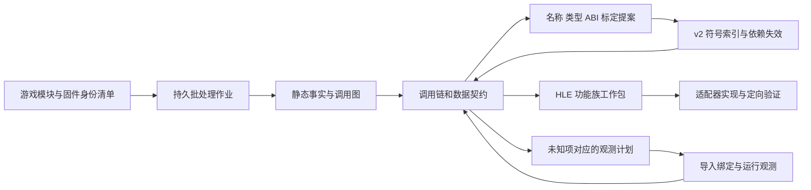

# Reverse Study 批量调用链标定与 HLE 重建 spec

状态：**待实施的设计**，2026-09-20。首个使用场景为 Beat Saber PSVR/SBS；本次只回捞记录、核对源码和制定方案，没有部署探针、修改 HLE 或运行游戏。

主仓基线：`63b6d560dd43af031ec7a5de64ae6204beea5de2`，工作分支 `feature/malos/beat_saber_fix`。工具源码基线：`dev_tools 7f9da023075cbf545974cbff2a6925f5c1ec9c2d`。详细路径、文件哈希和查证边界见 [源码核对清单](reverse-study-batch-hle-reconstruction-20260920.audit.json)。

## 1. 推荐决策

先补齐 Reverse Study 的**可续跑批处理、持久调用图、证据化标定和 HLE 功能族工作包**，再继续 SBS 修复。以一个有界 VR 功能族贯通工具闭环，不等待完整自动逆向平台建成。

批处理的单元是“一个需要回答的问题及其调用/数据依赖”，而不只是“一批待反编译的地址”。例如：为什么选择了 `None`、哪种状态允许提交眼图、谁在何时释放 completion label。每个工作包必须给出事实、假设、未知项、下一次观测和实现验收条件。

复用现有 SQL、`recompile_facts`、`guest_recompile_bundle`、探针与 v2 符号索引；增加调度和数据关联层。不要重写反编译器、另建不兼容的符号库，也不要把 HLE 重建等同于全游戏 C/C++ 重编译。



## 2. Beat Saber 进展回捞

### 2.1 已有成果与证据上限

历史任务为“分析 shadps4 VR 支持准备”（任务 ID `01a0b2ad-4653-73e1-b3c5-850c118b624f`）。2026-09-19 的集成提交为 `20179024`，最终交接仍保留 SBS 翻转和 HMD/VideoOut 时序问题；后续资源策略和同步优化不构成这些问题的游戏验收。

| 范围 | 已有成果 | 仍不能据此得出的结论 |
|---|---|---|
| 游戏盘点 | 1.00 eboot 静态 704 个导入、26,982 个 call→PLT 站点；实际加载 eboot、Fios2、Il2CppUserAssemblies、PS4Util、libc；历史运行审计 1164 行 | 静态导入数与运行绑定行数口径不同；不是所有导入均已正确实现 |
| Guest 标定 | 11 个语义入口、v2 符号索引、入口观察器和 HLE 返回值 wrapper | 多数只有名称/调用关系证据，尚未恢复完整 ABI；不是整个 Unity VR 模块的 C/C++ 实现 |
| VR 选择 | 观察到 `[None, PlayStationVR]`；诊断 patch 调整栈上副本顺序后命中 PSVR 初始化 | managed 层为何没有继续切换未解释；偏好 patch 不是正式启动修复 |
| HMD/Tracker/Camera | 虚拟 provider、用户 owner、固定 Camera buffer、诊断姿态与部分生命周期已接通；Camera 71/0、provider 73/0 是历史专项结果 | Camera 固定黑帧不是真实光学追踪；那次初始化运行尚未命中 CameraGetFrameData |
| Reprojection | 固件参数/布局证据、受检初始化、显示槽和事件/完成标签直通；专项 29/0；历史 guest log 证明 Initialize 返回 0 | 没有稳定、真实双眼场景的验收；测试通过不代表真实游戏消费眼图正确 |
| VideoOut | 已修 options 初始化入口与 ConfigureOutputMode 六参数顺序 | 修复后的整条游戏提交/退役/退出链尚未闭环 |
| 输出与停止 | 曾显示并排 Beat Games/Unity 标志；保留过 Stop 超时及 force-stop 记录 | 旧标志来自缓存源帧复制，不能证明活的双眼图像、60 FPS 游戏或正常停止 |
| Swan 内容 | 本体、更新、DLC 已分拆 ZAR 并传输、索引/核哈希 | 不是 Swan Beat Saber/SBS 运行验收；旧 1.00 patch 不能直接用于更新覆盖后的模块 |

上述设备 VR 证据来自 **AYN Thor**，不能转写为 Swan 结果。来源：[原 SBS/OpenXR 规划](../psvr-sbs-openxr-plan.md)、[生命周期与静态盘点](../validation/psvr-sbs-20260918.md)、[设备启动及缓存画面说明](../validation/psvr-sbs-20260918/beat-saber-device-startup-20260918.md)、[初始化与直通验证](../validation/android-native-host/beatsaber-vr-init-20260919.md)、[guest 标定说明](../../guest/games/CUSA12878/01.00/README.md)、[Swan ZAR 记录](../validation/android-native-host/swan-zar-20260920.md)。历史报告中的“仍 refused”按对应构建解释，不直接替代当前源码状态。

### 2.2 当前源码揭示的待验证边界

1. `Presenter::PrepareVrFrame` 已读取最多四个描述符并复用现有 post-process draw；仍设置 `settings.sbs=0`，旁边同时保留“先验证一只眼”和“guest 已为双宽 SBS”的说明。这是未解决的表示约定：必须确认独立 L/R、同图不同 array slice、同一 atlas 不同 viewport 中的哪一种。不能直接把开关改为 1，也不能把相同 base address 判为重复眼图。
2. 当前直通路由没有旧的缓存复制方案；旧截图仍不能替它提供验收。`flip_y=0` 是源码行为，缺少匹配构建的方向验证。
3. `GuestGraphics::SubmitVrFrame` 保留 guest 读区与 label 写区 pin，并在退休回调清零 label；需要证明回调恰好一次、GPU 读取与 host submit 都已结束，并补取消/错误路径。**资源可复用、host present、用户事件和 guest 帧完成是不同事件**，不能用一个布尔值替代全部合同。
4. `GuestVrSession` 与 `GuestReprojection` 各有状态和帧计数；需要明确 owner、generation 和状态投影，检查正常 flip 与 HMD 提交的呈现归属。两套状态存在本身不是已证实 bug。
5. 新资源策略会改变 host extent；眼图的 guest 尺寸、host extent、view 的 mip/layer 与最终输出尺寸须分别记录。先确定表示和所有权，再验证 Render 1.0/0.5；不得以旧截图证明新 TextureCache 行为。

代码入口：[眼图呈现](../../src/video_core/renderer_vulkan/vk_presenter.cpp)、[提交与 label 退休](../../src/core/host_runtime/guest_graphics.cpp)、[Reprojection adapter](../../src/core/host_runtime/guest_reprojection.h)、[VR 状态机](../../src/core/host_runtime/guest_vr_session.h)。以上为源码审查发现的验证需求，未进行新动态归因。

## 3. Reverse Study 现状与差距

| 现有能力 | 核对结果 | 本 spec 增量 |
|---|---|---|
| SQL/函数/xref/CFG/类型 | 支持查询、按需 materialize 和分页；必须区分 missing、partial、ready | 一次选定工作集，批量补齐事实并持久关联；逐节点保留覆盖率 |
| `guest_profile_batch` / `guest_frame_workset` | 已有批量长帧分析、时序视图、语义标签和源码请求 | 加入启动/失败/功能族入口，不能要求先取得完整帧；时序包含关系不变成真实机器栈 |
| `guest_auto_tag_plan` | 默认 depth=2；显式范围；64 个函数/1024 探针容量，`maxProbes=0` 不代表无限容量 | 图前沿分片和跨轮证据合并；不把容量限制当“全链分析完成” |
| `guest_recompile_bundle` | 1..64 个入口；完整字节/CFG/ctree、可选 early/final microcode、完整伪码和文件 SHA；逐函数导出 | 可续跑、按需分级采集、去重缓存、失败隔离；不重复通过 MCP 传整个函数体 |
| v2 符号库 | 本游戏已使用 index/shard v2；支持名称、原型和结构，候选/相关/已证实证据 | 字段级标定提案、冲突处理、依赖失效；保留 v1 只读迁移 |
| `edit_preview/apply` | 每批最多 32 项；绑定 generation；**非原子**，失败返回部分完成 | 大工作集拆批、每批 journal 和 IDB snapshot；不得宣称跨库全有或全无 |
| 活动数据库 | `IdaWorkspaceRegistry` 拒绝一个进程打开多个独立模块；IDA 调用经单 kernel thread | 项目级目录联结多个独立分析结果；默认一个 worker 顺序处理，多进程为后续可选加速 |
| 跨模块与 HLE | 尚无贯通“实际绑定→调用/字段→状态机→HLE 验收”的持久工作包 | 本 spec 的主要新能力 |

工具源码入口位于 `spatial_mcp_publish/dev_tools/mcp/ida` 与 `mcp/guest_profiling`。旧 `multi-module-guest-analysis.md` 的“一个 workspace 多个独立 native session”描述与当前拒绝分支不一致，实施时一并修正文档。符号 skill 中的 v1 说明也不能覆盖当前 v2 schema/消费者实现。

本次只读 MCP 返回 `study0` 可用、`study1` 不可用；`externals_status` 返回空 `libraryPath`、无打开的 workspace。因此本轮**没有证明 IDA/Hex-Rays 已成功加载**，也没有重跑二进制分析。开始实施时须先验证 worker 的实际版本、ABI、SDK 和架构能力；不能只凭工具注册成功认定后端可用。

## 4. 范围、分工与不变量

### 4.1 两类重建分别交付

- **HLE 语义重建**：从 guest 调用、精确固件及桌面实现恢复 API 合同，产物进入 shadPS4 的通用 HLE/adapter。无须重编译每个 guest caller。
- **Guest 逻辑恢复**：解释 Unity/IL2CPP 的选择、回调和状态转换，先产出名称、类型、调用链与观测点。确有需要才另交 C/C++ replacement；必须有独立 ABI/副作用合同及差分验证。

工具通用调度、图、标定和报告属于 `dev_tools`；PS4 NID/实际 Linker 绑定导出、guest VM/回调/retirement 适配属于 shadPS4。Foundation 只承接可复用日志/采集基础设施。随应用发布的通用同步 fast path 留在 runtime；Beat Saber 诊断 patch 留在游戏目录，不能互相替代。

### 4.2 固定规则

1. 主 ELF 与实际加载 SPRX 全量盘点，按功能族处理。API 的“可绑定、语义已实现、实际调用、场景通过”分别记录。
2. 优先对照完整桌面流程和当前固件证据，包含创建、查询、失败、回调、取消、销毁；不批量补返回 0 的 stub。
3. 静态直接调用、尾跳、fallthrough、数据引用、间接候选和运行命中不可混同；未观测到不等于不可达。
4. 反编译器推断的名称/类型不自动提升为 ABI；未知参数继续 opaque。proven confidence 不跨版本继承。
5. 时间线区间包含不证明调用栈；异步调度关系需要显式 flow/request/object 证据。elapsed 不等于 CPU，等待不能重复相加。
6. 只读分析默认不修改 IDB，不安装 patch、不启动/停止游戏。设备观测由已有 debugger/profiling 控制面执行，Reverse Study 不成为第二个 live controller。
7. 本 spec 不以 OpenXR、完整游戏回归或全部 Unity 逆向为工具首版前置条件。

## 5. 身份与持久数据模型

所有新 schema 名均为**拟议接口**，不表示当前工具已支持。首版提交 JSON Schema 和兼容性测试，再冻结 v1。

### 5.1 项目 manifest：`spatial.guest-analysis-project.v1`

一个项目容纳游戏模块、只读固件参考、桌面源码和多次运行，但每份事实仍属于自己的精确身份。

| 记录 | 必需字段/约束 |
|---|---|
| 模块 | `module_id`、role（guest/reference）、title/version、来源 base/update/DLC/guest_patch、运行输入 SHA、解密 ELF SHA、架构/字节序/指针宽度、preferred imagebase 及其证明 |
| 分析副本 | analysis SHA、original-input SHA、转换 recipe/工具版本和允许变化的字节范围；IDB SHA 单独存储 |
| 固件 | 固件版本、每个 SPRX 的输入/解密 SHA、导出 NID/库版本；仅作为 reference，不伪装实际 LLE 模块 |
| 运行 | capture SHA、boot、PID/start identity、session UUID/generation/context、module load map、APK/host/JNI/driver 身份、场景/配置、探针 profile 与 patch SHA |
| 工具 | worker build、IDA/SDK/decompiler 版本、ABI probe/capabilities、analysis generation、schema 和有效配置 |

节点的稳定 key 为 `module identity + kind + module offset`；另存函数边界/bytes SHA。路径与裸运行地址不得作为稳定 key。offset 用十六进制字符串，避免 JSON/JavaScript 大整数精度丢失。跨进程运行地址需先通过当次模块映射转为 offset。

Beat Saber 1.00 的已知三种身份必须分开：SELF `9ac17454…`、解密 ELF `71278f9c…`、ET_DYN 分析副本 `a0ea7528…`，完整值沿用现有 [index](../../guest/games/CUSA12878/01.00/symbols/index.json)。两字节转换只是这份副本的证明，不是允许任意哈希不匹配。更新 ZAR 若覆盖了 eboot 或 SPRX，创建新的模块身份；1.00 的观测器和符号不能直接复用。

### 5.2 项目事实库与边

使用独立项目 SQLite/JSONL 产物汇总各模块快照，不改变现有 IDA workspace 的单库约束，也不放开已有 SQL 工具的任意写入能力。

最低数据集：`module/function/callsite/edge/import_binding/type/field_access/observation/claim/family/task/artifact`。每条记录保留 provenance、generation、coverage；大正文按内容哈希落文件。

- `edge.kind`：`direct_call`、`tail_transfer`、`fallthrough`、`indirect_candidate`、`observed_call`、`import_binding`、`callback_registration`、`data_reference`、`async_flow`。
- 调用边记录 caller、callsite、callee 或 unresolved target expression；一个 callsite 可有多个候选/观测目标，不能互相覆盖。
- 绑定边记录完整 NID、库/模块/版本/后缀、调用模块、实际 provider 类型及地址；相同可读名不代表同一入口。
- 跨模块实际边来自 Linker 绑定、重定位/导入导出匹配或运行目标。静态候选与真实 LLE/HLE 选择分开，不能把固件参考里的内部函数接成游戏实际执行链。
- 对间接调用保留 vtable slot、注册表字符串、load/store 来源、有限候选和未解析原因。IL2CPP metadata 若实际存在且身份匹配才接入；无 metadata 时仍保留原生注册关系，不能猜 managed 方法对应。
- 图中完整记录前沿：未扫描、未解析、超预算、反编译失败、未命中、运行截断、跨模块待绑定。对这些节点，查询“没有 callee/参数”必须返回 unknown/coverage，不能返回具有完整含义的空列表。

### 5.3 字段与主张

结构字段记录 offset/width/alignment、signedness/单位候选、读写站点、参数方向、嵌套指针、length/selector 条件及证据。区分“机器码读取 8 字节”“语义上是句柄”“已证实完成标签”三种主张。

每个 `claim` 有独立状态与证据集合：名称已确认不意味着全部原型已确认；布局已确认不意味着生命周期已确认。支持相互冲突的候选和 `supersedes`，保留原始证据，不以最后一次写入覆盖异议。

## 6. 批处理与缓存

### 6.1 作业阶段

`queued → running → completed | partial | failed | cancelled | blocked`；控制请求另有 `pausing/paused/cancel_pending`。`completed` 仅表示请求中声明的工作已完成，不代表调用图覆盖全部动态路径或 HLE 语义已实现。

任务类型为 inventory、graph expansion、facts export、annotation import、contract export；依赖由 DAG 表达。调用图中的递归 SCC 作为分析单元，不能让递归边变成作业依赖环。

每项任务有输入哈希、状态、attempt、输出 SHA、错误码及 checkpoint。任务完成后原子发布文件/manifest；重启复核 SHA 后跳过成功项。失败项与依赖该项的任务可重试，其余已完成任务保持有效。`status` 返回计数、前沿和当前阶段，调用者不需要一直持有 MCP 连接。

### 6.2 队列与数据库所有权

- 首版 `workers=1`：按模块分组，保存并关闭本作业拥有的 IDB，再打开下一份；项目图由导出快照联结。遇到其他工作区占用返回 `WORKSPACE_BUSY` 和 owner，不关闭对方数据库。
- 每 worker 独立进程、独立 IDB 和唯一 kernel thread。后续才允许可配置多 worker，并报告真实内存/能力限制；不能用 `Task.WhenAll` 并行调用同一 idalib。
- Python/SQLite 归并、哈希和报告生成可在 IDA 外并行。默认不将所有函数反编译，不默认对每个函数生成两份 microcode。
- 取消检查在函数/导出阶段边界执行。无法中断的 native 调用须显示 `cancel_pending`；超时仅隔离/结束本作业 worker，保留最后 checkpoint，不能承诺取消令 native call 已停止。
- GUI review 使用独立快照。类型/名称变更按 generation 导入，作业不得覆盖人类或其他作业的新修改。

### 6.3 范围和分级采集

入口允许：语义函数、精确 callsite、NID 功能族、失败返回码对应站点、注册表/vtable、现有 PROF workset；**没有 PROF、没有第一帧也能运行**。

| 层级 | 内容 | 默认策略 |
|---|---|---|
| F0 | 身份、函数边界、导入/导出、调用引用、轻量属性 | 覆盖请求工作集，全量盘点不等于全量反编译 |
| F1 | 精确指令/字节、CFG、字符串与数据引用、现有原型 | 对调用链节点按需 materialize |
| F2 | 完整伪码、ctree 参数/局部位置、字段访问事实 | 有待回答语义问题的节点优先；复用单次 `recompile_facts` 查询 |
| F3 | early/final microcode、更深依赖 | ABI/间接目标/数据流确实需要时显式启用 |

推荐初值：32 个函数一个 export shard，兼容当前单次最多 64；图扩展默认两层，但保存所有未展开边。`maxFunctions/maxEdges/artifactBytes/nativeTime` 是显式预算，达到预算返回 partial 和可续跑前沿，不能静默裁剪。“跨整个功能族”允许自动拆多个工作项，不能把 64 函数扩大为隐式项目总上限。

优先级按可解释元组排序：当前阻塞路径 → 被多项合同依赖的节点 → 生命周期/所有权缺口 → 实测高频或高耗时 → 未覆盖旁支。不得仅按长帧排序，把一次性的启动失败排到最后。

### 6.4 缓存与失效

缓存分为机器事实和语义视图。key 至少含分析输入 SHA、loader/base、工具/后端版本、函数边界/bytes SHA、事实级别；伪码另含影响它的名称/类型 revision 与依赖摘要。

首次实现可在类型变更时保守失效整个模块的伪码缓存，保留机器字节；随后优化为被调用原型、结构使用者、直接调用方及有关 SCC。无法证明依赖完整时保守扩大失效，不能只刷新改名的一个函数而继续使用旧 caller 伪码。

每次查询报告 hit/miss/stale 及原因。相同项目在不同主机路径重开应可复用字节相同且版本兼容的产物；不能以本地路径相同代替身份验证。

## 7. 调用链标定与 HLE 契约

### 7.1 标定流程

1. 自动采集确定事实：函数边界、调用站点、读写宽度、导入、常量/字符串/注册关系；导出按问题组织的 workset，重复 callee 只引用一次。
2. 分析者提交 `annotation proposal`：语义名称、原型、字段、关系、证据引用和反例。模型可以提出候选，但候选不会因批量生成而成为事实。
3. 验证 identity、边界、类型布局、命名冲突和证据引用；展示 diff。类型受 caller/callee/布局证据共同约束，浮点 XMM、返回结构、栈参数、varargs、TLS 与回调 ABI 必须明确。
4. 接受的结果写入现有 SHA-pinned `spatial.guest-symbol-index.v2`/shard；图/claim/运行记录放独立 sidecar，不往严格 v2 schema 塞未知字段。需要 schema 扩展时先同步 validator 和各消费者。
5. IDB 写回复用 `edit_preview/apply`，每批最多 32，记录 token、前后 generation、已应用项、失败项和 snapshot。部分失败保持显式；不自动重放已消耗 token，也不盲目恢复旧 IDB 覆盖新编辑。
6. 重建受影响事实视图，并导出供 IDA、guest_debug、Litep、源码工作包共用的相同符号 revision。

“reviewed”表示已按证据合同核对，并不要求每个 rename 都弹出用户确认；是否写入仍由当前任务授权和明确 apply 参数控制。身份或类型矛盾不得靠降低校验绕过。

### 7.2 双向调用链与数据流

从启动/失败根向下分析执行链，同时从选定 HLE NID 向上找 caller。两侧相交的工作集用来回答“谁构造了参数、谁消费了返回值、谁走了清理”。callback/vtable/事件唤醒边独立展示，不能伪造一条同步栈。

对每个关键参数导出局部 reaching-definition/使用摘要和不确定 alias，而非只展示函数签名。以 Reprojection 为例，跟踪 layer→image descriptor→TextureCache view、submission→label→等待/清零，以及 start/end event 的注册/触发/等待/注销；保留 selector 分支和失败返回后的控制流。

### 7.3 HLE 功能族工作包：`spatial.hle-family-contract.v1`

每包包含以下表格及机器数据，文档与测试计划由同一事实源生成：

| 项目 | 必须回答的问题 |
|---|---|
| 入口全集 | 导入/NID/别名/库后缀/版本、实际 provider、caller 和场景需求 |
| ABI 与 wire 布局 | 参数位置/方向/宽度、结构大小和字段、嵌套数组/指针、长度与溢出检查；未知项 |
| 返回与副作用 | errno/sce 错误码、失败时允许写回哪些字节、部分成功、线程安全、顺序 |
| 生命周期 | init/create/query/start/submit/wait/stop/cancel/destroy 状态和句柄 generation |
| 内存/GPU 所有权 | 谁分配/读取/写入/释放；调用内副本、跨调用借用、VM pin、queue submit/GPU retirement 与 label 规则 |
| 回调与异步 | guest ABI、执行线程、request/frame/context 关联、重入、取消与晚到回调 |
| 实现定位 | 桌面共用代码、Android bridge、guest LLE、具名未支持；源码 revision 与预期改动点 |
| 验证 | 正常、非法输入、失败不写回、重复/乱序、取消、Stop/重启、真实 caller 和场景观察 |

入口状态至少分 `inventoried/binding_verified/contract_partial/contract_ready/implemented/tested/device_observed`；各列可独立记录。`contract_ready` 必须覆盖计划实现的分支和错误语义，或明确拒绝不支持分支；不能要求整个固件库完全恢复后才能实现一个有边界的功能族。

## 8. 运行证据接入和观测计划

沿用 `guest_auto_tag_plan`、custom SDK tagged log、Native/Guest debugger、Litep；不在 Reverse Study 内另建设备采集器。Litep 的采集/Windows 发布独立遵循 [已有工具 spec](litep-perf-tooling-gaps-20260920.md)。

- 项目导入器接受启动事件、绑定清单、调用区间、参数/返回快照、内存读写观测和完成事件。旧日志缺少线程/对象/请求键时标记为 legacy evidence，不补造因果关系。
- 对每个未知项产生一个 observation requirement：问题、模块/入口/callsite、预期证据、需要的参数/内存窗口、配对规则、触发/停止条件、容量及风险边界。
- 实际 target 地址必须绑定观测时的模块映射；间接调用若工具尚不能捕获 target，保持 unresolved，不能把静态候选写成已执行 callee。
- 只采已确认读取范围或受检有界快照；未知原型优先使用保留机器状态的入口/调用点观察器，不生成可能破坏参数的 typed wrapper。
- 64 函数/1024 探针按 profile 分轮，记录每轮覆盖和开销；不同运行只合并边的证据，不拼接为同一条时间线。保留丢事件、overflow、未配对、线程迁移和窗口截断。
- 对关心的状态变更关联 `session/generation/invocation + object/request/frame key`。指针复用须带有效期；没有对象身份时只报告候选关系。
- 若比较原实现与新 C/C++，在隔离 replay/可重置 fixture 比较返回值、写集合与有序外部调用。不能在真实游戏状态上先后执行两次有副作用的函数来作“差分”。

## 9. 拟议 MCP 接口与交付结构

优先新增一个统一批处理入口和通用作业生命周期，而不是为每个查询组合增加工具。

| 拟议工具 | 请求/返回合同 |
|---|---|
| `reverse_study.analysis_batch_start` | `projectManifestPath/requestPath/outputDirectory/idempotencyKey`；立即返回 jobId、输入 SHA、工作集与预算 |
| `reverse_study.analysis_job_status` | jobId、afterRevision、bounded wait；返回增量状态/计数/错误、无进展时无重复正文 |
| `reverse_study.analysis_job_control` | jobId、operation=pause/resume/cancel/retry_failed、expectedRevision；pause 在安全 checkpoint 后生效 |
| `reverse_study.analysis_project_query` | projectId、snapshotRevision、具名 query（chain/frontier/callers/field_uses/family/coverage）、过滤与游标；每页明确 coverage |
| `reverse_study.annotation_batch` | operation=validate/preview/apply/export，proposalPath、expectedRevision、明确的 owned workspace；所有写入返回 journal |
| `reverse_study.hle_family_export` | familyId、snapshotRevision、输出目录；返回 contract、测试矩阵、unknowns、报告的路径与 SHA |

`analysis_batch` 支持 inventory/graph/facts 三种阶段、静态 seed、运行 seed、显式边种类和停止前沿。现有工具继续可用，其单次容量不会被新入口暗中扩大。请求和结果需要明确 backend capability 拒绝，不能悄悄从精确机器事实退化成字符串猜测。

建议产物：

```text
analysis/<title>/<identity-set>/
  project.json                 # 身份与路径别名
  jobs/<job-id>/request.json, journal.jsonl, status.json
  graph/snapshot.json, facts.sqlite, frontier.json
  artifacts/<sha>/...           # 函数事实、伪码、类型和观测原件
  proposals/<revision>/...      # 未采纳的名称/ABI/字段提案
  symbols/index.json, *.symbols.json
  families/<family>/contract.json, contract.md, tests.json, unknowns.json
  reports/index.html, summary.md
```

报告须能按阶段/模块/功能族过滤，展开一个调用点的候选与真实 target、切换静态/观测边、显示字段读写和 HLE 状态。点击节点同时看到来源/置信度/缺口，未知边可直接形成下一工作集。大函数正文以路径+SHA 提供，MCP 默认只返回摘要和游标。

导出包使用相对路径和 manifest 哈希，可迁移 Mac/Windows；私有游戏/固件二进制和原始大 trace 留本地，仅提交有授权的 schema、工具、测试 fixture 和必要索引。缺少二进制的机器仍可审查已导出的合同，并显示哪些验证不能重跑。

## 10. Beat Saber 第一批工作包

### B0：锁定 1.00 基线与实际加载集合

先复用已验证的 1.00 索引和静态清单，新增各 SPRX 的身份与实际 binding；更新、DLC 和后续 guest patch 各自保留来源。Swan 测试时显式选择要跑的内容组合并读回实际模块哈希；不通过改名/忽略更新悄悄制造 1.00 基线。

### B1：VR provider 选择与初始化

初始根使用已有 11 个语义入口，优先 `UnityVR_RegisterProviders +0x9bf490`、`ReadDeviceNames +0x9c1330`、`SelectDevice +0x9bf8e0`、`InitializeSelectedDevice +0x9cf0c0`、`UnityPSVR_Initialize +0xd6f690`；全部属于上述精确 1.00 eboot。

向上连接 IL2CPP/managed 注册调用者，向下连接 HMD/Camera/Tracker/SetupDialog 和失败清理，解释 provider 顺序的来源、后续切换条件、错误返回的消费位置。诊断偏好 patch ON/OFF 的证据分开；退出条件是选择/回退合同清楚，不要求先把全部 managed 代码还原。

### B2：一帧的生产、提交与释放

根为 SetDisplayBuffers、StartMultilayer、VideoOut/GNM flip、event wait/trigger、label 使用站点。联合游戏 caller、11.00 精确固件参考和当前 host 实现，输出一张带状态/线程/对象的图：

`guest render → descriptor/view → HMD admission → host submit → GPU reads retire → label/event → guest buffer reuse`。

补全 start/end event 是否驱动下一帧、显示 slot 与眼图的区别、overlay/array/atlas 的表示；对未知边提出最小观测。不得把 present FPS 或 GNM submit 次数当眼图更新证据。

### B3：停止、取消与重新进入

从 Stop/Finalize/UnsetDisplayBuffers、tracker/HMD 关闭、session 取消和晚到退休回调反向构图。覆盖提交失败、pending>0、超时、双完成、旧 generation、guest 内存退出与 GPU 延迟。

退出条件是主正常路径及所有已准入失败路径有明确所有权和有限等待合同；旧 Stop 超时需要重新归因，不能默认已经被后来 TextureCache 死锁修复覆盖。

### B4：SBS 恢复实施与 Swan 验收

仅在 B1–B3 为选定路径形成可实现合同后修改 HLE/presenter。先用 L/R 不同校验图验证独立 L/R 图与已有 atlas 两种计划支持的布局；array slice 作为 view 子资源另行验收。再用真实 guest 内容验证：

- 双眼来源与 subresource、尺寸/方向/顺序正确；同一 atlas 可共享 base address，但必须有可证明的不同视区。
- 连续 120 个新 guest 眼图提交可关联到 host 呈现/退休，记录重复帧/丢帧；不是把旧 Unity 图重复呈现 120 次。该数量为首轮有界验收目标，不是稳定性承诺。
- 至少一次菜单输入改变可见状态；记录实际按键/姿态诊断方式，不等同 Move 6DoF 或切方块可玩。
- 普通 UI Stop、同进程重启、切回 Flat 的旧帧/句柄拒绝通过；先单独定位失败再扩大测试。
- Render 1.0/0.5、Texture High 固定配置做眼图尺寸与采样定向检查，再按证据决定是否扩展材质档位。
- Swan、AYN 结果分别归档；Swan 上第一阶段仍是 Android SBS，真正 OpenXR 为独立后续里程碑。

## 11. 实施里程碑与验收

| 阶段 | 首要交付 | 完成条件 |
|---|---|---|
| M0：基线/协议 | schema、版本/能力报告、Beat Saber 身份和 seed、确定性测试 corpus | SHA/模块/转换/版本错配均拒绝；当前能力与新增计划分开 |
| M1：最小批处理 | 持久 job、单 worker、F0/F1/F2 分级、checkpoint/缓存、图前沿 | 超过 64 函数自动分片；取消/崩溃续跑不重复成功导出；一个反编译失败不会丢整包 |
| M2：标定与合同 | v2 符号集成、字段/主张、批量 diff/journal、family export、基本图浏览 | 精确导入 binding 与调用链联结；类型变更后 caller 不读旧伪码；完成 B1 的解释包 |
| M3：观测闭环 | 启动日志/PROF/绑定清单接入、按 unknown 生成探针请求 | B2/B3 的事件/label/眼图所有权有证据；缺失和冲突能形成下一工作集 |
| M4：SBS 修复 | 基于合同的 HLE/presenter 改动、Swan 定向运行 | 满足 B4；保留无 Move/OpenXR/全游戏验收的边界 |
| M5：扩展 | 多 worker、类型精细失效、更多功能族/标题 | 用实测数据证明收益；不阻塞 M4 |

M1+M2 是推荐的首个开发批次；M3 先服务实际未知项，不预先建设所有观测方式。M2 后即可滚动推进一个完整功能族，不必等待 M5。

### 工具验收矩阵

1. 自有 stripped x86-64 fixture：调用/尾跳/fallthrough、递归 SCC、函数内部入口、vtable/回调、导入别名、错误分支；ARM64 fixture 核对架构分派，不使用 x86 ABI 默认值。
2. 两个模块同 base/同 RVA、两版本同名不同 SHA、相同路径被替换：不能串库；静态固件 reference 不可变成 runtime binding。
3. 130 函数工作集，包含一个故意失败项：分片和 coverage 正确；在中间中断、重启后逐项复用，坏项显式重试。任务计数满足 `requested=completed+failed+cancelled+blocked+pending`，其中 pending 含排队、运行、暂停及取消尚未结束的任务，各类互斥；partial 作业另列未纳入任务集的图前沿。
4. 缺 IDA、缺 Hex-Rays、未 materialize、bytes 不完整、native 超时、损坏缓存、磁盘写失败、已有 IDB 被占用：返回具名结果，成功项和原数据库不受损。
5. 名称/字段冲突、type edit 部分失败、generation 变更、人类 review 更新：journal 可重建，旧 token 拒绝；所有受影响视图失效。
6. runtime target/对象复用、跨线程同时间区间、缺 flow ID、未配对事件、profile 溢出：不能凭时间相近生成确定调用/因果边。
7. HLE 契约 fixture 覆盖长度溢出、嵌套指针、错误不写输出、async callback、GPU 延迟退休、Stop/restart；产物明确指出实现和动态验收各自缺项。
8. Mac/Windows 从正式安装包执行同一请求，schema/内容哈希一致（排除显式主机元数据）；安装包报告源码和引擎版本。源码测试通过不能替代 MCP 发布包验证。

### 效率验收口径

在同一身份、函数集、事实级别、工具版本和主机上比较旧逐工具流程与新批处理，分别记录冷/热缓存的 wall time、IDA/反编译调用次数、MCP 往返、正文传输字节、峰值 RSS、成功/失败/未知覆盖。

首版硬指标：相同输入热跑成功项 **0 次重复昂贵导出**；同一事实由多个 caller 引用不重复存储；大正文不经 status 重传；分页/分片穷尽且未知数可对账。MCP 往返减少 80% 作为首轮目标，需实测，不能预先宣称 HLE 开发速度或游戏 FPS 提升。语义准确性/覆盖率不得因加速下降。

## 12. 本次交付与下一步入口

本次只新增本 spec、源码核对清单，并在旧规划/AGENTS 中增加入口。没有新游戏运行、IDA 二进制分析、工具实现或性能结论。

下一次实施从 M0/M1 开始：先在 `dev_tools` 增加可离线测试的项目/作业/产物合同，用现有 11 个 Beat Saber 符号与自有多模块 fixture 跑通；随后接入真实 IDA worker，再输出 B1/B2 的第一份 HLE 功能族工作包。新功能分支以最新 `malos/main` 为集成基线，跨仓提交各自独立保留。
