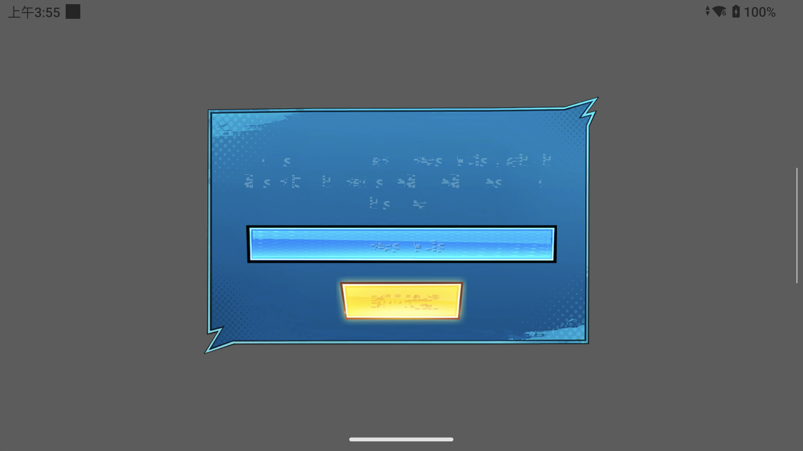

# 本地 AvPlayer、存档目录与停止流程（2026-09-14）

本轮把桌面本地 AvPlayer 接入 ARM64/bionic + FEX，并定位、修复了 TMNT 片头之后的存档崩溃。游戏已经能生成自己的界面，存档文件可以跨进程写入、读回；文字仍有明显损坏，不代表正确画面、可操作场景、十分钟或 Swan 验收。最后一轮结果见本文末尾。

按用户要求，网络/SSL 不扩展：保留桌面离线兼容和 Ssl2 dummy 初始化/结束，没有添加 HTTP、socket、TLS 或在线 provider。AvPlayer 仅接受挂载的本地绝对路径，拒绝协议 URL 和 HLS。没有新增执行 spec，没有做全量回归。

## 实现范围

### 本地媒体与 guest 回调

21 个显式 NID 接入 `GuestAvPlayer`，复用桌面 `AvPlayer`、FFmpeg demux/decode 与状态事件。播放器句柄是 Session 内递增编号，每实例拥有独立工作线程及持久 FEX callback owner、guest TLS/栈/scratch；不会把 native player、host 解码缓冲或 host 回调指针返回 guest。sysmodule 的 AvPlayer provider id/名称同时接入。

native FFmpeg 只操作 host 缓冲；guest allocator 返回的地址保留映射 generation 列表。输出前在短 VM 锁内检查每一段，包括内部拆分/remap，再复制 PCM/NV12 数据并刷新 GPU 缓存。调用 guest 或等 native worker 时不持有 VM pin/事务。事件在独立队列上派发；事件 callback 可以查询/选流/Start，分配器和文件 callback 中的 API 重入拒绝，Close/Stop 的事件重入也拒绝。嵌套 scratch 槽保留外层 payload。

共享桌面代码同时修复 Start 持锁再 Stop、控制线程晚于 source 析构、跨 worker/self join、EOF 未 drain 延迟帧、队列消费竞争、重启文件游标、缓冲/尺寸/seek 边界，以及等宽 NV12 的 stride 复制。`SetLogCallback` 沿用桌面空实现，不调用 guest 函数地址作为 native logger。

限制仍明确：最多8实例、单块64MiB/总驻留256MiB、scratch256KiB；目前 ValidateRange 对跨多个独立映射的请求较保守。InitEx 只消费已知前缀，不宣称未知扩展字段全支持。native 注入的非返回事件取消已测试，**没有把未执行的 avplayer-wait fixture 当作真实 FEX 无限回调取消证据**。

### 存档崩溃的实际来源

修复前 SaveData Initialize/Mount/备份/再次 Mount 已返回成功，随后 TMNT 以 `O_DIRECTORY=0x20000` 打开 `/savedata0/`。旧 `GuestStorage` 只准入普通文件，因此返回 EINVAL。guest 随后关闭写能力，把失败文件句柄计算成无符号索引 `0xfffffffe` 后越界。

[调试归属摘要](2026-09-14-avplayer-directory/debug-root-cause.json)记录原始 signal ucontext、对应 FEX JIT PC 映射得到的 guest RIP `0xa10008`。没有将异步 CPUState 当成完整快照，没有在 inferior 调用重建函数。进程转发原始 fault 后退出；前两次 debugger cleanup 报 incomplete，之后健康检查确认 host/adapter/server/forward 已无占用。原始 guest 内存和反汇编留在本地 build 目录，不入 Git。

Android 现在注入 descriptor-relative reader，复用桌面 `NormalDirectory` 的 Orbis dirent 编码、512字节分页、read/preadv/seek/fstat/getdents/getdirentries；不复制 Linux dirent ABI。四个目录 NID 已显式准入。挂载根目录与 `.`/重复斜线规范化保留边界，`..`/symlink 仍拒绝。每轮 reader 用独立 `openat`，避免 dup 共享 readdir 游标；打开的目录仍阻止存档卸载。

共用目录实现修复空枚举写越界、名称长度、seek 溢出、preadv 异常时游标恢复，以及静态 inode 计数的数据竞争。HLE 先验证数据和 basep 输出再消费游标。标准句柄0/1/2复用桌面 Logger，保留禁止关闭行为；同时补全文件系统 errno 的 native→Orbis 映射，未添加网络错误语义。

### 停止阶段的两个实测缺陷

首次修复目录后，TMNT 到2704次 present；120秒主动 Stop 时，GNM 正等待 VM 准入，把取消时的 Busy 当作 syscall fault。现在生产 `AcquireGraphicsAdmission` 在取消时返回无 lease 的成功状态，handler 不执行 native 工作，由 FEX 的 pending Cancel 结束调用；未取消的 Busy/超时及其他错误仍保留。

下一轮又暴露 AvPlayer callback owner 在全局 Stop 后尝试独立回收栈/TLS，GPU 已停止而无法再完成 VM drain。正常 Close 仍逐 owner 回收；全局 Stop 则保留这些 Session-owned 映射，待 native decode/guest/GPU workers 排空后整体释放。只允许取消期间的准入失败延迟回收，实际映射变更错误仍记录，不把所有 cleanup 错误改成成功。

## 定向验证及证据边界

设备 AYN Thor / API33 / ARM64 /4KiB，普通 APK uid10157，固定 Turnip；完整 base+update 44文件沿用先前核验。测试由普通 APK instrumentation 启动生产 native Runtime + Surface，未代替 UI 导入/普通启动验收。FEX/Foundation 未修改。

| 项目 | 结果 |
|---|---|
| native AvPlayer | 1042 checks /0，实际合成 H264 B-frame12帧、AAC90块，映射代际/坏指针/回调/取消/Close；这是目录修改前 DSO |
| x86 NDK syntax | AvPlayer source/state/file_streamer/video_utils 4/4，目录/base/errno 3/3；不是非 Android desktop 运行 |
| APK真实FEX AvPlayer | apk-twentyninth 三轮同PID，return51966、退出后owners1 |
| native文件/目录 | 最后334/0；分页、EOF、坏basep、游标、挂载排他、目录stat/preadv、Logger与errno |
| native图形准入 | 9/0；VM barrier保持、真实Busy、到期、等待中取消、预取消及释放后恢复 |
| TMNT目录修复前 | apk-twentyninth/thirtieth崩溃，保留FAIL |
| TMNT目录修复后 | apk-thirtyfirst2704次present，Stop的GNM Busy误记故障，保留FAIL |
| TMNT取消修复后 | apk-thirtysecond进入相同运行流程，Stop又发现AvPlayer::Finish GPU drain失败，保留FAIL |

[原始分阶段证据](2026-09-14-avplayer-directory/README.md)保留 `4b8710b1 + dirty` 的构建身份、产物 SHA 和 Build ID；不会回填成后续 commit。native fixture 初期 map::at 以及部分 unmap/跨映射写入用法错误均保留，最后用事务 remap 与逐页写修正。截断媒体测试预期会输出 FFmpeg partial-file 警告。

截图是目录首版普通 APK 的设备显示观察，尚未证明渲染像素正确。RenderDoc 工具状态没有活动 capture，其 capture_launch 在当前 ABI 明确不支持；本轮未抓取 RDC，未按截图猜改 shader/纹理布局。后续实际问题是文字/纹理正确性与可操作场景，而不是继续扩网络/SSL。

## 最后一轮普通 APK

`apk-thirtythird`：AvPlayer 合成 guest 三轮同PID8186通过，return51966、关闭后owners1；真实 TMNT 在PID8274中运行120秒后主动 Stop，**outcome=CANCELLED、2525次guest present、JUnit PASS**。取消修复后没有再出现前两轮的GNM Busy或AvPlayer::Finish排空故障。最新[manifest](2026-09-14-avplayer-directory/latest-build.json)中的 host Build ID为 `59d043d79f72a979bd253463d003f89352d4ca6c`，JNI为 `d53acdfc440fa4c471bbcdb63134d8a19a8beadf`。

这是单轮真实游戏长启动/取消通过，**没有将合成三轮称作真实TMNT三次重启**。仍缺文字/画面正确性定位、实际输入进入可操作场景、完整运行十分钟及Swan验收。继续围绕真实图形与游戏流程处理，不扩网络/SSL，不另拆spec。
