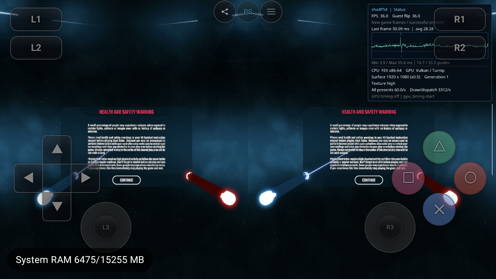

# Beat Saber：viewport 来源与 MSAA 重影修复

2026-09-21，`feature/malos/beat_saber_fix`，基线 `63b6d560`，本地未提交。

**AYN 实测安全提示页的双眼重影已消失。viewport 的左右偏移并未丢失；错误发生在颜色图像的实际采样数选择。**
修复前颜色图实际为 1×，pipeline 和深度图却为 2×。修复后两份警告文字、Continue 和光剑分别位于左右半屏。
本轮未验证 Continue 后的菜单、游玩或其他两款 PSVR 游戏。



## viewport 的来源

1. Guest 提交 PM4 `SET_CONTEXT_REG`。`liverpool.cpp` 将 payload 写入 `regs.reg_array[0xA000 + reg_offset]`。
2. `regs.cpp` 静态断言 `viewports` 起始 word index 为 `0xA10F`；viewport 0 按 xscale/xoffset/yscale/yoffset/zscale/zoffset 排列。
3. `Rasterizer::UpdateViewportScissorState` 读取这些寄存器，计算 `x=xoffset-xscale`、`width=2*xscale`，再应用当前附件的实际 internal scale；scissor 独立求交、缩放。
4. `DynamicState::Commit` 提交 `vkCmdSetViewportWithCount` / `vkCmdSetScissorWithCount`，随后绑定图形 pipeline 并 draw。

AYN 当前游戏的临时有界日志确认：

| 原始寄存器 / 输出 | 左眼 | 右眼 |
|---|---|---|
| xscale / xoffset | 672 / 672 | 672 / 2016 |
| yscale / yoffset | -756 / 756 | -756 / 756 |
| 原生附件 viewport x / width | 0 / 1344 | 1344 / 1344 |
| 0.5 附件 viewport x / width | 0 / 672 | 672 / 672 |

因此偏移是由 guest viewport 寄存器的 xoffset 实现，并已传到 Vulkan 动态状态；HMD 最终提交的半区 UV 是另一阶段。
日志见 [原路径](beatsaber-viewport-msaa-20260921/probe1-viewport.txt)、[绑定后重发](beatsaber-viewport-msaa-20260921/probe2-viewport.txt)。
临时诊断代码已逐字节撤回；[实验 patch](beatsaber-viewport-msaa-20260921/viewport-experiment.patch) 仅作为可复现证据保留。

## RDC 与实际错误位置

复用旧 Turnip RDC `build/validation/beatsaber-gyro-display-20260920/baseline.rdc`，
SHA `5bfe8050da75d0dedef655aa832b32df68d89a898b8e4f074951893a6ab71c85`，历史 PID14211、flip3177→3178；本轮未新抓 RDC。

- E1009/E1021 对应文字的左右 draw（draw index69/70），packet VA `0x21326cc20` / `0x21326cce8`。
  捕获命令保留左右 viewport、scissor，第二次设置与 draw 之间只有 pipeline bind 和 shading-rate 设置。
- 颜色 view1826 → R1825，2688×1512，**实际 1×**；深度 view1827 → R1818，**2×**。
- Pipeline1948/2047 的 `rasterizationSamples=2`，没有 mixed attachment sample count pNext；AYN Turnip 也没有 AMD/NV 混合附件采样扩展。
- [结构化证据](beatsaber-viewport-msaa-20260921/rdc-viewport-samples.json)、[完整 pipeline1948](beatsaber-viewport-msaa-20260921/pipeline1948.xml)、[命令顺序](beatsaber-viewport-msaa-20260921/right-text-command-order.xml)。

真正的错误链：

```text
ImageUsageFlags 无条件加入 STORAGE（为可能的 compute clear 预留）
  → getImageFormatProperties2(format + 全部 usage) 在 AYN 返回 samples=1
  → NumSamples 把请求的 2×/4× 降为 1×
  → backing.num_samples 仍记录 guest 请求值，pipeline/深度仍配置多采样
  → 无合法混合采样配置的颜色/深度/pipeline 组合
```

独立真机查询 UNORM 和 SRGB 均复现：包含 STORAGE 的 sample mask 为 **1**，移除 STORAGE 后为 **15（1/2/4/8×）**。
旧生产 Image 请求2/4×却实际创建1×，见 [能力和实际 VkImage](beatsaber-viewport-msaa-20260921/caps-turnip-v2.txt)。
不把这种无效组合在 Adreno 内部具体如何寻址当成已证明结论；修复前后实景支持其为本次重影原因。
Vulkan 合同及官方来源另存于 [MSAA 参考笔记](../../../references/psvr-public-api/vulkan-msaa-notes.md)。

## 修复和验证

- `image.cpp`：按具体 format/type/usage/flags 查询采样能力。可选 STORAGE 压低多采样能力时，重新查询去除 STORAGE 的合法附件用途并采用更完整的采样能力；构造及 `SetBackingSamples` 都走此路径。
- backing 从多采样返回单采样时重新采用原始用途，恢复 STORAGE。`image_view.cpp` 使用当前 backing 的真实 usage 创建 view；不支持的多采样 storage view 明确拒绝，不伪装单采样成功。深度附件的写标记不误当 storage view。
- 不修改 guest viewport、HMD ABI、眼图 UV、姿态、shader 矩阵或游戏专属参数。
- 回归增加实际 VkImage 采样数检查、UNORM/SRGB、2×/4×、单/多采样往返和 view 创建；既有 MSAA shader fetch / array 检查保留。旧的纯色 clear 测试会漏掉这个问题，因为未检查实际采样数。

| 同一测试程序 | 检查数 | 失败 |
|---|---:|---:|
| 旧生产库 / Turnip | 11556 | **14** |
| 修复库 / Turnip | 11556 | **0** |
| 修复库 / Qualcomm | 11556 | **0** |

原始 [旧库失败](beatsaber-viewport-msaa-20260921/regression-before.txt)、[Turnip](beatsaber-viewport-msaa-20260921/regression-after-turnip.txt)、[Qualcomm](beatsaber-viewport-msaa-20260921/regression-after-system.txt)；native/APK 构建和 `git diff --check` 通过。

## AYN 实景与交付状态

设备 Thor `9c2841a4`，Turnip Adreno740 / Mesa26 git-5ac41be677，驱动 SHA `fdd378520022f88b0363dd1f77f6989332730271712621523075fe4eb4de2a09`。
Render0.5 / TextureHigh / SBS / 初始前向 gyro 保留；配置文件前后逐字节一致。

| 会话 | PID / generation | 改动 / 效果 | 结束 |
|---|---|---|---|
| A | 15606 / 1 | 仅日志，仍重影 | 6157 presents / UIStop |
| B | 17042 / 1 | pipeline bind 后强制重发 viewport/scissor，仍重影 | 10133 presents / UIStop |
| 修复 | 21910 / 1 | MSAA 用途修复，双眼警告和光剑分离 | 4635 presents / UIStop |

A/B 同诊断 APK `442abb2b…`；无效的 viewport workaround 已撤回。
最终修复 APK `555f48cdbb0d8d2361fbf48dce711c4e9fd338a31eae5fe0796361c0544d2c1f`，
host `b55b77ff0124c0a948697535d2f76fe822bd1fe64df48e565e11039983afe2ef`，
JNI `8de50f1f151a0b51258268f69f9c4c1ea6da85be4ba913b8a16626be7aa7c181`；打包 host 与 native 构建产物一致，安装整包 SHA 匹配。
最终 run UUID `203314305ff80c7379ae903fcc771c33`。三轮均正常 UIStop / user_stop，guest return `2147614724`，不写 return0。

[修复前](beatsaber-viewport-msaa-20260921/probe1-scene.png)、[无效重发实验](beatsaber-viewport-msaa-20260921/probe2-scene.png)、[修复后](beatsaber-viewport-msaa-20260921/fix-scene1.png)。
保留1939行完整导入、256拒绝行/243唯一符号，未把已绑定数量作为完整语义验收。
终态 Library PID23357 / TracerPid0 / 无游戏服务、无自有 replay 或 adb forward；临时属性清空。

## 反例与边界

- 旧 RDC 的 E346 右半区 pixel history 只记录清屏，而同事件 pixel_pick/PNG 仍含旧内容；pipeline summary 的 viewport 还返回全零。
  不用这组互相矛盾的中间回放结果声称某 draw 首次越界写入；原始命令、真实图像创建参数、独立能力测试和普通实景才是本次证据链。
- shader debug 报 DenormFlushToZero 不支持；mesh_get 的 native ABI 不支持，均未伪造结果。
- 首次能力工具参数误传 driver 文件而非 hooks 目录，未进入 GPU 测试；修正参数后才得到上面的能力证据。
- 实景仅验收安全提示页的双眼布局；Continue/Move 射线、菜单、游玩、Tetris/Sports 本轮回归仍未完成。没有完整 PSVR、帧率或总 RAM 改善结论。
- 本修复处理可选 STORAGE 造成的错误降采样；其他格式本身不支持所请求采样数的通用合同不在本轮验收范围。

证据文件及 SHA 见 [manifest](beatsaber-viewport-msaa-20260921/manifest.json)。未 commit/push。
