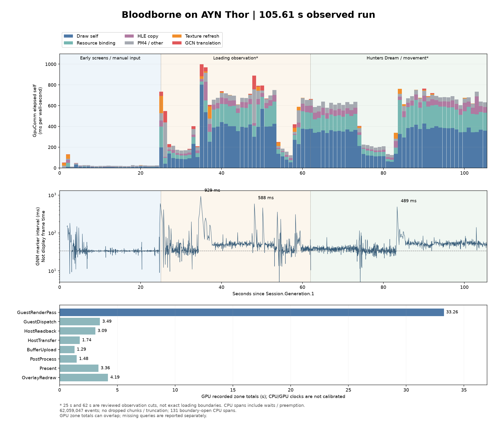

# 血源完整启动采集与 texture upload 评估（2026-09-26）

## 当前状态

已完成最新主干同步、AYN 安装身份核验和血源连续 LiteP 采集。用户手动推进菜单、选择继续并移动角色；截图确认进入猎人梦境。原始 PROF 覆盖 105.610 秒有事件的观测区间，62,059,047 个事件已完整解码。上传实现未改，本轮用于选择优化方向，没有性能 A/B 或提速声明。

主要结论：**纹理刷新存在少量长尖峰，但不是这段 GpuComm 累计开销的大头；优先检查首次 shader/pipeline 创建，其次分解持续的 Draw/资源绑定和 GPU render pass 开销。** 两次 compute dispatch 分别阻塞 GpuComm 320/326 ms；对应 GCN 翻译约 92/95 ms，日志和源码将其余约 228 ms 指向同步 pipeline 创建路径，尚缺独立 native pipeline scope 才能精确定量。整段 Texture.Refresh 仅 748 ms，进入场景后的单次 P95 为 0.224 ms。

图中 25 秒、62 秒是结合人工输入和截图选取的观察分段，**不是游戏内部精确加载边界**。CPU 是 elapsed scope；GNM 间隔不是显示帧时间；GPU zone 使用独立未校准时钟。

## Rebase 与恢复

- 分支：`codex/tetris-runtime-fix`。
- 原 HEAD：`31d4136c98a73a9b37b104515c5790026cf68113`。
- 已查询远端分支，没有 `master`；按本仓用户指定主干 `origin/malos/main` 更新。
- 新 HEAD：`b4972cbdf8231eed2111b21b71661f4194bf54cb`；原 HEAD 是其祖先，没有独有提交需要重放。
- Foundation 按主仓 gitlink 更新到 `d487242023e6899f680717d263cf35c7c1f9e6c2`，保留原本 `ProfilerRing.h` SDK 身份修正。
- Kosmickrisp 按 gitlink 更新到 `3af112680499cc5eaf519007404a7366679e1c7f`，嵌套 Mesa 到 `dc41592aa23b167da30aa66d1f36012d89961d69`。原配置的 Chromium remote 取不到该提交，改从该层 `.gitmodules` 声明的 `https://github.com/shadexternals/mesa.git` 精确 fetch 提交；未改 remote 配置、未跟踪任意远端最新版本。
- 主仓 stash 恢复仅 `AGENTS.md` 顶部冲突，保留新主干入口和原 Tetris 入口。27 个原本本地文件，16 个恢复后字节相同，11 个与主干合并，0 个缺失；全部恢复为 unstaged，未 commit/push。
- 备份目录：`build/rebase-upload-backup-20260926-204554/`，含原工作区归档、主仓/暂存区/Foundation 补丁、恢复清单。主干移除的旧干净 spdlog 目录保留于其中 `retired-spdlog/`。
- 主仓 stash `b9343a4826f8fdf3baf08c9824e79e7b3c2ab6ef`、Foundation stash `d088830ee2db0cd30e5a0ee4dbe398412d72f3e8` 均保留。

Android API33 / arm64-v8a / RelWithDebInfo 的 `shadps4_host` 已编译、链接成功。新主干 #5062 需要本机 glslang，已先构建 `cmake/host-tools`，再通过 `HOST_SHADER_COMPILER` 指向该产物；该构建配置不需改源码。构建日志在 `build/rebase-upload-{host-tools,configure,build}.log`。

原有 `liverpool_order_tests` 在重编时发现 `liverpool.h` 缺少 `std::function` 的直接 `<functional>` include（此前由间接头文件提供）；已补直接 include，没有运行逻辑改动。最终 host、`liverpool_order_tests`、`debug_pad_tests` 编译/链接通过，playstoreDebug APK 也构建成功，`git diff --check` 通过。测试程序未在 Android 运行，不把构建通过计为测试通过。最终构建日志为 `build/rebase-upload-contract-build.log` 和 `build/rebase-upload-apk.log`。

构建身份保留于 `build/validation/bloodborne-startup-20260926/build-identity.json`，同目录保留最终 APK：

- APK SHA256：`7f7ab9557a59795ce54830835d4092191d36b4de918156afc9c6a7fb9954e349`。
- host SHA256：`cffae94c2bb931302e3573dfdf3038ccb612405ee9081ea48fbdd4e92d465639`；APK 内 host 与本地 host 全文件 SHA 相同，Build ID `728e21d25a5c1b7eb6b62579f37cc0ca62826c2d`。
- APK 内 JNI SHA256：`7ea201f9600b13f673b9689ae5d1be80f20e778a53018ef6e8e0b099ae2d2396`。
- Foundation 当前 SDK 子树 `c1204a4ae4b5202c5bb682e60609994030916995` 与 reader 对应的导入提交 `b6797a098adedbba23ab35a15a83cc146736c24d` 完全一致。此 APK 已安装 AYN 并核对设备 APK SHA；运行身份见下文。

## 新主干上传路径：代码事实

| 环节 | 当前执行方式 | 待采集判断 |
| --- | --- | --- |
| `Texture.Refresh` | GpuComm 检查脏区/mip 内容；必要时结束 render pass | 主线程耗时与 pass 切断是否集中在卡顿窗口 |
| `Texture.Stage` | CPU 数据经 `CopySparseMemory` 同步快照到 staging；若源区由 GPU 修改，则使用真实 GPU buffer | CPU 拷贝量、内存跟踪和数据来源，不能把 GPU 新数据替换成 Guest RAM |
| staging pool | 16 MiB ring block，不等忙 block 完成；空间不足可新增 block，大块也按完成 tick 复用 | 是否出现内存峰值或大量分配；不能把正常 staging 请求误称为 GPU fence wait |
| `Texture.Detile` | 同一 graphics queue 上的 compute；每次 `GetScratchBuffer` 建 VMA 临时 buffer，完成后延迟销毁 | 临时分配/参数 stream 回绕等待是否显著；可考虑池化，但尚无本轮性能证据 |
| `Texture.Upload` | 同队列录制 copy/转换；缩放路径可能创建原尺寸临时图，再 blit/编码 | GPU 时间、临时图分配和重复上传量 |
| Vulkan recorder | 已有可选 `shadPS4:VkRecord` 录制线程和 pass 提前，默认关闭 | 是否值得用已有 `vk_recorder` 做同场景对照 |

普通 `RefreshImage` 上传链没有逐次 `scheduler.Finish` 等 GPU 完成。当前设备初始化只请求一个 graphics queue，上传与 draw 保持同队列依赖；“GPU 命令已异步提交”不等于“CPU 快照/分配已搬到后台”，也不等于“GPU copy 与 graphics 并行”。

独立队列方案还需处理 compute 解平铺、源快照与 Guest 写入顺序、资源 generation、首次使用依赖、image layout/queue ownership 和 staging 生命周期。下面的实采尚不足以支持直接重构成独立 transfer queue。主干对上游 #5100 的移植边界见 [稀疏 arena 记录](sparse-arena-port-20260926.md)。

代码入口：`src/video_core/texture_cache/texture_cache.cpp`、`tile_manager.cpp`、`image.cpp`、`src/video_core/buffer_cache/buffer_cache.cpp`、`src/video_core/renderer_vulkan/vk_staging_buffer_pool.cpp`、`vk_scheduler.cpp`。

## 本轮采用的采集协议

1. 确认设备所有权、当前进程/游戏、APK/host/JNI 身份、驱动、渲染倍率、前台 cpuset、诊断开关与可用内存/存储。先保全当前配置和存档；AYN 还需核对 上一轮本地清理记录（`docs/validation/android-native-host/tetris-gfx-order-20260926.md`，本次未提交） 的 CleanupPending，不能照旧记录盲目覆盖当前驱动或配置。
2. 使用当前 LiteP `0.3.0-local.20260926.insights2`。为真实新 PID 注册 target，确认 runtime SDK 身份与 `non_frame_capture=1`。
3. 冷启动前保存并设置 `debug.shadps4.profile_startup_seconds`，现有入口允许 1–600 秒、512 MiB 的连续文件采集。它覆盖 native host 初始化之后、Prepare 之前的阶段，不覆盖 ART/进程创建。确认进入 `recording`，跟踪字节/时间上限，禁止把末尾 ring dump 当完整启动。
4. 从血源启动、真实菜单、选择继续、存档载入到进入实际场景持续记录。同步保留截图、输入回执和时间；只按证据界定阶段，`sceGnmSubmitDone`/FrameMark 不当作已显示游戏画面。
5. 进入场景并取得短稳定观察后正常停止，按确切 PID/capture ID 拉取原始 PROF 与 sidecar。核对 SHA、footer、丢失事件、截断和 session 边界；恢复启动属性及自有采集/输入资源。
6. 使用后台 stage reducer 分析整段及有证据的启动/加载区间，再在长帧窗口比较纹理上传、shader 编译、存储、Guest HLE、GpuComm、VkRecord、提交/完成等待与 GPU zone。超过内存导入阈值的 PROF 走索引或 reducer，不展开整段数千万事件。
7. CPU scope 是 elapsed time，未插桩区间不是 idle。若需判断 on-CPU、调度等待或 KGSL 执行，另采有界 scheduler/KGSL sidecar；不得从原始 PROF 虚构调度数据或未校准的 CPU/GPU 时间对齐。

启动语义由 `Startup.Prepare`、`Startup.ModulesAndServices`、`Startup.GuestBootstrap`、`Startup.GuestMallocInit`、`Startup.ModuleInit.*`、`Startup.GuestEntry` 和真实首个 present 标记提供。本轮按时间区间分析，不将用户等待输入时间算成模拟器加载时间。

## 实机、文件身份与完整性

证据根目录为 `build/validation/bloodborne-startup-20260926/run-ayn/`（下文简称 R）。

| 项目 | 本轮值 |
| --- | --- |
| 设备 | AYN Thor `9c2841a4`，Adreno 740，Android API 33，16 GB RAM，4 KiB 页 |
| 游戏 | Bloodborne The Old Hunters Edition，CUSA03023；存档 namespace CUSA01363 |
| 运行 | PID 9560 / generation 1 / UUID `de80dbf1590f478b7c37211ed74b6269` |
| 驱动 | Turnip mainline `86ca472fc2`；SHA `ea4853bf58cdee3d49369706249090899cb4ebb17b8f0ca23685918912f0b6a1` |
| 设置 | 内部倍率 0.5 / High；async_submit=1；VkRecord 关闭；未改锁频，采集末 `/top-app` |
| LiteP | `0.3.0-local.20260926.insights2`；SDK `b6797a098adedbba23ab35a15a83cc146736c24d` |
| PROF | `R/capture/9c2841a4-9560-file-1790429150734619-1.prof`，512,361,310 B |
| PROF SHA256 | `5ad196fa588e5d223343896b890328072e8df984ff46c679cfdcb68a86b25dd2` |
| 容器 | PROF v3，5,673 chunks，0 gap markers，footer 存在，0 trailing bytes，未截断 |
| 解码 | 62,059,047 events；29,971,659 个结束的 CPU scopes；131 个在采集边界未结束的 scope；0 unmatched ends |
| GPU 原始记录 | 3 contexts，503,942 对 zone begin/end，1,007,884 timestamps，0 orphan times |

预启动连续文件采集在 Library host 初始化时开启（300 秒 / 512 MiB 上限），在 Guest Prepare 前已启用；按用户要求主动停止，未触及上限。Header 早于第一个 Guest 事件约 84 秒，这段 Library 等待不计为血源启动开销。零点是 `Session.Generation.1` 的 CPU timestamp `1165171427308983 ns`，末事件为 `1165277037703097 ns`。

内置 stage job `917a75148b6045fba55f981f7e3e1cc0` 遇到 50M event 上限。索引 job `d00cddbd6a724fa8a688cfbc4cf44de0` 在 253,952 events 已生成约 176 MB JSON，故停止该索引路径，保留原始文件，使用**同一版本 SDK reader 的有界流式聚合**完成整段：`R/analyze_full.py`、`full-analysis.json`、`summarize.py`、`summary.json`。聚合上限 100M events / 2M cells / 500K retained scopes，未修改 SDK 或原始事件；校验每物理线程每秒 self 总和不超过 1 秒。解压 payload 为 1,486,927,467 B，保留在 `R/analysis.payload`。可复核的小摘要和绘图脚本另存 [证据目录](bloodborne-startup-upload-20260926/)。

GPU runtime 的 `gpu-end.txt` 报 `calibrated=0`、estimated alignment、deviation 8.16 ms、dropped_zones=4983、discarded=7、dropped_batches=0、errors=0；它包含 PROF 停止后的少量尾部，不能等同于文件内精确计数。**容器没有丢 chunk，不代表每个 GPU zone 都被采样。** 报告仅统计已保留的 GPU zone，不画精确 CPU/GPU 重叠关键路径。GPU elapsed 也可能包含 semaphore/memory wait。

`collect_capture` 的三个额外 emulator status 参数误用了纯文本而非 JSON，sidecar 保留原始错误；核心 PID/SDK/build 身份和原始 PROF 可用，额外状态已独立保存为 `recorder.txt`、`gpu-end.txt`、`status-end.txt` 等，未伪造 sidecar 成功状态。

## 阶段与卡顿窗口

| 阶段 | 相对 Session 起点 | 证据与解释 |
| --- | --- | --- |
| Native Prepare | 0.000034–0.193556 s | 193.522 ms；其中 ModulesAndServices 133.954 ms |
| Guest bootstrap / entry | 0.193580–0.197195 s | bootstrap 3.612 ms；约 197 ms 已进入 Guest |
| 首次 Guest present | 1.849299 s | 真实 runtime 标记；不保证已经是可见菜单或非黑画面 |
| 提示页 / 菜单 / 人工推进 | 约 1.85–25 s | 用户确认手动操作，不将按钮间等待归因于加载 |
| 加载观察窗口 | 约 25–62 s | `03-boot.png` 为加载卡；人工操作与素材/绘制负载可能交错 |
| 猎人梦境 / 人工移动 | 约 62–105.61 s | `04-loading.png` 文件名沿用旧称，实际截图为“猎人的梦境”及角色 |

截图主机时钟与设备时钟相差约 2.57 秒，已用同次开机的 CNTVCT/MONOTONIC/REALTIME 有界采样对齐（`clock-anchor.json`、`clock-relation.json`；adb 往返约 62 ms）。这是 CPU 时钟关系，**不是 GPU calibration**。用户与启动 UI 操作有时间重叠，首个 Guest 运行以 runtime 标记为准，不采用 automation tap 时间作为起点。

2,372 个 GNM FrameMark 给出 2,371 个完整相邻间隔：P50 **36.894 ms**，P95 **64.232 ms**，最大 **929.167 ms**。它们反映 Guest 提交节奏，不能转换为已显示 FPS。

| 长 GNM 间隔起点 | 间隔 | 同窗 CPU 证据 |
| --- | ---: | --- |
| 24.877 s | 597.028 ms | Texture.Refresh 71.459 ms（Stage 49.805 ms），HLE.CopyShader 52.640 ms，同时有多个 Draw/Dispatch |
| 25.677 s | 412.456 ms | 单次 Dispatch 320.414 ms；其中 GCN 翻译 92.443 ms，dispatch self 227.782 ms |
| 34.873 s | 929.167 ms | 多个 20–57 ms Draw；不能由一个纹理上传或一个 GCN 翻译解释 |
| 48.113 s | 588.467 ms | Dispatch 108.166 ms 和 326.204 ms；后者含 GCN 翻译 95.297 ms，另有 Refresh 36.677 ms |
| 50.179 s | 461.217 ms | 多个 30–48 ms Draw；需继续拆分 pipeline/driver/其它 self |
| 83.390 s | 488.520 ms | Draw 84.074 ms，其中 BindResources 72.079 ms；仍有未归因部分 |

两个最重 compute dispatch 对应的首次 shader/pipeline 日志：

| Guest CS / pipeline | 同一 GpuComm 日志顺序 | 判断 |
| --- | --- | --- |
| `0x42f2a521` / `0x42f8e4a112a` | 21:27:40.571 编译 shader → .663 创建 pipeline → .895 下一条 GpuComm 工作 | 与 92 ms GCN 和约 228 ms dispatch self 一致 |
| `0x2da7fe60` / `0x2db0d5007ff` | 21:28:03.107 编译 shader → .203 创建 pipeline → .431 下一条 GpuComm 工作 | 与 95 ms GCN 和约 229 ms dispatch self 一致 |

源码 `PipelineCache::GetComputePipeline` 在 miss 时直接构造 `ComputePipeline`，后者同步 `createComputePipelineUnique`；同窗 Texture 子 scope 仅约 0.04/0.015 ms。因 native pipeline 创建尚无独立 scope，日志间隔还可能含其它工作、调度或日志成本，**不能把这 228 ms 全部宣称为精确的 Vulkan 编译时间**。但是这两次长停顿应先沿 pipeline 创建路径处理。

## CPU 与 GPU 的持续开销

以下 CPU 为物理线程 10668（`shadPS4:GpuComm`）**已结束 scope 的 elapsed self**，总计 45.536 秒；会包含线程被抢占的时间，不是 simpleperf on-CPU。父子 inclusive 不相加。

| CPU scope | 次数 | inclusive 累计 | self 累计 | 单次最大 |
| --- | ---: | ---: | ---: | ---: |
| Rasterizer.Draw | 1,442,221 | 36.190 s | **24.748 s** | 84.074 ms |
| Rasterizer.BindResources | 1,512,181 | 11.631 s | **11.192 s** | 72.079 ms |
| HLE.CopyShader | 73,088 | 3.969 s | 3.510 s | 113.446 ms |
| GPU.CompileGuestShader | 388 | 0.679 s | 0.679 s | 95.297 ms |
| Texture.Refresh | 4,974 | **0.748 s** | 0.013 s | 81.404 ms |
| Texture.Stage（Refresh 子项） | 4,974 | 0.420 s | 0.420 s | 49.805 ms |
| Texture.Detile（Refresh 子项） | 4,974 | 0.279 s | 0.279 s | 76.031 ms |
| Texture.Upload（Refresh 子项） | 4,974 | 0.036 s | 0.036 s | 7.947 ms |

Draw 与资源绑定 self 占该线程已记录 self 约 **79%**。Draw self 还含 pipeline 创建等未单独插桩的路径，不等于纯 `vkCmdDraw` 成本。Refresh inclusive 占约 **1.64%**，这仅是记录 scope 的占比，不能据此承诺整体 FPS 增益。Buffer.Upload 累计 132.94 ms；inflight budget wait 总计 1.38 ms，present-frame fence wait 81.59 ms，当前证据不支持“每张纹理等待 GPU 完成”是主因。

| 区间内完整 scope | Refresh 次数 / 累计 | Refresh P95 / 最大 | GCN 次数 / 累计 |
| --- | --- | --- | --- |
| 25–62 s 加载观察 | 2,820 / 465.548 ms | 0.196 / 81.404 ms | 325 / 636.223 ms |
| 62–105.61 s 场景观察 | 2,073 / 179.044 ms | 0.224 / 13.945 ms | 17 / 27.923 ms |

表格按完整包含于区间的 scope 统计，跨边界 scope 不强行拆分；图和粗粒度阶段 CPU 分类使用 1 秒 bin，边界按比例分配，不能与上表精确相加比较。`Texture.Detile` 包含 scratch VMA 分配、参数 stream 写入/回绕、首次 tiling pipeline 创建及命令录制，76 ms 尚不能单独归给分配或 GPU 解平铺。`TileManager::CreateTilingPipeline` 当前使用 `VK_NULL_HANDLE` pipeline cache，特化 pipeline 在进程内缓存，值得先拆测首次创建。

GPU 下表为原始 PROF **同 context 的成对 timestamp 差值**；列出了主要类别，嵌套总项不加入。无 CPU/GPU 时间对齐或总和等于 wall time 的假设。

| GPU zone | 保留次数 | 累计 | 单次 P95 / 最大 |
| --- | ---: | ---: | ---: |
| GuestRenderPass | 240,702 | **33.261 s** | 0.665 / 4.111 ms |
| GuestDispatch | 28,357 | 3.492 s | 0.905 / 2.481 ms |
| HostReadback | 2,152 | 3.086 s | 1.807 / 1.989 ms |
| HostTransfer | 13,289 | 1.744 s | 0.677 / 9.834 ms |
| BufferUpload | 194,925 | 1.285 s | 0.0148 / 3.425 ms |
| PostProcess | 2,311 | 1.481 s | 0.692 / 0.985 ms |
| Present | 2,373 | 3.355 s | 1.970 / 2.577 ms |
| OverlayRedraw | 3,043 | 4.185 s | 2.006 / 2.553 ms |

GPU 记录中 render pass 明显最多；HostTransfer 并非最大项。OverlayRedraw 总计 4.19 秒，值得评估无新 Guest 帧时的额外重绘，但没有对照前不归因为卡顿根因。嵌套 GuestCommands/DrawBatch 累计分别 45.55/47.05 秒，不能再加到此表。GPU.GuestFrame counter 是 retire 时汇总的 GuestCommands 时间，场景窗口完整秒 bin 样本均值约 26.56 ms；它不是与 CPU 帧精确对齐后的关键路径。FSR zone 整段仅 1.68 ms，即使设置保留 true，也不宣称 FSR 有实质运行负载。

读取工作线程 10692 的 `HLE.sceKernelRead` 为 50,013 次 / 4.186 秒 / 最大 10.366 ms；存在大量素材读取，但没有观察到单次数百毫秒的 read。读后解压、Guest 执行和任务依赖没有完整 on-CPU 采样，不能据此排除存储/Guest 工作的整体影响。

## gettimeofday 当前实现与意义

**Android/FEX 此入口是宿主 HLE，尚无 Guest 内取时快路径。** `src/core/host_runtime/guest_runtime.cpp:2673` 绑定 POSIX NID `n88vx3C5nW8`；`ejekcaNQNq0`（sceKernelGettimeofday）也复用该实现。路径是 Guest 调用 → HLE FunctionAdapter → 校验输出 Guest 地址 → `GuestClock::Read(ORBIS_CLOCK_REALTIME)` → 宿主 `clock_gettime(CLOCK_REALTIME)` → 以秒/微秒写回 Guest。timezone 参数存在时写 session UTC。`guest_clock.h:78` 是实际取时；`InstallSyncFastPath` 当前只替换 mutex/self 入口，不包含时间函数。

主 Guest 执行 owner 的物理线程 10611（trace 名称 `shadps4.android`，runtime 为 Guest-1）记录 **18,267,329 次 / 6.704 秒**，均值约 **367 ns/次**。其它线程合计后为 18,387,332 次 / 7.396 秒，后者是跨线程累计，不能当关键路径。主线程约 4.804 秒发生在 1.85–25 秒提示/菜单阶段；加载观察约 0.963 秒，场景观察约 0.882 秒（1 秒 bin 分段近似）。

计时 scope 在 `FunctionAdapter::Invoke` 内，**没有覆盖完整 Guest↔Host 往返成本**，也没有证明 libc 取时每次陷入内核。频率支持“先找调用点、判断定时/帧率轮询”的方向，尚不能证明 busy-wait 的具体语义。该主线程入口就产生约 3,653 万条 begin/end，占文件事件约 59%；采集自身开销未做 A/B，6.704 秒不是可直接回收的时间。若后续做 Guest 快路径，需保持 REALTIME 的时间语义及安全写回，而不是直接用未经换算的 RDTSC 替代。

## 优化顺序与本轮决定

1. **先拆分首次 pipeline 成本。** 给 native graphics/compute pipeline 创建与 tiling pipeline 创建增加独立 scope；核对现有缓存/预加载为什么未覆盖两个重 CS。根据命中、创建与等待分别计时，再选择预热、持久化缓存或提前异步准备。仅把“首次需要时立即创建并等待”搬到 worker，仍可能卡在同一个首次使用点。
2. **纹理先处理少量尖峰。** 区分 staging 快照、scratch 分配、tiling 首编、参数 stream 等待；证实分配占比后再池化。保持 CPU/GPU 数据来源、快照时刻、generation 和完成 tick 的合同。没有证据支持此时整体改成独立 GPU transfer queue。
3. **持续帧开销沿 Draw/绑定与 render pass 两条线。** CPU 先拆 Draw self 与 BindResources；可用已有 recorder/pass hoist 在固定视角做有界 A/B。GPU 再看主要 pass 的 shader/附件/回读。当前提交 worker 已开，VkRecord chunks/commands 都为 0；异步提交和后台 CPU 录制不是同一功能。
4. **gettimeofday 独立检查轮询调用点。** 它主要集中在菜单，先观察调用语义和真实边界成本，避免因为总次数大就当作加载首要瓶颈。OverlayRedraw 也保留为独立验证项。

本轮交付分析与证据，没有实现上述生产优化，也没有再次采集或重启游戏。首次编译、纹理尖峰和持续 GPU 开销是不同问题；单次 trace、未校准 GPU 时钟、缺少 scheduler/on-CPU sidecar 以及高频插桩开销限制了进一步因果结论。

## 设备与数据收尾

安装前保存 `before.apk`、`settings-saves-before.tar`、数据库备份和 52 文件 SHA 清单；安装后核对完整 APK SHA。没有清空 shader cache、存档或游戏内容。采集结束恢复 `debug.shadps4.profile_startup_seconds=0`、GPU timing off，resident ring 保持原有状态；TracerPid=0，无 debugger/adb forward 或持有输入。

按旧 Tetris 记录移除了自己添加且无效的 `readback_linear_images_enabled` 配置键，其余 host config 逐字节恢复原备份；保留用户当前 mainline 驱动属性。只完成了这项明确的旧清理，不代表旧 Tetris 全部 CleanupPending 已处理。

末次核对 52 文件无新增/删除，仅血源 `userdata0000`、`backup0000`、`userdata0010`、`backup0010` 随用户推进发生变化；settings/shared_prefs 未变。**游戏按用户控制留在 Running，故该清单是运行中快照而非最终存档状态**，未回滚正常进度。原始 PROF、截图、日志、脚本和备份均保留，无 commit/push。
