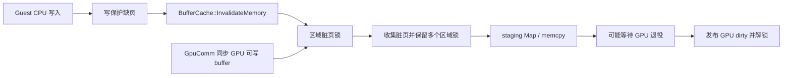

# Buffer Cache 的 CPU/GPU 职责与 Azahar、Citron 对照

日期：2026-09-20。范围：当前本地源码的只读对照；不是上游最新版评测，也不是三个模拟器的性能排名。shadPS4 的实测及本轮修复见 [血源缓存锁报告](bloodborne-buffer-tracking-locks-20260919.md)。

> 后续状态：本文描述 f8d264e5 检查点。锁外预留/重查/快照以及 fault 侧容器访问拆分已在新分支落地，见 [实施与验证](buffer-upload-unlock-20260920.md)。以下源码现状和待办保留为拆分前的审计记录。

## 结论

CPU/GPU 脏标记共同描述同一份 guest 内存的数据一致性，这个关联必须保留；CPU 缺页路径与 GPU 上传资源的分配、退役等待共用长临界区，则是可以且应当拆开的实现耦合。

shadPS4 当前不是一把 `BufferCache` 全局 mutex：它原来按 **4 MiB 地址区域**共享 `RegionManager::lock`，Android 又使用纯自旋。一次 GPU 可写 buffer 的同步会同时保留查询范围内的多把区域锁，跨过整个上传回调。落在其中的 CPU 写线程，即便写的是不同的 4 KiB 页面，也要等待。因此它具有“局部范围内的全局锁”效果，还会通过 guest 的任务完成等待扩散到主线程。

本轮 Android 改为 **256 KiB 分区 + futex**，修复的是错误扩大竞争范围和空转 CPU，**尚未把上传分配/GPU 等待移出临界区**。下一步不应只继续换锁类型。

## 对照身份和入口

以下均为本机工作树；所列源码在检查时相对各自 HEAD 无修改。文件 SHA 和绝对路径见本轮证据目录的 `reference-sources.json`。

| 项目 | 本地 HEAD | 主要入口 |
|---|---|---|
| Azahar | `254bff35e0d8ced97e6cc73f7a59be045798c60c` | `src/video_core/gpu.cpp`、`gpu_thread.cpp`、`rasterizer_cache/rasterizer_cache.h`、`renderer_vulkan/vk_rasterizer.cpp` |
| Citron | `3da08ee52defc5003d23683b0c233b0dac88722f` | `src/video_core/buffer_cache/{memory_tracker_base.h,buffer_cache.h}`、`renderer_vulkan/{vk_rasterizer.cpp,vk_staging_buffer_pool.cpp}` |

Azahar 根目录：`/Users/bytedance/workspace/emulations/3ds/azahar`。
Citron 根目录：`/Users/bytedance/workspace/emulations/switch/citron`。
本轮没有修改这两个仓库，也没有复制它们的源代码。

## Citron：独立的 staging 退役管理，但仍有缓存粗锁

1. `MemoryTrackerBase::ForEachUploadRange` 只枚举和更新脏页。`BufferCache::SynchronizeBuffer` 收集 copy 列表，再调用 `MappedUploadMemory` 申请 staging、复制数据、记录 GPU copy。这里没有 shadPS4 那种跨 `on_upload` 持有区域锁的接口。
2. **不能由此推断它无锁或天然并行。** `RasterizerVulkan::OnCPUWrite`、失效/回读，以及 draw 配置路径仍取得 `buffer_cache.mutex`；它是一把 `std::recursive_mutex`，部分路径还同时持有 texture cache mutex。直接照搬这个锁模型可能使 shadPS4 更粗。
3. 值得借鉴的是 `StagingBufferPool::Request`：当前默认 frame arena 分配失败后使用独立 staging pool；旧 ring 路径发现区域仍在使用也转向 pool。pool 只复用已退役的块，没有可复用块则创建新块，正常耗尽路径不等旧 GPU 工作完成。arena 模式切换时有一次 `scheduler.Finish()`，不能说全实现没有等待。
4. `core/memory.cpp::HandleRasterizerWrite` 可收集每核写入范围；GPU dirty 情况下合并延迟失效。它知道被拦截写入的地址和尺寸。`SynchronizeBuffer` 还从 CPU 上传范围中剔除 GPU 拥有的最新数据区间，避免拿旧 RAM 覆盖 GPU 结果。
5. 其异步模式还有按 accuracy 放宽 flush 的策略。这不是可直接迁移的 PS4 正确性依据，不采用“省略必要回读”的捷径。

**可迁移原则：** staging 复用由提交/退役 token 管理，容量不足不应让 CPU 脏页锁替它承担背压；CPU 写入记录、renderer 缓存对象、GPU 内容所有权分别管理。

## Azahar：范围依赖与延迟失效，也仍有显式串行边界

Azahar 的主要等价物是 `RasterizerCache` 的 surface/dirty-region 系统及 Vulkan stream buffer，不是与 PS4 一一对应的 storage-buffer cache。

1. `GPU::InvalidateRegionAndExecuteCPUWrite` 把 CPU 写操作放进有顺序的事务；没有相关未完成命令时，调用 `OnCPUWrite`、实际写入，再收集待失效范围。后续消费这些范围，而不是每次写入都完整遍历缓存。
2. `GpuCommandExecutor::AnalyzeDependency` 根据已接受命令的读写区间求依赖 fence。Flush 检查写者；Invalidate 还检查读者。已知不重叠时有直接分支，存在重叠时只等相关边界；范围未知或历史被淘汰时保守等待。
3. `RasterizerCache::FlushRegion` 没有 GPU dirty 命中即返回；真正回读从下载范围中扣掉 `pending_cpu_writes`，保护较新的 CPU 数据。CPU invalidation 与 GPU render-target owner 更新分开处理。
4. **它也不是无锁设计。** `ExecuteSerialized` 在依赖解析和动作期间保持 `submission_mutex`，约束后续命令的接受顺序；rasterizer 有 `state_mutex`，某些分支还有 `pica_mutex`。这里的 executor fence 表示主机命令执行边界，不能当成物理 GPU 已完成；GPU completion 另由 Vulkan scheduler/timeline 管理。stream buffer 重用也仍可能等待 GPU。

**可迁移原则：** 区分“命令已接受”“上传快照已形成”“GPU 已完成”；按真实访问范围表达依赖，记录为何等待，不能仅把“缓存失效”作为整条 GPU 队列的屏障。

## 为什么 shadPS4 的 CPU 和 GPU 会在这里碰到一起

这里的 CPU/GPU 有三种不同含义，分析时必须分开：

| 对象 | 含义 | 应由谁持有 |
|---|---|---|
| CPU dirty | guest RAM 比 host 缓存更新，下一次 GPU 使用前需要上传 | guest 写入通知与短时一致性元数据 |
| GPU dirty | host GPU buffer 比 guest RAM 更新，CPU 读取前可能需要回读 | renderer 的内容所有权和相关完成 token |
| 上传区退役 | 某段 host staging 仍被已提交 GPU 命令读取，尚不能复用 | 上传分配器与 GPU timeline |

前两者是**数据版本关系**，第三者是**host 资源生命周期**。把三者置于同一把锁下并不增加 emulation 精度，只会扩大等待范围。

当前路径可以写成：

这张图表达源码中的依赖可能性；没有把一次采样中的所有 wait 都证明为同一把锁，也没有测得具体哪次持锁跨过了 GPU wait。

还有两处需要纳入下一轮审计：

- `Rasterizer::InvalidateMemory` 顺序调用 buffer cache 和 texture cache，后者有整个 cache 的 `mutex`；本轮并未证明它是新的主要瓶颈，不能因修复一层就宣称缺页路径已完全并行。
- CPU 缺页入口的 `IsRegionRegistered` 读取 `buffer_ranges`，renderer 的 Register/Unregister 修改同一个 `SplitRangeMap`。所查路径中没有看到配对的容器读写同步；allocator 的内部 mutex 不保护 interval tree。这是明确需要核实/修复的跨线程所有权边界，尚无本轮崩溃或 TSan 证据可归因于它。

## 推荐的后续落地顺序

### 1. 先将上传等待移出脏页临界区

- 在锁外预留可写 staging 容量；采用已退役块、受预算约束的备用块，或锁外等待。
- 拿到容量后再取得相关区域锁，重新检查脏页和内容版本。容量不足就释放锁后扩容/重试；不能清掉脏标记后才发现空间不够。
- 锁内只完成必要的页面保护、快照复制和脏状态交接，随后解锁。命令记录、Vulkan 分配、提交和退役等待不得通过任意回调进入这一临界区。
- staging 必须同时满足 **GPU 完成 + 对应 host submit 已返回**才可复用，沿用现有 async-retirement 修复，不能退回单纯 GPU tick 判断。
- 需要有内存预算和有界背压；不能用无限新增 staging buffer 换取表面上的无等待。

### 2. 再明确 CPU 通知与 renderer 所有权

- guest fault 侧只操作稳定发布的页/区域描述和写入状态，不遍历 renderer 正在修改的资源容器。
- renderer 持有 buffer/texture 对象、命令列表和退休列表；CPU dirty 可按区域合并，在消费边界处理。
- 实际 CPU 读取 GPU dirty 数据时，用范围相关的请求/完成事件等待，在元数据锁外等待；后来的 CPU 写入必须使旧回读失效，不能被它覆盖。
- 当前 shadPS4 是“解除页保护后重试 guest 原指令”；同页其他线程随后可直接写入。不能把一次缺页通知当作已完成写入事务，也不能仅用原子 dirty 位便假定快照一致。设计需给出页保护、写入代次、快照和 GPU ownership 的完整交接规则。

### 3. 用等待原因验证，而不是只看 FPS

增加可选、低开销的竞争记录：区域地址、等待者、持有者、锁等待/持有时长、上传字节数、staging 命中/扩容、提交 token，以及是否需要回读。高频 fault handler 内不要写普通日志、分配内存或做堆栈展开。

结合 Litep 同一帧窗口及 KGSL/sched，区分锁竞争、快照复制、容量背压、真正 GPU 执行和 guest 自身任务等待。跨帧 span 必须裁剪贡献而保留完整因果身份；匿名 JIT PC 还需 exact-build guest 映射。

本轮只完成第一层的分区/futex 修复和上述源码对照；没有把这些后续设计标成已经实现。
