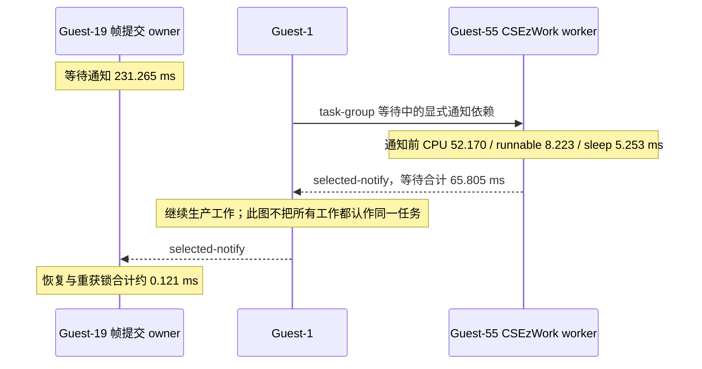

# 锁拆分后：血源诊所场景 Litep / KGSL 卡点分析

日期：2026-09-20。实现版本 `e7b07801`，分支 `feature/malos/hle_vr`。承接 [上传锁拆分](buffer-upload-unlock-20260920.md)。本报告分析人物和诊所已经可见后的运行，不能用 loading 的帧率代表游戏场景，也不能把 native 单独采样当作完整等待链分析。

## 结论与优先级

当前首先应继续定位 **Guest-1 的角色/行为任务阶段及 CSEzWork worker 的实际任务主体**。GNM 帧 owner Guest-19 的主要等待发生在通知之前；它等 Guest-1，Guest-1 又等待 task group 的 worker。通知之后恢复、重获锁很快，缩短 condition/epoll 的语义等待不解决这段生产工作。

同次采集成功上屏约 **4.272 FPS，平均间隔 234.061 ms**；GPU.GuestFrame 的 40 个有效计数样本平均 **87.084 ms**，P95 96.345 ms，最大 104.782 ms。GPU 也有明显成本，但不能独自解释帧产出间隔。两者会重叠，不能相减后把差值全算 CPU，也不能把 GPU elapsed 当成 shader 独占执行或利用率。GPU query 未做可信跨时钟校准，不强行指定它属于某个 CPU 帧。

采集开启 profile_sync、GPU timing 和 ftrace，会产生诊断扰动；**4.272 FPS 不是与此前普通运行 5.695 FPS 的优化 A/B**。本轮没有新增生产优化或声称血源性能问题已修复。

## 有效采集身份与质量

采集前已检查 [人物和诊所画面](evidence/buffer-upload-litep-20260920/scene-check.png)，采集期间没有注入自动输入。[场景复查](evidence/buffer-upload-litep-20260920/scene-after.png)及最后 Stop 对话框后的背景仍是该场景。

| 项目 | 本轮有效数据 |
|---|---|
| 设备/配置 | AYN Thor；Turnip `5ac41be677`；Bloodborne CUSA03023/01.00；0.5 / High 1×1 / FDM OFF |
| APK / host | `c14cf608` / `0d272251`，完整 SHA 沿用实现报告 |
| 运行 | PID6163 / generation2 / UUID `cb7f937ed48da57e5332fde966b3484e` |
| Litep | 已安装 `0.2.0-local.20260919.bottleneck3`，通过真实 stdio JSON-RPC 调用；SDK `e00321e` / engine `4f5a316` |
| PROF | capture **2**，18,434,512 bytes；SHA `b575d658ef5652d7e2d2f89543a02a34d6064971bd96c80fe6e85b67b078870a` |
| 解析 | 2,238,786 events；222 chunks、0 skipped；42 个完整 source 帧；421 对 GPU zone、0 orphan |
| 联合窗口 | `[617689749118570, 617699724719143)`，完整覆盖 **9.975600573 s** |
| KGSL/sched | 24 s、384 MiB 总预算、独立 instance；SHA `da9be3aeff959bb15a191c98eeb6a30620c1935c50628b134beaff0be285605f` |
| 调度/时钟 | overrun0、dropped0、scheduling_complete；CNTVCT/mono 双锚点，不确定度 1109 ns |

PROF 容器完整，但采集边界仍有未配对 CPU scope，因此保留 `truncated=true`；不声称全局无损。KGSL 有 1,887 条 zero-timestamp batch 观察，解析器没有强行构造完整批次。

早先一次 KGSL 在 loading 阶段开始，另一组场景 KGSL 又早于第一份 PROF 结束；后者被工具以无时间交集拒绝联合分析。两组均已冻结收集并清理，**不用于本报告数值**。最终使用 KGSL durable `armed` 状态立即自动触发 PROF 的流程，解决人工工具调用间隔导致的错位；不改变时间戳来伪造对齐。

## 一帧内到底多花了什么

Litep `analyze_frame_contributions` 选取最长完整 **GNM source 帧4417**，区间 `[617693522414977, 617693810049300)`，时长 **287.634 ms**。这是提交 epoch，不是精确的显示起止。连续邻帧时长中位数 239.782 ms。

| Guest-19 / TID10448 的帧内区间 | exclusive elapsed | 相比邻帧该项中位数 |
|---|---:|---:|
| `HLE.scePthreadCondWait` | 231.446 ms | +30.804 ms |
| 未插桩或端点不完整区间 | 40.976 ms | +12.036 ms |
| `HLE.scePthreadMutexLock` | 2.921 ms | +0.960 ms |
| `HLE.sceGnmSetVsShader` | 2.552 ms | +1.014 ms |
| `HLE.sceGnmInsertPushMarker` | 1.774 ms | +0.407 ms |

同 lane 的全部分区总和等于本帧时长；不叠加父子 inclusive 或其他线程。各项中位数独立计算，excess 之和不必等于整帧中位数差。

这笔 condition `0x10004dcc00` 的显式等待链为：

- enqueue→Guest-1 selected-notify：**231.265 ms**。
- notify→resume：**0.0447 ms**。
- resume→guest mutex reacquire：**0.0758 ms**。

因此大头不是“已经有人通知却长时间抢不回该 mutex”。在通知前，Guest-1 / TID10413 实际 **105.403 ms on-CPU、27.898 ms runnable、97.964 ms sleep**。生产者也有自己的等待，不能把这 231 ms 全称为 CPU 计算。

继续沿显式通知边，Guest-1 的一笔 task-group 等待为 **65.805 ms**，最后由 Guest-55 / TID10658 通知。该 worker 在通知前 **52.170 ms on-CPU、8.223 ms runnable、5.253 ms sleep**。这些是包含于上游等待的观测，不再加到 287.634 ms 上。

另外三个完整帧也看到同一类任务组：帧4404（269.973 ms）Guest-1 等 Guest-56 85.115 ms；帧4430（279.603 ms）等 Guest-51 56.683 ms；代表中位附近帧4442（232.996 ms）等 Guest-56 26.557 ms。通知者会随最后完成的任务变化，不能只针对一个固定 TID 优化。

当前捕获的主线程等待父返回地址 `0x1d186c5`，按既有 exact-build load base `0x400000` 对应模块偏移 `+0x19186c5`，位于已重建的 `Bloodborne_CoordinateCharacterBehaviorAndWorkerPhases`。worker 通知父返回地址 `0x243377c` 对应 `+0x203377c`，位于 `CSEzWork_ExecuteQueuedTaskAndSignalCompletion`；更上层是已标定的 worker loop。符号身份、原 ELF SHA 和证据见 [符号索引](../../../guest/games/CUSA03023/01.00/symbols/index.json)。这是复核既有调用链，不代表已经测出了虚表 task callback 的真实函数主体，也不能因为 worker 初始化 Havok 就把所有耗时称为物理计算。

## CPU 调度和 GPU 队列分别看

同一个 9.976 s 窗口内：

| 线程 | on-CPU | runnable 未获调度 | sleep |
|---|---:|---:|---:|
| Guest-1 | 5334.028 ms | 1375.861 ms | 3265.711 ms |
| GpuComm | 2571.089 ms | 38.074 ms | 7366.437 ms |
| Guest-20 | 2347.911 ms | 1263.589 ms | 6364.100 ms |
| Guest-19 | 1328.480 ms | 210.359 ms | 8436.761 ms |

Guest-1 的 on-CPU 中 HLE 为 1127.501 ms，HLE 外为 4206.527 ms；后者包括 JIT/FEX 和未插桩 host，尚不能全部归给某个 guest 算法。Guest-20～24 并行执行且都有约 1.2～1.4 s runnable 延迟，说明存在真实调度竞争，不支持“所有 guest 都被 epoll 串行锁住”。网络线程的 epoll 295 次，平均 33.208 ms，仍约 30 Hz。

647 条 Vulkan Post→WorkerSubmit flow 全部匹配。排队 P50 **0.0437 ms**、P99 **87.842 ms**、最大 **103.380 ms**。最大一条的提交 worker TID10451 正处在先前 KGSL wait：`[617690223443929,617690328964929)` 等待 105.521 ms，仅 **0.049 ms on-CPU**；新 Post 在其中到达，worker 在等待返回约 0.302 ms 后开始处理它。这里有具体 worker 和 flow 身份，能说明一段 GPU/驱动等待挡住了后续提交处理；不能把它直接加到当前主线程帧耗时。

KGSL 同窗 1116 个完整 submitted→retired 批次，最大 105.524 ms。该延迟包含排队、fence 和完成上报，并非 GPU busy。最长 KGSL wait 为105.587 ms、CPU 执行0.031 ms。GPU 队列尾延迟保留为第二条独立问题；本轮不替换驱动或放松 retirement 条件。

## 接下来应做的具体工作

1. 对 `CSEzWork_ExecuteQueuedTaskAndSignalCompletion` 中实际的 `task vtable+0x10` 执行目标做身份绑定与低扰动计时，按任务对象/组、函数地址和角色阶段分类，避免停留在通用 worker 名字。
2. 优先覆盖主线程 `+0x19186c5` 所在阶段，再区分任务计算、guest 自旋、host fault/缓存同步和 runnable 延迟。当前 trace 没有每把区域锁的地址/持有者，不能把剩余等待继续归因于 BufferCache，也不能宣称所有锁竞争已经消失。
3. 保留 KGSL wait 与异步提交队列的独立追踪。实际影响主线程的因果边明确后，再评估队列/driver 调整；不先改 condition 或把 epoll 变成忙轮询。

## 清理和可复核记录

有效数据和压缩原始 JSON/文本见 [manifest](evidence/buffer-upload-litep-20260920/manifest.json)，包括实际工具版本、四帧完整报告、异步流、调度报告、身份与脚本。PROF、SQLite 和完整 ftrace 留在本地 build，未提交游戏或构建二进制。

最终设备 **Stopped / user_stop，PID6163/gen2，TracerPid0**；`profile_sync=0`、GPU timing OFF、capture inactive、ring ON。三个独立 tracefs instance 均删除，全局 tracing/clock/buffer 前后未变；无持续自动输入或调试器。本轮未新增工具实现改动，复用了已交付的 Litep sidecar、帧贡献和显式通知分析能力。
