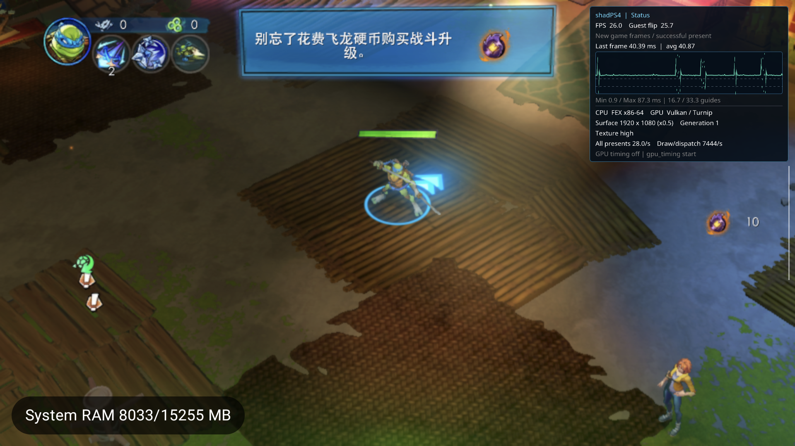

# DebugBus 手柄和真正隐藏触控层（2026-09-22，本地未提交）

用户通过Android OCR任务明确要求将游戏操作改为DebugBus全手柄，并修复隐藏touch设置、将当前设备设置为隐藏。本轮未commit/push。命令/枚举/JSON合同见[使用说明](../../debugbus-pad.md)。

## 实现

同一Foundation registry新增`pad capabilities/status/state/release_all`，连接生产OrbisPadAdapter/InputHub和checked GuestPad读路径，独立于Android keycode及屏幕坐标。18数字位、双摇杆、模拟扳机、单触点完整状态；PS/Share仅既有Pad位，不冒充系统功能，Intercepted/双点触摸/传感器不支持。PID+generation+run_uuid同输入锁内准入，Stop/故障撤销不依赖Mac清理；1..2000ms原生看门狗、独立来源释放、设备级owner串行、单调ID高水位及有界回执，重复不重放/续期。只有真实Guest输出准入才记录poll，诊断读或被ImGui截获的输入不冒充消费。

首版只撤销失焦时的已有hold，后续state仍可重新注册；审查发现后补focused入站门控。Compose模态通过NativeFocusLost/port0断连关闭准入，恢复焦点才接收新state；这与native ImGui捕获是两个独立条件。

SessionScreen原Hidden只改变透明度且每次重置；现在移除实际overlay View/命中区域，其dispose只发布触控源Neutral；SharedPreferences `session_ui/show_touch_controls`保存用户选择。Android Back仍可打开宿主菜单，不需要保留隐形PS热点。

## 定向测试

AYN最终debug_pad_tests **481/0**、既有GuestPad **85/0**；覆盖18按钮真实Guest内存输出、轴/触点边界、无效输出不能消费回执、4端口/输入源隔离、8并发重复、淘汰ID不重放、session替换、失焦新请求拒绝和恢复、UI捕获、无需Mac清理的原生超时。首版478/0归档为v1，不混同最终版。[测试与二进制身份](debug-pad-20260922/tests.json)。Kotlin现有session/touch测试11/0，APK编译成功；没有新增只重复实现的设置单测。

最终[安装身份](debug-pad-20260922/installed.json)：APK `641558184c38cc9f8750c6d5fb5816828fe15bad5d4740963ff020b6be3abf40`；host `33825d4e9163bc57d8e8e61d966a6465aa94d9c12d0063be70ec8eef26d6ffae`；JNI `d027321173dca1e42a665ecc39537e47521bc15ce3b8a16fa65b167563c37f0e`。核包内host及设备整个APK SHA。

## 实机

- v1包d669ca9d，PID11646/gen1，用户配置Hidden后无虚拟按键；通过DebugBus Cross进入Start/Continue/巢穴，左摇杆X0.6保持600ms观察场景位移，均真实Guest poll及timeout/重复ID不重放。随后正常UIStop/user_stop/return0，才安装最终包。
- 最终PID16363/gen1/run `b63431c100c46a4134b115280c788f73`，跨Stop/安装/重新启动，配置仍为Hidden且实景无面板。打开Compose菜单后[新state拒绝not_focused](debug-pad-20260922/modal-rejected.txt)，恢复后成功。旧PID请求wrong_session，显式release_all成功且全部debug_active=false。
- 最终Cross ID1有15次真实poll但未见翻页；ID2推进Start、ID3推进Continue到巢穴，不能把poll直接等同玩法成功。[逐动作回执](debug-pad-20260922/final-action-1.json)及[巢穴状态](debug-pad-20260922/final-status.txt)：15305flips/15303presents，Running。最终包轴操作留给接续OCR任务验证，不把v1场景位移冒充最终包实景。
- [完整1449导入、126拒绝行/99唯一](debug-pad-20260922/family-audit.json)；UTC转换已经桥接。此前死亡路线的Garlic堆错误仍未复现定位首个writer，MHW subgroup改动已随包部署但MHW实景未复测。

## 数据与交接

[配置/存档比较](debug-pad-20260922/userdata-check.json)：新增用户要求的session_ui.xml，原文件无删除，仅TMNT main/backup的User.ini和GameState共4文件随普通游戏推进变化；全局/游戏配置保留，未外部修改/格式化存档。原home/config备份在本机build验证目录；运行中只读快照不是事务备份。

交接时TracerPid0、无ADBforward/held input，Service输入focused=true/uiCaptured=false/buttons0。旧scrcpy未停止/调整，其旧帧已排除；后续OCR任务自行建设只读解码源。设备已明确交回该任务独占且收到确认，本任务归还前不操作设备。主仓保留原脏工作区，无完整可玩、完整回归或MHW DeviceLost已修声明。
