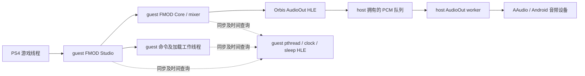
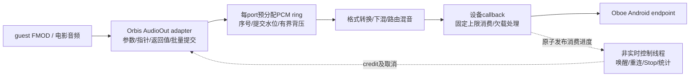

# FMOD、Android 音频 HLE 与 Citron / Azahar 的设计对照

**结论：当前 Android 音频适配确有结构性缺口，但不能把 FMOD 长等待归结为“FMOD 不适合 Android”。** 游戏里的 FMOD 运行在 PS4 guest 环境；它依赖模拟器提供正确、及时的线程、时钟、同步和 AudioOut 服务。当前最明确的两类问题是：设备输出没有真正进入低延迟路径，以及大量细粒度 guest HLE 调用放大了 FMOD 的同步成本。两者需要分别验证因果关系。

本次补充了源码审计、真实游戏 ELF 的导入/导出与有限反汇编核对、既有 PROF 的精确窗口重算，以及 AYN 上的静音输出探针。没有修改生产音频代码、替换游戏 FMOD、重装 APK 或重新跑游戏回归。上轮音频队列、AvPlayer 修复和未解决的场景推进问题保持原状态。

后续实现已落地，见 [Oboe 音频交付](oboe-audio-integration-2026-09-15.md)；以下保留迁移前审计快照。

## 证据与版本范围

| 对象 | 本次实际检查的版本 | 证据性质 |
| --- | --- | --- |
| shadPS4 | `4da582b7` + 当前未提交修改 | 包括上轮两块待消费 PCM 队列；不是最初同步实现 |
| Citron | `6a86baf4b6521ca3ee5b2f5e2a0ca6a8e6007cc0` | 本地源码；不宣称该提交已经发布到远端 |
| Citron Oboe | `987538b6ec4cb9e699b117a890e686de7a9302fa` | 独立子仓，工作区干净；重新 NDK 编译探针 |
| Azahar | `254bff35e0d8ced97e6cc73f7a59be045798c60c` | 本地源码干净；包括新的 realtime audio clock 调整 |
| Azahar cubeb | `18502c3b8ed41b01a6ff3af03a5c034009de81a1` | 独立子仓、工作区干净；源码对照，没有运行其完整音频链 |
| 游戏 FMOD Core | 模块 `getVersion` 实现写出 `0x00020226` | 对应 FMOD 2.02.26；没有调用 inferior 函数 |
| 真机基线 | AYN Thor / API 33 / 4 KiB；最终 APK PID21732，较早 PROF PID5502 | 不同阶段证据分别归属，不等于 Swan 验收 |
| 本次探针 | AYN，同应用 UID10190，独立 native 进程 | `runas_app`，有 permissive 执行记录；不是 ART / Service / FEX 内部测试 |

精确文件哈希、模块哈希、工具探针身份和小型原始数据在 [manifest](2026-09-15-fmod-audio/manifest.json)。本地参考源码位置与逐文件 SHA 在 manifest 中；本报告的 C/A 编号引用这些检查过的文件，不把本地修订包装成可下载的远端版本。

## 1. FMOD 在这里扮演什么角色

FMOD Core / Studio 引擎是闭源商业软件；免费许可不等于开源，官方另提供需要洽谈的源码授权。公开的 Unity 集成仓库只包含集成层源码，不包含引擎核心源码。本次没有取得 FMOD 核心源码；内部判断来自游戏二进制、公开 API 和运行轨迹。[官方授权](https://www.fmod.com/licensing)、[官方 Unity 集成仓库说明](https://github.com/fmod/fmod-for-unity)。

实际链路是：



FMOD 的混音、Studio 状态与大量内部任务仍是 x86-64 guest 代码，经 FEX 执行。Android 上没有一个 native FMOD 实例替它完成这些工作。改变 Android FMOD SDK 的 OutputType、调用 host `FMOD_System_Update`，都不会自动改变这份 PS4 FMOD 的行为。

FMOD 官方 2.02 线程文档说明：Studio 可以同步运行，也可以把命令批量交给独立线程；异步工作与 Core mixer 的更新相关，命令队列拥塞也会让调用方等待。因此“音频设备在另一个线程”并不意味着游戏线程永远不受音频工作影响。这里需要保持命令、混音和完成通知的语义，而不是把等待全部删除。[^fmodthreads]

桌面 shadPS4 同样执行游戏自带的 FMOD；主要差异是 native x86 guest / host 调用与 ARM64 FEX 的跨边界成本，以及桌面 SDL sink 已经处理的设备适配。Citron 的 AudioRenderer / ADSP HLE、Azahar 的 DSP HLE 则把相应平台的音频处理交给 native 实现，不能把它们理解为“已经移植了同一个 FMOD”。[C3][A3]

直接用 Android 版 FMOD 替换 PS4 `libfmod.prx` / `libfmodstudio.prx` 不是当前合适的切入点。它还要处理准确版本、guest 对象布局、C++/C 导出、插件、文件/内存回调、内部线程与 guest TLS、返回对象和指针的归属。这是一项中间件 HLE 工程，远大于输出后端迁移。

## 2. 这次进一步确认的 FMOD 等待链

通过仓库现有 NID 算法对公开 API 名称求值，匹配真实模块导出，得到：

| 函数 | NID | 模块内入口 |
| --- | --- | --- |
| `FMOD::Studio::System::flushCommands()` | `ERN4ES-D2x8` | `libfmodstudio+0x953e0` |
| `FMOD::Studio::System::flushSampleLoading()` | `qpxa4b3tmjs` | `libfmodstudio+0x95560` |
| `FMOD::Studio::System::update()` | `H+G1XQRDyWk` | `libfmodstudio+0x95330` |
| `FMOD::System::getVersion(unsigned*)` | `S9bYVNGDosY` | `libfmod+0xd83d0` |

匹配结果见 [NID 记录](2026-09-15-fmod-audio/fmod-nid-matches.json)。`getVersion` 经内部 `+0xdff90` 写出 `0x20226`。这是版本实现的静态证据，不是把当前公开手册的小版本当成游戏库版本。

两个 flush API 都调用 `libfmodstudio+0xebb30`：前者经 `+0x95460`，后者直接从 `+0x955b7` 调用。这个共享 helper 调用 `+0x5cc20`，读取 `[[rdi+0xb18]+0x1a0] > 0`；若仍有待完成计数，就等待并再次更新检查。有限静态检查还找到相应布局的原子加/减候选 `+0x11792f` / `+0x117b21`，但尚未用动态对象地址证明它们操作的是这次被等待的同一对象。

原始 PROF 的主线程采样链为：`libfmodstudio+0x32ba → +0xeb3a6 → +0xebc02`，与该等待 helper 内部的时钟/更新路径吻合。已找到公开 API 的静态来路，**但两层采样回溯不足以区分这次顶层究竟是 flushCommands 还是 flushSampleLoading**，也不能把内部计数直接命名为某个 bank 的加载进度。

对基线 PROF `db461296…` 的 `[171090000000000,171091000000000)` 一秒窗口重新计算：[原始统计](2026-09-15-fmod-audio/loading-window.json)。

| owner / TID | 同一窗口内的实际活动 | 含义 |
| --- | --- | --- |
| 主 guest / 5896 | Usleep704次，scope753.39ms；clock704次；mutex lock/unlock各1408次 | 等待循环持续前进，主线程每秒约4224次这些 HLE 调用 |
| AudioOut producer / 5995 | Outputs93次，scope988.85ms；SignalSema93次 | 输出及信号链仍推进；512-frame×93≈47616frames/s，接近48kHz |
| 与 Studio 调用相关的 owner / 5994 | WaitSema94次；SignalSema46次；mutex lock2231次 | 这个 owner 并非整秒睡死；不能只凭线程号把全部工作命名为 mixer |
| 另一音频相关 owner / 5996 | WaitSema47次；mutex lock462次 | 需要沿实际同步对象追踪依赖，不能只看总 AudioOut 时长 |

以上按 interval 起点落入窗口选取，末端裁剪；跨窗口开始的 scope 不在该表，所以和上轮按另一边界规则得到的94次/约993ms略有差异。scope 含等待，跨线程不可相加当 CPU 使用率。

还有一个采样限制：当前 clock/sleep 共用每64次取一次的计数器。固定调用序列会产生相位偏差，本窗口采样恰好总落在 clock 上；不能用 GuestPoll 样本个数估计 clock 与 sleep 的比例。应采用完整 HLE scope 统计频次，GuestPoll 只用于定位调用点。

这组证据支持的判断是：**待完成任务没有及时清零，同时音频输出仍以接近正常的周期工作。** 它反对“设备完全不消费导致整条 FMOD 停住”的简单解释，但没有排除提交/消费时钟偏差、工作线程竞争、加载 I/O 或某条完成通知的问题。公开 API 也明确区分命令执行等待和 sample loading 等待，不能将两者都当成 PCM drain。[^fmodflush]

## 3. 当前 shadPS4 的 Android 不匹配点

### 3.1 申请 LOW_LATENCY，实际得到 NONE

原 `src/core/libraries/audio/aaudio_audio_out.cpp` 后端 设置 Shared、LowLatency、Float、48kHz 和 guest channel count，使用阻塞 `AAudioStream_write`，没有 data callback。

上轮普通 APK 的 [原始摘录](2026-09-15-fmod-audio/production-aaudio-excerpt.txt) 显示，8声道流和两个2声道流均出现：

```text
AUDIO_OUTPUT_FLAG_FAST denied by client ... transfer = TRANSFER_SYNC
perfMode changed from 12 to 10
```

NDK 定义12为 LOW_LATENCY、10为 NONE。这是实际路径降级，不能再只凭 builder 参数或“AAudio 已打开”宣称低延迟。Android 官方也专门指出，非 MMAP 设备上的 blocking writes 可能进入更高延迟路径。[^android]

### 3.2 guest block、host FIFO、Android burst 被混为一组大小

当前 [GuestAudio::Worker / Output](../../../src/core/host_runtime/guest_audio.cpp) 已有两个拥有数据的待消费块，加最多一个正在消费的块。这比原先等待 `ready || busy` 的串行版本更合理，且保留了 guest buffer 提前复制、满队列背压和取消。

但设备容量仍直接请求 `buffer_frames * 4`，没有按实际 burst 设置使用量，也没有区分 accepted、送入设备、硬件已播放三个进度。主端口512frames对应10.667ms；电影端口1024frames对应21.333ms。两块 pending 的时间预算分别为21.333ms和42.667ms，不能仅用“队列长度2”评价两条流的延迟。

实际设备还可能调整请求。本次同 UID native 探针中，请求2048frames却获得3844frames的普通同步流缓冲，约80.08ms的容量；不是上层设定的42.67ms。容量、当前已排队音频、端到端听到的延迟是三个不同概念，不能直接相加后冒充实测听感延迟。[P1]

### 3.3 软件节拍与设备消费之间缺少反馈

Worker 在写之前执行 `next = steady_clock::now() + period`，再等待/提交设备。它不是简单的“sleep一周期再额外完整阻塞一周期”：若写操作耗时小于周期，两段时间会重叠。

真正的问题是，下一周期总从实际被调度到的 now 重新起算，没有基于消费帧计数或稳定绝对时间轴的反馈。持续的调度迟到不会被后续正常周期追回；例如512frames的10.667ms周期每次额外迟到0.5ms，纯模型下产出只剩约45.85kframes/s。这个数是算法示例，**不是本机测得的音频速率**。

多端口各自的软件节拍、设备队列和设备时钟还会产生独立漂移。修复目标应是由实际设备消费推进 host PCM，再由进度控制 guest 可提交量，而不是不断添加新的 sleep 或放大所有缓冲。

### 3.4 桌面的声道适配没有完整迁过来

当前 AAudio `ConvertAudioFrames` 处理 S16/F32、声道重排和音量，但不会8→2下混。设备开流保留8声道，把后续适配交给 Android。

桌面 [SDLPortBackend::OpenDevice / Downmix*](../../../src/core/libraries/audio/sdl_audio_out.cpp) 会检查实际设备声道；多声道 guest 配合 stereo 设备时显式重建2声道流。当前桌面矩阵大致为：

```text
L = FL + 0.7071*FC + 0.7071*(SL+BL)
R = FR + 0.7071*FC + 0.7071*(SR+BR)
```

这份实现省略 LFE；“PS4-accurate”是源码命名，不是本次独立硬件认证。Citron 的6→2矩阵还包含不同的 center/LFE 权重，不能直接覆盖 PS4 声道语义。[C1]

可复用桌面的既有策略，但应抽为可测试的纯函数，分别验证普通/Std布局、左右/center/surround脉冲、每声道音量、削波和非有限输入。不要简单把8声道数据取前两路，也不要把不同 emulator 的矩阵无条件混用。

### 3.5 设备完成和 guest 完成没有明确分层

`last_output_time` 在 worker 完成一次 write 后更新。它表示该实现的提交完成时点，不是 DAC 播放完毕时间。null Output 等待 `queued==0 && !busy`，实际只保证经过 host worker；AAudio 内部仍可有未播放数据。

桌面同样主要在提交后更新这个值，因此这是现有兼容模型的限制，不能擅自把 PS4 API 改成“等待听见最后一个采样”。另外，本次检查到的 FMOD Core AudioOut 导入含 Init/Open/Close/Outputs/SetVolume/GetPortState，**不含 GetLastOutputTime**；这个时间接口不是当前已证实的 FMOD 等待根因。

新实现内部应明确记录 submit/consume/present 三个水位，再依据核实的 Orbis 语义决定哪些水位可影响 guest 返回。null drain 应等待调用开始时已接受的序号，避免其他 producer 持续提交造成无限等待；设备 teardown、普通 drain、全局 Stop 也应区分。

### 3.6 高频成本更多在 FEX/HLE 服务边界

既有 simpleperf 中，地址空间及其锁约占启动/加载 CPU 样本的33%，guest mutex/cond剩余分类约13%，AudioOut约1–2%。这不是墙钟关键路径占比，但足以说明不能把主要优化投入都押在 PCM 拷贝。

当前 `GuestMutexDomain` 的无竞争路径仍会进入 host guard、检查 guest 内存并写回 owner/depth；FEX adapter 每次 HLE 退出和继续执行还要维护准入、frame 注册、VM 协调等状态。这些功能有正确性目的，不能简单删锁。桌面 native 调用与 FEX 下每秒数万次边界切换的成本不等价。

现在的 per-mutex 唤醒修复已保留；不要重复宣称全域 `notify_all` 仍未修。guest C/C++ 快路径仍是原型，不应在同一个生产 mutex 上混用两套 owner/递归深度/等待者状态。正确方向是无竞争 guest fast path 配合有竞争 host slow path的一套协议，而不是把 host mutex 直接搬入设备 callback。

## 4. Citron 当前实现：值得复用的部分及边界

Citron 本地 [C1] `ConfigureBuilder` 明确强制 `AudioApi::OpenSLES`，注释说明曾遇到 AAudio callback delay。配置为 I16、48kHz、允许格式/声道/采样率转换，目标240frames一个渲染块，通常请求480frames设备容量。**不能用“Oboe默认会选择AAudio”替代它实际的源码配置。**

`onAudioReady` 根据本次设备请求的 frames 拉取 `SinkStream`。一块guest数据可跨多个callback，多块数据也可拼入同一个callback；音频无需与GPU present一一对应。`AppendBuffer` 在提交侧完成音量及必要的6→2下混，PCM和带tag的buffer描述分别入队。[C1][C2]

`DeviceSession` 跟踪 buffer end timestamp，每5ms定时触发AudioOut manager处理；消费进度达到阈值后释放buffer并通知guest。消费计数是callback进度加CoreTiming插值，另加15ms调度余量，**并不是精确硬件播放头**。这套“buffer身份—消费进度—释放通知”比当前只看queued/busy更完整，但Switch的tag和release-event ABI不能直接变成PS4接口。[C2][C3]

Citron 也有背压：AudioRenderer 工作线程调用 `WaitFreeSpace`，队列拥塞时等待；它不是“所有线程永不阻塞”。而且其callback里仍有 `sample_count_lock`、短暂 `release_mutex` 和通知操作。迁移到Foundation时应消除与普通控制线程竞争的callback锁，不能把参考实现当成严格无锁模板。

## 5. Azahar 当前实现：重点在时钟和缓冲解耦

Azahar 的 DSP HLE 在 CoreTiming 事件内生成160个 stereo frames，原生3DS采样率32728Hz，约4.889ms一块，然后写入固定容量FIFO。音频设备callback从FIFO取数据；guest DSP tick、游戏帧和设备callback不是同一周期。[A1][A3]

当前默认 cubeb sink 请求 S16 stereo，latency参数取 `max(512, minimum_latency)`，32728Hz下512frames约15.64ms，但它只是请求值。检查的cubeb在Android编译AAudio时优先尝试AAudio，再有OpenSL等后备；AAudio backend有自己的状态线程、callback、resampler、timestamp和按burst调整buffer逻辑，不能因为外层叫Cubeb就认定其底层仍是OpenSL。[A2]

当前Azahar还按 `enable_realtime_audio` 或 guest-host realtime time 配置调整DSP事件间隔，并扣除 `cycles_late`。这说明它同时处理“模拟时间如何产出音频”和“设备时间如何消费音频”。shadPS4目前缺少这层明确关系，但不能复制Azahar的FPS比例公式：PS4 FMOD和guest线程使用真实时间接口，直接随GPU FPS缩放音频或guest时钟可能破坏游戏逻辑。[A3]

time stretching 是可选补偿：当前只有开启且 emulation speed≤0.95 时启用SoundTouch；欠载会保持最后一个frame。它能掩盖小范围供给抖动，并不能修复任务不完成，也无法保证55秒完全没有新音频时仍产生正确声音。[A1]

参考实现也有需避免照搬的地方：stretch路径在callback中构造vector/处理SoundTouch；FIFO Push可能只接收剩余容量，而上层不检查返回量；剩余音频flush拼接代码也需独立审查。它们不构成“已验证的严格实时、永不丢样模板”。PS4 AudioOut 已接受的buffer不能悄悄套用丢帧策略来保持表面流畅。

## 6. 横向比较

| 维度 | 当前 Android shadPS4 | 桌面 shadPS4 | Citron 本地 | Azahar 本地 |
| --- | --- | --- | --- | --- |
| 主要音频工作 | guest FMOD经FEX；host AudioOut/解码服务 | guest FMOD直接在x86运行；native HLE | native AudioRenderer/ADSP HLE | native DSP HLE或DSP LLE |
| 输出消费 | 每port worker阻塞写AAudio | worker提交SDL流 | Oboe/OpenSL callback | cubeb callback，Android可走AAudio |
| 声道适配 | 重排，未显式下混 | stereo设备时显式8→2 | system/device声道区分，6→2 | DSP最终stereo，cubeb转换 |
| 时钟/缓冲 | 软件period、两块pending、设备buffer | timer、SDL队列阈值/清队列 | callback进度+CoreTiming、buffer释放 | DSP事件、FIFO、可选stretch/realtime clock |
| 背压 | 满队列阻塞调用owner | 单个pending槽等待 | renderer worker等待；AudioOut释放事件 | FIFO容量限制，不能视为PS4背压模板 |
| 完成语义 | queued/busy与write完成 | output_ready与SDL提交 | tag/end timestamp/played估计 | DSP interrupt与设备FIFO各自推进 |
| 重连 | write错误后worker重开一次 | SDL设备层 | error callback重开 | cubeb状态线程及backend重建 |
| 主要可复用点 | guest指针校验、owned PCM、取消 | Orbis语义/声道矩阵 | callback消费、设备适配、buffer身份 | 分离时钟、FIFO、欠载/延迟观测 |

桌面也有软件计时、端口锁和过长队列清除策略；“桌面较正常”不等于其每个细节都应保留到Android。[SDL说明](https://wiki.libsdl.org/SDL3/SDL_OpenAudioDeviceStream)也区分应用输入格式与实际设备流，不能把它与直接AAudio固定格式调用等同。

## 7. AYN 上实际做了哪些验证

生产日志已证明同步写路径被降级。本次另外使用NDK 29.0.14206865 / API 33、同应用UID的独立静音进程，每种配置运行约1.2秒，所有流正常Start/Stop/Close，无新游戏执行。结果以真实granted参数为准。

| 配置 | performance | burst | 实际buffer size | 补充 |
| --- | --- | --- | --- | --- |
| 直接AAudio同步，2或8声道，容量请求2048 | NONE | 1922 | 3844 | 复现TRANSFER_SYNC拒绝FAST |
| 直接AAudio callback，2或8声道 | NONE | 960 | 2886 | 单独增加callback没有取得低延迟 |
| callback stereo，调为2×burst | NONE | 960 | 1920 | buffer预算降到40ms；不是端到端延迟测量 |
| callback默认容量/Exclusive请求/I16/明确Stereo mask/容量384 | NONE | 960 | 视调优为2886或1920 | 这些变更没有单独解决本机路径准入 |
| 按Citron builder的Oboe/OpenSL stereo I16 | NONE | 960 | 2880 | 请求480；setBufferSize与timestamp返回Unimplemented |
| 同一Oboe源码，AAudio stereo I16，请求size480 | NONE | 960 | 960 | 请求被约束到一个burst，timestamp可用 |
| Oboe AAudio float stereo，2×burst | NONE | 960 | 1920 | Exclusive请求最后仍为Shared |

所有这些短静音样本 xrun=0，callback线程观测到 SCHED_OTHER/priority0；这仅描述探针，没有游戏负载、真实声音或长时间欠载压力。`getFramesRead` 和 timestamp frame也明显不同，支持把API消费位置与硬件播放位置分开观测。

探针所在 `runas_app` 安全域不是普通APK，不能拿它判定最终APK无法获得FAST。反过来，也不能忽略结果，承诺“移植Citron后固定10ms”。后续必须在普通Service/实际route下记录性能模式、backend、共享模式、burst、capacity、使用buffer、timestamp可用性、callback间隔和xrun，再决定默认配置。[P1][P2]

Android官方建议callback不做分配、文件I/O、锁等待或sleep，并使用实际burst和xrun调优。Oboe的设备兼容处理和配置回读有价值，但不能覆盖平台策略不授予低延迟的事实。[^android][^oboe]

## 8. 建议采用的整体方案

优先保留guest FMOD 2.02.26，把host端做成“Orbis契约 + 设备音频服务”两个边界；选Oboe作为Android后端封装，允许明确选择AAudio/OpenSL以做同负载对照，不沿用Citron永久强制OpenSL的历史决策。若AAudio代码继续使用，也应实现同一消费/生命周期接口，避免HLE直接依赖API选择。



### 一块完成：Android输出与Orbis时序闭环

1. 抽出host-owned PCM、纯转换/下混和设备sink接口。普通speaker/headphone路由优先stereo；多guest port可混到同一设备endpoint，避免每port占一个硬件流与独立设备时间轴。端口handle、音量、错误、序号、drain仍独立；PadSpk继续拒绝没有真实端点的情况。
2. callback只消费已验证且已复制的数据，不进入FEX、GuestAddressSpace、VM gate、Orbis调用、guest callback或普通mutex。预分配ring/转换scratch，partial block跨callback保留offset。多producer不直接套用SPSC假设：由提交侧短锁或明确MPSC admission串行发布，callback是单consumer。
3. 按frames而不是vector块数控制预算，参考实际burst设置低/高水位。普通guest等待发生在HleScope释放执行准入后；不得持VM gate/pin等待。callback只发布消费计数，非实时控制端负责guest唤醒、错误和取消；额外唤醒延迟也必须测量。
4. 用同一个批次准入实现Outputs：所有选中端口校验成功、credit足够后共同发布，保留当前错误/返回计数。null drain采用已提交序号水位，Stop采用取消，正常Close如何处理尾音按桌面/Orbis契约固定下来；不能为了低延迟擅自改返回语义。
5. 把写入/消费/硬件播放计数分别暴露给诊断。不要让设备欠载时补出的静音或held frame增加“真实guest PCM已消费”的计数；不要让硬件时钟无条件覆盖所有guest时钟。
6. 路由变化、耳机断开、后台/恢复与Session Stop组成一个generation生命周期。错误处理排到控制线程；退出先停止准入，再停止并确认callback退出，最后释放ring与设备对象。设备重连失败应有真实状态和可取消等待，不能让旧callback复活关闭的session。

这批一次交付callback、ring、下混、流生命周期和统计，不拆成“先接一个空Oboe壳”再逐个追加。验收包括2/8声道脉冲、FIFO/跨callback边界、多端口原子提交、慢producer、满队列、disconnect、并发Stop/Close和同进程重开；再在同一TMNT场景测听感、xrun和输入到声音延迟。保留现有native68/0检查的语义，它不覆盖这些新的设备指标。

### 同一阶段另一条线：FMOD任务与FEX同步闭环

不要等输出换库后才开始这条线。实际场景目标是圈键后从传送门推进到下一场景，而不是纯色60FPS或仅有稳定AudioOut。

应从已有flush helper精确追踪被等待对象：记录同一generation下的任务提交、完成、pending计数变化、对应owner、相关mutex/semaphore和文件/解码请求。静态识别的`+0x11792f/+0x117b21`只有确认动态对象一致后才能用于因果图；不得通过强制清零pending、提前返回flush或删除sleep伪造完成。

优先扩充现有HLE边界的对象ID、等待时间、唤醒到重新运行延迟、VM gate时长、完成/取消结果和线程名/guest入口映射。GuestPoll应按operation分别采样或使用不与固定序列整除的采样策略，保留开销对照。此处不要求新guest auto tag或JIT patch。

若证明无竞争mutex与clock读取占主导，再把已验证的guest C/C++原型推进到一套完整快/慢路径协议，保留递归、错误检查、cond释放/重获、等待者唤醒、销毁、取消、VM remap和缓存失效。FEX HLE准入本身的锁优化也要保证暂停/排空/嵌套InvokeGuest不退化；不能直接删除RegisterThreadFrame或执行准入。

时钟调整只修对应语义：当前RDTSC缩放修复已存在，不重复切回旧倍率；不把GPU FPS当成FMOD DSP时钟。time stretching可在供给基本正确后作为host听感补偿，先默认关闭以便定位，不用它掩盖guest任务不完成。

## 9. Foundation 与依赖归属

Foundation当前没有音频模块。适合增加的是薄的 `modules/audio`：host PCM格式、预分配队列/消费序号、通用下混/重采样接口、Oboe endpoint、路由/设备生命周期和profiler counters。Foundation不依赖GuestCpu、PS4地址空间、FMOD对象或Orbis NID。

PS4具体的声道策略、Output返回值、端口类型、guest拷贝、批量事务和Session错误仍属于shadPS4 adapter。Azahar的DSP时钟、Citron的AudioRenderer/tag协议也分别留在各自项目；不为“共用”把模拟器ABI塞到基础库。

Oboe和cubeb在参考工程都已经是独立子仓。沿用独立子仓及受控分支管理，Foundation接收CMake target或显式源码路径，不再次vendor源码。当前Oboe实际remote为`tencentmalos/oboe`；Azahar `.gitmodules` 指向`tencentmalos/cubeb`，但本地cubeb checkout的origin仍是`mozilla/cubeb`，实施前应先确认拥有分支与remote配置，不能直接推向upstream。此次没有改动子仓或发布pin。

对这个Android项目，Oboe是较小的设备后端选择；cubeb可以保留为未来桌面共用选择。当前最有价值的复用是统一接口、buffer规则、生命周期和观测，不是同时引入两套默认后端。

## 来源与复核入口

所有本地引用均指本报告manifest记录的源码快照；主仓文件带未提交修改。外部checkout引用不是远端发布声明。

- [C1] Citron `src/audio_core/sink/oboe_sink.cpp:80–175`；`sink_stream.cpp:22–120`：backend、callback、声道转换。
- [C2] Citron `sink_stream.cpp:203–295`；`sink_stream.h:237–256`：消费、插值、队列与callback锁。
- [C3] Citron `device/device_session.cpp:68–137`；`out/audio_out_system.cpp:114–146`；`adsp/apps/audio_renderer/audio_renderer.cpp:127,203`：buffer释放、5ms服务事件及renderer背压。
- [A1] Azahar `dsp_interface.cpp:50–145`；`dsp_interface.h:118–125`；`time_stretch.cpp`：FIFO、callback、stretch与欠载。
- [A2] Azahar `cubeb_sink.cpp:28–139`；cubeb `src/cubeb.c:255–260`、`src/cubeb_aaudio.cpp:1285–1417`：实际后端选择、转换及buffer设置。
- [A3] Azahar `hle/hle.cpp:416–490`；`audio_types.h:14–20`：native DSP tick、realtime/cycles_late和160/32728Hz。
- [P1] [直接AAudio探针与配置说明](2026-09-15-fmod-audio/README.md)、[完整矩阵v2](2026-09-15-fmod-audio/aaudio-probe-v2-appuid.jsonl)、[格式/mask补充](2026-09-15-fmod-audio/aaudio-probe-v3-appuid.jsonl)。
- [P2] [Oboe探针](2026-09-15-fmod-audio/oboe-probe-appuid.jsonl)，使用本报告固定Oboe修订重新编译；没有复用不明来源的预编译archive。
- [上轮完整profile与实现边界](startup-audio-profile-2026-09-14.md)、[guest C/C++与时钟原型](ring-clock-compiled-guest-2026-09-14.md)。

[^fmodthreads]: Firelight Technologies，FMOD Engine User Manual 2.02：[Studio API Threads](https://www.fmod.com/docs/2.02/api/studio-api-threads.html)，访问于2026-09-15。在线维护版为2.02.35，作为同系列线程模型参考；游戏2.02.26行为以实际二进制/trace为准。
[^fmodflush]: Firelight Technologies，[Studio::System reference](https://www.fmod.com/docs/2.03/api/studio-api-system.html#studio_system_flushcommands)，flushCommands / flushSampleLoading语义；2.03文档用于公开API说明，未据此假定游戏内部对象布局。
[^android]: Android Developers，[Low latency audio](https://developer.android.com/games/sdk/oboe/low-latency-audio?hl=en)，2026-02-26更新，访问于2026-09-15。callback、阻塞限制、burst与xrun配置建议；不把文档示例延迟当成本机测量。
[^oboe]: Google Oboe，[Full Guide](https://github.com/google/oboe/blob/main/docs/FullGuide.md)，访问于2026-09-15。流的请求/实际配置差异、设备与共享模式；集成API仍以固定子仓源码为准。
