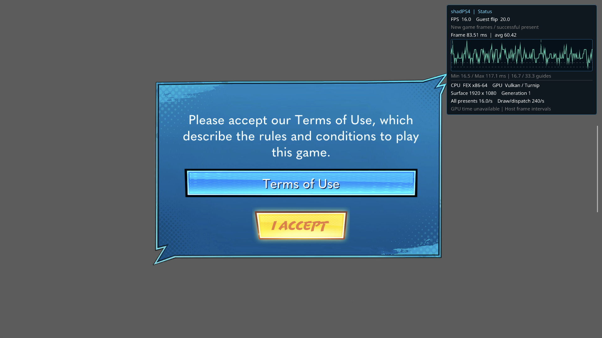

# TMNT 文字破损：R8 存储能力与解平铺修复

2026-09-14；`codex/android-fex-round2`，构建于 `6062df92+dirty`。没有修改 FEX、Foundation、字体包或执行 spec。证据见 [font-r8](graphics-toolkit-2026-09-14/font-r8/)，具体产物见 [artifacts.json](graphics-toolkit-2026-09-14/font-r8/artifacts.json)。

## 结论与桌面端对照

这处破损由 host R8 解平铺着色器使用了设备未支持的 `StorageBuffer8BitAccess` 引起，不是系统字库缺失或文字着色器采样错误。

- 桌面 `emulator.cpp` 挂载系统 `common/font` / `font2`；`font_internal.cpp` 的系统字体选择在外部字体不可用时使用内置字体回退。`sysmodule_internal.cpp` 为 Font/FontFt 选择 guest provider 或 native FreeType HLE。这些机制并不等于所有游戏文字都会走系统字体。
- 对本次实际 base+update 内容的 eboot 和七个模块逐个解析 SELF 的 SCE 动态库表，没有 Font/FontFt 导入。主程序中存在游戏自带的 `build://.../*.font` 资源路径。文件 SHA 与逐模块库清单保留于 `imports.json`；不是仅搜索日志未命中后推断。
- 普通 APK 的 RenderDoc capture 中，文字 draw212/226/240（第一帧81/95/109）使用 resource2395：1024×1024 R8Unorm / Thin2DThin，guest VA `0x274348000`。pixel shader31932678只采样 R，乘以顶点颜色/alpha。图集在这些 draw 前已损坏，本帧 resource usage 仅包含读，不能从该帧伪造上传事件或原始写入者。
- 第二次普通 APK 运行中，用精确 host Build ID 的 LLDB 在 `TextureCache::RefreshImage` 停住同类真实文字资源，读取当次实际 `image.info` 和完整1MiB。该次地址是 `0x274240000`，不能复用前一进程的地址；先读旧地址得到零数据的尝试已排除。原始数据按共享 PS4 Thin2DThin 地址规则在 CPU 解码后字形清晰，见 [CPU参考图](graphics-toolkit-2026-09-14/font-r8/cpu-reference.png)。原始内存不提交 Git，只保留 SHA、停止 epoch 和调试证据。


## 根因与修改

当前固定 Turnip（Mesa26.0.0-devel/5ac41be677，Adreno740）实际查询结果为：`shaderInt8=1`，`storageBuffer8BitAccess=0`，`storageBuffer16BitAccess=1`。整数运算支持不能代替8位SSBO支持。`vk_instance.cpp` 正确传入查询到的 feature 位，但原 `tiling.comp` 无条件用 `uint8_t[]` 作为8bpp输入/输出存储缓冲区，所生成的 SPIR-V 要求未启用的能力。管线创建成功也不能证明该程序合法。

独立真机计算探针使用同一个私有 Turnip、原始 guest 数据和 CPU 参考：旧 shader 有11463个不同字节、4109个非零字节；CPU参考有8228个非零字节。旧 GPU 图集仅在偶数行/列保留数据。修复后正向、反向均为0字节差异、8228个非零字节。

- R8 存储改为32位打包，不再要求 `StorageBuffer8BitAccess`。解平铺每个 invocation 聚合四个像素并独占一个输出 word，不使用跨 invocation 的非原子 read/modify/write。
- 反向平铺按唯一字节写入者使用不相交 mask 的 atomicAnd/atomicOr，保留相邻三个字节，也覆盖原内容非零时的清除。下游读取仍发生在完成整次 dispatch 的同步之后。
- `TileManager` 对 R8 解平铺按每 invocation 四个像素计算 dispatch，并向上取整；其余格式原有读取宽度保留。没有禁用平铺、改成系统驱动或替换游戏字体。

## 定向验证

`tests/video_core/run_android_r8_tiling.py` / `android_r8_tiling_probe.cpp` 是可重复的真实 Vulkan 数值测试：使用独立 CPU 地址参考和合成1MiB数据，验证 Thin2DThin、Display2DThin、Thin1DThin 的正向及反向，全部6/6通过。输出先填0xA5，覆盖清零和邻字节并发保留。每份 SPIR-V 经 `spirv-val` 检查且不含 StorageBuffer8BitAccess。原始游戏内存仅用于本地诊断，正式测试不依赖游戏。

```sh
python3 tests/video_core/run_android_r8_tiling.py \
  --serial 9c2841a4 --package com.picoxr.renderdoccmd.arm64 \
  --loader /data/user/0/com.picoxr.renderdoccmd.arm64/files/shadps4-turnip/librenderdoc_turnip.so \
  --ndk /path/to/android-ndk \
  --out build/r8-tiling-probe
```

loader 按 `cmake/renderdoc/README.md` 准备，必须可被所选包读取；不默认回退系统 Vulkan。脚本清理本次唯一临时目录，不修改全局 GPU debug 设置。

Canonical host构建 `1789380374347761000` 为 HOST_LINK_PASS，host/JNI RelWithDebInfo，FEXCore Release，普通 playstoreDebug APK。此前一次漏 include 的编译失败保留于build目录，不作为成功证据。安装后 APK SHA 与本地产物一致。

普通 APK 单轮140秒定向观察：修复后使用条款正文及两个按钮的字形已清晰；FPS/帧时间曲线继续可见，Surface1920×1080，无顶部系统状态栏。主动Stop/JUnit通过（141.926s总时长，1/1）；运行中最后采样1464次present，最终terminal记录1479次。原始结果见 `tmnt.txt` 和 `terminal-logcat.txt`。没有接受使用条款、没有声称游戏场景可玩、十分钟、三次长启动或Swan通过，也没有跑全回归。



## 证据与剩余边界

RenderDoc 真帧与 Android 私有 Turnip replay 已完成，见 [图形工具交付](graphics-toolkit-repair-2026-09-14.md)。这次文字修复由实际资源/CPU内存/独立GPU数值检查和普通APK画面共同支持；单shader GPU Reshape 无告警不能替代这些证据。

仍应分别审计 guest SPIR-V 的能力声明与真正8位 buffer load/store：当前 backend 仍无条件声明 StorageBuffer8BitAccess，不能据本次 **host R8 tiler/detiler** 修复声称所有 guest 8位SSBO已经兼容。系统 Font/FontFt 的完整 guest/host适配、桌面字体挂载策略也仍是其他游戏的兼容项，本次没有以未被调用的字体HLE扩容来替代图集修复。

调试扰动单列：abstract-platform LLDB session `c72f93e4ea2445208ff3a7bb52312bf5` 在宿主 AdbClient/SyncService 内崩溃，cleanup已证实TracerPid=0；改用同版本TCP后 session `f083cc78fa634bb8be7f1c096f4a4d76`、epoch4获得快照。快照读取后删除断点并继续；被调试测试最终JUnit PASS，耗时382.774s（含长暂停，不能作为240秒无扰动性能证据），随后instrumentation退出，调试清理报告SIGKILL而非游戏崩溃证明。host/adapter/server资源均清理。完整本地journal位于build/graphics-toolkit-review/renderdoc/font-debug-evidence，内存默认脱敏；摘要和hash见证据目录。
