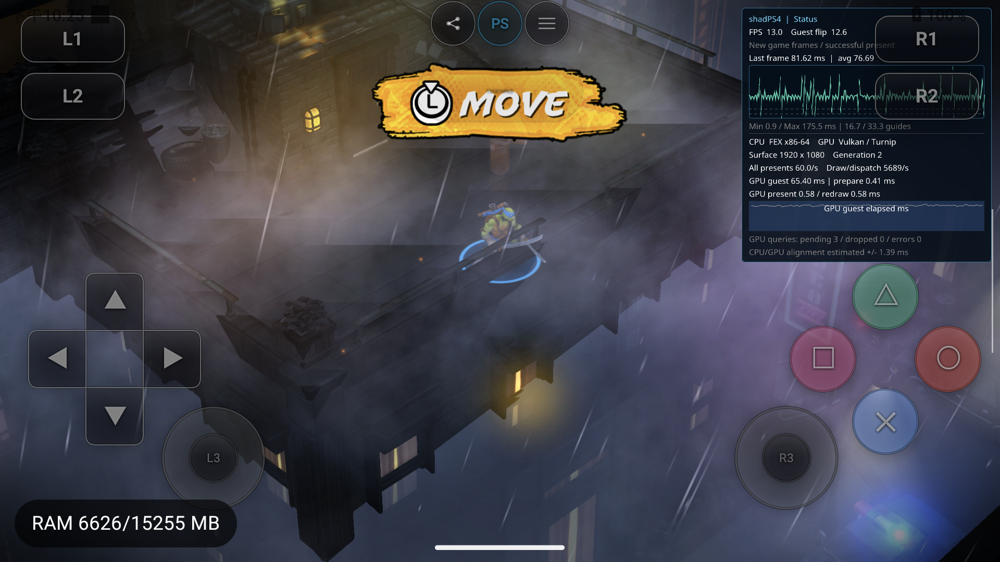

# Guest function patch / custom SDK / TMNT 标定交付

日期：2026-09-15。主仓 `codex/android-fex-round2`、`4da582b7` 加既有和本轮未提交改动。
这是实现与实测记录，不是后续执行 spec。[使用指南](../../guest-function-patches.md)。

## 结果与范围

已接通正式 Android Runtime：精确游戏/模块身份 → 混合 C/C++/汇编构建 → guest RX/RW
载入与重定位 → 函数入口跳转 → replacement → original trampoline → 原函数返回。
普通函数调用保留在 FEX；仅显式 SDK clock/counter 服务进入 host，数据写现有 litep ring。
AYN Thor / API33 / ARM64 / 4KiB 完成真实 FEX 41 项、builder 7 项、普通 APK 同进程三轮，
最终 TMNT 进入 Leonardo 屋顶且输入/镜头响应，运行中 disable/enable 通过。

这是有 ABI 和原始字节证据的函数入口 patch。安装在启动、所有 guest owner 之前完成；
运行中只切换常驻 dispatch slot，保留在途返回地址和 guest 状态。不是任意位置热覆写、
完整 C++ runtime、自动发现函数或任意 ISA 透明搬移器。没有启用 auto tag 或生产 guest mutex。

## 对照 Azahar 后的实现

参考 Azahar `254bff35e0d8ced97e6cc73f7a59be045798c60c` 的
`skills/azahar-guest-custom-sdk/SKILL.md`、`tools/guest-functions/README.md` 及 v4 SDK/loader：
保留类型化 original imports、模块 hash、可重复混合源构建、受约束 host SDK、独立游戏配方。
PS4 是 x86-64 SysV；不能照搬 ARM 单条入口指令，改为 Zydis 完整指令解码与 relocation。

- `guest/custom/v1`：跨游戏头文件、guest 内存函数、RX/RW linker script。
- `tools/guest-functions/build.py`：NDK Clang、freestanding x86-64/SSE2，静态 ELF、DWARF、
  disassembly、package、源/include/工具指纹。C/C++/ASM 可混编；内部绝对 64 位指针重定位，
  PC32/PLT32 静态解析。拒绝 TLS、构造器、动态/未知重定位和未定义运行库；构建失败清除旧包。
- `src/core/host_runtime/guest_patch*`：严格包校验、near allocation、entry/original/stub/slot、
  SDK 绑定、状态和 debugger 模块映射。title/module SHA、可选 eboot SHA 和载入后 preimage
  全匹配才发布。无猜测 code cave。入口和所有常驻页受生产 VM 变更保护。
- `guest_runtime.cpp`：Linker 之后、constructor/owner 之前安装，沿用正式 QuiescenceToken、
  code publication 和 cache invalidation；弱控制端与退休锁绑定 Runtime 生命周期。
- `scripts/android/guest-patch`：带 SHA 核对的应用私有部署、status、按当前 context 切换、clear。
  `deploy`/`clear` 影响下一次启动，不能冒充已经改变本轮代码。
- `tools/guest-functions/analyze-prof.py`：使用固定 litep decoder 导出显式 SDK Counter 和诊断。

trampoline 使用不占 scratch GPR/flags/栈的 indirect stub，覆盖完整入口指令并跳回原函数。
支持 RIP-relative load、direct call/jump、short/near Jcc 和 stolen-window 内边界映射。
partial instruction、中部 branch target、超限 RIP、LOOP/JRCXZ、call-next PC discovery 等拒绝。
调用约定覆盖 8 参数栈传参、SSE2 FP、hidden sret、C/C++ helper、手写变参 AL 和 callee-saved。
作者仍需确认无外部控制流进入被覆盖区间中部、无依赖原 PC/return address 的代码或异常展开。

## 修掉的实际问题

普通 APK 首次暴露正式 VM 将 RX 误记为 RWX：原实现用 `True(prot & CpuReadWrite)`
检测写权限，复合 mask 也命中单独 Read；GpuReadWrite 同理。现在
`Memory::ToMemoryPermission` 检测独立 CpuWrite/GpuWrite，CPU Write 的 Read 隐含规则保留。
文件映射与 protect 共用此转换；64 个组合的定向检查和最终普通 APK/TMNT 均通过。
这是正常 VM 权限语义的修复，不宣称只影响启用 patch 的游戏，也未做全游戏回归。

错误 token 原先会将健康 manager 标为 failed；校验移到 mutation 前，负例拒绝后仍能正常控制。
metadata 分配也提前到第一次入口写之前。安装失败中止 Prepare；发布已写字节后的失效失败
保留 VM poison，不能通过“还原保护成功”继续旧译码。入口跨 mapping 时逐段检查 RX。

## 验证与失败证据

| 验证层 | 最终结果 | 证明内容 |
|---|---|---|
| builder | 7/7 | 混合源/初始化 data/BSS/rebase、include 指纹；重复键/TLS/ctor/未知 import 拒绝，无陈旧产物 |
| AYN 真实 FEX + 正式 host DSO | 41/0 | ABI/搬移/SDK/身份、两持久 owner 真进入 guest 后 20 轮切换、取消、恢复入口、失败 poison |
| 普通 APK | 1 个 JUnit / 3 轮 | PID31985，generation1/2/3；每轮 10,000 次 public entry→C++ replacement→original，返回 `0xcafe` |
| 真实 TMNT | GAMEPLAY_REVIEWED | 最终 PID32104/gen2/context33，屋顶场景、stick-right 后角色/镜头响应 |
| TMNT 运行中控制 | PASS | 停用期间 SDK 次数不增，游戏仍前进；恢复采样；旧 context1 控制被拒绝 |

最终日志：[FEX](guest-function-patch-20260915/fex-final.txt)、
[builder](guest-function-patch-20260915/builder-tests.txt)、
[APK](guest-function-patch-20260915/apk-final.txt)、
[APK 各轮](guest-function-patch-20260915/apk-acceptance.txt)。最后一份含早期 PID28461；
最终 artifact 的对应轮是 PID31985，不能将两次来源混为一次。

41 项包括 **真正的 post-copy sink failure**：先暖好译码，再在切换发布字节后的失效 callback
注入 BackendFailure；后续执行返回 code-publication-failed，而非继续旧代码。普通 invalid token
与真实 mutation failure 分开处理。另保留首次 APK 权限失败、token 状态失败和测试 fixture
同时创建第二 context 的失败；最后一个是测试寿命错误，修为前一个 context 销毁后再建，
没有改变 FEX 的单活 context 契约。没有运行全量回归。

## TMNT 标定与最终样本

配方：[CUSA50828 / 01.08](../../../guest/games/CUSA50828/01.08/README.md)。
模块 `libfmodstudio.prx` SHA256 `2b4e4ef16cbe65cc936f4df92655bd913fc4520aa03936a990c9133742c464c0`，
eboot SHA256 `6122da7190de6b08d921b2c42c3ca9ed11dc4d11524f1139ff67aeceea5b204d`。
只修改运行时加载内存，游戏文件不改写。

| 入口 | 模块 offset | 最终运行时 entry | original trampoline |
|---|---:|---:|---:|
| Studio::System::update | 0x95330 | 0x101fa1330 | 0x104538010 |
| Studio::System::flushCommands | 0x953e0 | 0x101fa13e0 | 0x104538210 |
| Studio::System::flushSampleLoading | 0x95560 | 0x101fa1560 | 0x104538410 |

公共导出/NID、RDI this/EAX result 与 6-byte prologue 有静态证据；全模块已解码直接分支
没有发现进入 stolen window 中部的目标，见[入口引用](guest-function-patch-20260915/tmnt-direct-entry-references.json)。
这不等于任意间接分支的形式化证明。payload load base `0x104534000`；完整 instruction map、
package SHA 与最新 SDK 归属见[状态](guest-function-patch-20260915/tmnt-final-status.txt)。

最终 APK 保持 PID32104，gen1 正常 `Stopped/user_stop` 后，gen2 安装最终配方
`bbe17a87…`。UI 的 run_uuid 仍为 `75dc51c721f049b8d88f90e9595bf181`，所以另外保留 Session
generation2 与 CPU context33，不能只用 UUID 区分这两轮。最终
[warmup manifest](guest-function-patch-20260915/tmnt-final-warmup/manifest.json) 与
[明确目视复核](guest-function-patch-20260915/tmnt-final-warmup/review.json)：frame12 为屋顶 MOVE，
stick-right 后 frame14 角色/镜头移动。loading 曾约 20 多秒无新帧，随后恢复；本轮未解决慢 loading。

最终配方把返回值 SDK 上报放在 TimedScope 外，update 每16次取样。最终 30 秒 PROF：

- 文件 `build/guest-patch/tmnt-measurement.prof`，53,153,875 bytes，SHA256
  `ed03b602dc13598b901ed900f57cb0f672a50e2b21d9cfa6dfbe010cbcd11011`；采集状态 ready/inactive。
- update **24 次**，平均 **85.195 µs**，p95 **163.490 µs**，最大 **197.292 µs**；24 个返回码均0。
- guest 调用索引1649..2017，全部步进16；同一 host TID3345；调用序号→耗时→结果时间顺序正确。
  [原始 Counter/统计](guest-function-patch-20260915/tmnt-measurement-prof-analysis.json)、
  [序列检查](guest-function-patch-20260915/counter-sequence-check.json)。
- decoder：657 chunks、0 skipped、6,608,311 events；`truncated=true`，保留20条 CPU span
  起止边界诊断。Counter 序列能独立读取不代表整份 trace 无损。没有删除失败诊断来制造 PASS。
- 这24次样本未指向 update 为当时长帧主因；仍含 clock gateway/调度成本，不是纯 guest CPU
  时间。两个 flush counter 仍0：**安装成立，动态命中未验证，不能据此排除 FMOD 等待**。

停用窗口15.647秒：SDK calls **770→770**、guest flips **+207**（约13.23FPS）；重新启用后
SDK calls到855。[控制检查](guest-function-patch-20260915/tmnt-measurement-toggle-check.json)。
旧 context1 请求拒绝；clear 验证下一次启动属性为空但本轮补丁继续存在，随后恢复部署最终包。
未把 enable/disable 当作自动清空 guest globals 或释放 trampoline。

早期三个包阶段分开保留：`c1404bd9` 的初轮玩法/采样使用早期 host，完整 APK hash 未冻结，
不能代表最终 artifact；`3458ac1f` 在最终 APK gen1 验证并正常 Stop；最终 `bbe17a87` 调整了
计时范围。早期144µs及随后101µs的样本包含结果上报开销，不可与最终85µs声称为游戏加速。
首个96MiB抓取触及容量上限失败也保留。前一轮 warmup 文本曾多写“training dialog”，已用
独立 correction 撤回该描述；本次 frame12/14 只根据实际可见的屋顶移动验收。

## 最终产物与交接状态

[artifacts.json](guest-function-patch-20260915/artifacts.json) 包含 APK/DSO/测试/ELF/package、
本轮生产和工具源码 SHA、构建模式、子仓 HEAD、设备/会话身份及原始 PROF 路径。
Host/JNI 是 RelWithDebInfo，FEXCore Release，APK playstoreDebug。

- APK SHA256：`eada9e30099563d383eefefd5cd676f45f51b7706fe2d6211b905015252012e0`。
- host Build ID：`8bf15985aef4038795e3555e0061f4fcca31e600`。
- JNI Build ID：`57cfd575ea3cd5886634999202124155a825aa67`。
- 最终 TMNT package SHA256：`bbe17a87a100119b7f39fb89e907323a53e303b13907e4133b0168b0aae326d3`。
- [payload ELF](guest-function-patch-20260915/tmnt-patch.elf)、
  [构建/include/工具指纹](guest-function-patch-20260915/tmnt-build.json)、
  [反汇编](guest-function-patch-20260915/tmnt-payload-disassembly.txt) 与 package 一并留档。

最终游戏保持运行、补丁启用、ring/coarse GPU 开启；自动输入结束，file capture inactive，
TracerPid0。没有操作 Swan，没有 full regression、30FPS/十分钟稳定性/第二款零售游戏验收，
没有主仓 commit/push。本轮未修改 FEX/Foundation/Oboe 子仓，既有未提交改动保留。
本机制可以用于后续显式 guest 函数测量；生产 mutex 替换仍需正确共享 ownership/cond/lifetime
协议，不能仅换一个入口就认为高频同步语义已经完成。
