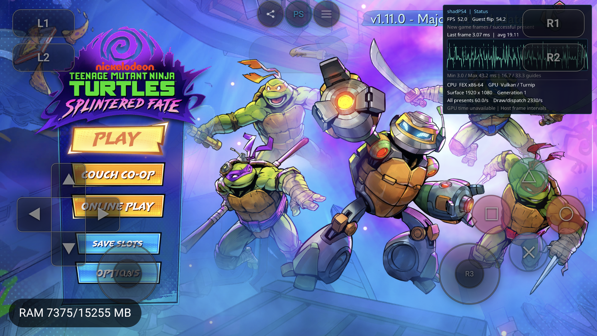

# Guest debugger 定位：HTTP2 空实现与白屏（2026-09-15）

后续用户要求的 host 正向处理已在[HTTP2 离线调用链修复](http2-offline-repair-2026-09-15.md)中记录；下文是修改前的定位和临时注入证据，不能替代后续正式产物身份。

本轮已把“画面全白但仍有约 50 FPS”追到具体 guest 调用、队列和文件字节。**当前 PKG 内的 HTTP2 调用入口直接返回成功，异步完成事件永远没有产生。** 这条调用根本没有进入 host HLE；回退 FEX/mutex 或补 host HTTP2 都不能直接改变这些指令。

对独立诊断副本只注入一个明确的 HTTP 失败返回后，认证请求结束、队列清空，真机显示正常 PLAY 主菜单；独立复验全程不挂调试器，180–310 秒均保持正常菜单绘制，显示约 37–52 FPS。中间另有一次 FMOD 同步加载等待，造成数十秒的真实 guest 0 FPS，随后自行恢复。**诊断副本不等于正式兼容修复；原游戏文件已恢复，不能据此宣称原始内容或 PLAY 后游戏流程已经修好。**

证据目录：[guest-http2-white-20260915](guest-http2-white-20260915/)。归档仅保留边界、寄存器、栈、必要代码字节和画面；认证对象的大块原始内存留在本地 build，不发布潜在玩家标识/请求头。未修改 spec，未运行完整回归。

## 1. 身份与基线回退

- 设备仅 AYN Thor `9c2841a4`，API 33 / ARM64 / 4 KiB。未操作 Swan。
- 主仓 `codex/android-fex-round2`，HEAD `4da582b7` + 原有 dirty work。
- 当前 APK SHA-256 `a01c30e38bb2075e0fd4b729d0d819bd5546a68e2b6774cc80a0213ae7330e15`。host/JNI RelWithDebInfo，FEXCore Release；私有 Turnip 未更换。
- 原始 `eboot.bin` SELF SHA-256 `6122da7190de6b08d921b2c42c3ca9ed11dc4d11524f1139ff67aeceea5b204d`。
- 从现存 1.08 PKG 重新提取，得到相同 SELF；重新展开 ELF SHA-256 `cf14264107ef499c5fcaffc97386dcee25652c16d3975d1be27edc4e7e40ede5`，与此前静态分析文件逐字节相同。不是把运行时补丁当作原文件。

按“以前正常的版本”建议，临时恢复那次记录的 11 个 main native 源文件和 FEX 清洁 HEAD，核对正常 host 的全部 1110 个源文件哈希，再重建配套 FEX/host/JNI/APK。这个 N 对照仍在 115 秒、尚未按键时白屏，180 秒仍白屏；120–129 秒四次 Circle 无进展，Stop 正常。它保留当前 Kotlin/UI，因此是**正常记录的 native 基线重建**，不是原历史 APK 的完全重现。

随后将全部 17 个临时替换的 main/FEX 文件按原字节恢复，并重新构建当前 FEX/host/APK。没有留下源码与 FEX 静态库错配。该负对照不证明每个近期修改都正确，但不支持继续盲目把白屏归于新 mutex 或新 debugger。

## 2. Guest 边界链条

以下 eboot 运行地址对应本次加载基址 `0x400000`；静态 VA 为运行地址减该基址。PID `6657` / Session generation 1 的数据是一组，不与后续 generation 2 或新 PID 合并。

1. 两段视频都执行到 `0x1927c37` 的完成事件分发，event type `0x7b0662`。已有媒体 EOF 证据在[上一轮报告](guest-white-media-debug-2026-09-15.md)。
2. 实际命中 `0x8739b0` → `0x886170` 创建 `DispatchEventAction`，`0x8739dc` 返回非空对象；两次都由 `0x190b7e0` 入队，并返回 `0x1927c3c`。
3. `OnComplete` 事件 `0x488ab` 交给启动序列。之后各级 UI action queue 都已清空，不能继续描述为“视频完成没上报”。
4. 启动对象 `0x2655e0e60`：9 个阶段，当前索引 7。该阶段入口 `0x54df50` 注册成功/失败事件，启动平台认证。
5. 认证 owner `0x2655e0400`，request `0x265612ba0`，当前状态 3。虚表名字函数明确返回 `AuthenticateWithInstallId`；状态入口 `0x81e810`。
6. 请求交给 `playfab_api` 注册项及 `json_rest` provider。HTTP worker `0x23bc00720`，待处理数组 `0x2655e9240`，count=1，item status=1；完成数组 count=0。活动请求节点 `0x2655eace0` 的状态也停在 1。
7. 在 **guest thread 23** 的实际断点 `0x18c119d` 读到 `RAX=0`，即 `sceHttp2WaitAsync` 的返回值；该调用输出在调用前清零，callee 完全不写输出。节点因此无法进入完成状态。

静态控制流与动态栈一致：`eboot+0x14c37b0` worker loop → `eboot+0x14c0ee0` poll → import slot。公开 NID `MOp-AUhdfi8` 对应 `sceHttp2WaitAsync`。slot 与 GOT 的对应由相邻保留的 PLT 跳转、16-byte slot/8-byte relocation 连续关系及动态 relocation 核对；不是把附近字符串当符号。

## 3. 直接卡点在内容内，不在这次 host/FEX 边界

该调用 slot 的静态 VA `0x15c05f0` / runtime `0x19c05f0` / SELF file offset `0x15ce0b0`，原始字节：

```text
31 c0 c3 af 77 00 ...
xor eax,eax
ret
```

相同字节同时存在于重新提取的 SELF、分析 ELF 和 guest debugger 读取的运行内存。其余保留的 `af 77 00` 是原 slot 区域字节，不会执行。host Linker 虽为对应 relocation 记录 Unsupported veneer，但控制流已在 guest 内返回，根本走不到它。

已核对该连续区域的 **21 个 HTTP2 入口**为直接返回零，包括 CreateRequestWithURL、SendRequestAsync、GetStatusCode、ReadDataAsync、WaitAsync、Init/Term 等。[逐项列表](guest-http2-white-20260915/http2-stub-audit.json)。不推断这些字节由谁、何时或为何写入；这里只确认它们已经存在于本地 PKG。

桌面处理也不是“所有异步 API 返回零就够了”：`http.cpp` 的 offline worker 会合成 transport failure 并发布失败状态；当前桌面 `http2.cpp` 的 SendRequestAsync/WaitAsync 自身仍是 return-OK stub，不能把“参考桌面”当作这个 async 契约完整的证明。对本内容，即使改善 host HLE，这些自带 return-zero slot 仍然绕过 host。

## 4. 单变量诊断与真实 0 FPS

只在临时 SELF 副本把 WaitAsync 的六字节改为：

```text
b8 63 10 43 80 c3
mov eax,0x80431063    ; existing ORBIS_HTTP_ERROR_NETWORK
ret
```

这是**失败注入**，没有网络请求、成功认证、强制清 pending、修改视频完成位或提前返回 FMOD flush。APK、FEX、mutex、Oboe、Turnip 不变。诊断文件 SHA-256 `d2c7a143f73827e7dcfbdc96a6216dddce90414865265efe01f2e055a6fa7f4d`。每轮先保存原件，结束后自动恢复并验证原 SHA。

- B：同 PID `6657` / Session generation 2，软件断点确认 WaitAsync 返回 `0x80431063`。后续出现 0 FPS；160 秒 Stop，因此这一轮单独不能作为恢复主菜单的证据。
- C：冷启新 PID `11258` / Session generation 1，UUID `549be4bdd75ebc58de37082662d2b0dd`，启动及故障形成前**没有调试器挂接**。130 秒 guest flip=804、最后一次 flip 距今 21.6 秒，复现真实 0 FPS；随后才短暂挂 debugger 读取现场。
- C 主线程的 verified RBP 链：认证失败处理 `eboot 0x58eddf` → UI/声音加载 → `eboot 0x82b3ab` → `libfmodstudio+0x954ab` → `+0xebbfa` → 1 ms sleep。该具体路径进入 `flushCommands` 共用等待实现；`+0x5cc20` 检查内部对象 `+0xb18` 指向对象的 pending 字段 `+0x1a0`。没有据此声称找到了 pending 的准确生产者。
- 此时认证 owner 的 request 指针已为 **null**，HTTP 两个队列最终均为 **0**，与原始 request state3/count1 形成直接对照。
- C 的 FMOD 等待后来自行结束。200 秒 guest flip=1725，正常显示 PLAY 主菜单，约 37 FPS；240 秒仍是正常菜单，约 36 FPS。因此这段等待不能称为永久死锁；其耗时优化仍未完成。
- D：新 PID `14071` / Session generation 1，UUID `4f85fb1d3d9ace5bf05e1583849244a5`。调试端口和 wait 属性全程为 0，无 guest debugger/LLDB 挂接。180、210、250、310 秒均显示正常主菜单；210 秒约 37 FPS，310 秒约 52 FPS，guest flip/host present 均为 7127。220 秒注入 Circle，后又注入 Cross，但最终画面仍是主菜单，**不能把输入命令成功当作已经进入 PLAY 关卡**。之后正常 Stopped/user_stop，最终 present=7152，原件恢复且 SHA 完全匹配。[未挂接复验日志](guest-http2-white-20260915/D-http-console.txt)、[额外输入记录](guest-http2-white-20260915/D-extra-input.json)。



这定位了稳定白屏的一条直接原因，并把其后的同步音效加载等待分离出来。没有验证十分钟玩法、所有 post-PLAY 卡顿、Swan 或整个 HTTP2 API。原始内容恢复后，原来的 return-zero 仍然存在；不要把诊断副本当作已经发布的游戏兼容方案。

## 5. Debugger 本身的边界与清理

- 本轮实际使用了 bounded pause、owned software breakpoint、exact stop epoch 寄存器/内存以及 verified RBP mixed-stack 接口。没有把异步 CPUState.rip 当成精确 guest PC。现有 debugger 足以找到这条链，尚无必要先回迁 Linux gdbstub。
- 当前实现已有受限 TF Step；本轮没有验证单步，MCP 的 atomic continue-over 支持仍未证明。一次重复保留已命中软件断点的继续请求被 `software_breakpoint_resume_unsafe` 正确拒绝。后续按 one-shot 先删除断点再继续，没有暗中跳过指令。
- 早期一次深追踪 RSP remote EOF 尚无确切原因；同样的两段视频边界追踪重跑成功。不把它混称为原始白屏。
- 两次本地取证脚本读空 request+offset 被 E14 拒绝；修正为先检查 null。另一轮脚本的局部变量遮蔽 Client 导致 finally 未能调用 stop_session，已修正脚本；对应 MCP 子进程结束，目标 Session 正常 Stop，残留的**本轮独占** tcp:24681 forward 手动删除。不能把该次自动清理写成 PASS。
- 最终清理已重新读取设备核验：PID `14071` 存活、TracerPid=0、Session Stopped/user_stop；两项 debugger 属性为 0、原 SELF SHA 匹配、备份已移回，独占 tcp:24681 不存在。已有 RenderDoc forwards 保留；没有操作 Swan。[最终清理记录](guest-http2-white-20260915/final-cleanup.json)。
- 增加的唯一生产代码是 `session_backend_fex.cpp` 在 terminal 时输出一次 bounded reason，避免 Service 销毁 runtime 后丢失原因；已完成 host/APK 构建。没有新增未挂接状态的热路径采样或 FEX/mutex 行为改动。

后续正式处理应从内容兼容来源入手：优先对齐桌面实际使用的同一 executable/配置，或以明确、可追踪、按精确内容身份启用的离线失败兼容处理这些 guest 空入口。不能为所有游戏盲改 PLT，也不能用新增网络/SSL工作掩盖已经绕过 HLE 的调用。性能方向继续跟进已确认的 FMOD 同步加载路径，而不是再次仅凭“看起来卡住”重写 mutex。
