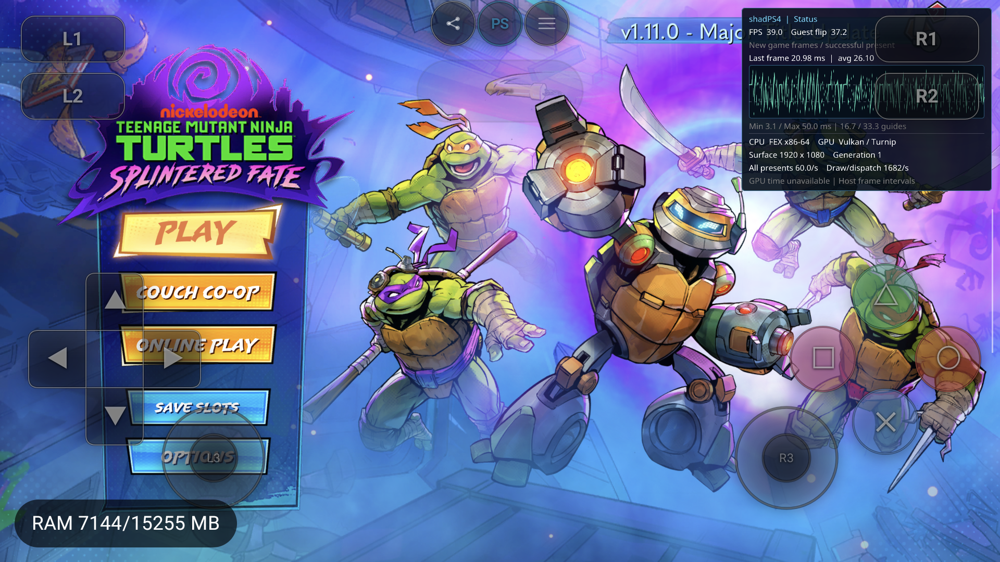

# HTTP2 离线调用链修复（2026-09-15）

本轮按用户要求，从实际 host 服务与导入调用链修复白屏。**不是实现在线认证，也不是把上一轮临时错误码写入游戏文件。** 原始 SELF 保持不变；已核验内容的加载内存恢复正常 HTTP2 导入，真实 FEX → HLE 调用创建会话资源，发送时明确返回离线失败，guest 正常删除请求并继续启动。

初次修正 VM 发布路径后的真实 APK 在 180 秒恢复 PLAY 主菜单，260 秒仍正常绘制并完成 Stopped/user_stop。最终产物也在 180–220 秒保持正常菜单绘制并 Stop，复验结果见下文及 [证据清单](http2-offline-20260915/artifacts.json)。尚未验证实际关卡、十分钟玩法或 Swan；FMOD 同步加载等待仍需独立优化。

## Desktop 对照与实施范围

- 桌面 [HTTP1 worker](../../../src/core/libraries/network/http.cpp) 的离线分支会生成 transport failure，更新请求状态并发布失败完成事件；它不是全返回 0 的空实现。
- 桌面 [HTTP2](../../../src/core/libraries/network/http2.cpp) 的同步接口复用 HTTP1，但原 SendRequestAsync、ReadDataAsync、WaitAsync 都直接返回 ORBIS_OK，没有异步完成生产者；Bachata-S4 / shadps4-arm64 参考版本也没有现成的完整实现。
- 本轮共享 [HTTP2 async policy](../../../src/core/libraries/network/http2_async_policy.h)，三个桌面异步入口都改为明确拒绝，返回当前 HTTP/HTTP2 适配层已有的 `ORBIS_HTTP_ERROR_NETWORK`。保留未知事件 ABI，不写猜测的结构体，不宣称异步发送已被接受。桌面同步在线能力保持原实现。
- [GuestHttp2](../../../src/core/host_runtime/guest_http2.h) 提供 25 个明确准入的离线 NID：上下文/模板/请求生命周期，限定配置与请求头，发送/读取/状态/完成等待/Abort/删除。每个 Session 有独立、有上限的资源表和不复用的正句柄；模板与请求的父子关系、请求数量、错误状态和清理均真实维护。
- 发送在接受任务之前失败，因此没有悬挂的完成任务或 wait，也不需要后台网络线程；失败返回不会制造 HTTP 200、响应内容、认证成功或异步事件。请求失败/Abort 后查询返回真实错误，删除仍然可用。
- Guest 字符串、缓冲区、状态输出先检查地址/长度/权限；失败输出保持原值，guest 指针不进入 host HTTP/SSL。仅持有短 VM gate/资源锁，无跨等待或回调的 pin；未增加 TLS、socket、DNS 或公网连接。
- [GuestRuntime](../../../src/core/host_runtime/guest_runtime.cpp) 仅在离线设置下创建该服务，以完整 `#libSceHttp2#1#libSceHttp2#Function` 后缀准入，并从 libkernel 通用准入中排除这些 NID。其他未知 HTTP2 API 仍具名 Unsupported。

## 为什么还需要修复导入

[前一轮 guest debugger 证据](guest-http2-white-debug-2026-09-15.md)证明，现存 PKG 已在 21 个 HTTP2 PLT 入口内写有 `xor eax,eax; ret`。补 host 实现本身不会触达这些调用。

因此新增独立的[内容兼容条目](../../../src/core/host_runtime/guest_http2_compat.h)：

1. 只匹配主模块原始 executable PT_LOAD[0]，27,475,088 bytes，完整 SHA-256 `6764ba967816a66e9d280f4d1d3496ff9f7e215c834b489a5b73be16c8dff9c6`。不是按标题名猜测或扫描任意 `return 0`。
2. 对全部 21 项核对 GOT 地址、jump relocation 类型、symbol 范围/函数类型、NID、library/module 名以及 library 版本；逐个验证原六字节。全部检查完成后才修改，缺少/重复/最后一项不符均拒绝。
3. 仅在加载内存把它们恢复为 `jmp qword ptr [rip + original-GOT-displacement]`，由正常 Linker 绑定 guest veneer/HLE。中间未改的 SSL 导入保持原字节。未注入任何游戏专用返回码或改认证状态。
4. 在现有 Prepare quiescence token 下通过 `PublishCode` 发布，随后正常 relocation/最终权限；执行开始后不再扫描或改写。只针对匹配体积的主代码段多做一次启动哈希，不增加 guest JIT/未挂 debugger 的运行时探针。
5. 磁盘 `eboot.bin` 始终为原 SHA-256 `6122da7190de6b08d921b2c42c3ca9ed11dc4d11524f1139ff67aeceea5b204d`；不保存覆盖副本或对所有游戏盲改 PLT。其他内容没有被此条目验证兼容。

这仍然是一个明确的内容兼容处理，不能描述成“只补 host 就自动解决”。未来拿到另一份桌面正常 executable 时，应重新核对来源；不扩大当前指纹适用范围。

## 定向验证与实际运行

- `guest_http2_tests` 最终 **240 checks / 0 failures**，ARM64 / Android API33 / 4 KiB。含桌面共用三个函数在 Android host DSO 中的负返回（不是桌面进程运行验收）、多个 Session 域、资源上限/错误类型、坏地址/只读输出/长度溢出、失败不写输出、Abort/重复删除/父子 Busy，以及内容指纹不匹配、重复/坏 NID、尾部字节不符不得部分修补、全部 GOT 位移恢复。
- VM 准备阶段的负例验证：持有 quiescence token 时普通 writable pin 必须被拒绝，而同 token 的 PublishCode 能发布并读回全部恢复指令。
- 真实 TMNT PID30890 / generation1 / UUID `f3cb544c8b29ff9f442e00e0296246ac`：host 初始化/模板/请求路径实际收到 guest 调用；请求句柄 6、7、8 的 SendRequestAsync 均返回 `0x80431063`，随后 DeleteRequest 返回 0。没有再把无事件的成功结果留给轮询。
- 同轮 100 秒出现真实 0 FPS（距最后 flip 约 2.3 秒），180 秒已恢复主菜单（约 37 FPS，guest flip=2059）；正常运行至 260 秒后 Stop。它对应此前已定位的可恢复同步音效加载区间；本轮没有进一步用 guest 栈证明全部等待来源，也不宣称 FMOD 性能已修复。
- 未挂 guest debugger / LLDB；使用固定私有 Turnip。host/JNI RelWithDebInfo，FEXCore Release，playstoreDebug APK。完整身份见 artifact manifest，绝不以源 HEAD 代替 dirty 源码/实际二进制身份。

## 最终 APK 复验与交付

- APK SHA-256 `37330cd7d17903d8417e4be4f01b2de5cc820bdf1e10eaba6bda0b35af05fd8e`，已核对设备安装的 base.apk 完全相同。
- host Build ID `0f5649b4d3b8f518aa568923e7908879b07c288a`；JNI Build ID `717514731d098a4ff3b5fe782737434933366fad`。源码文件 SHA、FEX dirty diff 身份均归档。
- PID `410` / generation1 / UUID `340f0cac9b86fab7e1febe345b102801`，全程未挂调试器。180 秒和 220 秒主菜单继续正常绘制，约 37 FPS；实际请求 6/7/8 均经历 HLE 创建 → 发送负返回 → guest 删除。
- 正常 Stop 到 `Stopped/user_stop`，进程存活、TracerPid=0；两项 guest debugger 属性为 0，原 SELF SHA 保持不变。保留既有 RenderDoc forwards，没有使用 Swan。
- 本轮没有输入推进关卡；只接受 HTTP2 卡点解除、菜单恢复和 Stop 清理。

## 实施中发现的问题与边界

首次 APK 在 Prepare 未完成时退出了 Service，未进入 guest；首版内容修复错误地请求普通 writable pin，与当前 VM quiescence 冲突。代码已改为 token publication，并加入对应负例；该失败轮次保留在证据中，不能算成游戏测试通过。

同时补充 Prepare 失败的一次有界原因日志，避免 Service teardown 后只剩黑屏无法追因。此前的 Run terminal reason 日志保留；这些都不是每帧采样。

本轮没有修改 FEX 子库、Foundation、mutex 或 Oboe 的执行实现，保留之前的 dirty work。没有新 spec、完整回归或 commit/push。只验证了 HTTP2 离线拒绝与当前内容调用链，未实现通用异步成功事件、HTTP2 在线协议、SSL/TLS，也没有 PLAY 后关卡或可玩验收。
