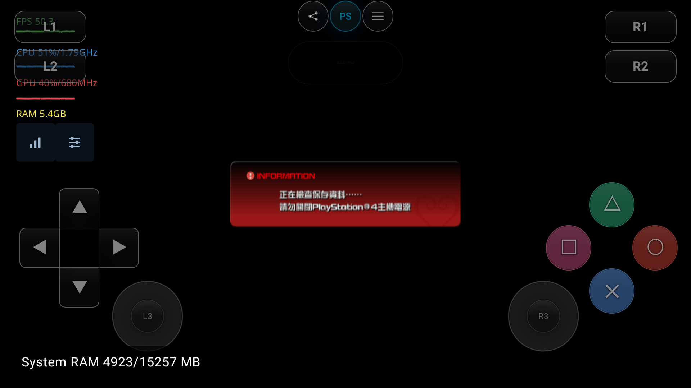

# 王国之心 III：Android 直接读取 PKG 实测（2026-10-07）

设备为 AYANEO Pocket DS，Android 13 / API 33 / Adreno 740。
接续 [PKG 文件系统验证](pkg-direct-mount-20261007.md) 与
[TMNT 实机验证](tmnt-pkg-direct-android-20261007.md)。

**结果：完整主包已传输并校验，直接挂载后进入中文“检查保存资料”界面；
尚未进入主菜单或可玩场景，不能宣称游戏兼容性通过。** 本轮没有修改或重装 APK。

## 包与挂载

- 原文件保留在 `/Users/bytedance/game/ps4/CUSA15072/HP0082-CUSA15072_00-KINGDOMHEARTSX30.v1.10[2468c.com].pkg`，没有移入 build。
- 设备文件为 `/sdcard/game/ps4/roms/CUSA15072.pkg`，47,067,103,232 字节（约 43.84 GiB）。
- 两端完整 SHA-256 均为 `5f54ed495ff03602d0f73fa70b7c1a1f723b3360ea1e1327786659a388ee2eca`。
  先传 `.part`，校验一致后改为 `.pkg`；传输约 20 分 49 秒。
- 包内 `TITLE_ID=CUSA15072`、`CATEGORY=gd`、`APP_VER=01.00`、`VERSION=01.10`。
  文件名及 VERSION 不等于独立更新包，本轮只传一个主包，没有部署 KH3 更新或 DLC。
- 游戏库自动登记 `archive.link`。包装目录只有链接、manifest、SFO 和图标，约 135 KiB；
  没有完整资源安装树。运行中 FD 99 持有主 PKG，未使用 ZAR。

[包身份与校验](evidence/kh3-pkg-20261007/package.json)、
[SFO](evidence/kh3-pkg-20261007/source-metadata.json)、
[挂载链接](evidence/kh3-pkg-20261007/archive-link.txt)、
[包装目录](evidence/kh3-pkg-20261007/wrapper-json2.txt)。

## APK、驱动与系统模块

继续使用 TMNT 最终 APK，SHA-256 为
`cad7d03c302794becb1be8bef34abe702c9586b36861b6712ba8362903043c28`。
运行时确认用户自编 Turnip `local-351a4847-barycentric-wsl`：
Mesa 26.3.0-devel / git-351a4847a0，SHA-256 为
`01a3548fbd2695f3b27ad896bfbbbf0561e28c49ad1de8a19b05745acd01ba19`。

设备原先没有 `libSceJson2.sprx`。首次启动 PID 9841 在进入 Vulkan 前失败，
冷启动 PID 10571 同样停在未支持导入
`-hJRce8wn1U#libSceJson2#1#libSceJson#Function`
（`sce::Json::MemAllocator::MemAllocator()`）。

宿主已有可选 LLE 加载路径，因此补入用户本机已有文件：

- 来源：`/Users/bytedance/game/ps4/firmware/11.00_sys_modules/libSceJson2.sprx`。
- 设备：应用私有目录 `files/host/sys_modules/libSceJson2.sprx`。
- 大小 127,784 字节，SHA-256 `6a9d3894497cdfbe8720a5720cc0ab06f4aefbc73dff6e5c86885770b58097c5`。

最终用 `adb push` 到临时文件，再由 `run-as cp` 放入应用目录；设备 SHA 校验一致，临时文件已清理。
之前 `exec-in` 写入未通过 SHA 的中间启动不计入有效验证。系统模块保留在设备，二进制不纳入源码。

补入后日志确认模块装载、`DT_INIT` 完成，游戏越过原导入错误，开始持续渲染。
[首次失败](evidence/kh3-pkg-20261007/status-fault.txt)、
[模块身份](evidence/kh3-pkg-20261007/json2-module.json)、
[设备校验](evidence/kh3-pkg-20261007/driver-json2-device.txt)。

## 存档检查停滞

首个经过模块校验的冷启动为 PID 11841，运行约 6 分钟后仍停在中文提示：
“正在檢查保存資料……請勿關閉 PlayStation®4 主機電源”。
截图时约 50–56 FPS，这是该提示界面的刷新率，不是游戏场景性能。
停止前 `guest_flip=16432`、`host_present=16432`，GPU 提交及画面持续推进，没有表现为 GPU 停滞。

对应日志中的存档调用：

| 接口 | 结果 | 首轮记录次数 |
|---|---|---:|
| SaveData 初始化 | OK | 1 |
| `sceSaveDataMount2` | `0x809f0008` / NOT_FOUND | 6,534 |
| `sceSaveDataTransferringMount` | `0x809f0000` / PARAMETER | 3,267 |

设备首次运行该标题，`files/host/home/1000/savedata/CUSA15072` 为空。
日志未见 PKG 解密、解压或读取失败，但这不足以排除所有尚未执行到的资源路径问题。

值得继续核实的代码线索：SFO 的 `SAVE_DATA_TRANSFER_TITLE_ID_LIST=CUSA16838`；
Android 的 `TransferringMount` 调用 `GuestStorage::Mount`，而后者拒绝不同于当前游戏的标题 ID。
桌面实现允许以请求的标题 ID 查找迁移存档。
**本轮没有捕获该调用的实际参数，跨标题迁移被拒只是候选原因，尚未完成根因确认或修复。**
没有伪造成功返回值，也没有创建空存档绕过检查。

[首轮状态](evidence/kh3-pkg-20261007/status-json2-stalled.txt)、
[日志节选](evidence/kh3-pkg-20261007/first-run-excerpt.log)、
[返回值计数](evidence/kh3-pkg-20261007/save-results-first.json)。

随后正常停止并冷启动 PID 12932，约 2 分钟后仍为相同提示，
`guest_flip=4460`、`host_present=4459`；再次记录 Mount2 / NOT_FOUND 1,752 次、
TransferringMount / PARAMETER 875 次。FD 102 持有同一 PKG，存档目录仍为空。
[第二轮状态](evidence/kh3-pkg-20261007/status-second-final.txt)、
[第二轮截图](evidence/kh3-pkg-20261007/second-save-check.png)、
[第二轮日志节选](evidence/kh3-pkg-20261007/second-run-excerpt.log)。

## 存档问题后续

参数取证与修复复测见 [存档迁移修复记录](kh3-save-transfer-fix-20261007.md)。
以下启动失败和停滞记录保留为修复前证据。

## 保留状态与边界

开始前正常停止 TMNT，将存档和设置备份至
`build/validation/kh3-pkg-android-20261007/device-state-before.tar`。
该目录另保存完整原始日志和失败记录，不存放主 PKG。
未执行 KH3 游戏内输入，未完成主菜单、场景、音频、存档读写或 DLC 验收。
本轮新增设备主包和 JSON 系统模块，保留原有游戏文件与存档。
复测后正常停止 KH3，最终为 `Stopped / user_stop`，主包与系统模块留在设备，
后台日志采集已停止，没有遗留输入或自动启动脚本。
