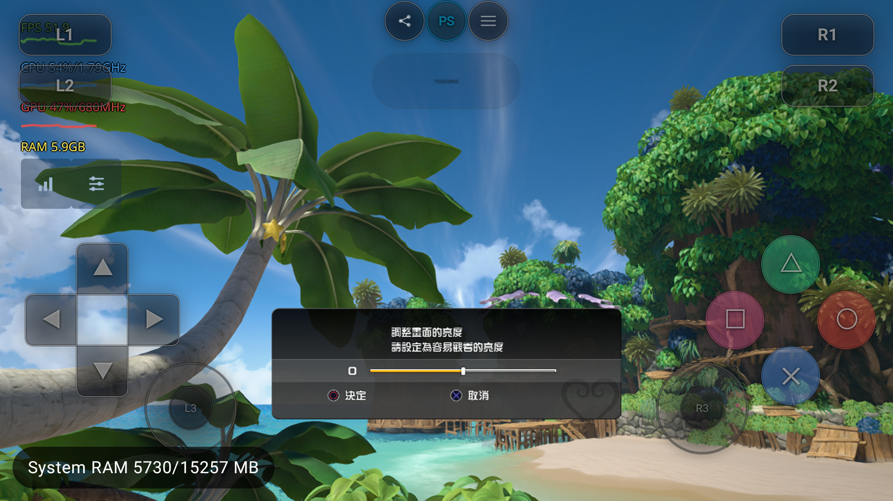

# KH3 Android：存档迁移检查停滞修复（2026-10-07）

接续 [PKG 实测与修复前现场](kh3-pkg-direct-android-20261007.md)。
设备 AYANEO Pocket DS，游戏 CUSA15072，仍直接挂载
`/sdcard/game/ps4/roms/CUSA15072.pkg`。

## 现场取证

给存档挂载 ABI 加入显式开启且每进程最多 16 条的参数诊断：
`debug.shadps4.save_mount_trace=1`；不改变返回值。诊断 APK PID 13022 复现停滞：

| 请求 | 目录 | 模式/blocks | 返回 |
|---|---|---|---|
| 当前标题 Mount2 | `kh3sv2` | 只读 / 20480 | `NOT_FOUND (0x809f0008)` |
| 当前标题 Mount2 | `kh3sv` | 只读 / 20480 | `NOT_FOUND (0x809f0008)` |
| TransferringMount，标题 `CUSA16838` | `kh3demo` | 只读 / 0 | `PARAMETER (0x809f0000)` |

三个请求的用户均为 1000，约每 100 ms 重试。CUSA16838 正是包内
`SAVE_DATA_TRANSFER_TITLE_ID_LIST` 声明的标题，实际请求目录为试玩版存档 `kh3demo`。
设备没有该存档。

原因是 Android 的迁移适配器把请求交给普通 `GuestStorage::Mount`，
它在检查文件存在前拒绝任何不同于当前标题的 ID。
因此游戏拿到“参数错误”，无法把“没有试玩存档”当作正常探测结果结束检查。
[实际参数](evidence/kh3-save-fix-20261007/save-mount-before.log)。

## 实现

- 新增 `GuestStorage::MountTransferring`，只允许同一用户下的合法标题 ID，以只读模式查找现存存档。
  共用真正的挂载实现：不存在返回 NOT_FOUND，不创建目录、不伪造成功、不写空存档。
- 普通 Mount/Mount2 仍限制当前标题；迁移不开放普通跨标题读写。
- 查找路径和 SaveInstance 使用请求的源标题；重复挂载检查比较完整源路径，
  两个标题的同名存档可以同时挂载。
- 迁移源的数据、参数、图标保留既有只读保护；额外拒绝通过 UmountWithBackup 修改源标题的备份。
  目录穿越、非法标题、不同用户和符号链接仍被拒绝。
- 参数日志默认关闭，启用时有总量限制。

## 回归验证

新增 `tests/host_runtime/guest_save_transfer_checks.h`，由 `guest_file_io_tests` 调用，
直接通过 Guest ABI 构造迁移请求。存档由临时源标题的真实保存实现创建，
验证读取正确源文件、同名目录共存、源 SFO/文件不变、写入/删除/改参数/备份被拒绝，
以及缺失源、不合法 ID、不同用户、路径穿越和符号链接。

- 修复前诊断库：**825 检查 / 4 失败**，包含缺失迁移源返回错误和现存源无法挂载。
- 修复后：**845 检查 / 0 失败**。旧版挂载失败会跳过依赖成功挂载的 20 项断言，因此总数不同。
- Android `host_library_smoke`：**30,519 检查 / 0 失败**，覆盖原有存档、对话框和其他宿主契约。
- Android host、测试程序与 fdroid debug APK 编译通过；`git diff --check` 通过。

[负对照](evidence/kh3-save-fix-20261007/tests-negative.txt)、
[修复后](evidence/kh3-save-fix-20261007/tests-fixed.txt)、
[宿主检查](evidence/kh3-save-fix-20261007/tests-host-smoke.txt)。

## 部署身份

APK SHA-256：`7286e7fdf3d5769beba1af9d7b07ac20c73181883a5d5762c62ddb75bb1ccc87`。
Host SHA-256：`395d04dcdb9718a575574ef64974c5a592ab0208e34773a87f9ba648e2b898a8`。
打包后检查 APK 内 host 与本次编译产物一致。
Turnip 保持用户自编 `351a4847a0`，SHA-256
`01a3548fbd2695f3b27ad896bfbbbf0561e28c49ad1de8a19b05745acd01ba19`。
未改渲染设置或重新传输主包；此前部署的 `libSceJson2.sprx` 保留。
[身份记录](evidence/kh3-save-fix-20261007/fixed-identity.json)。

## 实机结果

首次修复版 PID 14733：迁移请求 `CUSA16838/kh3demo` 返回 NOT_FOUND，**仅调用一次**；
此前两次本标题探测也各返回一次 NOT_FOUND，随后游戏正常创建 `kh3sv2`。
5 次成功挂载、5 次图标保存、15 次参数设置和 5 次卸载全部返回成功。
期间 CREATE 模式的 EXISTS 是随后改用读写模式打开现有存档的正常流程。
没有注入预制存档、复制其他标题数据或强制返回成功。

游戏进入首次亮度设置，岛屿场景背景可见；设备产生 `kh3sv2/data/system.bin`、
`sce_sys/param.sfo` 和 `icon0.png`，无需再安装或完整解压主 PKG。
[修复后请求](evidence/kh3-save-fix-20261007/save-mount-after.log)、
[存档文件](evidence/kh3-save-fix-20261007/savedata-after-first.txt)。

确认默认亮度后进入 Now Loading，加载结束显示“开始游戏”；按确认键后观察到黑画面，
此时帧和提交计数仍增长，未见同一存档检查循环复发。本轮针对存档阻塞修复，
未确认后续黑画面的原因，不能将其写成已进入可玩场景或全流程兼容通过。

覆盖安装前的存档和设置备份：
`build/validation/kh3-save-fix-20261007/state-before.tar`。
完整原始日志及构建记录保存在同目录，不纳入游戏或固件二进制。

## 后续黑屏：视频路径与诊断接口

PID 16208 冷启动仍越过存档检查，但 Loading 后黑屏。实际游戏截图是全黑，
帧和提交持续增长，暖缓存无待编译队列；PM4 采样平均每帧约 109 次 draw、22 次 dispatch。
这排除了“仍在同一存档重试”以及“单纯等待着色器编译”的解释，尚不能只据此归因 GPU。

原生 LLDB 附加两次均因调试器的 SymbolLocatorDebugSymbols 崩溃失败，已导出两份 journal
并确认清理。第二次附加后游戏发生 publication admission 超时，属于受取证扰动后的退出，
不能当作原始黑屏原因。改用 Guest RSP 的 PID 18607 能暂停、读线程和栈并恢复，
该版本不支持 frame-chain。RSP 会话和独占 adb forward 均已释放，调试属性已恢复空值。

进一步用只加日志的版本捕获到 `sceAvPlayerAddSource` 实际请求：
`../../../tresgame/Content/Movies/ja/copyright.mp4`，且注册了游戏文件回调。
旧 Android 适配器无条件要求绝对路径，返回 `0x806a0004`（NOT_SUPPORTED）；
原先日志文字笼统写作 invalid parameter，不代表该错误码是 INVALID_PARAMS。
[来源路径证据](evidence/kh3-save-fix-20261007/avsource-before.log)。

修复让完整的 open/close/read_offset/size 回调自行解释非空相对路径，原字符串原样传入。
没有完整回调时仍要求挂载路径；网络 URL、HLS 和空名字仍拒绝。复用同一
`HasFileReplacement()` 判定，避免部分回调被当成完整回调。

新增回归通过真实合成 MP4 验证原始路径、12 帧视频与 90 块音频；还验证无回调或缺少
任一回调时不接受相对路径、保留绝对路径用例。
旧 host 负对照 1,120 检查 / 8 失败；修复版第一次相对路径解码通过，但既有关闭期间
Play 事件计数断言失败 1 项（1,596 检查）；原样重跑 1,597 / 0。
保留第一次失败记录，不将这项偶发事件计数差异归因或宣称已修复。

实机 PID 20774 成功打开版权影片、发布 570 帧视频和 819 块音频，19 秒结束后到标题画面。
之后 ATRAC9 报错触发 `sceAjmBatchErrorDump`，Android 未登记此导入，导致 Faulted 弹框。
现接入桌面已有的诊断桩（记录日志并返回 0），不修改实际批次或 sideband 的错误结果。
AJM 测试 156 / 0；这只修复诊断导入导致的退出，ATRAC9 原始错误尚未定位。

## 手柄自动设置（同轮追加）

用户要求检测到实体手柄时自动隐藏虚拟按键，并在首次启动自动映射：

- 应用级 InputDeviceListener 初始枚举并监听连接、断开、变化，排除虚拟及指纹输入设备。
  设备清单不随游戏窗口焦点或会话销毁而清空。
- 实体手柄存在时移除虚拟控制层、暂停面板中的触控开关及设置中的 Touch Layout 入口；
  断开后恢复原触控显示偏好。移除控制层沿用其释放全部触点的逻辑。
- 尚未保存全局手柄槽时，首次检测到的至多四个设备使用与 Auto Map 相同的工厂生成配置，
  根据 HAT 轴选择方向键映射并保存设备身份。已有配置（包括手动清空的按键）和游戏覆盖不改。
  首次没有手柄不写配置，之后接入仍会初始化；存储锁保证并发初始化不会覆盖用户修改。
- 会话观察全局/游戏配置变化，应用运行中首次插入手柄后也更新映射。

RuntimeProfileStoreTest 8 / 0，ControllerMappingViewModelTest 9 / 0。
Pocket DS 原先全局 controllerSlots 为空，安装后识别 AYANEO Controller，保存 HAT 15/16
方向映射并绑定 port 0；截图确认虚拟按键消失。内置手柄物理断开/重新连接未实测。
[生成配置](evidence/kh3-save-fix-20261007/global-after-controller.json)、
[标题画面](evidence/kh3-save-fix-20261007/controller-title.png)。

包含以上修复的 APK SHA-256：`9a460b9a7193e93c1922d1dacca10456dde7206ae38076a2044e6c797bb0d6eb`；
host：`fa9048de58df725955c33df5946d9860e3c2d28230c1d061bba3c4623c9931ed`。
APK 内 host 与构建产物一致，Turnip 仍是用户自编 `01a3548f…`。
PID 23000 / generation 1 正常到达 NEW GAME 主菜单，但新游戏加载结束后仍然全黑。

## 黑屏现场与 replay 实现核对

同一 PID / generation，run UUID `ab36023b2cfb5f2178d642098e12a167`。持续有 draw、
queue submit 和 present，当前日志没有再次触发 AJM 诊断导入错误。
通过 `gpu_images` 读取真实物理 backing，并采集一个完整 guest flip 的 PM4/action trace：
`f14bea09d13b46435407cba65a3b62e9`，flip 44115–44116，10 次提交、121 个 action、
6,162 个 PM4 packet、107 个 shader，结构校验通过。它是命令 trace，不能代替可回放的
`.sgpurply` 内存快照。

| Guest 图像地址 | 读取结果 |
| --- | --- |
| `0x2045800000`（场景颜色） | 可见索拉，背景黑；RGB 非零像素约 1.17% |
| `0x2048000000`（后处理中的 HDR） | 仍有非零颜色，无 NaN |
| `0x204e800000`（800×450 后处理输入） | 仍可见索拉，RGB 非零像素约 1.24%，无 NaN |
| `0x204f800000`（800×450 RGBA8） | 全部 RGBA 为 0 |
| `0x204f000000`（下一步输出） | RGB 全 0，A 全 255 |
| `0x4000000000`（游戏最终输出） | RGB 全 0，A 全 255 |

[后处理前的实际图像](evidence/kh3-save-fix-20261007/black-95741.png)、
[全零输出](evidence/kh3-save-fix-20261007/black-95759.png)、
[帧命令明细](evidence/kh3-save-fix-20261007/black-frame.txt)。
采样是同一持续黑屏会话中先后读取，未冻结为同一帧，不能据此排除时序问题。
action 118（FS `44f1e20d409f43f7`）从 HDR 输入、两个 32³ LUT 等资源写入
`0x204f800000`，是下一步回放应重点核对的后处理环节；LUT 内容、常量、顶点与裁剪状态
尚未核验，不能断言已经定位到某个 shader 或驱动错误。

按用户要求，`feature/online_shop` 已快进合入远端 `feature/malos/swan_performance`
至 `1876c1dd2`；原有 41 个已跟踪文件的未提交改动已恢复，除需要三方合并的
`CMakeLists.txt` 外均逐字节核对一致。无冲突，`git diff --check` 与 Android host 构建通过。
设备暂保留原黑屏现场，尚未安装合并后产物。

重新 fetch 后核对了 41 个本地/远端分支引用：其中包含 replay recorder 的 7 个引用
都指向同一个 recorder blob `7ba0f6865127d40192edc5c09a1f89a1161da1e3`。
`origin/feature/astro_quest_ref` 为 `ad5c10c06`，其录制入口与当前分支一样位于
`#if !defined(__ANDROID__)` 内，`Recorder::Arm` 仍拒绝 GuestBackend。
当前设备 `gpu_replay_status` 也返回 unknown command。
仓库 `AGENTS.md` 记录 Android 回放和另一会话的 Android 录制是未提交改动；
本机工作区搜索未发现该版本或 `replay_frames.sh`。这说明已拉取代码尚未包含那份实现，
不否定另一台电脑已有实现。未将命令 trace 宣称为成功 record/replay。

## 主干 Android record/replay 合入后的实测

用户告知主干已提交后再次 fetch，当前分支快进到 `d67eb1e0e`，包含
`e6ced0fd7` 的 Android 录制与回放。恢复原有未提交的 PKG、存档、音视频与手柄改动；
`guest_runtime.cpp` 同时保留 `.sgpurply` 启动入口和 PKG 挂载入口。Android host 与 APK
编译通过，安装后仍加载用户自编 Turnip `01a3548f…`。

20:45 在 PID 29107 / generation 1 / run UUID
`4cba9819bf3a0a5ea2f81b5ed3f5ba80` 的黑屏现场录制两帧：
`kh3-black-20261007.sgpurply`，约 503 MiB，20 次提交、329 个流事件。
原始文件、设备输出帧与日志保留在本机
`build/validation/kh3-save-fix-20261007/replay/`，不放入 Git。

首次回放在 `Liverpool::ProcessGraphics` 的 type-0 PM4 断言退出。核对录制内容发现：
第一帧的 8 个 Android 宿主命令副本没有附加到 Submit 记录，只留下旧进程的 tagged
宿主地址；第二帧的 8 份副本完整。原因是它们在录制开启前已经排队，
`NoteSubmitContents` 仅在提交时、录制已经开启时保存内容。旧 `sgpurply.py check`
只检查流的结构与先后顺序，未发现该遗漏，不能将它的通过视为可回放性证明。

修复将宿主副本的采集移动到第一次 resume 前，由 task 保存指向 coroutine 自有副本的
span；录制之前排队、录制之后执行的提交也会保存完整内容。回放器遇到旧的缺失副本
记录直接报告失败；Python 校验也增加对应检查。对原始文件的负对照正确报告 8 次遗漏。
另外给 Android 回放增加 `dump,events=<first>-<last>`，限定导出范围，可与
`draws=<event>` 合用检查逐 draw 的真实 Vulkan 图像，包括 3D LUT。

此处修复的是取证工具，尚不能据此声称王国之心 3 黑屏已修复。

### 第二次录制与管线缓存根因

`kh3-black-r2-20261007` 来自 PID 1366 / generation 1 / run UUID
`688ed87388aa5c081dc03e9c06d6221a`，两帧、20 次提交，全部宿主命令副本完整。
回放完成 319 个执行事件、262 次 wait poll、0 divergence。两次录制 flip 只导出了一张
回放 PNG，因此当时的全黑 PNG 不能证明两个对应帧都一致。

第二帧 event 276 的逐 draw 图像读回：

- draw 28、29：FS `bf93e1b9a9b13256` / `dc5e60886f079912`，共用
  ES `87643fcb61eeb549`、GS `87643fcb39dd575f`；两张 32³ LUT 的全部 131,072 字节
  均为零（读取其后创建的完整 3D backing，而非仅第 0 层）。
- draw 30：FS `44f1e20d409f43f7`，HDR 输入有颜色，曝光 1×1 RG32F 为 `[2, 2]`；
  输出 RGBA8 的全部 1,440,000 字节为零。后续拷贝只有 alpha 变为 255。
- 将原 recipe 缓存临时移走、重新翻译着色器后，两张 LUT 的哈希从
  `e7488e240cc78ea7` 分别变成 `2fc1875e6e78db2d`、`e8d72f1ca1df15f9`；
  色调映射与其后的输出可见索拉。原缓存已恢复，驱动缓存与自编 Turnip 未替换。

根因落在 `PipelineCache::LoadPipelineStage`：预加载按 Fragment → Vertex → Geometry
恢复阶段信息，Geometry 没有 fetch shader，却通过 `LoadShaderMeta` 把此前 Vertex
恢复出的 `fetch_shader` 覆盖为空。运行时编译路径已有“非空才更新”的规则；
缓存加载缺少相同规则，创建出的 GS 管线因而不绑定顶点输入，调色表绘制无输出。
修复让缓存加载同样只在当前阶段带有 fetch shader 时更新它，不修改缓存文件格式。

另补录制边界的 flip 通知竞态：旧实现检查 IRQ 队列为空后，先执行耗时 GPU 写回，
再开启通知并清空待记队列；写回期间登记的下一帧 EOP flip 因此丢失。
现提前开启通知，再检查 IRQ 队列，并保留写回期间到达的通知。待新包实测确认。

尝试过将第二个 FS 换成固定色的诊断，但该替换未实际生效（无加载确认，输出仍有
27,868 种值），不用于因果结论。对应临时 shader 文件已删除，游戏 profile 已按备份恢复。

### 第三次录制：最终黑屏来自游戏提交的不透明遮罩

修复后的 warm recipe 回放与移开 recipe 后重新编译的结果，全部 198 条图像哈希相同。
原缓存已恢复，不需要清空用户缓存。此验证只证明上述 fetch 恢复修复，实机仍然黑屏。

安装 APK `32ec989018c158d1750f72d5ae0a8f02749fd93744ab4d5d9ef4ff3b89344731`
（host `bf0ff4bb6425693af1eecf83de677f04cf31404b83b5e8c9deb901c697030f0d`）后，
在 PID 10020 / generation 1 / run UUID `988d635cf39fe527caa6cd3d1f2ffa1d`
录制 `kh3-fixed-r3-20261007`。两次 EOP armed、两次 flip 均完整；回放 320 个执行事件、
262 次 wait poll、0 divergence，输出两张 PNG。两帧均与录制时设备输出逐字节一致，
哈希都是 `95b680c41cc1ed0c`。这次确认了黑屏可以在脱离游戏 CPU 后重现。

对第二帧最后一次 resume（event 311）逐 draw 读回：

- draw 0 / PM4 action 120，FS `493e67e5db3634e8`：最终缓冲 `0x4000000000`
  已有索拉，哈希 `bfe35e5aa99f71ec`。
- draw 1 / action 121，FS `a0e85c5d98817438`：同一缓冲变成全黑，哈希
  `95b680c41cc1ed0c`。
- 对齐该 replay event 的录制内存与同一次回放的 PM4 trace
  `f473cdbab2bffe6eb9875ac688c67ca6`：顶点表 `0x20198442e0` 指向
  `0x20198529f0`，stride 64，四个顶点覆盖 `(0,0)` 至 `(1920,1080)`，
  四个 RGBA **全部是 `(0,0,0,1)`**。纹理 `0x2000840400` 为白色；
  blend `0x61000504` 为 `src_alpha * src + (1-src_alpha) * dst`。
  因此这次最后一层的黑色和不透明度来自 Guest 数据，不能归因于最终显示拷贝。

[两帧摘要](evidence/kh3-save-fix-20261007/r3-replay_summary.txt)、
[最终两次 draw 哈希](evidence/kh3-save-fix-20261007/r3-final-draw-image-hashes.txt)、
[顶点与 blend 证据](evidence/kh3-save-fix-20261007/r3-overlay-inputs.json)。

随后真实游戏 PID 13429 / run UUID `ce834ab68d223f6b3bd1e01e971a5569`，
短时只跳过上述 UI FS，能显示索拉，背景仍黑；恢复后重新全黑。
[原画面](evidence/kh3-save-fix-20261007/r4-black.png)、
[诊断跳过遮罩](evidence/kh3-save-fix-20261007/r4-no-mask.png)。
跳过只是因果验证，已移除，不作为修复。暂停键没有出现可见菜单。
当前进一步排查 Guest 为何保留遮罩；尚未证明是加载、过场或音频等待。

## 开场流程定位与 Android Videodec2 接入

R3 的录制内存不只包含 GPU 输入，也保留了游戏可写内存。根据 eboot 的反射注册表、
UObject/FName 和属性偏移还原出以下状态（[精简证据](evidence/kh3-save-fix-20261007/r3-cutscene-state.json)）：

- 当前关卡 `bt_50`，`bt_50_gameflow_C` 已发送 `bt_50_gameflow_REvt_cutscene_bt50_bt051`。
- `cutscene_bt50_bt051_C` 已把视频名转换为 `Tres/mv_bt051.usm`。它的字节码包含
  `TresUI_PrepareVideo` → `TresUI_WaitForVideoPrepare` → `TresUI_ResumeVideo`；后续才等待视频结束。
- `bt051a` 的 `bIsPlaying=false`、`InterpPosition=0`；摄像机的 FadeAmount=0，fade enabled 位未置。
  最终黑色 draw 因而不能直接解释成摄像机淡出仍在运行。
- R5 实机主线程和 worker 的多次 Guest 栈发生变化，主线程包括 GameEngine.cpp 的 Tick 路径；
  没有证据支持“主线程一直死锁在同一处”。Host 部分是 HLE 边界历史栈，不能当实时 native unwind。
- R5 启动日志明确 `sceSysmoduleLoadModule(0xcf)` / `libSceVideodec2` 返回 `0x805a10ff`，
  游戏导入的 9 个 Videodec2 函数全为 `refused/unsupported_import`。版权 MP4 的 AvPlayer 正常
  不能排除 USM 所使用的另一条视频解码路径。

新增 `GuestVideodec2`，把已有 FFmpeg Videodec2 实现接到 Android 的受检 HLE：
12 个查询、队列、创建/销毁、Decode/Flush/Reset、picture info 接口，按完整 library/module
后缀接纳，并发布 `libSceVideodec2` 系统模块。解码器使用会话内句柄；压缩 AU 复制到带
FFmpeg padding 的宿主缓冲；输出 ABI 与 NV12 缓冲一起取得可写 pin，返回前将指针还原为
Guest 地址。支持 0x30/0x38 两种 OutputInfo。Guest 线程退出后销毁全部解码器。

共享解码器同时在 Decode/Flush 写 NV12 前检查图像和 picture info 的完整容量，缓冲太小
返回错误而不是断言或越界写。Android 原生测试使用生成的 64×32 白色 H.264 帧，检查跨映射
AU、只读输出拒绝且不消耗包、正确 NV12 像素/尺寸/PTS、Guest 指针、旧版结构末端 canary、
过小缓冲、Reset/销毁后句柄失效；707 项检查 0 失败
（[结果](evidence/kh3-save-fix-20261007/videodec-tests.txt)）。Native host 和 APK 编译通过。

R6 APK SHA256 `4d62079dcfb0bb6890e49d694a9c0affeef245a8288eaa164a9d941a40ec4881`，
host `d39cf7524500ab89605a08c3c1d0fbff4be837e57ab7433e58f8f816a16ca8d0`；
PID 19475 / generation 1 / UUID `fc9aa0f91f949c9cf2ba86206126f2db`。
继续使用用户 Turnip `01a3548f…`，未开启 draw_skip 或替换着色器。
22:32:45 Videodec2 模块加载成功；22:33:12 创建 AVC 1920×1088 解码器，启动影片已显示。

22:36:19 新游戏加载结束后创建第二个解码器，原先持续黑屏的位置已显示棋局开场影片与中文字幕
（[截图](evidence/kh3-save-fix-20261007/r6-opening-cutscene.png)）。用户确认视频正确播放。
随后已进入彩色玻璃平台的 3D 场景，仍有严重性能问题；不能把视频恢复等同于全游戏验证完成。

Guest RSP 会话 `gdbg_1794ee2f4f7a4972a43416524ecf6b04` 已停止，Guest 恢复运行，所属 adb forward
已删除，guest_debug_port/guest_debug_wait 属性已清空。录制、ELF 和全量内存分析放在
`build/validation/kh3-save-fix-20261007/`，不提交大型文件。

## 视频恢复后的 litep 采集：约 6 FPS（22:45–23:01）

用户要求保留当前卡顿数据并初步判断瓶颈。本轮没有修改性能代码或重启游戏。
全部原始 PROF、生产者 sidecar、SQLite 索引、截图、CPU 采样放在
`build/validation/kh3-save-fix-20261007/litep/`；小型证据与文件 SHA 清单见
[evidence/litep](evidence/kh3-save-fix-20261007/litep/manifest.json)。

### 保存的记录

| 记录 | 范围 | 完整性与用途 |
| --- | --- | --- |
| `ring-1791384319582738-1` | 119 个完整提交周期，约 5.4 s；影片阶段 | 0 丢块、无容器截断；无 GPU 计时 |
| `ring-1791384631926435-2` | 99 个完整提交周期，约 16.7 s；玻璃平台约 6 FPS | 0 丢块、无容器截断；保留 1,560 对 GPU zone；每线程保留范围仍不同 |
| `file-1791384776187297-1` | 12 s 连续采集，67 个完整提交周期，231 万事件 | 正常收尾，但 44 个 SDK overload 标记；保留缺失诊断，不能当作完整线程覆盖 |
| `ring-1791385208926815-3` | GPU 计时恢复关闭后的 4 个 marker | 0 丢块；3 个周期均值已达 658 ms，只代表这一短窗口 |
| `simpleperf.data` | 后续 9.96 s，cpu-cycles 500 Hz、帧指针栈 | 13,218 个样本，丢失 7；内核符号地址受限；未改系统限制 |
| `schedstat-10s.json` | 同期另一个约 10 s 窗口的每线程 schedstat 差分 | on-CPU / runnable 可用；未与 PROF 做跨时钟逐帧绑定 |

生产者仍为 PID 19475 / UUID `fc9aa0f91f949c9cf2ba86206126f2db`，APK `4d62079d…`，
用户 Turnip `01a3548f…`。文件采集切换后 profiler recording generation 从 1 变为 3，
游戏 generation 仍为 1，不跨边界拼接。

Litep 0.3.0 包拒绝 `0b467a8…+slow-frame-v1` 后缀。核对本地与工具内的 decoder、flows、
dependencies、intervals 四个模块，只有包相对 import 的差异；slow-frame 设计明确不新增 wire tag。
保留原始 PROF 和 sidecar 不变，仅在 `decoder-compatible/` 派生副本选择已核实的基础解码器，
同时保存 `producer_sdk_revision`、模块 SHA 与解释，见 decoder-compatibility.json。

### 当前证据指向 Guest 内存映射更新热点

- 第二份快照提交周期平均 **168.44 ms**、中位 **170.73 ms**、p90 **191.88 ms**，
  与约 6 FPS 一致。GNM marker 是提交周期，不是成功上屏时间戳。
- 提交线程 **Guest-31 / TID 19643** 每周期 **157.79 ms** 在 `pthread_cond_wait`，
  命令提交接口约 **1.30 ms**。最慢周期 215.84 ms，其中条件变量等待 187.75 ms。
  这证明提交线程大部分时间在等，但当前没有 selected-notify 记录，不能据此指定唤醒者。
- 同场景 GPU 状态中 `GPU.GuestFrame` 约 **31.9 ms**，FSR 约 1.6 ms；屏幕与 sysfs 观察
  GPU busy 约 29–32%。这支持先排查 CPU 侧生产/同步链路。GPU query 未校准到 CPU 时钟，
  不能把 31.9 ms 强行对应到某一个 GNM 周期或把差值称为空闲时间。
- 独立 schedstat 窗口中 **Guest-57 / TID 19761** 占一颗核的 **66.95%**，runnable **1.57%**；
  Guest-51 29.78%、Guest-1 22.14%、Guest-44 21.90%、GpuComm 17.80%。整机 CPU 不满不能排除
  少数线程的串行瓶颈；这也不是所有线程都在等调度的证据。
- Guest-57 的 cpu-cycles 样本中，**PoolCommit 含子调用占 75.75%**，
  **UpdateDataMapping 含子调用占 68.60%、自身 43.56%**；全进程的该函数自身占 **13.47%**。
  同时可见 Mapping vector 的 `push_back` 与 `any_of`。包含关系不能相加。
- 对照 `src/core/guest_cpu/api/address_space.cpp:1727`：`UpdateDataMapping` 持地址空间锁，
  每次检查全部映射是否涉及可执行页，再遍历、复制整个 Mapping vector 构造更新结果。
  `FindContainingMappingLocked` 快速命中失败后也线性查找。最后一份短快照中 Guest-57
  有 2,470 次 `VM.DataMapping`，已保留完整调用共 1.09 s，`PoolCommit` 单次最高 121.6 ms。
  **当前最明确的优化候选是映射表的全量扫描/复制与批量 PoolCommit 的调用方式。**

尚未证明的部分：映射数量是否持续膨胀、Guest-57 与 Guest-31 的完整依赖链，以及优化该路径
对最终帧率的收益。下一步应保留权限、pin、失败原子性与映射边界语义，测量映射条目数量、
每次触及条目数量、锁持有时间，再考虑区间索引和批量映射；不要通过放宽范围校验解决性能。
第二份环形快照的 Guest-1 只保留末尾约 5 个周期，不能用全窗均摊值解释主线程。
连续文件有 44 个丢块，也不能把其中无事件区间认定为 idle 或 JIT。

设备 Thermal Status 为 3，记录了温度；尚无这次完整频率/温控因果对照。
已关闭临时 `gpu_timing`，常驻 ring 恢复开启；simpleperf 已退出。原生解码单测的设备临时目录
与已拉取的 perf.data 已清理。本轮稍后服务不再存在、前台已是其他内容，未自动重启 KH3。
