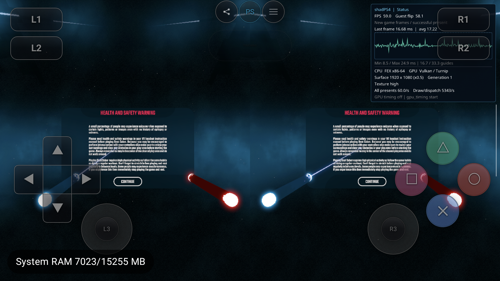

# Android MSAA 策略与陀螺仪转轴修正

2026-09-21，AYN Thor `9c2841a4`。本轮在 Beat Saber 分支完成，随后按用户要求集成到 `malos/main`。以下是验证时点记录，不代表三款游戏完整可玩或全量回归。

## 结果

- 正常模式保留游戏的 MSAA；颜色图、深度图、pipeline 使用一致的实际采样数。预留 STORAGE 不再使支持 2×/4× 的颜色图静默变为 1×。
- Android Settings → Graphics 新增 **Force Disable MSAA**，默认 Off，支持全局和每游戏覆盖，重启游戏生效。On 将物理附件、pipeline 和 shader 图像访问统一为 1×；不是仅关闭 pipeline sample shading。
- 陀螺仪按会话初始重力建立头部坐标系，解决平放/翻盖设备水平转向与侧倾混用。启动仍朝正前方。用户在最终包上确认“**三个方向都正常**”。

## 实现边界

原始故障定位见 [viewport / MSAA 报告](beatsaber-viewport-msaa-20260921.md)。`ConfigureImageSamples` 在可选 STORAGE 限制 MSAA 时重查具体用途；若最终仍不支持要求的采样数，明确报出格式/用途/采样错误，不再让图像静默降级。绑定颜色/深度及建立 pipeline 时增加一致性检查。

`Vulkan::Instance` 在会话启动时捕获策略。Guest 的内存布局、描述符和逻辑采样数保留；host backing、image view、pipeline key、重解释及 resolve 使用有效采样数。关闭 MSAA 后，Guest MS 图像生成非 MS 的 SPIR-V 类型；fetch 使用 LOD 0，移除 Sample 操作数，多个逻辑 sample 对应同一物理 texel。正常模式继续处理 sample 索引回绕；正常 MS storage read 补 Sample 操作数及 `StorageImageMultisample` capability。ShaderBinaryVersion 升到 12，缓存 profile 包含策略。

强制关闭属于实验性画质/资源策略：依赖独立 sample 内容的效果可能改变。AYN 不支持 MS storage，本轮没有宣称模拟该硬件功能或所有格式/采样数组合。GPU 回归覆盖的是实际支持的 2×/4× 颜色/深度、2D/array、sample fetch、尺寸查询及 resolve/copy。

Settings 的 BOOLEAN 编辑路径同时补齐触摸 Off/On、手柄切换和严格类型校验。原先 Android 编辑器只接受 ENUM；首个 APK 的开关尚不能通过 UI 编辑，该版本不作为设置入口验收。修正版已在真实 UI 切 On，磁盘配置只增加目标字段；最终恢复原配置。

陀螺仪优先使用 TYPE_GRAVITY，没有时用加速度计；四次稳定重力样本后，以重力为头部 Y 轴、屏幕右向在水平面的投影为 X 轴、叉积为 Z 轴。校准前保持默认前向；校准后冻结坐标基，后续真实转动不会被逐帧重力重置抵消。新会话重新校准。横屏 90°/270° 的向量基转换也纠正了符号。无重力传感器时保留屏幕轴回退；尚未测试无传感器设备及长期漂移。

## 验证

证据目录：[文件与 SHA manifest](msaa-policy-gyro-20260921/manifest.json)。构建命令：

```sh
cmake --build build/android-host-api33/native --target android_msaa_image_probe -j 6
cd android/shadps4-app
./gradlew :core:runtime:testDebugUnitTest :feature:settings:testDebugUnitTest :app:assembleFdroidDebug
```

| 检查 | 结果 |
|---|---|
| Qualcomm / 保留 MSAA | 26,154 checks，0 failures |
| Qualcomm / 强制 1× | 26,154 checks，0 failures |
| Turnip / 保留 MSAA | 26,154 checks，0 failures |
| Turnip / 强制 1× | 26,154 checks，0 failures |
| 生成 SPIR-V，`spirv-val --target-env vulkan1.3` | 48 模块通过 |
| Kotlin runtime / settings | 120 / 14 tests，均 0 failures |

GPU probe 使用生产 Image/backing/view/Resolve 和 shader emitter。按 sample mask 写不同颜色，逐 sample 读回，再核对正常 resolve 平均值或关闭后的单样本 copy。覆盖 2×/4× 和 2D/array。首次夹具的 ClearValue 初始化编译错误及修正记录保留；不把失败版本算通过。

最终 APK SHA `e727bef6762ed16e477092dc2dc8d60b0b44679d94d6a52d0bf7d375d1818119`；host `47e4c36cd5104c8b9aa69a4a5b7c4e1b1b20798c0903a4ccdad112bcc34a0184`；JNI `3c23c2ffd04e12ca3d066a0f160faad57f56d764e2b7db8972c55c5d4ef9696c`。已核对本机构建 host、APK 内库和设备完整 APK 的 SHA。GPU 四组测试使用同一 host；早期 APK `263f5394…` 只是中间构建。

最终包 / Turnip / Render0.5 / TextureHigh / SBS：

| 模式 | PID / generation / run UUID | 观察与退出 |
|---|---|---|
| 保留游戏 MSAA | 10176 / 1 / `760c68f39823780efcdef8ba9f4b5006` | 双眼提示/Continue/光剑分离；用户测试三轴正常；UI Stop → Stopped/user_stop，guest return 2147614724 |
| 强制 1× | 11099 / 1 / `d8b2eb09f340fdb73882d2ff6d80c21c` | 双眼提示/Continue/光剑分离；UI Stop → Stopped/user_stop，guest return 2147614724 |

原会话 PID27583 已获用户明确批准停止。安装最终包前另观察到 Tetris PID8848，会话正常 UI Stop / user_stop / return60；不把它记录成 Beat Saber 或本轮 Tetris 验收。

PID10176 的初始重力日志为 `rotation=1, gravity=[-1.509173,-0.66713583,9.666836]`，符合机身接近平放；PID11099 独立重新校准。普通模式截图在用户转动后视角倾斜，是这次采样的实际姿态；三轴正常的结论来自用户手动确认，不是凭静态截图推断。



这些仅是安全提示页的实测；Continue 交互、歌曲及其它游戏未验收。截图中的 FPS 受视角/交互影响，未做严格同场景性能 A/B，不据此声称提速或总 RAM 下降。

终态 Library PID11907、session:none、TracerPid0，无本轮 debugger/forward/capture。全局配置已逐字节恢复（Turnip/0.5/High/SBS/gyro；强制关闭 MSAA 回到默认 Off）。临时探针文件只在设备 `/data/local/tmp/shad-msaa-policy-20260921`，无活动进程。

公开合同：[Vulkan / SPIR-V 笔记](../../../references/psvr-public-api/vulkan-msaa-notes.md)、[Android gyro 笔记](../../../references/psvr-public-api/android-gyro-notes.md)。
