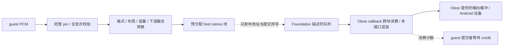

# Android AudioOut：Oboe 回调消费与单次 guest 数据转移

本轮执行音频设备这条线。生产 AudioOut 已由同步 AAudio 写入改为 Foundation / Oboe callback 消费；FEX 高频 mutex 的 guest 编译代码与 host bridge 快慢路径是独立后续线，本轮没有改其生产协议。此前未提交的 AvPlayer、时钟、profiler 和输入修改保留。

## 实现与数据归属

这是 **一次 guest → host PCM 转移**，不是对整条 Android 音频栈“零拷贝”的声明。音频描述符读取不算 PCM 搬运；Oboe/系统内部仍可能按实际设备要求进行格式转换或重采样。

- `GuestAudio` 在打开端口时预分配 stereo 块。提交时先检查句柄、批次形状与指针，随后释放 pin 等待 credit；取得 credit 后重新 pin 全部输入，直接转换到可复用 host 块。没有先 `Read` 到临时 PCM vector，再复制到另一份 FIFO 的步骤。
- 全批次 pin 成功后才修改任何输出块；转换融合 S16/F32、unaligned 读取、普通/Std 布局、每声道音量、总音量、mono 扩展和桌面 8→2 下混矩阵。沿用桌面省略 LFE 的策略；最终多源混音限幅。音量在块被接受时取快照，之后调整影响后续提交。
- Foundation 队列只保存借用的块地址、帧数、offset 与批次 epoch。一次 callback 可以跨多个 guest 块，也能仅消费块的一部分。只有整个块消费结束，host 才能复用其槽位。
- 多端口 `Outputs` 使用同一设备的发布 epoch。callback 在开始时固定可见 epoch，因此不会消费发布到一半的批次。准入/关闭由 host domain 串行化；callback 不读取 guest 指针、不调用 FEX、不取得 VM gate、不分配、不通知条件变量、不写 profiler/log。
- guest 调用返回后可以立即改写自己的 PCM，已接受的 host 块不受影响。pin 和 VM gate 不跨队列等待或设备 callback。

主仓实现：[GuestAudio](../../../src/core/host_runtime/guest_audio.cpp)、[Orbis / Oboe adapter](../../../src/core/libraries/audio/oboe_audio_out.cpp)、[融合转换](../../../src/core/libraries/audio/audioout_transfer.h)。通用实现与借用寿命约定见 [Foundation audio](../../../foundation/modules/audio/README.md)。

## 消费、背压和生命周期

生产 callback 路径不创建每端口的 `shad:AudioOut` worker，也不再叠加软件 period。所有端口通过同一个 `OboeAudioOut` 实例共享 stereo endpoint。旧 worker 保留给普通同步 PortBackend 和既有契约测试。

端口预算从实际 burst 计算，至少三个 guest 块，并覆盖约两个 burst；上限32块。比如本机 burst960、512-frame guest block 会分配4块，而256-frame端口分配8块。容量按帧预算设计，不把 callback 大小错误地等同于 guest block 大小。

满队列只阻塞提交者。它在释放 VM/pin 后以可取消的1ms等待读取消费计数；callback 只发布原子计数。null Output 等待调用开始时的 accepted watermark，新 producer 不能把这个 drain 无限延长。设备消费计数、host观察到的兼容 `last_output_time` 和设备 timestamp 分开：没有把 callback 消费冒充 DAC 已播放。

正常 Close 和 Session Stop 都先停止源的准入，撤销尚未消费的块，并等待已经进入的 callback 离开后才归还 host 缓冲区。Stop 保留取消语义；不会假装已消费所有尾音。最后一个端口销毁时释放设备。

每次开流有独立、由 Oboe shared stream 保活的 callback 对象。断开回调只发布关闭完成事件；非实时控制线程重建流。未消费的源尾部继续保有，已经送入 Android 的 PCM 不重播；断开时设备缓冲中的音频可能丢失。重建失败或存在待播放 PCM 却超过2秒没有 callback 进展，报告设备错误，避免无限等待。显式 `RequestReopen` 与自动断开走同一控制流程；退出会阻止旧代流重新启动。

## 诊断与实际配置

默认明确选择 Oboe AAudio；保留 Foundation 配置选择 OpenSL ES 的能力，没有新增面向用户的驱动选项，也没有照搬 Citron 强制 OpenSL 的历史配置。设备请求 Shared / LOW_LATENCY / Float stereo / 48kHz，允许 Oboe 做必要转换，按 granted burst 请求2倍使用缓冲。

非实时 observer 每秒记录实际 api/performance/sharing/rate/channels/burst/capacity/size、callback次数、输出帧数、真实源消费量、源欠供给、xrun、timestamp和重建次数。`Audio.SourceStarvedFrames` 包含已打开但暂时闲置的源，不等于物理设备 xrun；补零不增加源消费量。

普通 APK 的32块 guest 音频测试仍显示 `LOW_LATENCY → NONE`，虽然 callback 已经 ON。因此本轮接受的是回调消费、拷贝/生命周期正确性；**不宣称本机已经进入 FAST/MMAP，或测得端到端低延迟**。

## 验证

证据见 [本轮目录](2026-09-15-oboe-audio/)。只进行改动相关检查，没有运行完整回归。

| 范围 | 结果与覆盖 |
| --- | --- |
| AYN / API33 / 4KiB host AudioOut | **123/123**：原语义、一次 pin→prepared→同址发布、预分配槽位复用、跨块消费、坏指针批次无部分发布、满队列无 pin、取消、水位 drain、下混与错误 |
| Foundation portable / 真机 | **40/40**，callback 分配计数0；借用描述符、批次可见性、混音、partial buffer、源退役与并发复用 |
| macOS Clang23 | 上述40项在 ASan/UBSan 和 TSan 下分别通过；系统 Xcode libc++ 缺少 stop_token，保留初次编译失败，没有修改模块去假支持 |
| Oboe 静音设备生命周期 | 三轮、每轮两个不同块大小的 source、一次受控设备重建；该阶段1197项动态提交/生命周期检查0失败。不是物理拔插或听感验收 |
| 普通 APK / 真实 FEX | `AudioRuntimeInstrumentedTest` 通过；同 PID20098 三轮，13个真实 import、每轮32块PCM、坏指针、drain、关闭、旧句柄拒绝与既有信号量检查 |
| 生产 host / APK 构建 | canonical `HOST_LINK_PASS`；host/JNI RelWithDebInfo，沿用已有 FEXCore Release；APK 与打包 host 哈希见 artifacts |

**TMNT 120秒定向观察也已完成**：普通 APK、PID20416、API33/4KiB、固定 Turnip；真实 guest 产生3909次 present，Stop 返回 CANCELLED，JUnit通过。音频 endpoint 保持 api2 / perf10 / stereo48kHz / burst960 / buffer1920；最后采样 xrun0、重建0、error0。稳定阶段 observer 相邻采样多数消费48000帧、偶有48960帧；observer约每秒执行，不能把这些差值当作独立高精度时钟测量。

累计消费6227776帧是所有 source 的合计，不能与设备5552640输出帧直接一比一对账：电影等多源并行阶段会同时消费多个来源。117条最新 endpoint observer 记录及 PID 过滤日志已归档。此次没有按圈触发流程、采集声音或验证画面正确性，**不宣称听感、白屏、场景推进或 FMOD flush 等待已修复**。测试结束后流正常关闭，Instrumentation进程退出。

## 子仓与构建入口

新增独立 `externals/oboe`，固定 Citron 使用的 `987538b6ec4cb9e699b117a890e686de7a9302fa`。通过 gh 在 `tencentmalos/oboe` 创建并核对 `codex/shadps4-audio`；未修改 Oboe 源码。Foundation 仍在既有 `codex/shadps4-android-fex-v0`，新增 `modules/audio`，没有把 Oboe 塞入 Foundation。

本轮实现尚未 commit/push；Foundation 新模块与此前 profiler_ring 本地工作都要随各自 child 正确保存，主仓旧 gitlink 不能代表这些未提交内容。不得把已存在的 Foundation 远端分支解释为最新音频实现已发布。

继续使用 `scripts/android/build-host-android`，该脚本现在把实际 Foundation audio 源文件加入 source manifest。APK 使用现有 `build/fexcore-android-api33`（API33、c++_shared）；本机旧 local.properties 误指 `build/fexcore-android` 的构建被校验拒绝，现已纠正。没有绕过 FEX provenance 门控或重编另一套 FEX 来掩盖配置错误。

本轮 host Build ID：`badb52cd40c31a3bc1f24f35742911f37687369e`；JNI：`3c0867b6790a9c0be1d48367faff0ba9526452b1`；APK SHA256：`e6f92f070434d97f2bf27082903eded8fb640dde78228355edf8550c145ad59c`。主仓基点 `4da582b7` + 既有修改 + 本轮音频修改，精确文件/子仓状态单列在 source manifest。

## 下一条线的边界

FEX 高频 mutex 后续沿已验证的 guest C/C++ 原型推进 host/FEX bridge：无竞争路径尽量留在 guest；有竞争、阻塞与唤醒进入 host 慢路径。递归/错误检查、cond 释放与重获、取消、销毁及 VM remap 必须共享一套协议。不要把本轮 Oboe callback 当作执行 guest mutex 或 guest 回调的线程，也不要删掉 FEX 执行准入来换表面低开销。
