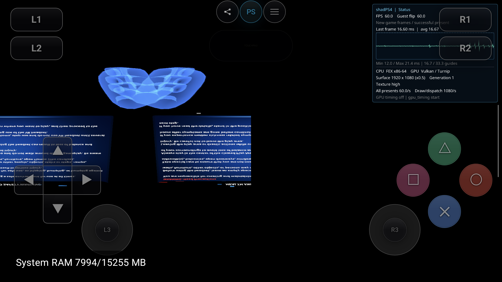
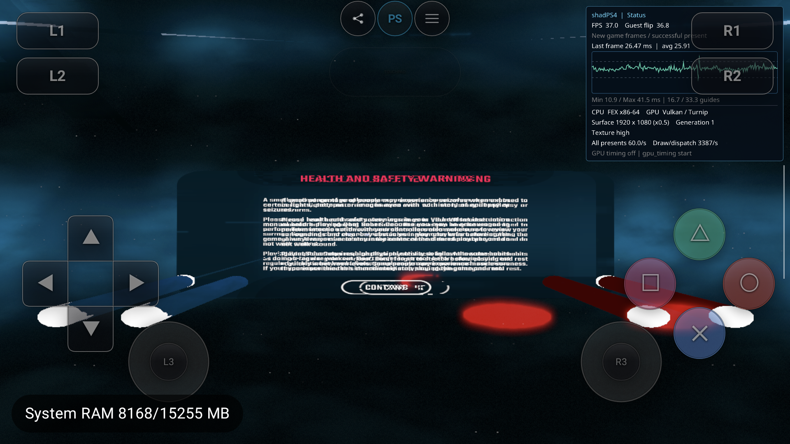

# AYN PSVR：NP/HTTP 控制面与多采样数组修复（2026-09-21）

本轮继续 Beat Saber（CUSA12878）、AllInOneSports（CUSA36289）、Tetris Effect: Connected（CUSA13427）。设备 AYN Thor `9c2841a4`，分支 `feature/malos/beat_saber_fix`，基线 `63b6d560`。保留已有未提交工作；没有 commit/push、完整回归或三款可玩声明。

## 实现范围

- NP Utility：18 个 NID 的初始化/终止及离线 word filter、bandwidth 路径。按本机 firmware 11.00 ABI 校核请求结构及保留参数；Censor 第三个参数为必须为零的 option，不能当作输出缓冲。离线不制造过滤结果、在线身份或成功的网络操作。
- NP Toolkit / UserService：Toolkit 独立状态回调及 NetCtl 注册槽；UserService 本地 Login 订阅使用 session 自有 FEX worker，复制事件，不抢占 GetEvent 队列。注册、撤销、重入、终止、停止与异常取消均有针对性检查。复用 AVPlayer 的 worker owner 协议；不能将 Guest 回调地址强转为 Host 函数。
- HTTP：复用桌面 URI parse/build/escape 并重定位输出 Guest 指针，原子校验输出，包括跨相邻映射的输出。连接、空 Cookie flush、离线空响应头及五类回调注册/继承；离线 DNS 失败在这些回调事件之前结束，不调用 Guest 指针作为 native callback。
- WebAPI：仅七个本地控制入口：init/term、handle 创建/删除、extended push filter 创建/删除、NpId parse。复用桌面对象，HTTP context 验证并转换；保留 filter 嵌套键的生命周期。新增仅用于无 user-context 的离线控制域退休，拒绝活动在线对象；修复共享实现无效 handle 分支未解锁及 handle/filter 释放。在线 user-context、请求、push callback 和精确 pool stats 仍不准入。
- NetCtl：修正已发布 provider 未启动本地控制域的问题；Prepare 先初始化离线控制域再发布。控制域独立于应用 Net pool 初始化；重复 Init 保留回调，Term 清除注册，重新 Init 可用。保持 DISCONNECTED，不伪造连接事件。这是桌面离线 provider 的显式生命周期，不声称 firmware module_start 会隐式调用 sceNetCtlInit。
- GPU：支持 Color2DMsaaArray 的 SPIR-V 类型/ImageMSArray capability、无 LOD 尺寸查询、单 mip 结果、带 Sample 的 fetch 及越界 sample wrap；生产 Vulkan view 转换支持 e2DArray。shader binary version 11。未声明所有 MSAA storage write、采样变体和 DRS 已完成。

## 定向验证

AYN：NP 400/0、HTTP 357/0、Network 最终 298/0、PSVR services 最终 154/0、AVPlayer 1206/0。AVPlayer 使用实际 MP4 fixture；第一次未提供 fixture 的退出 2 不算通过。PSVR services 初始 fixture 缺少 ElfInfo metadata 的 Host assertion、HTTP 初轮三项失败均保留，修复后的结果分别归档。

生产 SPIR-V 及 Image/View GPU probe：Qualcomm / Turnip 各 11,520 checks / 0 failures；12 个 SPIR-V 通过 `spirv-val --target-env vulkan1.3`。覆盖非数组/两层数组、4×MSAA、samples 0/3/6、是否查询 mip 数及每层颜色。各 sample 使用同色清屏，不能证明不同 sample 内容的逐样本解析正确性。旧 Host 确认在 ImageType 断言；仅修 emitter 的中间版确认在 ConvertImageViewType 断言；最终 probe 改用生产 Image::FindView 避免漏掉这一段。

APK V7 `7bb24802e33df8de586c9acf8b21e91f882e61df9f600d132a357d007f8010b7`，Host `a7be69f6dba98cf4db3228e2970b0b637b97cb495f9ca8c20710fd3b3b585367`，JNI `4c4dc2948feb24f13d126a8fa780e7a914478cde9ac9884478d87252fee9eed5`。Gradle 构建成功，已安装；安装包内 Host/JNI 与本机构建 SHA 匹配。

## 实测与证据边界

### Tetris

V5 普通 PID22119 仍在 Toolkit 初始化失败后的 Guest fatal 路径发生 VA8 二次故障。独立 RSP PID23351/gen1（run `ed4a17a6e40cedd285bd29a3049ff26d`）逐段断点确认：资源初始化、多个内部阶段均成功，回调注册阶段 `+0x3d0b9` 返回 `0x80412109`，Core::init 返回同值。第一 RSP session 工具默认 big-endian 配置错误；原始 rawHex 保留，结论按 x86 little-endian 解码，不使用该次 numericHex。暂停租期曾自动恢复，停点重复命中没有算成新的执行进展。

V6 普通 PID2206 仍退出；独立 RSP PID3340/gen1（run `7b8dfef1cbd712c26e285b715fa5403a`，明确 little-endian）确认 main `+0x5d7eac` Core::init 返回 **0**。后续 `+0x5d8493` SetTitleIdForDevelopment 返回 **0x805a10ff**，普通日志明确 worker 请求 `libSceSigninDialog` id `0xe4` 被拒。下一批应实现完整离线 Signin/Login dialog 生命周期，桌面当前这部分只是 stub，不能直接发布假 provider。

最终 V7 普通 PID9281 重现相同边界：09:24:42 worker9709 的 SigninDialog 加载返回 `0x805a10ff`，随后 Guest-1/tid9649 发生 SIGSEGV/VA8。最终包尚未越过这一错误路径；Core::init 返回 0 的直接断点证据属于 V6，不能写成 V7 也重新做了同一断点验证。

两个调试 session 均移除自有断点、恢复运行并释放所有权，ADB forward 已移除，guest_debug_port/wait 恢复 0。调试工具未绑定 native PID/Build-ID，模块基址来自 RSP；外部 PID/run 身份及本地精确 ELF SHA 分开保存，不能夸大为工具完成强身份验证。

### AllInOneSports

V5 PID19282 新边界是 GPUComm 的 ImageType 断言；V6 PID538 越过该点后在 ConvertImageViewType 断言。V7 PID5682/gen1（run `9011562df4b91a78217b8b01132611a6`）进入 VR 安全提示，有双眼元素且持续出帧；图像倒置、布局/重影异常。一次屏幕 Cross 注入有两次 overlay 事件，未证实完成提示或进入菜单。4350 presents 后通过 UI Stop 达到 Stopped/user_stop，guest return=0。不能将 60 FPS 提示界面当作游戏性能或可玩验收。

### Beat Saber

V7 PID7876/gen1（run `bf52d85400ae16b93b0942dda3619783`）场景、光剑、正向安全提示可见，明显双眼重影。一次 Cross 注入未完成 Continue；没有正常菜单、歌曲或可玩验收。3765 presents 后 UI Stop 达到 Stopped/user_stop，guest return=2147614724（EINTR，不是 0），input token=0、TracerPid=0。此前 NP ENOTINIT/LoginDialog 问题未做专门完整复核，本轮不宣布其全部消失。

Sports/Beat 均有 service 与 managed 状态已 Stopped、native 输入 token=0，但界面仍残留最后一帧的现象；后续验证通过重开已停止的应用恢复 Library，没有中断活动游戏。UI 退出展示仍是独立待办。

最终 V7 完整绑定盘点：Beat 1939 行（780 guest_export / 828 runtime_bound / 317 refused / 14 not_relocated），Sports 2303 行（969 / 953 / 370 / 11），Tetris 2603 行（1146 / 969 / 471 / 17）。分别保留 293/322/360 个唯一拒绝 symbol，按库归档；行数、唯一符号数、未重定位项含义不同，不能合并为已接入数量。

清理后回到 Library，当前应用 PID9972 的 TracerPid=0，无 FexSessionService、活动输入或采集会话；自有 scrcpy 会话已停止，两次 RSP 清理均释放所有权，ADB forward 为空。global.json 与 host/config.json 相对本轮起点逐字节相同，保留 Turnip、Render0.5/TextureHigh、SBS/gyro 与初始前向策略；没有改动游戏 ZAR。

## 证据与下一步

本地完整工作集 `build/validation/psvr-np-http-20260921/`；可移交的日志、导入全表、寄存器、测试结果、截图与 SHA 清单见 [evidence manifest](psvr-np-http-20260921/manifest.json)。分析用 ELF 仅在本机 build；PT_LOAD 字节及 VA 保持原始文件内容，新增节/符号用于反汇编。Reverse Study 本次 Toolkit workspace 未物化到有效函数索引，因此静态结论采用精确 ELF + LLVM 反汇编，不用零命中推断不可达。

Sports 最终提示画面（倒置/布局异常）：

Beat 最终提示画面（双眼重影、Continue 未完成）：

保留离线拒绝族；Toolkit InGameMessage helper 在 GetState!=IPOBTAINED 时返回离线错误，后续在线调用静态有门控，不代表其全库或所有调用路径已实现。后续重点为两款 Unity 游戏的真实眼图布局、Y 方向和 Move 射线，以及 Tetris 的 SigninDialog 初始化依赖；不靠最终画面偏移或统一返回成功掩盖 Guest 状态问题。
