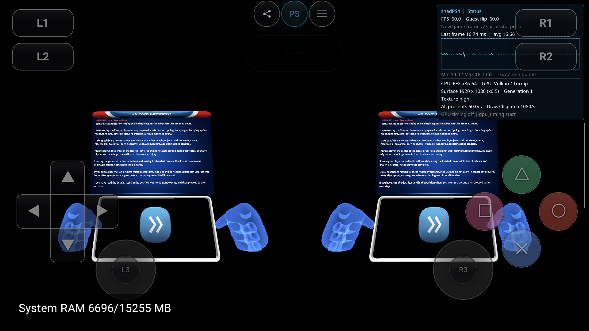

# AllInOneSports：恢复右眼的图元层索引

2026-09-21，基线 `605053a651ebd7085acbe7efbec996675f25bc6a`，工作分支 `codex/tetris-runtime-fix`，本地未提交。

AYN 实测右眼已恢复：安全提示、箭头和双手分别出现在左右眼图中。原来右半屏全黑，修复后两眼均有内容，并保留视差。本轮尚未通过安全提示进入运动项目，不能据此宣称可玩。

## 错误来源

基线 APK `e727bef6…`，PID1630 / generation1 / run `4414ceffa8e1ada3fc7c1adf6bebf87f`。日志明确报告 `RenderTargetIndex is exported in vertex shader but tessellation-based primitive emulation is active. Not implemented yet.`

HMD 的 StartMultilayer 提交没有把两眼描述符设成同一层：左右共用 960×1080、pitch1024 的数组纹理，左眼 base/last_array=0，右眼=1，两眼 UV 均接近 `(1,1,0,0)`；采样的22次调用返回0。修复版23次采样同样保留0/1分层。输入描述正确，但 Guest 写右眼时的层索引在着色器转换阶段丢失。

`ExportPosition` 在矩形/四边形的辅助细分路径主动丢弃 RenderTargetIndex 和 ViewportIndex。即使 VS 有导出，后面的辅助 TCS/TES 也没有传递 Layer；最终光栅化写到第0层，因此右眼第1层没有内容。

Vulkan 由最终活动的前光栅化阶段提供 Layer，未提供时使用第0层；跨阶段传递和整数索引合同见 [本地参考](../../../references/psvr-public-api/vulkan-layered-primitive-notes.md)。本次没有复制左眼充当右眼，也没有修改 HMD 参数。

## 实现

- 保留 IR 的 RenderTargetIndex/ViewportIndex 导出；图元模拟时，VS 将其写为整数 user varying。
- 按实际 VS varying 的空闲位置分配 location，避免稀疏参数和 clip-distance 模拟占用发生冲突。
- 辅助 TCS 将首顶点的整数索引传给全部控制点；TES 输出真正的 Layer/ViewportIndex，不对索引做浮点插值或四边形顶点重排。
- 辅助 `gl_PerVertex` 只声明 Position，深度裁剪开启时再加入 ClipDistance[8]。删除此前未使用的 PointSize/CullDistance 成员，并与生产 VS 的深度裁剪 block 对齐。
- 启用设备实际支持的 `shaderOutputViewportIndex`；shader binary version 从12升至13，避免复用旧转换结果。

PointSize 的辅助阶段桥接、通用 Guest CullDistance 和所有设备能力回退不在本轮完成范围。

## 定向验证与反例

新 `android_layered_primitive_probe` 使用生产 VS emitter、辅助 TCS/TES、Image 和 Scheduler 实际绘制并读回。矩形/四边形 × 无索引/层/viewport/两者 × 深度裁剪关闭/开启，共16组；覆盖0/7/31稀疏 varying，逐字节比较两层16×8图像。

| 测试 | 检查数 | 失败 |
|---|---:|---:|
| Qualcomm | 16,384 | 0 |
| Turnip | 16,384 | 0 |
| Turnip，主动省略辅助索引桥接的负对照 | 16,384 | 4,096（预期失败） |
| 既有辅助 varying 接口 / Qualcomm | 12 | 0 |

48个导出的 SPIR-V 模块通过 `spirv-val --target-env vulkan1.3`。NDK/APK构建成功，`git diff --check` 通过。负对照是同测试显式省略桥接，不冒充旧生产二进制回归。

保留中间失败：旧辅助 block 在 Qualcomm 上先出现错误像素，开启 clip 后 pipeline 创建 ErrorUnknown；修正接口形状后通过。首次 Turnip 缺少 hook library，退出33，补齐匹配 hooks 后才执行 GPU 测试。首次测试 C++ const 参数编译失败亦保留。原始日志及 SHA 见 [manifest](sports-layered-primitive-20260921/manifest.json)。

## 真机实景

设备 AYN Thor `9c2841a4` / Adreno740，Turnip Mesa26 git-5ac41be677，驱动 SHA `fdd378520022f88b0363dd1f77f6989332730271712621523075fe4eb4de2a09`。保持 Render0.5 / TextureHigh / SBS / gyro / 正常MSAA。

修复 APK SHA `e44290a0cec4d0c86b10bb94dd6b3d0fdcee36a70b86727c02583db7631ec9d5`，host `a75026cb6798d244d0a0c251179d1dbb127f991e1bfb110e958ca50bfebccaa0`，JNI `2bd9c2d76bc180f3532d3be9c1fa6a145f16ba120649fba9fea1fdee39e7c548`；安装整包SHA已核对。构建后仅做源码格式和行尾整理，不改变语义。

修复会话 PID18957 / generation1 / run `ad1bf3f74c52e38996a1c35b5357bc9b`：双眼安全提示及双手可见；10秒 scrcpy 物理屏幕录像包含577个解码帧，实际10.035722秒，无音频，已正常finalize。MP4帧数不是Guest帧数。[本地录像](../../../build/validation/sports-stereo-20260921/sports-stereo-fixed.mp4)。本次短按Cross/R2未越过安全提示。

基线正常UIStop / user_stop / return0；修复版累计17,710次present后正常UIStop / Stopped / user_stop，guest return `18446744071562199125`，不是return0。随后在session:none时重开Library，继续Tetris验证。

冷启动复验 PID27598 / generation1 / run `bb0f1490e75971aafb2e4f28c7603a58` 再次确认双眼安全提示/箭头/双手；长按Cross和R2仍未越过该页。完整导入2303行，拒绝278行/253唯一项，见 [bindings](sports-layered-primitive-20260921/bindings.tsv) 和 [逐族审计](sports-layered-primitive-20260921/family-audit.json)。这是同APK第二轮实景，不把首次会话的导入快照伪装成已单独采集。

没有完整PSVR、全游戏回归、帧率或总RAM收益声明。Tetris在同一修复包上的后续结果另见 [续验](tetris-layered-followup-20260921.md)。

冷启动复验累计4,384次present，正常UIStop / Stopped / user_stop / return4。最终Library PID29089 / session:none；global.json和host/config.json逐字节不变，Turnip0.5/High/SBS/gyro保留，HMD日志属性清空，自有scrcpy已结束、探针目录已移除。
