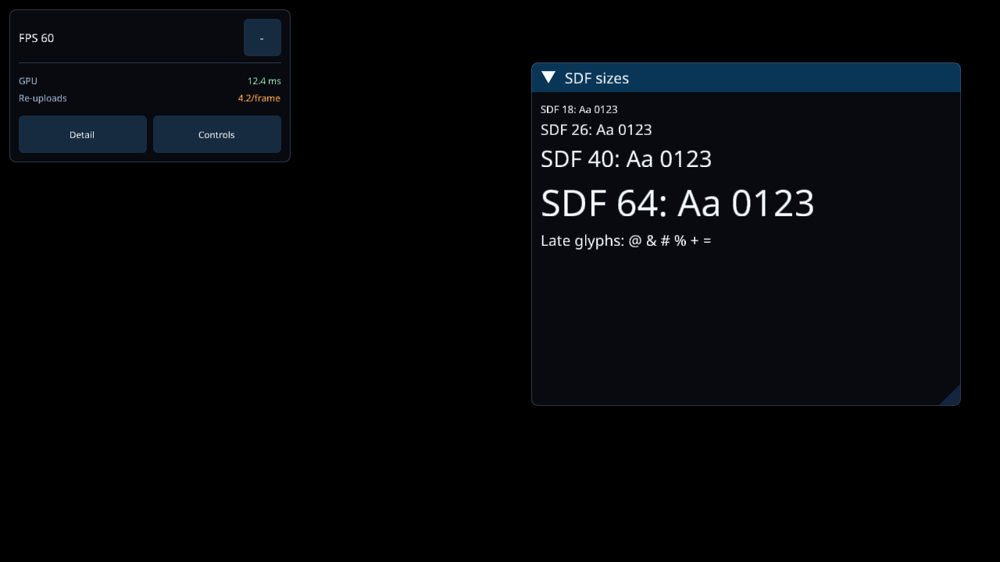

# Status Overlay、SDF 与 IME 输入接入验证

日期：2026-09-25。主仓基线 `9ebee8048`，Foundation 基线 `f536264`。
使用独立 worktree；原始 shadPS4、Cemu 的未提交工作未修改。
参考本机 Cemu `74fd7b6b` 加其现有工作区实现，Foundation 为 `f536264`；这是本机源码对照，
不声称 Cemu 整个工作区对应一个干净远端提交。

## 实现与参考关系

- 按 Cemu 接入顺序：宿主环境/DPI/字体 → snapshot → 测量 → 输入路由 → shell.render →
  命令写回 → drawOverlayShellFrame。宿主继续使用自己的 ImGui context。
- Only FPS 直接用 Foundation Simple：半透明紧凑条、FPS 数字、Detail 柱状图图标、
  Controls 滑杆图标。Summary 为独立模式，早先展示 Summary 的截图不能作为 Only FPS 的证据。
  Controls 提供模式、字号、面板透明度及独立 FPS 透明度，持久化到 `status-overlay.json`。
- 删除两份 externals ImGui gitlink；唯一源为 Foundation v1.92.2b 的 docking core。
  [来源](../../../foundation/third_party/imgui/tnt/UPSTREAM.md) 记录上游 core diff，保留 Foundation 原有补丁。
  字体嵌入工具也来自同一目录。ImGuiFileDialog 的旧内部字段名在其编译 target 内兼容。
- Property 固定/动态 label、value 色通过 snapshot 复制；shadPS4 原来的状态数值及警告色保留。
- 真实 SDF atlas 和 fragment pipeline，普通图片仍走 RGBA。新增字符/字号时整张 atlas 替换，
  先排空已接受提交并等待 GPU 生命周期结束；静态帧不重复上传。没有声称部分更新或性能提升。
- RuntimeTooltips 由额外 `ImGui::Layer` 承载，最多 3 条、普通 4 秒/警告 7 秒，tag+内容变化去重。
  `session.terminal` 从生命周期直接写日志，不依赖故障时渲染还可用。
- PS4 IME 继续归 shadPS4 所有；只接入触屏捕获、鼠标优先及拖动保持，保留 PS4 ABI、字符限制、
  过滤与手柄确认/取消协议。Foundation 仅新增[所有权说明](../../../foundation/docs/guides/emulator-ime-ownership.md)。

实际操作、tag 定义及 trace 关联见[指南](../../guides/status-overlay.md)。

## 验证结果

| 项目 | 结果与边界 |
| --- | --- |
| Foundation Overlay 测试 | 235/235，通过颜色解析/绘制及既有输入、持久化、布局测试 |
| Only FPS 点击 | 既有 `Simple actions open Detail and Controls without expanding Summary`、`visible FPS actions remain interactive while Controls is open` 均通过 |
| Foundation 反射示例 | 用当前 overlay、ImGui core、imgui helpers 重新编译；复用 Cemu 未改的底层库，断言启用；固定/动态颜色及回退通过 |
| 生产 Vulkan backend 离屏渲染 | Apple M4 Pro / MoltenVK，启用 `VK_LAYER_KHRONOS_validation`，无 validation 错误；SDF atlas、texture、shader 三项证据为真 |
| Summary / 字号 | 18/26/40/64 px 与延迟新增字符，6 次 atlas 上传、53 个 SDF draw；最后静态帧无新增上传 |
| Only FPS | 单独渲染，2 次 atlas 上传、20 个 SDF draw；紧凑条可见 |
| mailbox | 多指、跨区域捕获、溢出取消、有界队列、旧 owner 拒绝、DPI 非法值与上限通过 |
| RuntimeTooltips | 生产代码的去重、过期、恢复、身份切换、日志换行清理通过 |
| Android host | NDK 29 完整 `shadps4_host` 编译链接通过 |
| Android APK / runtime tests | `assembleDebug` 成功；123 tests / 0 failures / 0 errors；包内 host SHA 与构建产物一致 |
| 旧 diagnostics runner | 7 个目标通过；commands/service 两个目标缺少 `nlohmann/json.hpp` include，未完成编译，不计通过 |
| AYN / 游戏 | `adb devices -l` 无设备；本轮没有安装、游戏运行或实机触屏验收 |
| 桌面 / Windows | 非完整桌面应用构建和跨平台 UI 验收；离屏 Vulkan 仅代表上述 macOS 环境 |

最终 APK SHA、host/JNI 身份见 [manifest](status-overlay-20260925/manifest.json)。
本机 NDK 构建使用 `ALSOFT_UPDATE_BUILD_VERSION=OFF` 避免 OpenAL 对 worktree `.git` 的旧路径解析问题，
未修改该依赖源码。FEX 和其依赖按主仓 gitlink 准备，只参与构建，无源码变更。

### Only FPS


黑色是探针清屏背景，不是游戏截图。FPS 60 是探针输入；不表示任何游戏性能。

### Summary 与字体



## 可重复验证

```sh
cmake -S foundation/modules/imgui_overlay/tests -B /tmp/overlay-tests -G Ninja
cmake --build /tmp/overlay-tests
ctest --test-dir /tmp/overlay-tests --output-on-failure
cmake -S tests/imgui -B /tmp/overlay-vulkan -G Ninja
cmake --build /tmp/overlay-vulkan
# 从主仓根目录运行，读取生产 NotoSans 字体；首参数为本机 Vulkan loader。
VK_INSTANCE_LAYERS=VK_LAYER_KHRONOS_validation /tmp/overlay-vulkan/overlay_vulkan_probe /usr/local/lib/libvulkan.dylib /tmp/summary.ppm
VK_INSTANCE_LAYERS=VK_LAYER_KHRONOS_validation /tmp/overlay-vulkan/overlay_vulkan_probe /usr/local/lib/libvulkan.dylib /tmp/fps.ppm fps
/tmp/overlay-vulkan/overlay_tooltips_test
clang++ -std=c++20 -pthread -Isrc tests/host_runtime/overlay_control_tests.cpp src/core/diagnostics/overlay_control.cpp -o /tmp/overlay-control-test
/tmp/overlay-control-test
```

探针默认也支持 `libvulkan.so.1`；需要本机 Vulkan headers、loader、fmt 和 shader compiler。
日志：[Foundation](status-overlay-20260925/foundation-tests.txt)、
[反射](status-overlay-20260925/reflection-tail.txt)、[Only FPS GPU](status-overlay-20260925/gpu-only-fps.txt)、
[Summary GPU](status-overlay-20260925/gpu-summary.txt)、[mailbox](status-overlay-20260925/mailbox.txt)、
[Tooltips](status-overlay-20260925/tooltips.txt)、[host](status-overlay-20260925/native-build-tail.txt)、
[APK](status-overlay-20260925/apk-build-tail.txt)、[旧 diagnostics runner](status-overlay-20260925/diagnostics-runner.txt)。

剩余实机项：不同 Android DPI 下的三种字号、Only FPS 两个图标、隐藏触控面板后的 IME 点击/拖动、
手柄与触屏交替、失焦/恢复、停止/换游戏后的捕获释放及提示日志。MHW 既有 GPU 超时没有在本轮修复或验收。
