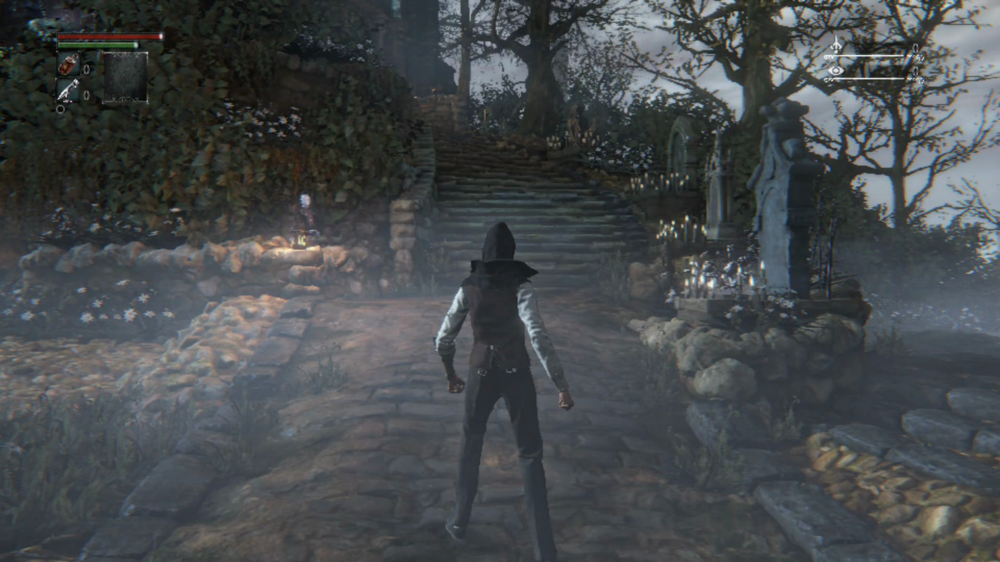

# Swan 编码 Surface / 干净截图修复（2026-09-29）

已在 Swan `PB3110PGL6240001G` 修复正常 MediaCodec Surface → Vulkan blit → H.264 → PNG 路径。问题位于 fork 的 Turnip QCOM Mapper 5 导入适配，MediaCodec 编码器和输入 ANativeWindow 本身创建成功。主仓基线 `feature/malos/swan_performance` / `b0778a7ff`，Foundation `b05f80f`，修复驱动基于已发布 `86ca472fc2`，不含 a1c3d387 的额外 FDM/QCOM opaque-import 改动或 alloc64 补丁。

## 失败链与根因

稳定 86ca 和旧候选都出现 `encoder swapchain: ErrorInvalidExternalHandle`，不能把这个错误归于新 FDM 提交。实际日志顺序：`c2.qti.avc.encoder` 创建成功 → GraphicBufferSource connect 成功 → `u_gralloc_get_buffer_basic_info failed` → swapchain 创建失败。

对同一生产缓冲的 968 字节 PLANE_LAYOUTS 实采解析（[原始值](evidence/swan-encoder-surface-20260929/encoder-plane-layout.json)）：

| 项目 | RGBA 像素平面 | QTI 压缩元数据平面 |
|---|---:|---:|
| offset | 36,864 | 0 |
| row stride | 7,680 | 128 |
| size | 8,355,840 | 36,864 |
| width × height | 1920 × 1080 | 1920 × 1080 |
| sample increment | 32 | 0 |
| subsampling | 1 × 1 | 0 × 0 |

元数据平面含 `QTI / 0x80000000` 组件；分配大小 8,396,800 字节。旧 parser 一律要求 subsampling > 0，因而拒绝该平面。仅放宽此检查仍不正确：HAL 将 DRM fourcc/modifier 报成 0；辅助平面的 offset=0 还会被通用转换误认为独立 dma-buf，而 Turnip 的 QCOM_COMPRESSED 布局需要从整个 UBWC 分配起点计算像素区。

使用公开 AHardwareBuffer + Mapper 5 的设备探针，以 RGBA8888、usage `0x10010200/0x10010300` 独立重现完全相同的 968 字节布局、fourcc=0、modifier=0，并读取 COMPRESSION=`QTI / 10`（无损 UBWC）。普通 RGBA 单平面和未启用 UBWC 的 BGRA 对照均可正常解析。ROM 源码仅作语义交叉核对；未复制私有源码到补丁。

## 修复范围

`u_gralloc_mapper5_metadata.h` 识别 QTI 元数据组件；保持长度、计数、字符串、地址与分配范围检查。`u_gralloc_qcom_mapper5.cpp` 在明确 COMPRESSION=`QTI / 10`、单层 RGB32、像素/metadata 尺寸一致且符合 UBWC 对齐时，将两个 HAL 平面规范化为一个 DRM QCOM_COMPRESSED 平面：offset=0，rowPitch 保留像素 stride。未知/有损压缩、其他格式、多层或不一致的布局仍拒绝。fourcc 缺失时只通过已知 HAL 格式映射补齐。

没有修改 SDK 的 MediaCodec 配置、编码颜色格式或默认截图路径。`capturectl snapshot` 继续从短 H.264 录制解出最后一帧。原图路径作为显式 `--lossless` 保留：单个带 token/generation 的请求、GPU 退休后读回、原子 PNG 写入、状态与几何/CRC/像素流校验；限 SDR 8-bit，不会因编码失败而自动绕到 PNG。

## 实测

- Mapper parser/UBWC 规范化 1,402 项检查通过（普通构建与 UBSan 各一轮）：实采等价布局、每个截断长度、错误 namespace、大小/stride/offset/几何反例。
- SnapshotSession 生命周期检查通过；实际 PNG 正例和 5 个错误数据/尺寸反例均符合预期。
- Android host 与 APK 构建通过。
- PID 21406 / generation 1 / UUID `62eca95ca802cec2cf30108329c2bd1d`：连续五轮默认编码截图（提示、logo、在线/离线菜单、猎人梦境），分别提交/解码 72、72、71、73、71 帧，均 0 skipped、EOS=true，完整 ffprobe 解码数与 submitted 一致。
- 同进程 20 秒加载录制：提交/解码 347 帧、skipped=133、EOS=true。现有 acquireNextImage(0) 策略在编码背压时跳帧，不能据此宣称录制全帧保真或固定 60 FPS。精确 codec PTS 在 CSV；MP4 只是标称 60 FPS 预览。
- 原图显式选项取得 1920×1080 PNG；默认截图同样 1920×1080，未包含宿主 HUD / SPR 投影。游戏自己的 HUD 保留。
- 最终代码补上 SDR 格式门控后，PID 22404 再次完成默认编码截图。最终包元数据修正只涉及 identity.json，不更换已验证 host/driver。
- 本轮由本任务依次按 circle（确认提示）、options、circle（离线）、circle（继续），进入猎人梦境。均 150ms 自动释放，最终 debug_active=false；未移动角色。前一轮用户手动推进不计入这一轮。

## 交付与边界

驱动修复保留在 `references/mesa-turnip` 的 `codex/swan-encoder-surface` 本地分支，未提交/推送；[补丁](evidence/swan-encoder-surface-20260929/turnip-mapper5-ubwc.patch)。完整测试包、驱动 zip、原始日志/视频位于 `build/validation/swan-turnip-repair-20260929/`，最终 APK 为 `shadps4-b0778a7f-encoder-final.apk`；[身份](evidence/swan-encoder-surface-20260929/mapper-fix-identity.json)、[逐轮解码校验](evidence/swan-encoder-surface-20260929/encoder-verification.json)。

主仓正式 runtime lock 和两处默认 SHA 保持可下载的 86ca，不把未发布候选伪装成正式依赖。测试 APK 单独打包本地 driver，identity 明确标识 source_dirty 和补丁摘要。源码默认重建仍使用发布版驱动，复现修复需使用交付测试 APK，或应用 Mesa 补丁后按本轮本地打包步骤替换测试资产和两处 SHA。没有发布新驱动 release。

本项不构成原始 `CP opcode=0`、shader VA=0 或 a1c3d387 黑屏的修复证明。此前分支未提交工作仍在 `pre-switch-backup.json` 所列 stash/backup refs 中，未自动应用回当前分支。

最终安装校验：APK SHA256 `e7e85584a41309110fb1ee67472f93c6f601fe22b8dd01d827552d195b83b66c` 与设备 base.apk 一致；host `2da5cbc2654632e99266334f4795649738f27e5e59d464253c2d2f7f322831a8`，driver `92d6582b4bd806a87e0b7486a1f0aebc1a50c1cae96d192e62600b779a6d9e82`。设备终态 Library / PID 23274 / session:none，无录制或本任务 held 输入。自有 Mapper 探针目录和 UI XML 已清理，存档只经历正常游戏推进；原有 DumpLayer 属性状态未改变。主仓两处 SHA 与生成资产恢复发布版后，host/APK 重建通过，未安装回设备；交付的修复测试 APK 单独保留。
