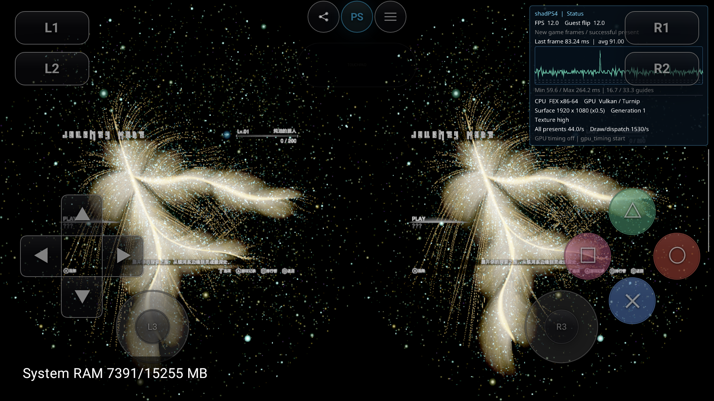

# Tetris：辅助图元修复后的闪黑续验

2026-09-21，`codex/tetris-runtime-fix`，同 [Sports 分层图元修复包](sports-layered-primitive-20260921.md)，APK `e44290a0…`。没有另加 Tetris 专属改动、HMD 调度延时或 GPU idle workaround。

安全提示和 EULA 的两段10秒录像均未再出现此前周期性的整片黑帧；已接受用户授权的协议，实际进入主菜单、Journey Mode 和教程页。**尚未进入实际关卡**：教程1/12中演示区域为空，本轮Circle退出和D-pad翻页没有推进。该后续问题独立保留，不能宣称完整可玩。

## 同设备、同配置的复测

AYN `9c2841a4`，Turnip Adreno740 / git-5ac41be677，Render0.5 / TextureHigh / SBS / gyro / 正常MSAA。PID21629 / generation1 / run `90a62704a7d543d6836c16a236f315ce`。

用 scrcpy 录 physical display、1920×1080、无音频，读取全部解码帧。继续使用之前的 `500×280+350+300` ROI 和 `YAVG < 17` 黑帧阈值；MP4帧数不等于Guest帧数。接触表已经实际查看，避免只凭计数判定内容。

| 场景 | 实际时长 | 解码帧 | 黑ROI帧 | 黑/正常切换 |
|---|---:|---:|---:|---:|
| 安全提示 | 9.969867s | 411 | 0 | 0 |
| EULA | 9.946000s | 325 | 0 | 0 |

安全提示ROI YAVG 35.3537–35.6015，EULA 61.7968–66.9939。此前原包EULA为313帧/210黑ROI/57切换，见 [原始诊断](tetris-flicker-20260921.md)。这是显示正确性观察，场景和时序不构成FPS或黑帧比例的性能A/B。

两段录像均 mux finalize/exit0，保存在本地：

- [安全提示](../../../build/validation/tetris-order-20260921/tetris-sports-fix-baseline.mp4)
- [EULA](../../../build/validation/tetris-order-20260921/tetris-eula-fixed.mp4)

前12帧分别见 [安全提示接触表](tetris-layered-followup-20260921/first12.png)、[EULA接触表](tetris-layered-followup-20260921/eula-first12.png)。教程录像请求发出时自有scrcpy已TTL结束，因此未取得教程MP4，不把失败请求算作录像验收。

## 归因程度

旧Tetris日志也存在 `RenderTargetIndex` 在辅助细分图元路径被丢弃的警告，[原始邻接行](tetris-layered-followup-20260921/old-missing-layer.txt)已保留。Sports修复同时补整数Layer/ViewportIndex传递和辅助builtin接口形状；同一修复包后，Tetris的原周期性黑帧在上述录像中消失。

这支持共享图元路径是相关修复方向，但本轮没有取得Tetris正常/黑帧的首个错误writer RDC，也未拆分两个改动做游戏二进制A/B。因此不把某一个draw、UE轮换索引或驱动内部行为写成已证实的唯一根因。旧版主眼图在HMD合成前已全零的读回结论仍成立；不再把调度过早的候选假设当作修复依据。

## 继续进入游戏后的边界

Cross较短触控有漏采，长按后可越过安全提示、标题与EULA；接受协议后能进入Options，返回主菜单并选择Journey/Play，说明之前的启动和菜单路径已实际推进。

教程1/12的文字、箭头和双目布局仍在持续绘制，但中心演示区域为空；Circle和D-pad尝试未推进。日志另有POSIX `read` 返回EBADF，以及既有VrTracker GPU stub日志；没有现场调用链证据把其中一项确定为教程阻塞根因。未验证教学完成、第一关、存档持久化、联网或长时间稳定性。

完整导入2603行，拒绝358行/290唯一项，保留 [bindings](tetris-layered-followup-20260921/bindings.tsv) 和 [逐族审计](tetris-layered-followup-20260921/family-audit.json)。绑定数量不代表功能完整。

累计9,840次present后正常UIStop，终态Stopped/user_stop/session:none，guest return `68719731408`，不是return0。其后在无活动会话时重开Library继续Sports冷启动复验。恢复状态、APK与证据SHA见 [manifest](tetris-layered-followup-20260921/manifest.json)。无commit/push。
