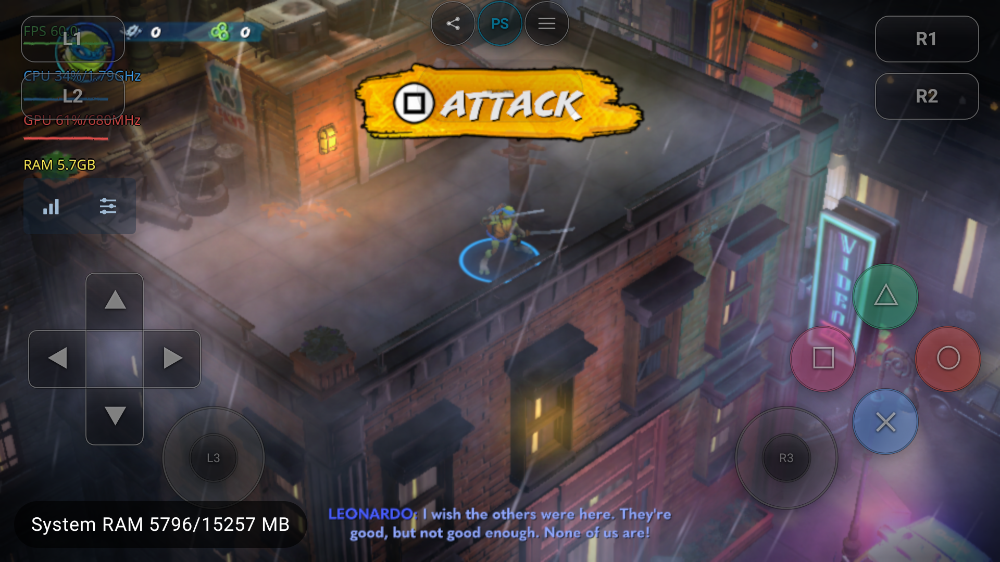

# TMNT：Android 直接读取主包与更新 PKG

接续 [PKG 读取器验证](pkg-direct-mount-20261007.md)。设备为 AYANEO Pocket DS，
Android 13 / API 33 / Adreno 740，游戏 CUSA50828。本轮覆盖真实屋顶场景和有限输入，
不是全流程或长期稳定性验收。

## 驱动与画面异常

用户指出首次进场景时画面没有正确显示，并要求使用其自行编译的 Turnip。
首次日志及进程映射确实为 Turnip，但本次 Mac 构建带入了另一份源码产物：
`Mesa 26.3.0-devel / 64817e1115`，SHA-256 `5cb472105ec817a649d120cfcd39cacdd3c7551702a898247c3e0cc76a8e1934`。
这与测试前安装 APK 内的驱动不同，不能只凭 “Turnip” 名称认定版本相同。

从安装前备份 APK 恢复用户已有的原始 ELF，校验后通过现有
`SHADPS4_TURNIP_PREBUILT_LOCK` 路径重新绑定宿主并打包；没有修改驱动或伪造源码身份。
最终使用 `local-351a4847-barycentric-wsl`，即用户在 WSL 构建、带 barycentric 补丁的版本：

- 驱动 SHA-256：`01a3548fbd2695f3b27ad896bfbbbf0561e28c49ad1de8a19b05745acd01ba19`。
- 驱动 Build ID：`872fcd9bf15bf54a2a4ef7be75d65fe12518abd9`。
- 最终 APK SHA-256：`cad7d03c302794becb1be8bef34abe702c9586b36861b6712ba8362903043c28`。
- 完整来源与宿主绑定见 [identity](evidence/tmnt-pkg-20261007/apk-final-identity.json)。

对照过程保留失败，不能把后续成功写成已定位首次异常：

| 运行 | 内容 | 驱动 | 观察 |
|---|---|---|---|
| PID 14924 | PKG 主包 + 更新 | `5cb47210` | 菜单正常，屋顶只显示模糊色块，教学 UI 可见 |
| PID 16223 | 设备原有 ZAR | 同一 APK、`5cb47210` | 屋顶角色、建筑、雨雾正常显示 |
| PID 17285 | 同一 PKG 主包 + 更新 | 用户自编 `01a3548f` | 屋顶正常，移动触发攻击教学，约 60 FPS |
| PID 20145 | 同一 PKG 主包 + 更新，最终 APK | 用户自编 `01a3548f` | 冷进程重启后屋顶正常，再次移动触发攻击教学 |

这排除了“实际加载的是高通系统驱动”的猜测；尚不能区分首次异常与驱动版本、
首次编译/缓存或会话时序的关系。没有以关闭某项渲染功能掩盖问题，也未宣称修复了渲染根因。

[首次异常截图](evidence/tmnt-pkg-20261007/user-reported-screen.png)、
[ZAR 对照](evidence/tmnt-pkg-20261007/zar-control-scene2.png)。

## PKG 与更新的实际读取

输入来自 `/Users/bytedance/game/ps4/TMNT/CUSA50828/`：

| 包 | SFO 版本 | 字节 | SHA-256 |
|---|---|---:|---|
| `TMNT.Splintered.Fate_CUSA50828_v1.00_[12.02]_OPOISSO893[2468c.com].pkg` | gd / 01.00 | 1,772,814,336 | `4ebea14adbabdd48c68875839f9e65800954a8a916247b1f353e8d76b414f2b6` |
| `TMNT.Splintered.Fate_CUSA50828_v1.08_BACKPORT_[5.05-6.72-7.xx-9.00-11.00]_OPOISSO893[2468c.com].pkg` | gp / 01.08 | 1,867,120,640 | `c3ad762919ca1e2bbf781d856b842379b08d0a5e6ef71fff122f0d8a859e0af1` |

设备上分别命名为 `/sdcard/game/ps4/roms/CUSA50828.pkg` 和 `CUSA50828-UPD.pkg`，
传输后核对完整 SHA。游戏库正常扫描生成 `archive.link`，有效 SFO 为 01.08；
游戏内标题显示 `v1.11.0 – Major Title Update`，这是游戏自身版本文本，勿与 SFO 版本混用。

运行中 `/proc/<pid>/fd` 同时持有两个 PKG，无 ZAR 句柄；游戏包装目录只有约 439 KiB 元数据，
没有 `eboot.bin` 或完整资源安装树。主程序和资源从挂载视图读取，更新成功参与覆盖。

另以已有 Python 提取器生成独立预期，C++ 读取器逐项比对：

| 包 | 元数据检查 | SHA-256 读取检查 | 合计 |
|---|---:|---:|---:|
| 主包 | 63 | 347 | 410 |
| 更新 | 55 | 332 | 387 |

**797 项全部通过**，包含两包各自完整 `data.arc`、可执行模块、小文件与跨块随机读取。
结果见 [主包](evidence/tmnt-pkg-20261007/verify-base.json)、
[更新](evidence/tmnt-pkg-20261007/verify-update.json)。对照临时提取树已经删除，原 PKG 保留。

## 实机发现的入口遗漏

1. JNI 的 `nativeReadLaunchParamSfo` 仅识别 ZAR，首次 PKG 启动被显示需求检查挡住。
   改用 `IsGameArchive`，重新构建后正常进入游戏。
2. Android `GuestStorage::Resolve` 原先仅把多层或 ZAR 挂载分流到 VFS。
   单个 PKG 主包/DLC 会走 `open(..., O_DIRECTORY)`，返回 ENOTDIR。
   现在仅单一宿主目录走原生目录快速路径，其余后端进入 VFS。TMNT 有更新层，
   因此这条遗漏不是首次模糊画面的原因。

新增真实合成 PKG 的 Android 宿主读取测试，覆盖无覆盖层的 `/app0`、`/hostapp`、`/addcont0`：
Stat、目录状态、只读、缺失文件、顺序读、定位读与游标不变。
修复前 [752 项 / 12 失败](evidence/tmnt-pkg-20261007/file-io-negative.txt)，
修复后设备执行 [767 项 / 0 失败](evidence/tmnt-pkg-20261007/file-io-fixed.txt)。
数量差异来自修复前打开失败后跳过了依赖有效句柄的断言。

## 操作、边界与保留状态

用户自编驱动首轮 PID 17285 的 900 ms 左摇杆输入被 Guest 读取 54 次，随后自动释放；
角色位置和摄像机发生变化，教学从 MOVE 进入 ATTACK，并显示角色对白。
之后发送一次攻击键，输入回执确认消费，不将其等同于完整战斗验收。
停止前 `guest_flip=15084`、`host_present=15083`，正常停止为 `Stopped / user_stop`。
见 [移动回执](evidence/tmnt-pkg-20261007/pad-move-receipt.txt)、
[攻击回执](evidence/tmnt-pkg-20261007/pad-attack-receipt.txt)、
[状态](evidence/tmnt-pkg-20261007/status-user-driver-pkg-gameplay.txt)。

最终 APK 的第二个冷进程 PID 20145 再次完成相同屋顶移动，画面约 60 FPS。
[最终画面](evidence/tmnt-pkg-20261007/final-gameplay.png)、
[运行状态](evidence/tmnt-pkg-20261007/status-final-gameplay.txt)、
[输入已释放](evidence/tmnt-pkg-20261007/pad-final-released.txt)。
游戏留在屋顶供用户继续操作，没有后台输入或录制进程，合成测试目录已删除。

没有 TMNT DLC 样本，本轮不宣称 DLC 游戏内容实机通过。没有人工听音验收或在线联机测试。
日志仍有既有 HLE/奖杯/AvPlayer 错误；上述运行未见 PKG 读取、解密、解压报错。

安装前 APK、存档/设置、原包装目录均备份在本地
`build/validation/tmnt-pkg-android-20261007/`，该目录不存放源 PKG。
设备原 ZAR 保留为 `CUSA50828.zar.before-pkg-test-20261007`，未删除；
游戏库当前使用 PKG。存档随正常游戏启动和教学操作可能更新，不宣称逐字节未变。
没有改写其他游戏存档，也没有修改 Mesa 子仓或提交驱动二进制。
