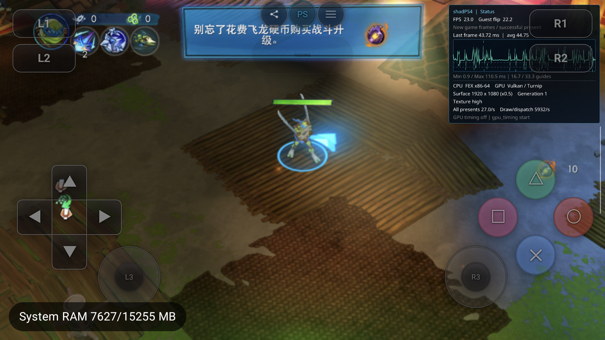

# TMNT UTC/localtime 阻塞修复（2026-09-22，本地未提交）

在backtrace诊断包上，OCR任务PID19069/gen1首次点击“开始游戏”后4.119秒因op442 `-o5uEDpN+oY` 退出。这是sceKernelConvertUtcToLocaltime，不是此前死亡路线的Garlic heap首个错误writer。调用前后证据位于本机`spatial_mcp_publish/_out/android-ocr-jev-20260922/tmnt-backtrace-auto-1`；没有把未到战斗的运行当作堆修复。

本轮补整个三入口族：Gettimezone、ConvertUtcToLocaltime、ConvertLocaltimeToUtc，均走checked Guest输出，原子批量pin后一次写回。用户11.00 libkernel ELF SHA `b3e13917da667d01a353ccf49025d6b1308a32cf86f3f351f96b3a13cd5c7c2f` 在+0x151d0/+0x15290确认转换信息16B、DST输出4B；local→UTC额外第二标量参数保留。没有采用desktop的8B DST输出及local转换8B timezone结构。保持既有Guest UTC策略，与GuestRtc/gettimeofday一致，不冒充完整IANA/DST配置。

AYN process服务**1737/0**，覆盖8种optional输出、非法地址不部分写回、守卫字节、负秒数/闰日/边界及正负zone偏移；实际生产FEX三轮转换fixture成功，旧host三轮同NID拒绝负对照。[测试身份](tmnt-timezone-20260922/tests.json)。

[安装身份](tmnt-timezone-20260922/installed.json)：APK `aeb1f4143bd7d0755de2199a4dca15cfe56608adb0b0e50740c56e5c633d4914`，host `8a6ec2c4488c86b6ad98b326985ff7f2d8590a42d411206c39cce52cc1b93b46`，JNI `a58e6d461810d73fd0d770961442d4714d02e427d992f3fb5d78ef2ab6ba48f6`。包内host与设备全APK SHA核对一致。

TMNT PID28228/gen1/run `3bf73319dcaddb8dbb69c9499e772e2b`，真实ADB截图确认Start Game后进入新/继续冒险，再确认进入巢穴升级提示，31418 guest flips/31416 presents时Running。既有scrcpy窗口返回旧菜单帧，被排除；不把旧帧用于判输入失败。此轮未进行死亡路线，未声明堆损坏已修。

随后AYN断连又恢复；[系统exit-info](tmnt-timezone-20260922/exit-info.txt)记录18:22:25 PID28228 USER REQUESTED/FORCE STOP（来源PID3088），不归类成新GuestFault或本任务正常UI Stop。之后设备用于用户明确要求的[DebugBus全手柄](../../debugbus-pad.md)和隐藏触控层修复。

[存档/配置快照](tmnt-timezone-20260922/userdata-check-final.json)：无新增/删除，仅TMNT main/backup的User.ini及GameState共4文件经普通游戏推进改变；无外部存档写入或格式化。前两次tar误含不存在的config.toml导致后续参数静默遗漏，比较结果作废，最终只列实际存在路径重新核对。诊断属性恢复原空值；捕获时TracerPid0/无forward，后续新包见DebugBus验证。未commit/push，无全游戏或MHW DeviceLost修复声明。
