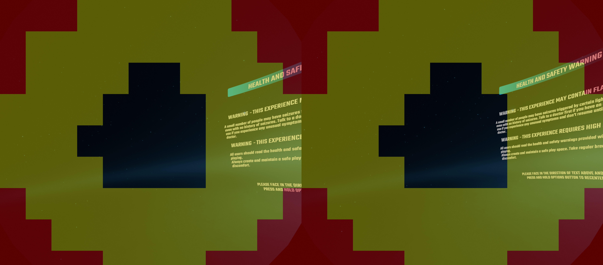

# ETFR 调试画面全黄：Turnip 分块过粗

2026-09-30，Swan PB3110PGL6240001G / Adreno 840，分支 `feature/malos/swan_performance`，本地未提交。

## 结论和证据

用户看到的全黄不是眼动权限错误或调试色表错误。原始游戏渲染目标同样全黄；黄色表示 shader 的 `gl_FragSizeEXT` 面积为 4–7，本轮是 2×2。ETFR 只影响宿主重建/呈现，不代表 guest draw 也受注视密度图控制。

Turnip `tu_tiling_config_update_tile_layout` 按 GMEM 容量最小化分块数，原 FDM 规则只惩罚长宽比超过 2 的块。A840 的本轮 RGBA8 pass 可容纳 4,141,056 像素，3376×2976 被选成 1728×1504、2×2 分块。`tu_calc_frag_area` 只从各块中心取密度，注视中心在块边界附近时，采样点全部落在高清区之外。

- 原 APK `c55c4793` / Turnip `48adf9b6`，PID5938：原图 `etfr-debug-source-0060.png` 全黄。
- 原驱动独立 GPU 测试，3376×2976、FSR/SGSR、左右注视位置：全密度像素 0，注视点像素 `(131,89,0)`，新增检查 8 项失败。
- 临时源码日志准确打印上述块尺寸；日志已从最终源码移除。
- 旧 2592×2400 测试虽然有全密度像素且会随 gaze 变化，但占比 37%/63% 异常，且仅检查是否存在、是否变化，未约束空间位置与面积。此前的“GPU 地图更新”结果不能作为密度分布正确的证明。

## 修复

在现有 Mesa 子仓修改 FDM pass 的分块上限：以 framebuffer 短边的 1/8 为目标，按硬件横纵对齐向下取整，且不低于硬件最小块。保留 GMEM、层数、LRZ/图像约束及原分块选择逻辑；普通无 FDM pass 不走此限制。相同密度的相邻块仍可由原逻辑合并。

当前高档选择 288×352、12×9 基础网格。这个限制改善空间采样精度；仍然是按块取样，调试边界呈阶梯状，不是假装逐像素圆形。更多分块会增加命令开销，本轮未测性能收益，也不将此修复等同于旧 GPU hang 修复。

Foundation 的 GPU 回归增加：三个输出档位；FSR/SGSR；左右、上下、中心五个注视位置；真实全密度区域占比、注视点必须全密度、当前帧变化及全图覆盖。原 gamma、双眼裁剪、负 Y 与非占位超分检查保留。调试图通过原 shader 输出，不是 CPU 画出预期圆环。

## 验证

| 检查 | 结果 |
|---|---|
| 抽取实际 Mesa 分块函数，单/双层、三种 GMEM 预算、单眼及双眼宽度，UBSan | 121/0；旧源码同测试 21 项失败；普通 pass 同为 1344×2976 |
| 推荐 2592×2400，最终驱动 | 1,572,932/0；五点 × 两种超分 |
| 高 3376×2976，最终驱动 | 1,572,932/0；五点 × 两种超分 |
| 极高 4160×3552，最终驱动 | 1,572,932/0；五点 × 两种超分 |
| 高档测试椭圆理论占比 12.6% | 实测全密度区 11.1%–12.1%，注视点全部 `(64,0,0)` 原色 |
| host / probe / APK | 构建通过；最终 APK 内 host 和驱动与源码构建产物逐项匹配 |

最终 APK `4032b106`，host `ed116865`，JNI `d8104cad`，Turnip `a95b15df`。完整 SHA 见 [身份文件](evidence/xr-density-tiles-20260930/density-identity.json)。源构建流程、未发布子仓 dirty 状态保持如实记录，没有替换为外部二进制。

安装前通过 FexSessionService STOP 正常结束原会话（Stopped/user_stop）。安装后设备 APK 全 SHA 匹配；重新启动 Beat Saber CUSA12878，PID13778/gen1/run_uuid `127557781be36ebaa61757eecca6f42b`，实际驱动 SHA 匹配，Running、1018 guest flips。用户的 FSR / 高档 / 左右手交换配置逐字节保留，密度 debug 重新开启。

实际游戏固定中心原图 6752×2976 已恢复未染色中心、黄色中环、红色外围。此时 `gaze_valid=0`，头显未返回有效眼动，因此本轮最终包的真实眼球跟随仍待佩戴验收；合成注视位置的 GPU 结果不能代替这一项。没有推进安全提示、菜单或歌曲。

本轮只清理自有 probe 目录和 0060/0061 两个设备截图副本；本地原图与日志保存。保留运行中的游戏和 debug view，旧 GPU 诊断属性、快照与缓存待办未动。无 commit/push。

## 后续体验状态

用户要求关闭 debug view，已执行 `xr_render density_debug off`。PID13778 原会话保持运行；原图 `build/validation/xr-sgsr-etfr-20260930/etfr-debug-off-0062.png`（producer13792，6752×2976）确认染色消失，ETFR、FSR与高档输出保留。关闭时累计 gaze_valid=807、tracked_draws=2452，说明最终包已接收真实眼动并产生跟踪帧；未以计数代替逐注视位置视觉验收。0062设备副本已清理。
