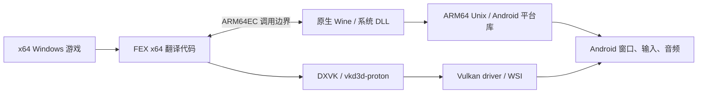

# Winlator、WinNative、GameNative 开源项目源码审计

日期：2026-09-07。按用户澄清，本篇重点是这些 **Windows 游戏 Android 开源项目**，
以及对 Android 16 / ARM64 / 16 KiB shadPS4 的借鉴价值。FEX 原生 Windows 只作为
[辅助源码参考](fex-windows-frontend-reference.md)，不作为本文研究目标。

**建议把 WinNative 用作 bionic/runtime 装配与平台桥接参考，把 GameNative 用作
Android 呈现/会话参考，沿 Winlator app → Vortek/Gladio 的子仓关系核查底层出处；
继续保留我们已有的 shadPS4 Android 基线。** 没有证据支持直接搬任意一个整仓就能得到
符合当前 V0 契约的 FEX CPU library。

本次读取固定版本源码与第一方资料，没有安装 APK、运行商业游戏或做 16 KiB 实机测试；
下文区分“代码存在”“组件装配”和“运行验证”。未增加新的产品依赖子仓。

## 1. 项目分工与固定版本

版本按源码 SHA 锁定，不用应用的小版本名推断 runtime 内容。
查询与读取文件的记录见 [source manifest](data/windows-android-sources-20260907.json)。

| 项目/固定提交 | 本次能确认的事实 | 优先研究什么 |
|---|---|---|
| Winlator `5949297d…` | 原项目明确为 Wine + Box86/Box64；不能代表所有名为 Winlator 的 fork | Android 窗口/输入、配置、驱动和 runtime 装配的历史基础 |
| Winlator Bionic `da12b7a0…`（Pipetto-crypto/dev） | 2025-07-20 的固定提交已有 bionic launcher、ARM64EC 分支和 FEX 组件管理 | 追溯后续 fork 的移植来源，不把它当最新 Android 16 基线 |
| Hangover `56e385b7…` | 在 ARM64 Linux 上使用 ARM64EC FEX，并为 x86 提供不同 WoW64 CPU 模块 | Wine 与 CPU backend 分界、跨架构库和调用职责 |
| GameNative `d9e9764a…` | 有 Bionic/Glibc/旧 Guest 三种 launcher 源码及多个 FEX runtime archive；不是唯一固定的 FEX+Proton 链 | 实际 backend 选择、Android Vulkan scanout、会话/配置 |
| WinNative `8ed4ff80…` | launcher 管理 ARM64EC Wine、FEX DLL 与 UnixLib 配套，另有 Box64 分支 | bionic 启动、组件匹配、直接音频与 namespace 问题 |
| GameHub | 官方产品提供本地 PC 游戏和商店整合；本次未取得可对应发布包的完整 runtime 构建源码 | 只作体验/兼容性参照，不用于证明 FEX 内部实现或排名 |

GameHub 的能力描述来自 [官方产品页](https://gamehub.xiaoji.com/)；不沿用原评估中
“跑分通常最高”等没有同设备、同场景、同配置对照的结论。

### 1.1 Winlator 原项目：必须跟进 app 子仓

当前 Winlator 外层仓不是完整 app 源码树，其 `.gitmodules` 固定了：

| 子仓 | 固定 SHA |
|---|---|
| `brunodev85/winlator-app` | `c03f6ab558c6f94cbac6ec0c791b12f3428fbdf6` |
| `brunodev85/vortek` | `b1730c5def9b575672e671aee11d79ae7adc63d1` |
| `brunodev85/gladio` | `116c0d14dedbea3bd057f98f1db138bb1efe225e` |

所以只对外层仓运行递归 tree 查询，也不会展开 app gitlink。上述 app 已另外查询和读取；
Vortek/Gladio 后续已补充 [client/server 与图形路径专项审计](vortek-gladio-graphics-bridge-audit.md)，覆盖共享内存、AHB、shader 与纹理兼容的选定源码，尚无构建或设备验证。[固定 .gitmodules](https://github.com/brunodev85/winlator/blob/5949297d9dc83ad24ce3f5119fe382da7c899a78/.gitmodules)

app 的 [launcher](https://github.com/brunodev85/winlator-app/blob/c03f6ab558c6f94cbac6ec0c791b12f3428fbdf6/app/src/main/java/com/winlator/xenvironment/components/GuestProgramLauncherComponent.java)
构造 `rootDir/usr/local/bin/box64 + guestExecutable`，并设置 RootFS、DISPLAY、native/x64
library path 与共享内存服务。这里没有 FEX CPU adapter；当前方法也没有直接加上 PRoot 命令，
不能把旧资料里的 PRoot 描述机械套用。

[app native CMake](https://github.com/brunodev85/winlator-app/blob/c03f6ab558c6f94cbac6ec0c791b12f3428fbdf6/app/src/main/cpp/CMakeLists.txt)
分为 winlator、vortekrenderer、virglrenderer、midihandler、libadrenotools、gladiorenderer。
这批 Android native helper/renderer 是值得研究的底层来源，而不是 FEX/PS4 的 CPU 内核。
该 [Gradle 快照](https://github.com/brunodev85/winlator-app/blob/c03f6ab558c6f94cbac6ec0c791b12f3428fbdf6/app/build.gradle)
仍写着 targetSdk 28、NDK 24；其 app 自报版本还与外层 README 标签不同。
这些是源码配置事实，不代表已发布 APK 一定相同，也不适合作为我们的 API 36 工具链模板。

Winlator Bionic 的 [固定 launcher](https://github.com/Pipetto-crypto/winlator/blob/da12b7a0a9168261656a71a6d68f9f08f77d6304/app/src/main/java/com/winlator/cmod/xenvironment/components/BionicProgramLauncherComponent.java)
则已出现 ARM64EC、FEX archive 提取和直接启动分支；WinNative README 也明确列出这条来源。
这比按 Cmod/Frost/Bionic 等名称排列“先进程度”更有用：先找代码来自哪一版，再看后续修复。

### 1.2 WinNative：优先看实际 launcher，不看 Native 名称

固定版本的 [GuestProgramLauncherComponent.java](https://github.com/WinNative-Emu/WinNative/blob/8ed4ff8013bdb5be923b2253f4c2cacdd5f62fb4/app/src/main/runtime/display/environment/components/GuestProgramLauncherComponent.java)
按 `isArm64EC()` 区分直接 ARM64 Wine 与经 Box64 的命令；`extractEmulatorsDlls()`
检查 `libarm64ecfex.dll`、`libwow64fex.dll`、版本与 UnixLib 开关，并把配套 `.so` 安装到
Wine 的 `aarch64-unix` 路径。其运行时选项由 container/shortcut/content profile 共同决定。

这说明一个 APK 版本号不足以锁定执行环境。我们也应把 FEX、bridge、driver、配置有效值
分别写进 run record，而不是只记录主仓 commit。文件名匹配和“已提取”日志也只是装配检查，
不能证明 DLL 与 UnixLib 的 ABI 真正匹配。

WinNative 的 [DirectAudio 集成记录](https://github.com/WinNative-Emu/WinNative/blob/8ed4ff8013bdb5be923b2253f4c2cacdd5f62fb4/docs/direct-audio-integration.md)
尤其值得读：它描述按 Wine ABI/实际页大小选择组件，并记录 Wine unixlib 访问 Android
AAudio 时遇到的 linker namespace 问题。这是旧容器到原生 Android 服务之间的真实工程边界。
我们在普通 NDK app 中应优先直接接系统音频 API，不能为了借鉴而引入其 Wine 装载补丁。

### 1.3 GameNative：避免把残留实现当作当前运行链

其 [BionicProgramLauncherComponent.java](https://github.com/utkarshdalal/GameNative/blob/d9e9764a84e60d792070fb0e6f380ca3f69769db/app/src/main/java/com/winlator/xenvironment/components/BionicProgramLauncherComponent.java)
有 ARM64EC/FEX 与 Box64 分支，并使用显式环境启动子进程。仓内同时还有 glibc launcher
和带 PRoot 的旧 Guest launcher。仅搜到 `libproot.so` 就断言 GameNative 必然走 PRoot，
与仅搜到 FEX archive 就断言所有游戏都走 FEX，同样不可靠。

其中 `HODLL=libwow64fex.dll` 是 32 位 WoW64 模块选择，不应仅凭它推断 x64 后端；
x64 的实际 DLL 与 Wine 配套仍要在运行时核对。该启动方式也是子进程，并未证明能把同一个
runtime 原样链接到带 ART 的 JNI app 进程。

[native CMake](https://github.com/utkarshdalal/GameNative/blob/d9e9764a84e60d792070fb0e6f380ca3f69769db/app/src/main/cpp/CMakeLists.txt)
为部分库明确指定 16 KiB ELF 对齐，但这不是整套 runtime 的页大小证明。
[VulkanRendererScanout.cpp](https://github.com/utkarshdalal/GameNative/blob/d9e9764a84e60d792070fb0e6f380ca3f69769db/app/src/main/cpp/winlator/VulkanRendererScanout.cpp)
使用 AHardwareBuffer、SurfaceControl transaction 与 fence；它提供比 Bitmap/Canvas
更有价值的呈现参考，但不应将“存在 scanout 实现”直接写成所有路径零拷贝。

## 2. 两类执行链：同一项目也可能同时包含

### 2.1 x64 Wine/Proton + Linux 用户态翻译器

```text
x64 游戏 + x64 Wine/DXVK 等模块
    → Box64 或 FEX 的 Linux 用户态执行路径
    → 原生库 wrapper/thunk、ARM64 Linux 用户态环境
    → Android 图形/音频/输入桥
```

具体哪些库还在 x64 侧、哪些被 native wrapper 替换，取决于构建和运行配置。
Box64 也有 native library wrapping，不能描述成“所有代码全部翻译”。Winlator 原项目的
README 明确列出 Wine、Box86/Box64、Mesa、DXVK 等组件。[Winlator 固定源码](https://github.com/brunodev85/winlator/tree/5949297d9dc83ad24ce3f5119fe382da7c899a78)、
[Box64 原项目](https://github.com/ptitSeb/box64)

此链适合解释旧式容器路径；不应将它套到所有 ARM64EC/FEX 应用。容器在这些项目里通常
是 prefix、ImageFS 和用户态依赖集合，不必然是 VM，也不必然使用 PRoot。

### 2.2 ARM64 Wine + ARM64EC/WoW64 CPU 模块



图中的 DXVK/vkd3d 可以是 x64 或 ARM64EC 构建；只有选用并成功加载匹配的原生构建，
才减少对应代码的 CPU 翻译成本。Hangover 的 README 明确给出了 ARM64EC FEX 的 x64
路线，以及 x86 的 WoW64 模块选择。[Hangover 固定版本](https://github.com/AndreRH/hangover/tree/56e385b7ff490edd281b288f420677093563560b)

我们对应的路径是：PS4 x64 guest → FEXCore → 自有 SysV/Orbis HLE bridge → 原生 shadPS4
服务。Wine 提供的 loader、线程、异常、模块边界，在我们这里需要由 shadPS4 提供。
**Windows 路线证明了分层形态；它没有提供一个可直接替换 Orbis HLE 的系统层。**

## 3. 对 Android 16 / 16 KiB 的证据要求

| 项目 | 本次页大小相关证据 | 仍缺什么 |
|---|---|---|
| Winlator 原项目 | 固定 app 工程使用 NDK 24 / targetSdk 28 | 当前源码与发布 APK 对应关系、完整 ELF/动态组件对齐及 API 36 实测 |
| Winlator Bionic | 已有 bionic/ARM64EC 源码路径 | 该旧快照全部 runtime 的 16 KiB 适配证据 |
| GameNative | 所读 CMake 给 winlator/vulkan_renderer 添加 `max-page-size=16384` | 其他库、预打包 FEX/Wine、PE 映射、实际进程页大小与运行 |
| WinNative | DirectAudio 文档有运行时页大小检查及不同组件选择 | 音频以外整条链，尤其 FEX/Wine 映射与 JIT 的统一验收 |

这是“尚未由本次研究证明”，不是断言这些项目不能在 16 KiB 设备上运行。

“采用 bionic”“ARM64EC”“不需要 x86 rootfs”和“真实 16 KiB app 中完整运行”是四个
独立结论。Windows 路线能减少 x86 系统库依赖，但还可能有 Wine prefix、native ELF、PE DLL、
UnixLib 和辅助进程；也不意味着与 ART 同进程。

检查应贯穿：APK 内 ELF 与 libc++ → 动态下载的 ELF → PE 映像 section/权限处理 → JIT code
与 guard pages → 游戏映射请求 → GPU/AHB/音频。PE 的 section alignment 不能等同 host
`mprotect` 粒度；Wine 处理部分映像布局也不能自动证明通用 4 KiB 子页权限已解决。

WinNative 的音频页大小选择是有用的局部证据，GameNative 的 linker flag 是构建证据；
两者都不能代替我们在 Android 16 普通 app 上执行的 V0 内存测试。
更不能用另一游戏在 4 KiB 手机上的帧率预测目标 16 KiB 设备的兼容性。

## 4. 游戏能运行，究竟证明了什么

CPU 指令正确只是第一层；Windows API、图形特征、视频/音频、启动器、同步和平台行为
会分别决定某个游戏能否进入场景及稳定运行。DXVK 对应 D3D8–11，vkd3d-proton 对应 D3D12；
它们的驱动需求不能只用一个 Vulkan 版本数字概括。
[DXVK](https://github.com/doitsujin/dxvk)、[vkd3d-proton](https://github.com/HansKristian-Work/vkd3d-proton)

| 游戏负载 | 常见定位重点 | 对本项目的解释边界 |
|---|---|---|
| 较小的离线 2D/轻量 3D | 启动、CPU/ABI、窗口输入、音频 | 适合建立可重复对照，但成功不代表现代 3A |
| D3D11 多线程游戏 | CPU 同步、draw call、shader cache、内存占用 | 原生 ARM64EC 图形库可能减少 CPU 成本，需测量 |
| D3D12/重度 3A | 扩展、descriptor、同步、内存带宽/容量、shader 与持续散热 | 黑屏不能一概归因 CPU 翻译器，也不能一概归因驱动 |
| 带平台服务/联网要求 | 启动器、服务、系统依赖、同步路径 | 安装/启动成功与实际游戏场景是不同阶段 |
| PC VR | Windows XR runtime、双眼提交、tracking、控制器、音频和帧时序 | 手机或 Android XR 上的大屏显示不是 VR 游戏闭环 |

GameNative 自己也说明并非所有游戏能运行，提供按游戏/GPU查找的
[兼容性入口](https://gamenative.app/compatibility/)。这些社区配置可以缩小调查范围；
必须补上具体 build、SoC/driver、真实页大小、分辨率、帧时间与失败场景，才适合用于我们的决策。
本次不提供未经复现的 FPS 榜或“全部可玩”列表。

**Beat Saber 的 Windows 版、PS4/PSVR 版和 Android 原生发行版是不同目标。**
Windows 版跑通只会证明那条 PC/VR 兼容链；不能替代 PS4 的 HLE、GCN shader、PSVR/Move
输入与系统服务。若未来考虑先做 PC 版 Android XR，应另立目标，不悄悄替换当前 PS4 目标。

## 5. 给当前 shadPS4 方案的具体建议

先按具体模块筛选，不迁移整个应用：

| 我们需要的模块 | 首选阅读位置 | 处理方式 |
|---|---|---|
| Android native window / AHB / fence | GameNative `VulkanRendererScanout.cpp`、Winlator renderer 子目录 | 提取可验证的平台机制；V0 先保留直接 Vulkan swapchain 路线 |
| driver 动态加载 | Winlator app 的 libadrenotools 接入、GameNative native CMake | driver、loader、WSI 分别锁版本；不将 Turnip 当适用于所有 GPU 的统一驱动 |
| runtime 选择与故障定位 | WinNative launcher / ContentsManager 调用边界 | 借鉴有效配置和部署产物检查；不照搬 Wine prefix 作为 PS4 产品结构 |
| bionic/namespace / 音频 | WinNative DirectAudio 与 Bionic launcher | 理解跨 namespace 问题；我们优先普通 NDK API，音频仍后置 |
| 停止与 session generation | 各 launcher 的 PID/termination callback | 只借鉴 app 生命周期；进程退出/暂停不等于 guest 可恢复暂停 |
| FEX CPU API | 这些 Android app 的 launcher 都不是此接口 | 延续自己的 guest_cpu adapter，辅助研究 FEX Windows 前端 |

随后按以下工作落实；FEX 前端细节见辅助文档：

1. **P0：读 FEX ARM64EC 的状态、线程和内存通知契约。** 对照现有 CPU API，把宿主负责
   的动作映射到 Android adapter；尤其检查停止/重建/恢复是否共享一致状态模型。
2. **P0：保持旧 FEX pin，但核对新前端的必要修复。** 比较目标函数的新旧实现和依赖，
   不为借用一个挂起处理就无验证地升级整个 Core；遵守 FEX 的贡献规则。
3. **P1：研究 GameNative 的 Android scanout 和 WinNative 的组件/namespace 处理。**
   我们的 V0 仍先直接 ANativeWindow + Vulkan；只有有明确需求时引入更复杂呈现桥。
4. **P1：增强环境证据。** 记录选中的 backend、每个 runtime hash/Build ID、API/ABI、
   真实页大小、driver 与有效配置，尤其防止“界面选择 FEX，实际走另一个路径”。
5. **P2：用 Windows 小型 fixture 做 FEX 平台对照。** 同一计算/原子 workload 分别在
   可用的 Wine ARM64EC 和 Android FEX harness 上执行，帮助区分 Core 与我们的 adapter
   问题；平台结果分别记录，不把 Wine 成功算成 shadPS4 成功。

不建议将 Wine/ARM64EC ABI、DXVK、UnixLib 装载链移入 PS4 backend，也不建议把整个
WinNative/GameNative fork 搬作主仓基础。继续使用现有 Android/ARM64 参考基线，
通用网络/反射/诊断复用 foundation，保留独立 guest CPU 与 Orbis adapter。

本研究不增加 Windows compatibility、TCP、音频或 PC VR 的 V0 必做范围。
当前执行入口仍是 [V0 spec](specs/android-fex-v0.md)。
## 6. 对原评估的修正

| 原评估概括 | 更准确的表述 |
|---|---|
| Proton 一条 CPU 指令都不翻 | 单纯 Wine API 实现不负责 x86 JIT；但 Proton 是集成工具/组件集合，具体 ARM 构建可配合 CPU 后端。应按模块说责任，不把发行包定义成只含 API 转换 |
| Wine/Proton 工程实践完全不适用 | Windows API 不进入 PS4 产品依赖；异常、调用转换、原生图形/音频边界和装配证据有价值 |
| wowbox64 / ARM64EC 都只是壳，底下必须 FEX 或微软翻译器 | ARM64EC 是 ABI；wowbox64 是 Box64 的 WoW64 CPU 集成，不能把 Box64 后端从分类中抹去 |
| Windows 游戏链必为 bionic + X + PulseAudio | glibc/bionic、X/其他 WSI、ALSA/Pulse/直接 AAudio 均须按实际版本和路径判断 |
| PS4 路线少几层所以一定更快 | 少 Wine/D3D 转换有潜在收益，但引入 PS4 HLE/GCN/GPU 内存语义；总成本不能由层数计算 |
| 驱动是主要瓶颈 | 某设备/场景可能如此；还需区分 CPU、TSO、shader、同步、内存和热限制 |
| Winlator 是唯一可跑非游戏 Windows 软件的项目 | Wine/Hangover 本身也运行 Windows 应用；前端产品定位不等于兼容层只能跑游戏 |

Proton 的组件定位见 [Valve 官方仓库](https://github.com/ValveSoftware/Proton)，WoW64 后端
选择见前述 Hangover 文档。此处修正不表示已审计任何第三方 runtime 包的完整依赖。
